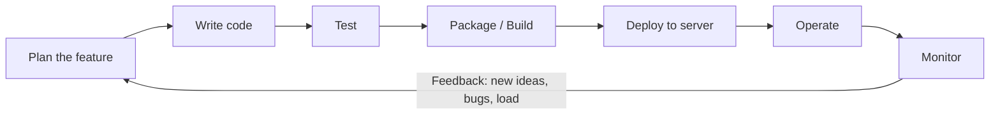

# What Is DevOps? The Wall Between Dev and Ops, and Why It Matters

## Learning Objectives
- Understand the problems that arise when development (Dev) and operations (Ops) work in isolation: slow releases, finger-pointing, and team silos.
- Explain the core values DevOps is trying to deliver: fast delivery, stability, and collaboration.
- Recognize that DevOps is not just a set of tools, but a culture and a way of working.

## Body

### Why this lecture comes first

Before you learn a single DevOps tool, it helps to understand *why* DevOps exists at all. If you skip this part, every tool you meet later, Docker, Jenkins, Kubernetes, Terraform, will feel like a random pile of technology. Once you understand the problem DevOps was invented to solve, all of those tools suddenly make sense as different ways of attacking the same goal.

So in this lecture we are not touching any tools. We are answering one question: **what painful problem hurt software teams so much that an entire discipline grew up to fix it?**

### Follow a feature on its journey to users

Let's start with something concrete. Imagine you have a great idea for an app. The path from "idea" to "real users are using it" always looks roughly the same, no matter which methodology a team follows:

1. You decide what the app should do (its features).
2. Developers write the code.
3. Someone tests it.
4. The app is packaged into something runnable.
5. A server is prepared, configured, and the app is deployed onto it.
6. Networking and firewall rules are opened so users can reach it.
7. Users start using it, and now you must watch it: Is it up? Are there bugs? Can it handle the load?

And here is the crucial part: **this is not a one-time event.** Once users like your app, you'll want to add features, fix bugs, and improve performance. Every improvement has to travel that same path again, over and over. This endless loop, "idea to code to test to deploy to observe, then back to idea", is why the unofficial DevOps logo is an infinity symbol. The work never ends; it just cycles, as shown in the delivery loop below.



> DevOps is fundamentally about making this delivery loop **fast** and **low-error** at the same time. Anyone can ship quickly if they don't care about quality, and anyone can ship safely if they take forever. The hard part, and the whole point, is doing both at once.

### The wall: where Dev and Ops collide

In the traditional way of building software, that journey was split between two separate teams with a wall between them.

- **Developers (Dev)** write the application code. Their job, and their reward, is shipping new features quickly.
- **Operations (Ops)** run the application on servers. Their job, and their reward, is keeping the system stable and available, no crashes, no error pages.

On paper these two teams share the same goal: deliver great software to users. In practice, the way their jobs are measured pulls them in opposite directions. The diagram below shows how the same shared goal is split by a wall into two silos with opposing incentives. This is the heart of the problem, so let's look at exactly how it goes wrong.

```mermaid The wall between Dev and Ops, two silos pulling in opposite directions
flowchart TB
    Goal["Shared goal: great software for users"]
    Goal --> Dev
    Goal --> Ops
    subgraph Dev["Dev team (silo)"]
        D1[Writes application code]
        D2[Rewarded for shipping more features faster]
        D3[Pushes for change]
    end
    subgraph Ops["Ops team (silo)"]
        O1[Runs the app on servers]
        O2[Rewarded for stability and uptime]
        O3[Resists change, says no]
    end
    Dev -. "throws code over the wall" .-> Wall["THE WALL: vague handoffs, blame, no shared ownership"]
    Ops -. "sends it back with questions" .-> Wall
```

**Problem 1: Miscommunication and the handoff gap.** A developer finishes a feature and "throws it over the wall" to operations. But the deployment instructions are vague or poorly documented. Ops doesn't really understand how the application works internally, and Dev never thought hard about where or how it would actually run. So Ops struggles to deploy it, sends it back with questions, waits for answers, tries again. A release that should take an hour stretches into days, sometimes weeks. There is no clean, automated handoff, just a bureaucratic chain of checklists, documents, and manual approvals.

**Problem 2: Conflicting incentives.** Developers are pushing to release *more, faster*. Operations are pushing to *slow down and verify* that nothing breaks. When something does break in production, say a new feature eats so much memory that the servers crash, it's Ops who gets paged at 2 a.m. to put out the fire, not the developer who wrote it. Because the pain of failure lands on Ops, Ops becomes the team that says "no" and resists change. Because developers don't feel that pain directly, they keep pushing. Neither team is wrong; the *structure* sets them against each other.

**Problem 3: Finger-pointing and silos.** When a release goes badly, the natural reaction is to blame the other side. Dev says "it worked on my machine, Ops broke it." Ops says "your code is the problem, we just ran it." Each team sits in its own silo, with its own tools, its own priorities, and very little shared understanding. Nobody owns the whole journey, so problems fall through the cracks between them.

It's worth noting that releasing software isn't only Dev and Ops. **Security** reviews often have to sign off that a change is safe, and **testing** teams may run manual checks across multiple environments. In the traditional setup, each of these is another manual, bureaucratic gate that adds days to the release. (The security side of this even got its own name later: DevSecOps.)

**Problem 4: Manual work everywhere.** In the old model, most tasks were done by hand: an operator typing commands directly on a server to install tools, apply patches, and tweak configuration, or running one-off scripts. Manual work is slow, but worse, it's fragile. It is error-prone because humans make mistakes. Knowledge is trapped in people's heads, so sharing it is hard. It's hard to trace who changed what and when. And if a server dies, recovering its exact previous state means *remembering* every command that was ever run on it, in the right order. Good luck with that under pressure.

### What all these problems have in common

Step back and look at Problems 1 through 4 together. Notice that every single one does the same thing: **it slows down the release loop and lets errors slip through to users.** That shared symptom is the key insight. DevOps doesn't define itself by a fixed list of tools or a rigid org chart. It defines itself by a mission:

> **Remove every roadblock that slows down the delivery loop, and replace slow, manual, error-prone steps with fast, automated, repeatable ones, one roadblock at a time.**

That's it. Whatever is slowing you down, a clumsy handoff, manual server setup, a security review that takes a week, DevOps says: automate it, streamline it, and tear down the wall that created it. Some companies have optimized this so far that they release multiple times a day. Not every team needs that, but a smooth, automated release process helps everyone.

### So what *is* DevOps, really?

The original, official definition is this: **DevOps is a combination of cultural philosophies, practices, and tools** for delivering software quickly and reliably. Read that again and notice the order, *culture* comes first.

This is the single most important takeaway of the lecture: **DevOps is not a tool you install. It's a way of working.** The deepest idea behind DevOps was simply that developers and operations should *stop being two teams separated by a wall*. They should talk more, collaborate more, and share ownership of the entire journey from code to running software. The tools (Docker, Jenkins, Kubernetes, and the rest) exist only to *support* that collaboration and automate the boring, risky parts. If you buy all the tools but keep the wall, you don't have DevOps; you just have expensive software.

A helpful way to remember the three core values DevOps delivers:

- **Fast delivery** — features and fixes reach users quickly, not after weeks of manual handoffs.
- **Stability** — releasing fast doesn't mean releasing carelessly; changes are well-tested and reliable.
- **Collaboration** — Dev and Ops (and security, and testing) share goals, context, and responsibility instead of blaming each other across a wall.

### From culture to a job title

Here's an honest wrinkle. The original creators of DevOps imagined it purely as a *culture*, not a job. But in the real world, the idea bent to meet practical needs. Companies started hiring people to build and maintain that automated, streamlined release pipeline, and the role of **"DevOps Engineer"** was born. Sometimes a developer does DevOps alongside coding; sometimes an operations person does; sometimes it's someone's full-time job.

At the center of what that person builds is the **CI/CD pipeline** — Continuous Integration and Continuous Delivery. In plain terms, it's the automated assembly line that takes a code change, tests it, packages it, and deploys it to servers, with no manual handoff in between. We'll explore CI/CD in detail in later lectures. For now, just hold onto the picture: the wall between Dev and Ops gets replaced by an automated bridge, and the DevOps mindset is what builds and maintains that bridge.

You may have also heard the term **SRE (Site Reliability Engineering)**. It grew up alongside DevOps with the same goal, ship quality software fast, but with extra emphasis on keeping systems reliable and stable. Many people describe SRE as one specific way of putting DevOps principles into practice. For now, just think of DevOps and SRE as two sides of the same coin, both aimed at fast *and* reliable delivery.

### A quick analogy

Think of a restaurant. In the old model, the **chefs** (Dev) cook dishes and shove them through a hatch into the dining room, then forget about them. The **waiters** (Ops) serve whatever appears, even if it's the wrong dish or arrives cold, and they're the ones who get yelled at by unhappy customers. The chefs are rewarded for cooking *more* dishes; the waiters are rewarded for *calm, happy* tables. So the chefs rush, the waiters resist, and the customer waits.

DevOps tears down the hatch. Now chefs and waiters share one goal, a great meal in front of the customer, fast, and they build a smooth, well-rehearsed system (the automated pipeline) so dishes flow from kitchen to table without anyone shouting through a wall. The kitchen equipment matters, but it's the shared goal and the smooth process that make the restaurant great.

## Key Takeaways
- The traditional split between Dev and Ops creates a "wall" that causes slow releases, conflicting incentives, finger-pointing, and fragile manual work.
- Every one of those problems shares the same symptom: it slows the delivery loop and lets errors reach users.
- DevOps is defined by its mission, remove roadblocks and replace slow, manual steps with fast, automated, repeatable ones, not by any specific tool.
- The three core values DevOps delivers are fast delivery, stability, and collaboration, and you need all three at once.
- DevOps is first and foremost a culture and a way of working; tools like the CI/CD pipeline exist to support that collaboration, not replace it.
- The "DevOps Engineer" role and SRE emerged as practical ways to put these principles into action, with the CI/CD pipeline at the center.

## Sources
- TechWorld with Nana — *What is DevOps? REALLY understand it | DevOps vs SRE*: https://www.youtube.com/watch?v=0yWAtQ6wYNM
- Programming with Mosh — *The Complete DevOps Roadmap*: https://www.youtube.com/watch?v=6GQRb4fGvtk
