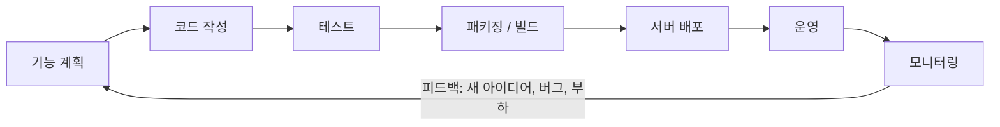
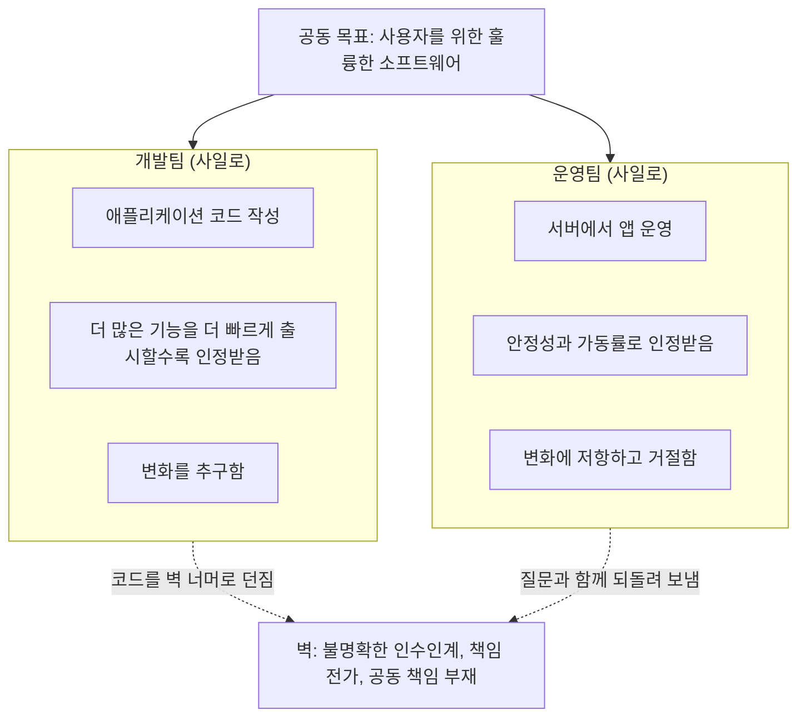

# DevOps란 무엇인가: 개발과 운영 사이의 벽, 그리고 왜 중요한가

## 학습 목표
- 개발(Dev)팀과 운영(Ops)팀이 따로 일할 때 생기는 문제(느린 배포, 책임 전가, 팀 사일로)를 이해한다.
- DevOps가 추구하는 핵심 가치인 빠른 배포, 안정성, 협업을 설명할 수 있다.
- DevOps가 단순한 도구 모음이 아니라 일하는 문화와 방식임을 인식한다.

## 본문

### 왜 이 강의가 첫 번째인가

DevOps 도구를 하나라도 배우기 전에, DevOps가 애초에 *왜* 생겨났는지를 이해하는 것이 훨씬 중요하다. 이 맥락 없이 도구부터 배우면 Docker, Jenkins, Kubernetes, Terraform이 그냥 뒤죽박죽 기술 목록처럼 느껴진다. 하지만 DevOps가 어떤 문제를 해결하려고 탄생했는지 이해하고 나면, 이 도구들이 모두 같은 목표를 향해 각자의 방식으로 기여하고 있다는 사실이 명확하게 보인다.

그래서 이번 강의에서는 도구를 전혀 다루지 않는다. 오직 하나의 질문에 답한다. **소프트웨어 팀을 얼마나 괴롭혔기에 한 분야가 통째로 생겨났을까?**

### 기능 하나가 사용자에게 닿기까지

구체적인 예시부터 시작해 보자. 앱 아이디어가 생겼다고 가정하면, "아이디어"에서 "실제 사용자가 쓰는 서비스"까지의 경로는 어떤 방법론을 쓰든 항상 비슷한 형태를 띤다.

1. 앱이 무엇을 해야 할지 결정한다(기능 정의).
2. 개발자가 코드를 작성한다.
3. 누군가가 테스트한다.
4. 앱을 실행 가능한 형태로 패키징한다.
5. 서버를 준비하고 설정한 뒤 앱을 배포한다.
6. 사용자가 접근할 수 있도록 네트워크와 방화벽 규칙을 연다.
7. 사용자들이 쓰기 시작하면 이제 관리가 시작된다. 서비스가 살아 있는가? 버그는 없는가? 부하를 감당할 수 있는가?

그리고 여기서 핵심이 있다. **이 과정은 단 한 번으로 끝나지 않는다.** 사용자가 앱을 좋아하면 기능을 추가하고, 버그를 수정하고, 성능을 개선하고 싶어진다. 그 모든 개선이 같은 경로를 다시, 계속해서 지나가야 한다. "아이디어 → 코드 → 테스트 → 배포 → 운영 → 모니터링 → 다시 아이디어"로 이어지는 이 끝없는 반복이 바로 DevOps의 비공식 로고가 무한 기호(∞)인 이유다. 작업은 끝나지 않고 계속 순환한다. 아래 배포 루프 그림이 이를 잘 보여 준다.

> DevOps의 본질은 이 배포 루프를 **빠르면서도 오류 없이** 돌아가게 만드는 것이다. 품질을 신경 쓰지 않으면 누구든 빠르게 배포할 수 있고, 시간을 무한정 들이면 누구든 안전하게 배포할 수 있다. 어려운 점은, 그리고 DevOps의 존재 이유는, 이 둘을 동시에 달성하는 것이다.

### 벽: 개발팀과 운영팀이 충돌하는 지점

소프트웨어를 만드는 전통적인 방식에서는 이 여정이 서로 벽을 사이에 둔 두 팀으로 나뉘어 있었다.

- **개발자(Dev)** 는 애플리케이션 코드를 작성한다. 새 기능을 빠르게 출시하는 것이 일이자 성과 지표다.
- **운영자(Ops)** 는 애플리케이션을 서버에서 실행한다. 시스템을 안정적으로 유지하고 장애와 오류 페이지 없이 서비스를 가동하는 것이 일이자 성과 지표다.

표면적으로 두 팀의 목표는 같다. 사용자에게 좋은 소프트웨어를 제공하는 것. 하지만 성과를 측정하는 방식이 두 팀을 정반대 방향으로 잡아당긴다. 아래 그림은 같은 목표가 어떻게 서로 다른 인센티브를 가진 두 사일로로 분열되는지 보여 준다. 이것이 문제의 핵심이므로, 실제로 어떻게 잘못되는지 하나씩 살펴보자.

**문제 1: 소통 부재와 인수인계 공백.** 개발자가 기능을 완성하고 운영팀에 "벽 너머로 던진다." 하지만 배포 지침은 불명확하거나 문서화가 부실하다. 운영팀은 애플리케이션 내부 동작을 제대로 이해하지 못하고, 개발팀은 애플리케이션이 실제로 어디서 어떻게 실행될지 깊이 고민하지 않았다. 그러니 운영팀은 배포에 애를 먹고, 질문을 담아 되돌려 보내고, 답변을 기다리고, 다시 시도한다. 한 시간이면 끝날 릴리스가 며칠, 때로는 몇 주로 늘어난다. 깔끔한 자동화된 인수인계는 없고, 체크리스트·문서·수동 승인으로 가득 찬 관료적인 절차만 있다.

**문제 2: 상충하는 인센티브.** 개발팀은 *더 많이, 더 빠르게* 릴리스하려 하고, 운영팀은 *속도를 늦추고 검증*해서 아무것도 망가지지 않게 하려 한다. 실제로 문제가 터지면, 예컨대 새 기능이 메모리를 너무 많이 잡아먹어 서버가 새벽 2시에 다운되면, 호출기가 울리는 것은 코드를 작성한 개발자가 아니라 운영팀이다. 장애의 고통이 운영팀에게만 떨어지기 때문에, 운영팀은 변화에 "아니요"라고 말하는 팀이 된다. 개발팀은 그 고통을 직접 겪지 않으니 계속 밀어붙인다. 두 팀 중 어느 쪽도 틀리지 않았다. *구조* 자체가 그들을 서로 싸우게 만드는 것이다.

**문제 3: 책임 전가와 사일로.** 릴리스가 잘못되면 자연스럽게 상대방을 탓하게 된다. 개발팀은 "내 로컬에서는 잘 됐는데 운영팀이 망쳤다"고 하고, 운영팀은 "코드 문제다, 우린 그냥 실행만 했다"고 한다. 각 팀은 자기만의 도구, 자기만의 우선순위를 가진 사일로 안에 앉아 공동의 이해를 거의 나누지 않는다. 전체 여정을 책임지는 사람이 없으니 문제는 두 팀 사이의 틈새로 빠져버린다.

소프트웨어 릴리스에는 개발팀과 운영팀만 관여하는 것이 아니라는 점도 짚어야 한다. **보안** 검토팀이 변경사항이 안전한지 승인해야 하고, **테스트** 팀이 여러 환경에서 수동 검증을 해야 할 수도 있다. 전통적인 방식에서 이들 각각은 릴리스에 며칠씩 더 얹는 또 하나의 수동·관료적 관문이 된다. (보안 측면은 나중에 DevSecOps라는 이름을 얻었다.)

**문제 4: 곳곳에 만연한 수작업.** 기존 방식에서는 대부분의 작업이 수작업이었다. 운영자가 서버에 직접 명령어를 입력해 도구를 설치하고, 패치를 적용하고, 설정을 바꾸거나 일회성 스크립트를 실행하는 식이었다. 수작업은 느릴 뿐 아니라, 더 큰 문제는 불안정하다는 것이다. 사람이 하는 일인 만큼 실수가 생긴다. 지식이 특정 사람의 머릿속에만 있으니 공유하기 어렵다. 언제 누가 무엇을 바꿨는지 추적하기도 힘들다. 서버가 죽으면 이전 상태를 복구하려면 그 서버에서 실행됐던 모든 명령어를 정확한 순서로 *기억*해야 한다. 긴박한 상황에서 그게 가능할 리 없다.

### 이 문제들의 공통점

문제 1부터 4를 한 발 떨어져서 보면 모두 같은 결과를 낳는다는 것을 알 수 있다. **배포 루프를 느리게 만들고 오류가 사용자에게 흘러들어 가게 한다.** 이 공통 증상이 핵심 통찰이다. DevOps는 특정 도구 목록이나 딱딱한 조직도로 스스로를 정의하지 않는다. 하나의 미션으로 정의한다.

> **배포 루프를 느리게 만드는 모든 장애물을 제거하고, 느리고 수작업에 의존하며 오류가 잦은 단계를 빠르고 자동화되고 반복 가능한 단계로 하나씩 교체한다.**

그것이 전부다. 어색한 인수인계, 수동 서버 설정, 일주일씩 걸리는 보안 검토 등 무엇이든 속도를 늦추고 있다면 DevOps는 이렇게 말한다. 자동화하고, 간소화하고, 그것을 만들어 낸 벽을 허물라. 어떤 기업들은 이를 극한으로 최적화해 하루에도 여러 번 릴리스한다. 모든 팀이 그럴 필요는 없지만, 매끄럽고 자동화된 릴리스 프로세스는 누구에게나 도움이 된다.

### 그래서 DevOps란 정확히 무엇인가?

공식 정의는 이렇다. **DevOps는 소프트웨어를 빠르고 안정적으로 제공하기 위한 문화적 철학, 실천 방식, 도구의 조합이다.** 다시 읽어 보면 순서가 눈에 들어온다. *문화*가 가장 앞에 온다.

이 강의에서 가장 중요하게 기억해야 할 것은 바로 이것이다. **DevOps는 설치하는 도구가 아니다. 일하는 방식이다.** DevOps의 가장 깊은 아이디어는, 개발자와 운영자가 *더 이상 벽으로 나뉜 두 팀이 아니어야 한다*는 것이다. 더 많이 소통하고, 더 긴밀히 협력하고, 코드에서 실행 중인 소프트웨어까지 전체 여정의 책임을 함께 나눠야 한다. Docker, Jenkins, Kubernetes 같은 도구들은 그 협력을 *지원*하고 지루하고 위험한 작업을 자동화하기 위해 존재한다. 도구를 다 사도 벽을 그대로 두면 DevOps가 아니라 그냥 비싼 소프트웨어를 갖게 되는 것이다.

DevOps가 제공하는 세 가지 핵심 가치를 기억하는 방법:

- **빠른 배포** — 기능과 수정이 몇 주간의 수동 인수인계 없이 빠르게 사용자에게 닿는다.
- **안정성** — 빠르게 배포한다고 해서 허술하게 배포하는 것이 아니다. 변경사항은 충분히 테스트되고 신뢰할 수 있어야 한다.
- **협업** — 개발팀과 운영팀(그리고 보안팀, 테스트팀)이 서로 벽 너머로 비난하는 대신 목표, 맥락, 책임을 함께 나눈다.

### 문화에서 직무로

솔직한 반전이 하나 있다. DevOps를 처음 만든 이들은 이것을 순수하게 *문화*로 상상했지, 직무로 생각하지 않았다. 하지만 현실에서 이 아이디어는 실용적인 필요에 맞게 변형됐다. 기업들이 자동화된 릴리스 파이프라인을 구축하고 유지할 사람을 채용하기 시작하면서 **"DevOps 엔지니어"** 라는 역할이 생겨났다. 어떤 경우에는 개발자가 코딩과 병행해 DevOps를 담당하고, 어떤 경우에는 운영자가, 어떤 경우에는 전담 직무로 분리된다.

이 역할의 중심에는 **CI/CD 파이프라인**, 즉 지속적 통합(Continuous Integration)과 지속적 배포(Continuous Delivery)가 있다. 쉽게 말해 코드 변경사항을 받아 테스트하고 패키징한 뒤 서버에 배포하는 것을 수동 인수인계 없이 자동으로 처리하는 조립 라인이다. CI/CD는 이후 강의에서 자세히 다룬다. 지금은 이 그림만 머릿속에 담아 두자. 개발팀과 운영팀 사이의 벽이 자동화된 다리로 교체되고, DevOps 마인드셋이 그 다리를 만들고 유지한다.

**SRE(사이트 신뢰성 엔지니어링, Site Reliability Engineering)** 라는 용어도 들어봤을 것이다. DevOps와 같은 목표, 즉 품질 좋은 소프트웨어를 빠르게 제공하되 시스템의 신뢰성과 안정성에 특히 강조점을 두면서 함께 성장한 개념이다. 많은 사람들이 SRE를 DevOps 원칙을 실천하는 구체적인 방법 중 하나로 설명한다. 지금은 DevOps와 SRE를 같은 동전의 양면으로 생각하면 된다. 둘 다 빠르면서 *동시에* 안정적인 배포를 목표로 한다.

### 간단한 비유

레스토랑을 생각해 보자. 기존 방식에서 **요리사(Dev)** 는 음식을 만들어 창구로 밀어 넣고 잊어버린다. **서빙 직원(Ops)** 은 창구에 나타나는 것을 그대로 서빙한다. 잘못된 음식이든, 식은 음식이든. 불만스러운 손님에게 혼나는 것도 서빙 직원이다. 요리사는 더 많은 요리를 내면 인정받고, 서빙 직원은 테이블이 조용하고 만족스러워야 인정받는다. 그러니 요리사는 서두르고, 서빙 직원은 저항하고, 손님은 기다린다.

DevOps는 창구를 없앤다. 이제 요리사와 서빙 직원은 하나의 목표를 공유한다. 손님 앞에 맛있는 음식이 빠르게 놓이는 것. 그리고 매끄럽고 잘 다듬어진 시스템(자동화 파이프라인)을 함께 만들어 아무도 벽 너머로 소리 지를 필요 없이 주방에서 테이블까지 음식이 흐른다. 주방 장비도 물론 중요하지만, 레스토랑을 훌륭하게 만드는 것은 공유된 목표와 매끄러운 프로세스다.

## 핵심 정리
- 개발팀과 운영팀의 전통적인 분리는 느린 릴리스, 상충하는 인센티브, 책임 전가, 불안정한 수작업을 낳는 "벽"을 만든다.
- 이 문제들은 공통 증상을 공유한다. 배포 루프를 느리게 만들고 오류가 사용자에게 도달하게 한다.
- DevOps는 특정 도구가 아니라 미션으로 정의된다. 장애물을 제거하고 느린 수작업 단계를 빠르고 자동화된 반복 가능한 단계로 교체하는 것.
- DevOps의 세 가지 핵심 가치는 빠른 배포, 안정성, 협업이며 세 가지를 동시에 달성해야 한다.
- DevOps는 무엇보다 문화이자 일하는 방식이다. CI/CD 파이프라인 같은 도구는 협력을 대체하는 것이 아니라 지원하기 위해 존재한다.
- "DevOps 엔지니어" 역할과 SRE는 이 원칙을 실천하는 구체적인 방법으로 등장했으며, CI/CD 파이프라인이 그 중심에 있다.

## 출처
- TechWorld with Nana — *What is DevOps? REALLY understand it | DevOps vs SRE*: https://www.youtube.com/watch?v=0yWAtQ6wYNM
- Programming with Mosh — *The Complete DevOps Roadmap*: https://www.youtube.com/watch?v=6GQRb4fGvtk
