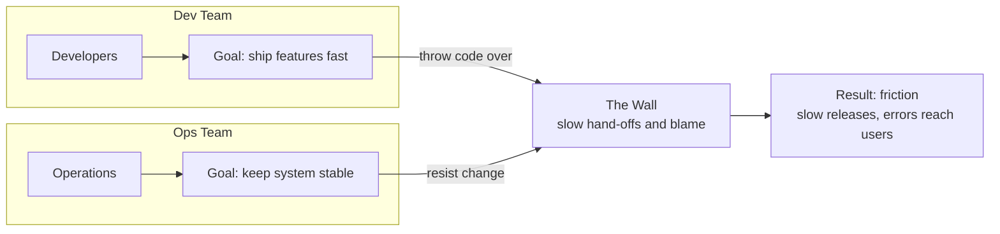

# DevOps란 무엇인가 — 개념과 문화(CALMS)

## 학습 목표
- 개발(Dev)과 운영(Ops)이 분리되어 생기는 문제와 DevOps가 추구하는 핵심 가치(빠른 전달·안정성·협업)를 이해한다.
- DevOps가 도구가 아니라 문화이자 일하는 방식임을 안다.
- CALMS(Culture·Automation·Lean·Measurement·Sharing) 프레임워크로 DevOps 원칙을 설명할 수 있다.

## 본문

### Dev와 Ops 사이의 벽

소프트웨어는 언제나 같은 여정을 따른다. 누군가 아이디어를 내고, 개발자가 코드를 작성·테스트하고, 그 결과물이 실제 서버를 거쳐 사용자에게 닿는다. 출시 이후에도 버그를 잡고, 기능을 추가하고, 업데이트를 계속 배포한다. DevOps는 이 끝없는 배포 사이클을 **빠르고** **안정적으로** 만드는 것을 목표로 한다.

전통적인 조직에서는 이 여정이 두 팀으로 나뉜다. **개발자**는 코드를 작성하고, **운영팀**은 그것을 프로덕션에서 운영한다. 문제는 두 팀의 인센티브가 서로 충돌한다는 점이다.

- 개발자는 새 기능을 빨리 출시할수록 좋은 평가를 받는다.
- 운영팀은 시스템을 안정적으로 유지할수록 좋은 평가를 받는다 — 그러니 변경을 꺼리게 된다. 모든 변경은 위험 요소이기 때문이다.

결국 구조적인 이해충돌이 생긴다. 개발자는 완성된 코드를 "벽 너머로 던지고," 운영팀은 직접 만들지도 않고 속속들이 알지도 못하는 무언가를 배포해야 하는 처지가 된다. 인수인계는 느리고 관료적인 체크리스트로 변한다. 몇 시간이면 될 릴리스가 며칠, 몇 주로 늘어지기 일쑤다. 새 기능이 새벽 2시에 프로덕션을 다운시키면 호출을 받는 건 운영팀이다 — 코드를 작성한 개발자는 실제 운영 환경을 고민할 압박을 거의 느끼지 못한다.

아래 다이어그램은 서로 반대 방향을 향한 두 팀이 벽을 사이에 두고 어떻게 마찰을 만들어내는지 보여준다.

> Dev/Ops 분리가 낳는 증상은 항상 같다. 릴리스 사이클을 늦추고, 결국 오류가 사용자에게까지 흘러가는 마찰이다.

### DevOps란 무엇인가

DevOps를 도구 모음이나 직함으로 생각하기 쉽다. 하지만 본질은 그렇지 않다. DevOps의 원래 정의는 소프트웨어를 빠르고 높은 품질로 전달하기 위한 **문화적 철학, 실천 방식, 도구의 결합**이다.

순서를 주목하자. **문화가 먼저다.** 시장의 모든 자동화 도구를 갖춰놓아도, 개발자와 운영팀이 실제로 대화하고 책임을 나누지 않는다면 DevOps는 실패한다. 핵심 통찰은 단순하다. 두 팀은 함께 일하고, 자주 소통하며, 각자의 사일로를 지키는 대신 결과를 공동으로 책임져야 한다.

DevOps의 목표는 릴리스 사이클을 늦추는 요인 — 소통 부재, 수작업 인수인계, 오류가 잦은 배포 — 을 제거하고, 그 자리에 효율적이고 자동화된 협업 프로세스를 심는 것이다. 이를 제대로 실현한 기업은 연 몇 차례 릴리스에서 벗어나 하루에도 여러 번 안전하게 배포할 수 있다. 흔히 보이는 무한루프(∞) 로고가 그 의미를 잘 담고 있다. 개선은 끝이 없고, 배포 흐름도 멈춰서는 안 된다.

> DevOps는 일하는 방식이지, 설치하는 제품이 아니다. 도구는 문화를 지원하는 수단이며, 문화를 대체하지 않는다.

### CALMS 프레임워크

"문화적 철학, 실천 방식, 도구의 결합"은 너무 넓다. 그래서 업계는 DevOps를 구체적으로 표현하는 간결한 체크리스트를 만들었다. 바로 **CALMS**다. "DevOps가 무엇인가?"에 대한 가장 좋은 짧은 답이기도 하다.

| 글자 | 원칙 | 실제로 무엇을 의미하는가 |
|------|------|--------------------------|
| **C** | **Culture (문화)** | 사일로를 허물고 Dev와 Ops가 책임을 나눈다. 실패를 비난이 아닌 학습의 기회로 삼는 심리적 안전감을 갖춘 환경을 만든다. 실패를 두려워하는 문화에서 "빠르게 실패하고 앞으로 나아가는" 문화로, 기술 집착에서 고객 중심으로 전환한다. |
| **A** | **Automation (자동화)** | 테스트·빌드·배포 같은 반복적인 수작업을 없애 릴리스를 빠르고 일관되게 만든다. 단, 자동화는 *사람과 프로세스가 먼저*다. 잘못된 프로세스를 자동화하면 더 빠르게 망가질 뿐이다. |
| **L** | **Lean (린)** | 전체 가치 흐름을 단순하게 유지한다. 작은 단위로 작업하고, 진행 중인 작업(WIP)을 제한하며, 작은 증분을 지속적으로 배포한다. 단순하고 반복 가능한 프로세스라야 팀이 실제로 따른다. |
| **M** | **Measurement (측정)** | 의견이 아닌 데이터로 결정한다. 리드 타임, 배포 빈도, 변경 실패율, 평균 복구 시간 같은 지표와 팀 만족도 같은 사람 지표도 함께 추적한다. 측정하지 않으면 개선할 수 없다. |
| **S** | **Sharing (공유)** | 지식·피드백·성과를 조직 전체에 공개적으로 공유한다. 투명성은 신뢰를 쌓고, 피드백 루프를 촘촘하게 하며, 현장의 해결책을 회사 전체의 자산으로 만든다. |

다섯 글자 중 넷이 사람과 프로세스에 관한 것이다. 나머지 하나만 자동화를 다룬다. 이 비율이 핵심이다. 누구나 먼저 떠올리는 자동화 빌드·배포 파이프라인은 DevOps의 아주 작은 부분에 불과하다. 나머지는 조직이 어떻게 생각하고, 배우고, 함께 일하는가에 달려 있다.

기억하기 쉬운 문구 하나: **"CALMS를 유지하며 DevOps를 하라."**

## 핵심 정리
- Dev와 Ops를 분리하면 속도 대 안정성이라는 이해충돌이 생겨 릴리스가 느려지고 오류가 사용자에게 닿는다.
- DevOps는 도구만이 아닌 더 나은 협업을 통해 그 마찰을 없애고 소프트웨어를 **빠르고 안정적으로** 전달하는 것을 목표로 한다.
- DevOps는 **문화이자 일하는 방식**이지, 도구나 단일 역할이 아니다. 문화가 먼저고, 도구는 그것을 지원한다.
- **CALMS**가 원칙을 요약한다: **C**ulture(문화), **A**utomation(자동화), **L**ean(린), **M**easurement(측정), **S**haring(공유).
- CALMS 다섯 기둥 중 넷이 사람과 프로세스에 관한 것 — 자동화는 DevOps의 한 부분일 뿐이라는 사실을 잊지 말자.

## 출처
- What is DevOps? REALLY understand it | DevOps vs SRE — https://www.youtube.com/watch?v=0yWAtQ6wYNM
- CALMS (Eficode) — https://www.youtube.com/watch?v=jiDwhKNS9A0
- DevOps Principles - The C.A.M.S. Model — https://www.youtube.com/watch?v=VySUutlo91E
- DevOps CALMS Framework — https://www.youtube.com/watch?v=LdMtHOWhchk
- [DevOps 전문가 블로그] DevOps 엔지니어가 되려면 어떻게 해야해요? — https://www.youtube.com/watch?v=5ACICDxWops
