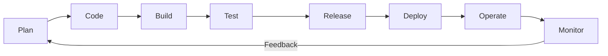

# DevOps Culture and Principles: CALMS, Collaboration, Automation, and Measurement

## Learning Objectives
- Understand the CALMS framework (Culture, Automation, Lean, Measurement, Sharing) and what each element means in practice.
- Explain the core DevOps principles of collaboration, automation, and continuous improvement.
- Recognize how adopting DevOps changes the way an organization works, using everyday examples.

## Body

### Why DevOps Is a Culture, Not a Toolbox

When people first hear the word "DevOps," they often picture a stack of tools: build servers, deployment scripts, dashboards full of graphs. Those tools matter, but they are only the visible tip of something much larger. At its heart, DevOps is a way of working that brings developers (the people who write software) and operations (the people who run that software in production) together so they share one goal instead of fighting over two.

To see why that matters, picture the "old" way many companies still work. Developers write code, throw it "over the wall" to an operations team, and move on. When something breaks in production, operations gets paged at 2 a.m. and developers say "it worked on my machine." Each side blames the other. The wall between them is what DevOps tries to tear down.

> DevOps is far more than automation. It is a culture and a state of mind that borrows from Agile and Lean thinking. The tools are the easy part; changing how people work together is the real challenge.

So how do we describe this way of working in a way that is concrete enough to act on? The most widely used answer is a framework called **CALMS**.

### The CALMS Framework

A framework is simply a roadmap: a set of guidelines you can follow step by step toward a destination. CALMS, popularized by DevOps thought leaders such as Jez Humble, gives us five lenses for understanding what DevOps is really about. The letters stand for:

- **C** — Culture
- **A** — Automation
- **L** — Lean
- **M** — Measurement
- **S** — Sharing

(You may also encounter an older, four-letter version called **CAMS**, created by Damon Edwards and John Willis. It is the same idea without the explicit "Lean" letter.)

As the diagram below shows, Culture is the foundation that the other four elements rest on, and each element supports the shared DevOps goal.

```mermaid The five elements of the CALMS framework, built on a foundation of Culture
flowchart TD
    Goal["DevOps Goal: faster, reliable value delivery"]
    A["A — Automation"]
    L["L — Lean"]
    M["M — Measurement"]
    S["S — Sharing"]
    C["C — Culture (the foundation)"]
    A --> Goal
    L --> Goal
    M --> Goal
    S --> Goal
    C --> A
    C --> L
    C --> M
    C --> S
```

Let's walk through each one.

### C — Culture

Culture comes first because it is the foundation everything else stands on. Even though DevOps uses advanced technology, the problems it solves are really about *people*. Culture is shaped by how people behave and interact, so a healthy DevOps culture means changing behavior. A few shifts matter most:

- **From fear of failure to "fail fast, fail forward."** In a healthy culture, mistakes are treated as learning opportunities, not reasons for blame. When someone breaks something, the team asks "what can we learn?" rather than "whose fault is this?" This requires *psychological safety*: an environment where people feel safe to speak up, experiment, and admit problems without fear of being scolded. Leaders set the tone here by how they react when things go wrong.
- **From silos to shared responsibility.** Instead of separate, walled-off dev and ops teams, DevOps gives both groups shared ownership of the product. Developers help maintain what runs in production, which makes them care about how it deploys. Operations gains a clearer view of what the software is meant to do. The same idea extends outward: integrating the business gives us "BizDevOps," and integrating security gives us "DevSecOps."
- **From tech obsession to customer obsession.** It is easy to fall in love with a clever, feature-rich product that nobody actually needs. A DevOps culture keeps asking, "What job is the customer trying to get done, and are we helping them do it?"

A simple everyday parallel: think of a restaurant where the kitchen and the waiters never talk. The kitchen cooks whatever it likes; the waiters serve whatever arrives and apologize when guests complain. Now imagine they share one goal: a happy diner. The cooks ask the waiters what guests are saying, and the waiters explain the menu accurately. Nothing about the stove changed, but the *culture* did, and the food gets to the table better.

### A — Automation

Automation is many people's favorite part of DevOps because it is the most concrete. The goal is to seek out manual, repetitive, tedious work and let machines handle it, freeing engineers for more valuable and more satisfying tasks.

The backbone of this is **Continuous Integration and Continuous Delivery (CI/CD)** — automated pipelines that test, integrate, deploy, and monitor code without someone running each step by hand. (We'll explore CI/CD in detail in a later lecture.) Instead of releasing one huge batch of changes every few months, teams automatically push small, production-ready pieces of code as soon as they are ready.

But there are two important cautions an experienced practitioner will always raise:

> Automation success is about *people and processes*, not just tools. Buying a shiny tool and bolting it onto a broken process will not fix the problem. First understand the real bottleneck, then automate the right thing.

Second, **speed for its own sake can be dangerous.** Automating a flawed process just lets you make mistakes faster. The skill is choosing *which* activities truly benefit from speed, and calibrating them over time. We should also "architect for automation": if an application is hard to test, run, or deploy automatically, treat that as a critical problem to fix, just as important as building new features.

### L — Lean

Lean thinking, borrowed from manufacturing, is about maximizing the flow of value while cutting waste. In DevOps terms, this means a few practical habits:

- **Small batch sizes.** Deliver small increments of working software often, rather than one giant release.
- **Limiting work in progress (WIP).** Don't start ten things at once; finish a few before starting more, so work actually flows to completion.
- **Keeping processes simple.** Lean, slim processes are repeatable and scalable. Heavy, complicated processes tend to be ignored, so the goal is "leaner and simpler" rather than "more rules."

The aim is to keep value moving smoothly through the entire pipeline, from idea to the user's hands, and to react quickly to their feedback.

### M — Measurement

You cannot improve what you cannot see. DevOps strives to build a *data-driven culture*, using real measurements from production and from your processes to guide decisions rather than relying on opinion or guesswork.

Helpful metrics fall into three groups:

- **Technology metrics.** These measure system health. Common ones include *lead time* (how long it takes to get a code change into production), *deployment frequency* (how often you release), *change failure rate* (how often a release causes a problem), and *mean time to recovery* (how fast you bounce back from an incident). Because DevOps ships small changes, the cause of a problem is usually easier to spot and fix.
- **Process metrics.** Is a given process actually adding value? A useful, honest question to ask is: "What would happen if we removed this step?" If the answer is "nothing bad," the step is probably waste.
- **People metrics.** Are engineers satisfied, challenged, and motivated? Do the goals feel achievable? Short, two-week goals let people see progress and stay engaged far better than a vague target six months away.

Measurement isn't about drowning in big data. The point is *insight*: seeing trends, learning about your product and organization, and then using that knowledge to drive your next action.

### S — Sharing

The final element ties the others together. Sharing means openness and transparency across the whole organization, summed up by the phrase "sharing is caring."

This works in two directions. First, share knowledge, feedback, and best practices between teams. When a small team solves a hard problem, that solution should be lifted up and reused across the wider organization, multiplying its benefit. Second, make goals and incentives *visible* so everyone can see progress and pull toward the same outcome.

One subtle but important point: communication barriers are often created at the *top*, not the bottom. If leaders and VPs talk openly with each other, developers will follow suit. When sharing flows freely, teams build trust, tighten their feedback loops, and steadily improve. The result is collective intelligence, where the team becomes greater than the sum of its parts.

### Putting It Together: The Infinite Loop

Notice how the five elements reinforce one another. A healthy *culture* makes people willing to *share*. Sharing feeds *measurement*, which reveals where to focus *automation* and where to apply *lean* thinking, which in turn frees people to collaborate even better. This is why DevOps is often drawn as an infinite loop of continuous feedback, continuous integration, and continuous delivery: improvement never stops, it just cycles around again.

The loop below shows how the development and operations sides connect into one never-ending cycle of feedback and improvement.



That is also the meaning behind the popular slogan: **"Keep CALMS and do DevOps."**

## Key Takeaways
- DevOps is primarily a *culture and mindset* that unites development and operations around shared goals; tools are only a small part of it.
- The **CALMS** framework captures five dimensions: Culture, Automation, Lean, Measurement, and Sharing. (An older version, CAMS, omits the explicit Lean element.)
- **Culture** means psychological safety, shared responsibility, breaking down silos, and a "fail fast, fail forward" attitude.
- **Automation** (especially CI/CD) removes repetitive manual work, but success depends on fixing people and processes first, not just buying tools, and speed must be applied thoughtfully.
- **Lean** keeps value flowing through small batches, limited work-in-progress, and simple repeatable processes.
- **Measurement** builds a data-driven culture using technology, process, and people metrics to guide improvement, focused on insight rather than raw data.
- **Sharing** spreads knowledge and makes goals transparent, often starting from leadership, fueling a continuous improvement loop.
