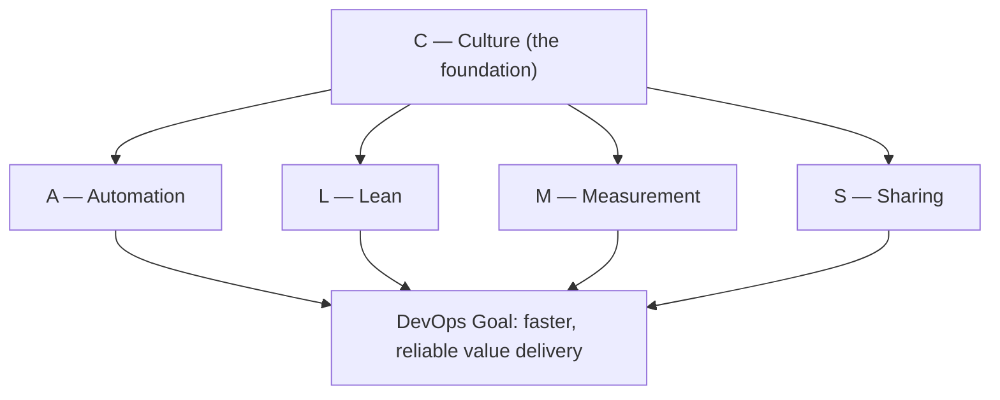
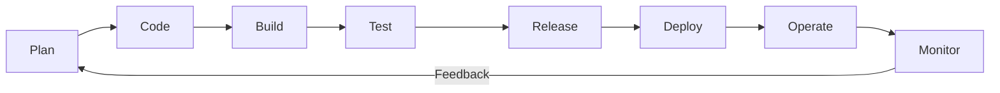

# DevOps 문화와 원칙: CALMS, 협업, 자동화, 측정

## 학습 목표
- CALMS 프레임워크(Culture, Automation, Lean, Measurement, Sharing)의 각 요소가 실제로 무엇을 의미하는지 이해한다.
- 협업, 자동화, 지속적 개선이라는 DevOps 핵심 원칙을 설명할 수 있다.
- DevOps를 도입하면 조직이 어떻게 달라지는지, 일상적인 예시를 통해 파악한다.

## 본문

### DevOps는 도구 모음이 아니라 문화다

'DevOps'라는 단어를 처음 들으면 보통 빌드 서버, 배포 스크립트, 그래프가 빼곡한 대시보드 같은 도구들을 떠올린다. 물론 그 도구들도 중요하다. 하지만 그것은 훨씬 큰 무언가의 표면일 뿐이다. DevOps의 핵심은 소프트웨어를 만드는 개발자(Dev)와 그 소프트웨어를 운영하는 운영팀(Ops)이 각자의 목표를 놓고 싸우는 대신, 하나의 공동 목표를 향해 함께 일하는 방식이다.

왜 이게 중요한지는 많은 회사가 아직도 반복하는 '구식' 방식을 보면 알 수 있다. 개발자는 코드를 작성하고 운영팀에게 '던져 넘기면' 끝이다. 운영에서 장애가 나면 새벽 2시에 호출을 받는 건 운영팀이고, 개발자는 "내 로컬에서는 잘 됐는데요"라고 한다. 서로 책임을 떠넘기는 상황이다. DevOps가 무너뜨리려는 것이 바로 이 '벽'이다.

> DevOps는 자동화 그 이상이다. 애자일과 린(Lean) 사고를 빌려온 문화이자 사고방식이다. 도구를 갖추는 것은 쉬운 편이다. 진짜 어려운 과제는 사람들이 함께 일하는 방식을 바꾸는 것이다.

그렇다면 이 일하는 방식을 실제로 행동에 옮길 수 있을 만큼 구체적으로 표현하려면 어떻게 해야 할까? 가장 널리 쓰이는 답이 바로 **CALMS** 프레임워크다.

### CALMS 프레임워크

프레임워크는 일종의 로드맵이다. 목적지를 향해 단계별로 따라갈 수 있는 지침의 묶음이다. Jez Humble 같은 DevOps 사상가들이 대중화한 CALMS는 DevOps가 진정으로 무엇인지를 다섯 가지 시각으로 설명해 준다. 각 알파벳은 다음을 뜻한다:

- **C** — Culture (문화)
- **A** — Automation (자동화)
- **L** — Lean (린)
- **M** — Measurement (측정)
- **S** — Sharing (공유)

(Damon Edwards와 John Willis가 만든 네 글자 버전 **CAMS**를 접하는 경우도 있다. 'Lean'이 빠진 것만 다르고 기본 개념은 같다.)

아래 다이어그램에서 볼 수 있듯, Culture는 나머지 네 요소를 떠받치는 토대이며, 각 요소는 DevOps의 공동 목표를 뒷받침한다.

하나씩 살펴보자.

### C — Culture (문화)

Culture가 맨 앞에 오는 이유는, 다른 모든 것이 그 위에 서 있기 때문이다. DevOps가 첨단 기술을 활용하더라도, 그것이 풀려는 문제는 결국 *사람*에 관한 것이다. 문화는 사람들이 어떻게 행동하고 상호작용하느냐에 의해 만들어지므로, 건강한 DevOps 문화를 만들려면 행동 방식을 바꿔야 한다. 특히 중요한 변화가 몇 가지 있다:

- **실패에 대한 두려움에서 "빨리 실패하고, 실패에서 나아가라(fail fast, fail forward)"로.** 건강한 문화에서는 실수를 비난의 근거가 아닌 배움의 기회로 다룬다. 무언가 잘못되면 "누구 잘못이야?"가 아니라 "우리가 뭘 배울 수 있지?"를 묻는다. 이를 위해서는 *심리적 안전감(psychological safety)*, 즉 혼나지 않을까 걱정하지 않고 자유롭게 의견을 내고, 실험하고, 문제를 인정할 수 있는 환경이 필요하다. 리더가 문제 상황에 어떻게 반응하느냐가 그 분위기를 결정한다.
- **사일로(silo)에서 공동 책임으로.** 개발과 운영이 서로 벽을 쌓고 분리되는 대신, DevOps에서는 두 팀 모두 제품에 대한 공동 소유권을 갖는다. 개발자가 운영 환경을 함께 책임지면 배포 방식에 자연히 신경을 쓰게 되고, 운영팀은 소프트웨어가 무엇을 하려는지 더 잘 이해하게 된다. 같은 맥락에서 비즈니스를 통합하면 "BizDevOps"가 되고, 보안을 통합하면 "DevSecOps"가 된다.
- **기술 집착에서 고객 집착으로.** 정작 아무도 필요로 하지 않는 화려한 기능의 제품에 빠져들기 쉽다. DevOps 문화는 끊임없이 묻는다. "고객이 해결하고 싶은 일이 무엇이고, 우리가 그것을 돕고 있는가?"

쉬운 비유로 생각해 보자. 주방과 홀 직원이 전혀 소통하지 않는 식당을 떠올려 보라. 주방은 자기 맘대로 요리하고, 홀 직원은 나오는 음식을 그냥 갖다 주면서 손님이 불평하면 사과만 한다. 이제 두 팀이 '행복한 손님'이라는 하나의 목표를 공유한다고 상상해 보자. 주방 직원은 홀 직원에게 손님 반응을 물어보고, 홀 직원은 메뉴를 정확하게 설명한다. 조리 기구가 바뀐 것은 없지만 *문화*가 바뀌었고, 음식이 더 잘 나오게 된다.

### A — Automation (자동화)

자동화는 DevOps에서 가장 눈에 잘 띄는 부분이다. 목표는 반복적이고 지루한 수작업을 찾아내서 기계에 맡기고, 개발자가 더 가치 있고 보람 있는 일에 집중할 수 있게 하는 것이다.

그 핵심이 바로 **CI/CD(지속적 통합과 지속적 제공)**다. 매 단계를 사람이 직접 실행하지 않아도 코드를 테스트하고, 통합하고, 배포하고, 모니터링하는 자동화 파이프라인이다. (CI/CD는 이후 강의에서 자세히 다룬다.) 몇 달에 한 번씩 대규모 변경 사항을 한꺼번에 배포하는 대신, 작고 배포 가능한 단위의 코드를 준비되는 즉시 자동으로 내보낼 수 있다.

그런데 현장 경험이 풍부한 실무자라면 반드시 짚고 넘어가는 두 가지 주의사항이 있다:

> 자동화의 성공은 *사람과 프로세스*에 달려 있지, 도구에 달린 것이 아니다. 근사한 도구를 사서 망가진 프로세스에 덧붙인다고 문제가 해결되지 않는다. 진짜 병목이 무엇인지 먼저 파악하고, 그다음 올바른 지점을 자동화해야 한다.

두 번째로, **속도 자체가 목적이 되면 위험하다.** 결함이 있는 프로세스를 자동화하면 실수만 더 빠르게 늘어날 뿐이다. 어떤 작업에 속도가 진짜로 도움이 되는지 가려내고, 시간을 들여 조율하는 것이 핵심이다. 또한 "자동화를 위한 설계"도 중요하다. 자동으로 테스트하거나 배포하기 어려운 애플리케이션이라면, 새 기능을 만드는 것만큼 그 문제를 해결하는 것을 중요하게 다뤄야 한다.

### L — Lean (린)

린 사고는 제조업에서 빌려온 개념으로, 낭비를 줄이면서 가치의 흐름을 극대화하는 것이 핵심이다. DevOps에서는 다음과 같은 실천 습관으로 나타난다:

- **작은 배치 크기.** 대규모 릴리스 한 번보다, 작은 단위의 완성된 소프트웨어를 자주 제공한다.
- **진행 중인 작업(WIP) 제한.** 한 번에 열 가지를 시작하지 않는다. 몇 가지를 끝낸 다음 새 것을 시작해야 작업이 실제로 완료까지 흘러간다.
- **프로세스를 단순하게 유지.** 가볍고 단순한 프로세스는 반복 가능하고 확장하기도 쉽다. 복잡하고 무거운 프로세스는 결국 아무도 따르지 않게 된다. "더 많은 규칙"이 아니라 "더 가볍고 단순하게"가 목표다.

아이디어에서 시작해 사용자의 손에 닿기까지, 가치가 파이프라인 전체를 막힘 없이 흐르게 하고 사용자 피드백에 빠르게 반응하는 것이 린의 지향점이다.

### M — Measurement (측정)

볼 수 없는 것은 개선할 수 없다. DevOps는 *데이터 기반 문화*를 만드는 것을 지향한다. 직관이나 추측이 아닌, 운영 환경과 프로세스에서 얻은 실제 측정값으로 의사결정을 이끄는 것이다.

유용한 지표는 크게 세 가지로 나눌 수 있다:

- **기술 지표(Technology metrics).** 시스템의 건강 상태를 측정한다. 자주 쓰이는 것으로는 *리드 타임*(코드 변경이 운영 환경에 반영되기까지 걸리는 시간), *배포 빈도*(얼마나 자주 릴리스하는가), *변경 실패율*(릴리스가 문제를 일으키는 비율), *평균 복구 시간(MTTR)*(장애에서 얼마나 빨리 회복하는가)이 있다. DevOps는 작은 변경을 자주 배포하므로 문제 원인을 찾아 고치기가 상대적으로 쉽다.
- **프로세스 지표(Process metrics).** 특정 프로세스가 실제로 가치를 만들고 있는가? 솔직하게 던져볼 수 있는 질문이 하나 있다. "이 단계를 없애면 어떻게 될까?" 아무 문제도 없다면, 그 단계는 아마 낭비일 것이다.
- **사람 지표(People metrics).** 개발자들이 만족하고, 도전받고, 동기부여를 받고 있는가? 목표가 달성 가능하게 느껴지는가? 6개월 뒤의 막연한 목표보다 2주 단위의 짧은 목표가 진척을 느끼고 몰입을 유지하는 데 훨씬 효과적이다.

측정은 빅데이터에 허덕이는 것이 목적이 아니다. 핵심은 *통찰*이다. 추세를 파악하고, 제품과 조직에 대해 배우고, 그 지식을 바탕으로 다음 행동을 결정하는 것이다.

### S — Sharing (공유)

마지막 요소는 나머지를 하나로 묶는다. Sharing은 조직 전체의 개방성과 투명성을 의미하며, "나눔은 배려다(sharing is caring)"라는 표현으로 함축된다.

공유는 두 방향으로 작동한다. 첫째, 팀 간에 지식과 피드백, 모범 사례를 나눈다. 작은 팀이 어려운 문제를 해결했다면, 그 해법을 조직 전체로 끌어올려 재사용해야 한다. 둘째, 목표와 인센티브를 *가시적으로* 만들어 모두가 진행 상황을 보고 같은 방향으로 나아갈 수 있게 한다.

미묘하지만 중요한 포인트가 있다. 소통의 장벽은 흔히 아래가 아니라 *위*에서 만들어진다. 리더와 VP급이 서로 솔직하게 소통하면 개발자도 그 흐름을 따른다. 공유가 자유롭게 이루어지면 팀 간 신뢰가 쌓이고 피드백 루프가 촘촘해지며 꾸준한 개선이 이어진다. 그 결과는 팀의 집단 지성(collective intelligence), 즉 구성원 개개인의 합을 넘어서는 팀 전체의 역량이다.

### 하나로 연결되는 무한 루프

다섯 요소가 서로를 강화하는 방식에 주목하자. 건강한 *문화*는 사람들이 기꺼이 *공유*하게 만든다. 공유는 *측정*을 풍부하게 하고, 측정은 어디에 *자동화*를 적용하고 어디에 *린* 사고를 쓸지 알려주며, 린과 자동화는 사람들이 더 잘 협업할 여유를 만들어준다. DevOps가 흔히 끊임없는 피드백, 지속적 통합, 지속적 제공의 무한 루프로 표현되는 이유가 여기에 있다. 개선은 멈추지 않고 계속 순환한다.

아래 루프는 개발과 운영이 어떻게 끝없는 피드백과 개선의 사이클로 이어지는지 보여준다.

이것이 바로 유명한 슬로건의 의미이기도 하다: **"Keep CALMS and do DevOps."**

## 핵심 정리
- DevOps는 근본적으로 *문화이자 사고방식*이다. 개발과 운영을 공동의 목표 아래 하나로 묶는 것이 본질이며, 도구는 그 일부일 뿐이다.
- **CALMS** 프레임워크는 다섯 가지 차원을 담는다: Culture(문화), Automation(자동화), Lean(린), Measurement(측정), Sharing(공유). (구버전인 CAMS에는 Lean이 명시적으로 포함되지 않는다.)
- **Culture**는 심리적 안전감, 공동 책임, 사일로 해소, "빨리 실패하고 나아가라"는 태도를 의미한다.
- **Automation**(특히 CI/CD)은 반복적인 수작업을 없애지만, 도구를 먼저 구매하는 것이 아니라 사람과 프로세스를 먼저 고쳐야 성공하며, 속도는 신중하게 적용해야 한다.
- **Lean**은 작은 배치, 진행 중인 작업 제한, 단순하고 반복 가능한 프로세스를 통해 가치가 끊임없이 흐르게 한다.
- **Measurement**는 기술·프로세스·사람 지표를 활용해 데이터 기반 문화를 만들고, 방대한 데이터가 아닌 통찰에 초점을 맞춘다.
- **Sharing**은 지식을 퍼뜨리고 목표를 투명하게 만들며, 흔히 리더십에서 시작해 지속적 개선 루프를 이어간다.
