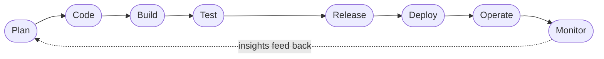
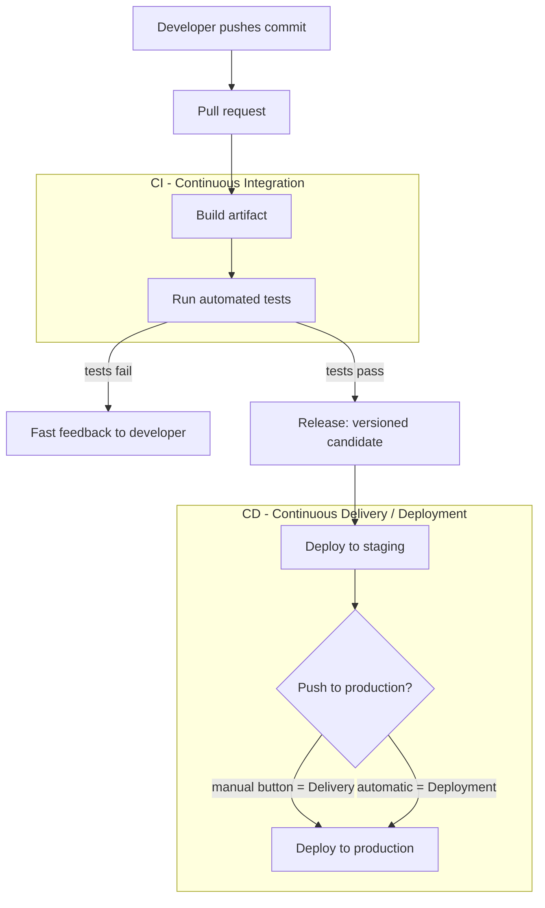

# The DevOps Workflow — From Code to Production (the CI/CD Lifecycle)

## Learning Objectives
- Picture the DevOps lifecycle as a loop: Plan → Code → Build → Test → Release → Deploy → Operate → Monitor.
- Understand what CI (Continuous Integration) and CD (Continuous Delivery/Deployment) each do, and how they differ.
- See how version control, an automated pipeline, and a feedback loop fit together into one continuous flow.

## Body

### Why look at DevOps as a workflow

In the previous lecture we said DevOps is a culture, not a tool. So what does that culture actually *do* all day? It moves an idea, step by step, from someone's head into the hands of real users — and then learns from what happens. The fastest way to grasp DevOps is to follow that journey as a single, repeating flow.

The journey always starts in one place: **version control**. A version control system (like Git) is the shared source of truth where everyone's code lives. Each developer works on their own copy in a separate **branch** — an isolated line of changes — then opens a **pull request** to fold that work back into the main branch where the team integrates. This matters because the entire automated pipeline we're about to describe is triggered *by* what happens in version control. When code lands in the repository, the machinery wakes up.

> Version control isn't just a backup. It's the starting gun for the whole DevOps lifecycle — every later stage reacts to a change being pushed.

### The DevOps lifecycle: eight stages

DevOps is usually drawn as an infinity loop, because the work never really "ends." It cycles. Here are the eight stages and what each one does, in one breath each:

1. **Plan** — Decide what to build next: features, fixes, priorities. This is where requirements and ideas turn into concrete work items.
2. **Code** — Developers write the software and commit it to version control, working in branches and reviewing each other's pull requests.
3. **Build** — Turn that source code into a runnable artifact. *Building* compiles and packages the code into something a computer can actually run (an executable, a container image, a bundle).
4. **Test** — Run automated checks against the build: unit tests, integration tests, security scans, and code-quality checks — to catch problems before users ever see them.
5. **Release** — Take a build that passed all tests and mark it as a candidate ready to go out, stamped with a version.
6. **Deploy** — Place that release into an environment where it runs — staging first, then production, the live environment your users touch.
7. **Operate** — Keep the running system healthy: scaling, infrastructure, availability, and recovery.
8. **Monitor** — Watch the live system: collect logs, metrics, and user feedback to learn how it's actually behaving.

These eight stages connect end to end and then circle back, as the loop below shows — Monitor feeds straight into the next Plan.

The key idea isn't memorizing eight words. It's that each stage hands off to the next automatically, with as little manual hand-holding as possible. The two stages most people obsess over — building/testing and deploying — are exactly the ones automated by **CI** and **CD**.

### What is CI?

**CI stands for Continuous Integration.** The idea is simple: instead of working alone for weeks and then trying to merge a giant pile of changes all at once (the old, painful "merge day"), every developer integrates their small changes into the shared codebase *frequently* — and every time they do, an automated pipeline immediately **builds the code and runs the tests**.

If something breaks, the developer gets feedback within minutes, while the change is still fresh in their mind — not weeks later when nobody remembers what they did. This is why teams "shift testing left": the earlier a bug is caught, the cheaper it is to fix. CI is what catches problems on a pull request *before* broken code ever reaches the main branch and blocks everyone else.

In short: **CI automates the Build and Test stages.** Its job is to keep the shared codebase always healthy and always integrated.

### What is CD? (Delivery vs Deployment)

**CD picks up where CI ends.** Once a build has passed all the tests, CD automates getting that build out the door. Here's the part that trips people up: CD actually means *two* related things, and the difference comes down to one question — **is the final push to production automatic or manual?**

- **Continuous Delivery** — Everything up to production is automated: build, test, and an automatic release into a staging environment. The build is *always* in a deployable, production-ready state. But the final step — pushing to production — is triggered **manually**, often after a QA check or a business decision. The button exists; a human presses it.
- **Continuous Deployment** — The same pipeline, but the final push to production is **automated too**. Every change that passes the tests goes live on its own, with no human in the loop.

The diagram below traces a commit through the shared CI/CD pipeline and shows exactly where Delivery and Deployment part ways at the final step.

So Continuous Delivery means "*ready* to deploy at any moment, on demand," while Continuous Deployment means "*automatically* deployed, every time." Delivery keeps a human gate at the very end; Deployment removes it. Both rely on strong automated testing to be safe — you only trust a fully automatic release if your tests genuinely have your back.

Why bother automating deployment at all? Imagine deploying by hand to one server — annoying but doable. Now imagine dozens or hundreds of servers. Logging into each one to run a script by hand is error-prone and slow. Automating it shrinks **lead time** (the gap between committing code and that code running in production) from weeks to minutes, and makes rollbacks fast and routine instead of scary.

### The feedback loop: why it's a loop, not a line

Here's what makes DevOps a *lifecycle* rather than a checklist. After Deploy, the work doesn't stop — it flows into **Operate** and **Monitor**, and then **the insights from monitoring feed straight back into Plan.**

The flow is as follows: monitoring tells you which features users actually use (studies repeatedly find a large share of features are barely touched), where errors spike, and how the system performs under real load. That evidence shapes the *next* round of planning, the next batch of code, and the next trip around the loop. Small batches go out often, you measure the result, and you learn — a build-measure-learn rhythm repeated continuously.

So version control, the automated CI/CD pipeline, and the monitoring feedback loop aren't three separate things. They're one continuous circuit: a push to version control triggers CI to build and test, CD carries the passing build toward production, monitoring observes the live result, and what it learns flows back into the next plan — around and around, faster and safer each lap.

## Key Takeaways
- The DevOps lifecycle is a repeating loop: **Plan → Code → Build → Test → Release → Deploy → Operate → Monitor**, then back to Plan.
- **Version control is the starting point** — pushing code is what triggers the automated pipeline that follows.
- **CI (Continuous Integration)** automates Build + Test on frequent, small changes, giving developers fast feedback and keeping the shared codebase healthy.
- **CD** automates getting a passing build to production. **Continuous Delivery** stops at a manual production button; **Continuous Deployment** automates that last step too.
- **Monitoring closes the loop**, feeding real-world insight back into planning so each cycle improves on the last.
- DevOps is "a loop, not a line": version control, automated pipeline, and feedback all connect into one continuous flow.

## Sources
- Git and GitHub collaboration — branches, pull requests, merge vs rebase: https://www.youtube.com/watch?v=_wQdY_5Tb5Q
- Git Merge vs Rebase, visually explained: https://www.youtube.com/watch?v=cjSjlHUmaBU
- GitHub Actions CI/CD — getting started: https://www.youtube.com/watch?v=mFFXuXjVgkU
- The ONLY Continuous Integration (CI) Tutorial you need: https://www.youtube.com/watch?v=MIWH2CpVyXs
- CI/CD and zero-downtime deployment (테코톡): https://www.youtube.com/watch?v=sIPU_VkrguI
- Jez Humble — Continuous Delivery: https://www.youtube.com/watch?v=skLJuksCRTw
- Understanding CI/CD properly: https://www.youtube.com/watch?v=KTHZyV9yJGY
