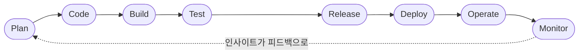
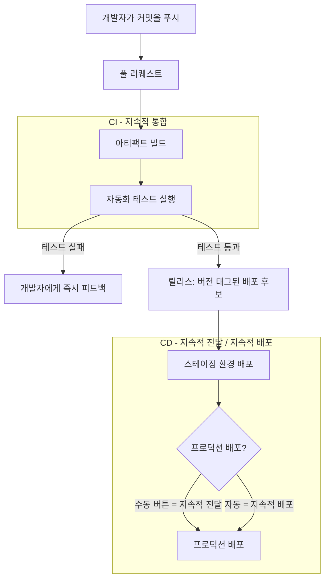

# DevOps 워크플로우 — 코드에서 프로덕션까지 (CI/CD 라이프사이클)

## 학습 목표
- DevOps 라이프사이클을 하나의 루프로 그릴 수 있다: Plan → Code → Build → Test → Release → Deploy → Operate → Monitor.
- CI(지속적 통합)와 CD(지속적 전달/배포)가 각각 무엇을 하는지, 그리고 둘의 차이가 무엇인지 이해한다.
- 버전 관리, 자동화 파이프라인, 피드백 루프가 어떻게 하나의 연속 흐름으로 연결되는지 파악한다.

## 본문

### DevOps를 워크플로우로 바라보는 이유

앞 강의에서 DevOps는 도구가 아니라 문화라고 했다. 그렇다면 그 문화는 실제로 무엇을 하는 걸까? DevOps는 아이디어를 한 걸음씩 옮겨 실제 사용자의 손에 닿게 하고, 그 결과에서 배운다. DevOps를 가장 빠르게 이해하는 방법은 이 여정을 하나의 반복 흐름으로 따라가 보는 것이다.

여정은 언제나 같은 곳에서 시작된다: **버전 관리**. Git 같은 버전 관리 시스템은 팀 전체가 공유하는 코드의 단일 출처다. 각 개발자는 **브랜치**(독립된 변경 흐름)에서 작업한 뒤, **풀 리퀘스트**를 열어 팀의 메인 브랜치에 변경을 합친다. 이게 중요한 이유는, 앞으로 설명할 자동화 파이프라인 전체가 버전 관리에서 일어나는 일을 *기점으로* 동작하기 때문이다. 코드가 저장소에 들어오는 순간, 모든 자동화가 깨어난다.

> 버전 관리는 단순한 백업이 아니다. DevOps 라이프사이클 전체의 신호탄으로, 이후 모든 단계는 코드 변경이 푸시되는 순간부터 반응한다.

### DevOps 라이프사이클: 8단계

DevOps는 보통 무한대(∞) 루프로 그린다. 작업이 진짜로 '끝나는' 일이 없기 때문이다. 계속 순환한다. 8단계와 각 단계의 역할을 간략히 정리하면 다음과 같다:

1. **Plan(계획)** — 다음에 무엇을 만들지 결정한다: 기능, 버그 수정, 우선순위. 요구사항과 아이디어가 구체적인 작업 항목으로 바뀌는 단계다.
2. **Code(코딩)** — 개발자가 소프트웨어를 작성하고 버전 관리에 커밋한다. 브랜치에서 작업하고 서로의 풀 리퀘스트를 리뷰한다.
3. **Build(빌드)** — 소스 코드를 실행 가능한 아티팩트로 만든다. 컴파일하고 패키징해 실제로 실행할 수 있는 형태(실행 파일, 컨테이너 이미지, 번들 등)로 변환한다.
4. **Test(테스트)** — 빌드 결과에 자동화 검사를 돌린다: 단위 테스트, 통합 테스트, 보안 스캔, 코드 품질 검사. 사용자가 보기 전에 문제를 잡는다.
5. **Release(릴리스)** — 모든 테스트를 통과한 빌드에 버전을 붙여 배포 후보로 확정한다.
6. **Deploy(배포)** — 릴리스를 실제 실행 환경에 올린다. 스테이징 환경에 먼저, 그다음 사용자가 접근하는 프로덕션 환경에 배포한다.
7. **Operate(운영)** — 실행 중인 시스템을 건강하게 유지한다: 스케일링, 인프라 관리, 가용성 확보, 장애 복구.
8. **Monitor(모니터링)** — 운영 중인 시스템을 관찰한다: 로그, 메트릭, 사용자 피드백을 수집해 실제 동작을 파악한다.

8단계는 끝에서 끝으로 이어지고, 아래 루프처럼 다시 처음으로 돌아온다. Monitor에서 얻은 인사이트가 곧바로 다음 Plan으로 흘러들어간다.

핵심은 8개 단어를 외우는 게 아니다. 각 단계가 다음 단계로 **자동으로** 이어지고, 사람이 직접 개입하는 부분을 최대한 줄인다는 것이다. 그중 가장 많이 주목받는 두 단계 — 빌드·테스트와 배포 — 를 자동화하는 것이 바로 **CI**와 **CD**다.

### CI란 무엇인가?

**CI는 지속적 통합(Continuous Integration)을 뜻한다.** 개념 자체는 단순하다. 몇 주씩 혼자 작업하다가 한꺼번에 거대한 변경을 합치려는 예전 방식(고통스러운 '머지 데이') 대신, 모든 개발자가 작은 변경을 공유 코드베이스에 **자주** 통합하고, 통합할 때마다 자동화 파이프라인이 즉시 **코드를 빌드하고 테스트**를 실행한다.

무언가 깨지면, 개발자는 변경 내용이 아직 머릿속에 생생할 때 — 몇 주가 아닌 몇 분 안에 — 피드백을 받는다. 이것이 바로 팀들이 "테스트를 왼쪽으로 당긴다(shift testing left)"고 말하는 이유다: 버그를 일찍 잡을수록 수정 비용이 싸다. CI는 문제 있는 코드가 메인 브랜치에 합쳐져 팀 전체를 막기 전에, 풀 리퀘스트 단계에서 문제를 잡아낸다.

한마디로 **CI는 Build와 Test 단계를 자동화한다.** 공유 코드베이스를 항상 건강하고 통합된 상태로 유지하는 것이 CI의 역할이다.

### CD란 무엇인가? (전달 vs 배포)

**CD는 CI가 끝난 지점에서 시작된다.** 빌드가 모든 테스트를 통과하면, CD는 그 빌드를 세상 밖으로 내보내는 과정을 자동화한다. 여기서 헷갈리기 쉬운 부분이 있다: CD는 사실 *두 가지* 개념을 가리키며, 차이는 단 하나의 질문에 달려 있다 — **프로덕션에 최종 배포하는 단계가 자동인가, 수동인가?**

- **지속적 전달(Continuous Delivery)** — 프로덕션 직전까지의 모든 과정이 자동화된다: 빌드, 테스트, 스테이징 환경 자동 릴리스. 빌드는 언제든 배포 가능한 상태를 유지한다. 단, 프로덕션으로의 최종 배포는 QA 검토나 비즈니스 결정 이후 **수동**으로 실행한다. 버튼은 있고, 사람이 누른다.
- **지속적 배포(Continuous Deployment)** — 파이프라인 구성은 동일하지만, 프로덕션 최종 배포까지 **자동화된다.** 테스트를 통과한 변경은 사람의 개입 없이 자동으로 프로덕션에 반영된다.

아래 다이어그램은 커밋이 CI/CD 파이프라인을 통과하는 흐름을 보여주고, 마지막 단계에서 전달과 배포가 어떻게 갈리는지 확인할 수 있다.

정리하면, 지속적 전달은 "언제든 요청하면 바로 배포할 수 있는 상태"를 의미하고, 지속적 배포는 "테스트를 통과할 때마다 자동으로 배포"를 의미한다. 전달은 마지막에 사람이 관여하고, 배포는 그 관여를 없앤다. 둘 다 강력한 자동화 테스트를 기반으로 해야 안전하다 — 완전 자동 배포를 신뢰하려면 테스트가 진짜로 빈틈없어야 한다.

배포를 왜 자동화해야 할까? 서버 한 대에 수동으로 배포하는 건 번거롭지만 할 수 있다. 그러나 서버가 수십, 수백 대라면? 각 서버에 일일이 접속해 스크립트를 실행하는 건 오류가 생기기 쉽고 느리다. 자동화하면 **리드 타임**(코드를 커밋하고 프로덕션에서 실행될 때까지의 시간)이 몇 주에서 몇 분으로 줄어들고, 롤백도 무섭지 않고 빠르게 할 수 있다.

### 피드백 루프: 선이 아닌 루프인 이유

DevOps가 체크리스트가 아닌 *라이프사이클*인 이유가 바로 여기에 있다. Deploy 이후에도 작업은 끝나지 않는다 — **Operate**와 **Monitor**로 이어지고, **모니터링에서 얻은 인사이트가 곧바로 Plan으로 돌아온다.**

흐름은 이렇다: 모니터링은 사용자가 실제로 어떤 기능을 쓰는지(연구에 따르면 상당수 기능이 거의 사용되지 않는다), 어디서 에러가 급증하는지, 실제 트래픽 아래서 시스템이 어떻게 동작하는지를 알려준다. 이 데이터가 다음 계획 수립, 다음 코드 작업, 그리고 루프의 다음 순환을 형성한다. 작은 단위로 자주 내보내고, 결과를 측정하고, 배운다 — 이 만들고-측정하고-배우는 리듬이 쉬지 않고 반복된다.

버전 관리, 자동화 CI/CD 파이프라인, 모니터링 피드백 루프는 별개의 세 가지가 아니다. 하나의 연속된 회로다: 버전 관리에 코드를 푸시하면 CI가 빌드와 테스트를 실행하고, CD가 통과된 빌드를 프로덕션으로 이동시키며, 모니터링이 실제 결과를 관찰하고, 그 인사이트가 다음 계획으로 돌아온다 — 돌고 돌면서 매 순환마다 더 빠르고 안전해진다.

## 핵심 정리
- DevOps 라이프사이클은 반복되는 루프다: **Plan → Code → Build → Test → Release → Deploy → Operate → Monitor**, 그리고 다시 Plan.
- **버전 관리가 출발점**이다 — 코드를 푸시하는 행위가 이후 자동화 파이프라인 전체를 시작시킨다.
- **CI(지속적 통합)**는 자주, 작게 이루어지는 변경에 대해 Build + Test를 자동화해 개발자에게 빠른 피드백을 주고 공유 코드베이스를 건강하게 유지한다.
- **CD**는 테스트를 통과한 빌드를 프로덕션까지 자동으로 이동시킨다. **지속적 전달**은 프로덕션 배포를 수동 버튼으로 남기고, **지속적 배포**는 그 마지막 단계까지 자동화한다.
- **모니터링이 루프를 닫는다** — 실제 운영에서 얻은 인사이트가 계획으로 피드백되어 매 순환이 이전보다 나아진다.
- DevOps는 "선이 아닌 루프"다: 버전 관리, 자동화 파이프라인, 피드백이 하나의 연속 흐름으로 연결된다.

## 출처
- Git과 GitHub 협업 — 브랜치, 풀 리퀘스트, 머지 vs 리베이스: https://www.youtube.com/watch?v=_wQdY_5Tb5Q
- Git Merge vs Rebase, 시각적 설명: https://www.youtube.com/watch?v=cjSjlHUmaBU
- GitHub Actions CI/CD — 시작하기: https://www.youtube.com/watch?v=mFFXuXjVgkU
- 꼭 알아야 할 CI(지속적 통합) 튜토리얼: https://www.youtube.com/watch?v=MIWH2CpVyXs
- CI/CD와 무중단 배포 (테코톡): https://www.youtube.com/watch?v=sIPU_VkrguI
- Jez Humble — 지속적 전달: https://www.youtube.com/watch?v=skLJuksCRTw
- CI/CD 제대로 이해하기: https://www.youtube.com/watch?v=KTHZyV9yJGY
