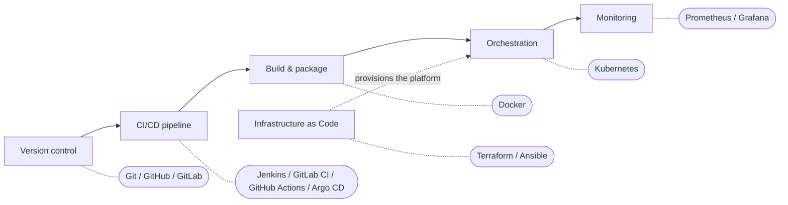

# DevOps Open-Source Tools — A Tour of the Ecosystem by Stage

## Learning Objectives
- Identify the representative open-source tool for each stage of the DevOps workflow: version control, CI/CD, containers, orchestration, Infrastructure as Code, and monitoring.
- Explain in one line what problem Git, Jenkins/GitLab CI, Docker, Kubernetes, Terraform/Ansible, and Prometheus/Grafana each solve.
- Know what to study next once you have the big picture.

## Body

### Reading the tools as a "map by stage"

In Lecture 2 we walked through the DevOps lifecycle — plan, code, build, test, release, deploy, operate, and monitor. The good news for beginners is that you do not have to memorize a giant pile of tools. Each tool exists to solve one specific pain in that workflow. So the smartest way to learn the ecosystem is not "what does this tool do?" but "which stage is it for, and what problem does it fix?"

Once you see the tools as a map laid over the workflow, the whole landscape clicks into place. The tools we cover here are almost all open source and are the de facto industry standards — meaning if you learn these, you will recognize most real-world setups.

> Tools are means to an end. When you understand *why* each stage needs help, swapping one tool for another (Jenkins for GitHub Actions, say) becomes easy. Learn the concept first; the tool is replaceable.

### The toolchain at a glance

| Stage | Representative tool(s) | What problem it solves |
|-------|------------------------|------------------------|
| Version control | **Git** (hosted on GitHub / GitLab) | Tracks every change to code, lets a team collaborate without overwriting each other, keeps a full history you can roll back to |
| CI/CD | **Jenkins**, **GitLab CI**, **GitHub Actions**, **Argo CD** | Automates the pipeline that builds, tests, and ships code so releases are frequent and reliable instead of manual and error-prone |
| Build & packaging (containers) | **Docker** | Packages an app with everything it needs to run, so it behaves the same on every machine — "it works on my PC" stops being an excuse |
| Orchestration | **Kubernetes** | Runs and manages thousands of containers across many servers — restarting failed ones, scaling up under load, keeping the app always available |
| Infrastructure as Code (IaC) | **Terraform**, **Ansible** | Defines servers and infrastructure as text files so an entire environment can be created, reproduced, or rebuilt automatically |
| Monitoring & observability | **Prometheus**, **Grafana** | Collects metrics and shows them on dashboards so you can see the system's health and get alerted *before* users notice a problem |

The same idea is easier to hold in your head as a single picture: follow the workflow from left to right and read off the go-to tool sitting at each stage, as the toolchain map below shows.

The rest of this lecture is just a sentence or two on each row, so the table actually means something to you.

### A closer look at each category

**Version control — Git.** Git is a version control system: it records every change you make to your code and lets multiple people work on the same project safely. You "commit" snapshots, branch off to try things, and merge work back together. Services like GitHub and GitLab *host* your Git repositories online and add collaboration features (pull requests, issue tracking). In DevOps, Git is the foundation — pipeline definitions, Dockerfiles, and infrastructure code all live in Git too, not just application code.

**CI/CD — Jenkins, GitLab CI, GitHub Actions, Argo CD.** A CI/CD tool runs the automated "release pipeline" we drew in Lecture 2: on every code change it builds the app, runs tests, scans it, and deploys it to the target environment. Jenkins is the long-standing, most widely used option; GitLab CI and GitHub Actions are popular because the pipeline lives right next to your code. Argo CD is a newer, Kubernetes-focused tool that follows a "GitOps" idea — it keeps your cluster in sync with what is declared in Git.

**Containers — Docker.** Docker packages software into a standardized unit called a *container* that bundles the code together with its libraries and runtime. Because the container carries its own environment, the app runs the same way on a laptop, a test server, or production. Containers are lightweight and fast to start, which is exactly why teams adopted them over heavier virtual machines. In a typical flow, the CI/CD pipeline builds a Docker image and ships it to be run as a container.

**Orchestration — Kubernetes.** Docker makes one container easy; running thousands of them is a different problem. Kubernetes is a *container orchestration* platform — think of it as a conductor directing many containers across many servers. It auto-heals (restarts crashed containers), auto-scales (adds copies when traffic spikes), and handles the networking that makes a fleet of containers behave like one system. You declare the state you want ("run 5 copies of this app"), and Kubernetes works to keep reality matching that.

**Infrastructure as Code — Terraform, Ansible.** IaC means managing your infrastructure with text files instead of clicking through dashboards by hand. **Terraform** is *declarative*: you describe the end state you want (5 servers, this network, these permissions) and Terraform figures out the steps to get there — and gives you the same result no matter how many times you run it (this is called idempotency). **Ansible** is mainly a *configuration* tool: once servers exist, it installs software, applies patches, and configures them. In practice, teams often use Terraform to *provision* the infrastructure and Ansible to *configure* it. The big payoff: an environment that used to take weeks to rebuild can be recreated by running a script.

**Monitoring & observability — Prometheus, Grafana.** Once everything is running, you need to *see* it. **Prometheus** collects metrics — numeric measurements over time, like CPU usage, request rate, or error count. **Grafana** turns those numbers into dashboards and graphs you can read at a glance. The broader goal is *observability*, usually described as three pillars: **metrics** (numbers over time), **logs** (timestamped records of discrete events), and **traces** (the path of a single request as it travels through multiple services). Good monitoring lets you catch and alert on trouble before customers ever feel it.

### Where to go next

You now have the whole map. A sensible learning order for an absolute beginner looks like this: start with **Linux and the command line** plus **Git**, since almost everything sits on top of them. Then learn **Docker** to understand how modern apps are packaged. Next, pick up one **CI/CD** tool (Jenkins or GitHub Actions are great first choices) to automate a real pipeline. After that, move to **Kubernetes** for orchestration, then **Terraform** (and later Ansible) for Infrastructure as Code, and finally **Prometheus and Grafana** for monitoring. A typical self-study plan covers all of this in roughly 10–14 months at a steady pace — but you do not need to master everything at once. The point of this introductory course was the big picture; pick one box on the map, go a level deeper, and the rest will follow.

## Key Takeaways
- The DevOps toolchain is best understood as a *map over the workflow*: every tool solves one specific problem at one stage.
- Git (version control), CI/CD tools (automated pipelines), Docker (packaging), Kubernetes (orchestration), Terraform/Ansible (IaC), and Prometheus/Grafana (monitoring) are the open-source standards you will see everywhere.
- Declarative, idempotent definitions — used by Terraform and Kubernetes — let you reproduce environments reliably instead of clicking by hand.
- Observability rests on three pillars: metrics, logs, and traces.
- Concepts outlast tools: understand *why* a stage needs help, and switching tools becomes trivial.
- A practical next step is to learn Linux, Git, and Docker first, then build up through CI/CD, Kubernetes, IaC, and monitoring.

## Sources
- 10 DevOps Tools you need to know — The Complete Guide (TechWorld with Nana): https://www.youtube.com/watch?v=UMQGyeAnfFE
- The Complete DevOps Roadmap (Programming with Mosh): https://www.youtube.com/watch?v=6GQRb4fGvtk
- Terraform explained in 15 mins (TechWorld with Nana): https://www.youtube.com/watch?v=l5k1ai_GBDE
- What is Infrastructure as Code? (IBM Technology): https://www.youtube.com/watch?v=zWw2wuiKd5o
- Observability vs APM vs Monitoring (IBM Technology): https://www.youtube.com/watch?v=CAQ_a2-9UOI
- Observability: Metrics, Logging, Tracing, Oh My! (CCSI): https://www.youtube.com/watch?v=ZVKrN1RLetI
- Monitoring and Logging for DevOps Engineers (Cloud Champ): https://www.youtube.com/watch?v=nD6JfA9nGOg
- 개발자를 위한 쉬운 도커 (인프런 inflearn): https://www.youtube.com/watch?v=eRfHp16qJq8
