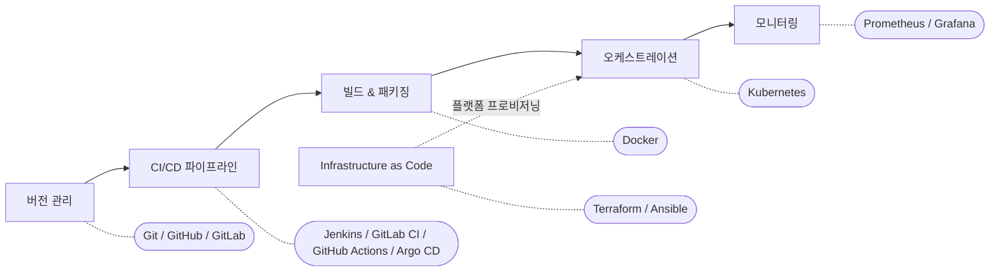

# DevOps 오픈소스 도구 — 단계별 생태계 한눈에 보기

## 학습 목표
- DevOps 워크플로의 각 단계(버전 관리, CI/CD, 컨테이너, 오케스트레이션, IaC, 모니터링)를 대표하는 오픈소스 도구를 꼽을 수 있다.
- Git, Jenkins/GitLab CI, Docker, Kubernetes, Terraform/Ansible, Prometheus/Grafana가 각각 어떤 문제를 해결하는지 한 줄로 설명할 수 있다.
- 전체 그림을 파악한 뒤 무엇을 먼저 공부할지 알 수 있다.

## 본문

### 도구를 "단계별 지도"로 읽기

2강에서는 DevOps 라이프사이클 — 계획, 코드, 빌드, 테스트, 릴리스, 배포, 운영, 모니터링 — 을 살펴봤다. 처음 배우는 입장에서 반가운 소식이 있다. 수많은 도구를 한꺼번에 외울 필요가 없다는 것이다. 각 도구는 워크플로의 특정 단계에서 발생하는 한 가지 문제를 해결하기 위해 존재한다. 그러므로 생태계를 익히는 가장 효율적인 방법은 "이 도구는 무엇인가?"가 아니라 "어느 단계를 담당하며, 어떤 문제를 해결하는가?"를 묻는 것이다.

도구를 워크플로 위에 얹힌 지도로 보면, 전체 그림이 한순간에 정리된다. 여기서 다루는 도구는 거의 모두 오픈소스이자 사실상의 업계 표준이다. 이것들을 익혀두면 실무 환경의 대부분을 금방 알아볼 수 있다.

> 도구는 목적을 위한 수단이다. 각 단계가 왜 도움을 필요로 하는지 이해하고 나면, Jenkins를 GitHub Actions으로 바꾸는 것쯤은 어렵지 않다. 개념을 먼저 익혀라. 도구는 언제든 교체할 수 있다.

### 툴체인 한눈에 보기

| 단계 | 대표 도구 | 해결하는 문제 |
|------|-----------|---------------|
| 버전 관리 | **Git** (GitHub / GitLab에서 호스팅) | 코드의 모든 변경 이력을 기록하고, 팀원들이 서로 덮어쓰지 않고 협업할 수 있게 한다. 언제든 원하는 시점으로 되돌릴 수 있다. |
| CI/CD | **Jenkins**, **GitLab CI**, **GitHub Actions**, **Argo CD** | 2강에서 그린 빌드·테스트·배포 파이프라인을 자동화한다. 수동으로 진행하는 대신 릴리스를 자주, 안정적으로 내보낼 수 있다. |
| 빌드 & 패키징 (컨테이너) | **Docker** | 앱을 실행에 필요한 모든 것과 함께 묶어 패키징한다. "내 PC에서는 되는데요"라는 말이 더 이상 통하지 않도록, 어떤 환경에서도 동일하게 동작하게 만든다. |
| 오케스트레이션 | **Kubernetes** | 수많은 서버에서 수천 개의 컨테이너를 실행·관리한다. 장애가 생긴 컨테이너를 재시작하고, 부하가 몰리면 자동으로 확장하며, 앱을 항상 가용 상태로 유지한다. |
| Infrastructure as Code (IaC) | **Terraform**, **Ansible** | 서버와 인프라를 텍스트 파일로 정의한다. 전체 환경을 자동으로 생성·재현·재구축할 수 있다. |
| 모니터링 & 가시성 | **Prometheus**, **Grafana** | 메트릭을 수집하고 대시보드로 시각화한다. 사용자가 문제를 체감하기 전에 시스템 상태를 확인하고 알림을 받을 수 있다. |

이 흐름을 한 장의 그림으로 보면 더 직관적이다. 아래 툴체인 지도에서 왼쪽부터 오른쪽으로 워크플로를 따라가면, 각 단계의 대표 도구가 어디에 자리하는지 한눈에 확인할 수 있다.

이어지는 내용에서는 각 항목을 한두 문장으로 짚는다. 앞의 표가 실제로 와닿도록 만드는 것이 목적이다.

### 각 카테고리 자세히 보기

**버전 관리 — Git.** Git은 버전 관리 시스템이다. 코드에 가한 모든 변경 사항을 기록하고, 여러 사람이 같은 프로젝트에서 안전하게 협업할 수 있게 해준다. 특정 시점의 스냅샷을 "커밋"으로 남기고, 브랜치를 만들어 새로운 시도를 해보다가, 완성되면 다시 합친다. GitHub와 GitLab은 Git 저장소를 온라인에 호스팅하면서 협업 기능(풀 리퀘스트, 이슈 추적 등)을 추가로 제공하는 서비스다. DevOps에서 Git은 모든 것의 토대다. 파이프라인 정의 파일, Dockerfile, 인프라 코드까지 전부 Git에서 관리한다.

**CI/CD — Jenkins, GitLab CI, GitHub Actions, Argo CD.** CI/CD 도구는 2강에서 그린 자동화된 "릴리스 파이프라인"을 실행한다. 코드가 변경될 때마다 앱을 빌드하고, 테스트를 돌리고, 보안 검사를 하고, 대상 환경에 배포하는 과정을 자동으로 처리한다. Jenkins는 가장 오래되고 널리 쓰이는 도구다. GitLab CI와 GitHub Actions은 파이프라인 설정 파일이 코드 옆에 바로 놓이는 덕분에 인기가 높다. Argo CD는 Kubernetes에 특화된 신세대 도구로, "GitOps" 방식을 따른다. Git에 선언된 상태와 클러스터가 항상 일치하도록 자동으로 동기화한다.

**컨테이너 — Docker.** Docker는 소프트웨어를 *컨테이너*라는 표준화된 단위로 패키징한다. 코드와 라이브러리, 런타임을 하나로 묶어 어느 환경에서 실행해도 동일하게 동작하도록 만든다. 컨테이너는 가볍고 시작이 빠르다. 그래서 팀들이 무거운 가상 머신 대신 컨테이너를 선택한 것이다. 일반적인 흐름에서는 CI/CD 파이프라인이 Docker 이미지를 빌드한 뒤, 이를 컨테이너로 실행한다.

**오케스트레이션 — Kubernetes.** Docker 하나로 컨테이너 하나를 다루기는 쉽다. 하지만 수천 개를 운영하는 것은 전혀 다른 문제다. Kubernetes는 *컨테이너 오케스트레이션* 플랫폼이다. 여러 서버에 걸쳐 수많은 컨테이너를 지휘하는 지휘자라고 생각하면 된다. 장애가 발생한 컨테이너를 자동으로 재시작하고(자가 치유), 트래픽이 몰리면 복제본을 늘리고(자동 확장), 컨테이너 집단이 하나의 시스템처럼 동작하도록 네트워크를 처리한다. 원하는 상태를 선언하면("이 앱을 5개 실행해") Kubernetes가 실제 상태를 그에 맞게 유지한다.

**Infrastructure as Code — Terraform, Ansible.** IaC는 대시보드를 클릭하는 대신 텍스트 파일로 인프라를 관리하는 방식이다. **Terraform**은 *선언형* 도구다. 원하는 최종 상태(서버 5대, 이 네트워크, 이 권한)를 기술하면 Terraform이 그 상태에 이르는 절차를 스스로 계산한다. 몇 번을 실행해도 결과가 같다는 것도 중요한 특성인데, 이를 멱등성(idempotency)이라고 한다. **Ansible**은 주로 *구성 관리* 도구다. 서버가 이미 존재하는 상태에서 소프트웨어를 설치하고, 패치를 적용하고, 설정을 조정한다. 실무에서는 Terraform으로 인프라를 *프로비저닝*하고 Ansible로 *구성*하는 조합을 많이 쓴다. IaC의 가장 큰 이점은 이것이다. 이전에 몇 주씩 걸리던 환경 재구축을 스크립트 하나로 처리할 수 있다.

**모니터링 & 가시성 — Prometheus, Grafana.** 시스템이 돌아가고 나면 그것을 *눈으로 봐야* 한다. **Prometheus**는 메트릭을 수집한다. CPU 사용률, 요청 수, 오류 수처럼 시간에 따라 변하는 수치 데이터다. **Grafana**는 그 수치를 대시보드와 그래프로 변환해 한눈에 파악하게 해준다. 더 넓은 개념인 *가시성(observability)*은 보통 세 가지 기둥으로 설명된다. **메트릭**(시간에 따른 수치), **로그**(개별 이벤트의 타임스탬프 기록), **트레이스**(단일 요청이 여러 서비스를 통과하는 경로)다. 탄탄한 모니터링 체계가 있으면 고객이 문제를 체감하기 전에 이상을 감지하고 알림을 받을 수 있다.

### 다음에 무엇을 공부할까

이제 전체 지도가 그려졌다. 완전한 초보자라면 다음 순서로 공부하길 권한다. 거의 모든 것의 기반이 되는 **Linux와 커맨드라인**, 그리고 **Git**부터 시작한다. 그다음 **Docker**로 현대적인 앱 패키징 방식을 익힌다. 이어서 CI/CD 도구 하나(Jenkins나 GitHub Actions가 좋은 첫 선택이다)를 배워 실제 파이프라인을 자동화해본다. 그 다음은 **Kubernetes**로 오케스트레이션을, **Terraform**(이후 Ansible)으로 IaC를, 마지막으로 **Prometheus와 Grafana**로 모니터링을 배운다. 꾸준히 공부한다면 이 모든 내용을 10~14개월이면 커버할 수 있다. 단, 한꺼번에 다 마스터할 필요는 없다. 이 입문 강좌의 목적은 큰 그림을 보는 것이었다. 지도에서 박스 하나를 골라 한 단계 깊이 파고들면, 나머지는 자연스럽게 따라온다.

## 핵심 정리
- DevOps 툴체인은 *워크플로 위의 지도*로 이해하는 것이 가장 효과적이다. 모든 도구는 특정 단계의 특정 문제를 해결한다.
- Git(버전 관리), CI/CD 도구(파이프라인 자동화), Docker(패키징), Kubernetes(오케스트레이션), Terraform/Ansible(IaC), Prometheus/Grafana(모니터링)가 어디서나 만나게 될 오픈소스 표준이다.
- Terraform과 Kubernetes가 사용하는 선언형·멱등성 방식 덕분에 환경을 클릭 없이 신뢰성 있게 재현할 수 있다.
- 가시성(observability)은 세 가지 기둥으로 이루어진다. 메트릭, 로그, 트레이스.
- 개념은 도구보다 오래간다. 각 단계가 왜 도움을 필요로 하는지 이해하면 도구를 바꾸는 것은 사소한 일이 된다.
- 실용적인 학습 순서: Linux/Git → Docker → CI/CD → Kubernetes → IaC → 모니터링.

## 출처
- 10 DevOps Tools you need to know — The Complete Guide (TechWorld with Nana): https://www.youtube.com/watch?v=UMQGyeAnfFE
- The Complete DevOps Roadmap (Programming with Mosh): https://www.youtube.com/watch?v=6GQRb4fGvtk
- Terraform explained in 15 mins (TechWorld with Nana): https://www.youtube.com/watch?v=l5k1ai_GBDE
- What is Infrastructure as Code? (IBM Technology): https://www.youtube.com/watch?v=zWw2wuiKd5o
- Observability vs APM vs Monitoring (IBM Technology): https://www.youtube.com/watch?v=CAQ_a2-9UOI
- Observability: Metrics, Logging, Tracing, Oh My! (CCSI): https://www.youtube.com/watch?v=ZVKrN1RLetI
- Monitoring and Logging for DevOps Engineers (Cloud Champ): https://www.youtube.com/watch?v=nD6JfA9nGOg
- 개발자를 위한 쉬운 도커 (인프런 inflearn): https://www.youtube.com/watch?v=eRfHp16qJq8
