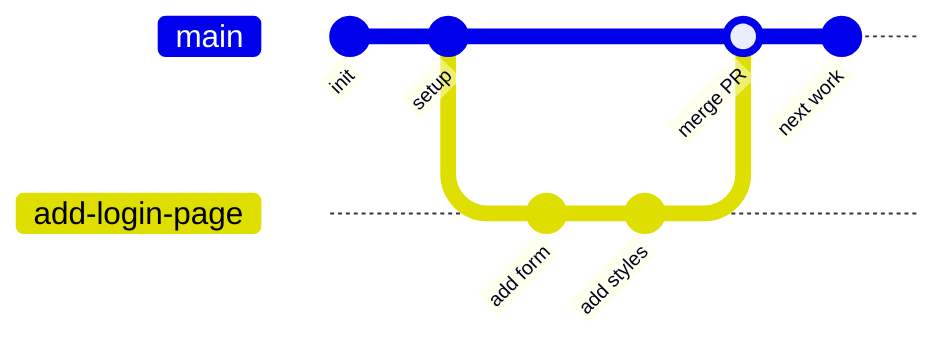
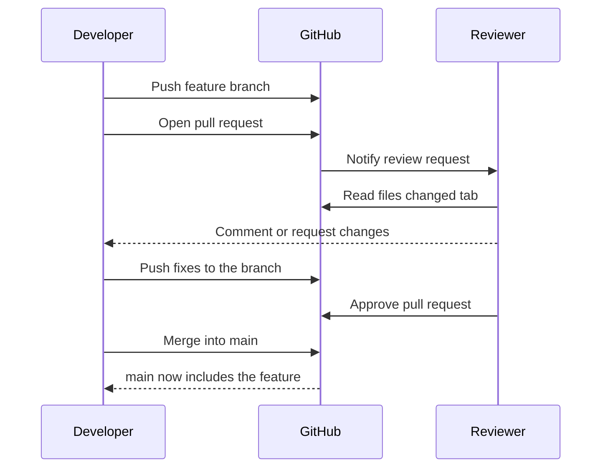

# Version Control and Collaboration: The Basics of a Git Workflow

## Learning Objectives
- Understand why version control is the starting point for both collaboration and automation in DevOps.
- Know the core flow of Git collaboration: branches, commits, merges, and pull requests.
- Practice creating a branch and merging your changes using a handful of simple Git commands.

## Body

### Why version control comes first

In the previous lectures we talked about DevOps as a culture built on collaboration and automation. Here is the practical truth that ties it all together: **none of it works without version control.** Continuous integration can't run tests on "the latest code" unless there is one agreed-upon place that holds *the* latest code. Continuous deployment can't ship a build unless it can point to an exact, recorded version of the source. Automation needs a single source of truth, and in modern software that source of truth is a Git repository.

Version control is simply a system that records every change to your files over time, so you can see what changed, who changed it, and roll back if something breaks. **Git** is the version control tool that dominates the industry today, and **GitHub** (along with GitLab and Bitbucket) is a hosting service that puts your Git repository on a server where a whole team can share it.

> Think of Git as the engine that records history on your machine, and GitHub as the shared garage where the whole team parks and exchanges that history. Git is the tool; GitHub is one place to host it.

The reason version control matters so much for collaboration is that it lets many people change the same project at the same time *without* stepping on each other. Before tools like Git, teams emailed zip files around or copied folders named `project_final_v2_REALLY_final`. Git replaces that chaos with a structured, trackable flow. Once that flow exists, automation can hook into it — and that is exactly how DevOps pipelines get built.

### The mental model: repository, commit, branch

Three words will appear constantly, so let's pin them down with plain definitions:

- **Repository (repo):** the project folder that Git is tracking, including its full history.
- **Commit:** a saved snapshot of your changes at a moment in time, with a message describing what you did. Each commit has a unique ID and remembers who made it and when.
- **Branch:** a separate line of work inside the same repository. It lets you develop a feature in isolation without touching the stable code everyone else relies on.

Every repository has a default branch, usually called `main` (older repos call it `master` — the terms are used interchangeably). The `main` branch is meant to always hold working, shippable code. You generally do *not* edit `main` directly. Instead, you branch off it, make your changes safely, and merge them back when they're ready.

### The core collaboration flow

In a typical team, the flow looks like this: you create a **feature branch** off `main`, make commits on it, push it to GitHub, open a **pull request** to propose merging it back, get a teammate to review it, and finally **merge** it into `main`. The structure of that flow is as follows: `main` stays clean while each person works on their own branch and only rejoins `main` through a reviewed, deliberate step. The diagram below shows that branch-and-merge shape.



Let's walk through it with real commands.

### Step 1: See where you are and create a branch

First, check which branch you're currently on:

```bash
git branch
```

The branch you're on is highlighted (often in green). If you only see `main`, that's your starting point. Now create a new feature branch and switch to it in one command:

```bash
git checkout -b add-login-page
```

The `-b` flag means "create a new branch," and `add-login-page` is the name — pick something descriptive that says what the work is about. Run `git branch` again and you'll now see two branches, with `add-login-page` highlighted as your current one.

> A modern equivalent you'll also see is `git switch -c add-login-page`. It does the same thing as `git checkout -b` and reads a little more clearly. Either is fine.

### Step 2: Make a change and commit it

Let's add a file and save a snapshot of it:

```bash
echo "login form" > login.txt
git add login.txt
git commit -m "Add login page placeholder"
```

`git add` stages the file (tells Git you want this change included), and `git commit` records it as a permanent snapshot with the message after `-m`. Write commit messages in plain, present-tense language that explains *what the change does* — your future teammates (and future you) will thank you.

### Step 3: Push your branch to GitHub

Your commit currently lives only on your computer. To share it, push it to the remote:

```bash
git push
```

The first time you push a brand-new branch, Git will stop and complain that there's no **upstream** — meaning it doesn't yet know where on the remote to send this branch. It hands you the exact command to fix it:

```bash
git push --set-upstream origin add-login-page
```

Here `origin` is the default name for your remote on GitHub, and you're telling Git to link your local `add-login-page` to a branch of the same name on the remote. You only do this once per branch; after that, a plain `git push` works.

Switch back to `main` with `git checkout main` and list the files — you'll notice `login.txt` isn't there. That's the whole point: branches keep changes fully separate until you choose to combine them.

### Step 4: Open a pull request

Back on GitHub, you'll now see a prompt to "Compare & pull request." A **pull request** (PR) is a proposal that says, "Here are the changes I want to merge into `main` — please review them." It is the heart of safe collaboration, because nothing reaches `main` without being seen.

Give the PR a clear title and a description of what changed and why. Add a reviewer (a teammate) so they get notified to look at it. They can browse the **files changed** tab to see exactly which lines differ from `main`, leave comments, request changes, or approve. This review step is where bugs get caught early and where the team keeps a searchable log of every change that ever landed. The sequence below traces who does what during this review-and-merge handshake.



> Teams often add **branch protection rules** to `main`: no direct pushes, at least one approving review required, and automated tests must pass before merging. This is the exact seam where your CI pipeline (next lecture) plugs into the Git workflow.

Once the PR is approved and has no conflicts, click **Merge pull request** to fold your branch into `main`. Done — your feature is now part of the shared codebase.

### Bringing main's changes into your branch: merge vs. rebase

Real projects move while you work. By the time you finish your branch, `main` has probably gained new commits from your teammates. You need to bring those changes *into* your branch so your work sits on top of the latest code. There are two ways to do this, and knowing the difference is a hallmark of someone comfortable with Git.

First, update your local `main`:

```bash
git checkout main
git pull
```

Then bring those changes into your feature branch. **Merge** combines the two histories by creating a new "merge commit" that joins them:

```bash
git checkout add-login-page
git merge main
```

Merge is safe and never alters existing commits — their IDs, timestamps, and authorship stay exactly as they were. The trade-off is that your history fills up with extra merge commits and can get tangled, especially on a busy team.

**Rebase** takes a different approach: it lifts your branch's commits off and replays them one by one on top of the latest `main`, producing a clean, straight-line history:

```bash
git checkout add-login-page
git rebase main
```

The result reads as if you started your work *after* your teammates' changes. The catch is that rebase *rewrites history* — it creates brand-new commits (with new IDs) to replace your originals.

> The golden rule: **rebase only your own local commits, before others rely on them. Never rebase a branch that other people are already sharing,** because rewriting shared history will break their copies. A common, safe pattern is `git pull --rebase` to tidy up before opening a PR, then merge the PR normally.

### Handling a merge conflict

Sooner or later, two people will edit the *same line* of the same file, and Git can't decide which version wins. That's a **merge conflict**, and it's completely normal — not a sign you did anything wrong.

When you run `git merge main` and hit a conflict, Git pauses and marks the conflicting file like this:

```text
<<<<<<< HEAD
Hello from my branch
=======
Hello from main
>>>>>>> main
```

Everything between `<<<<<<<` and `=======` is *your* version; everything between `=======` and `>>>>>>>` is the incoming version from `main`. Open the file in an editor (VS Code shows these with clickable "Accept" buttons), decide what the correct final content should be, and delete the conflict markers entirely. Then stage and commit the resolution:

```bash
git add hello.txt
git commit -m "Resolve merge conflict in hello.txt"
git push
```

That commit ties the two versions together, and you're back in sync. Resolving conflicts gets routine quickly — the key is to read both sides carefully and keep the markers out of your final file.

### Doing this in a GUI

Everything above works the same through a graphical tool. **Visual Studio Code** has Git built in: its Source Control panel lets you stage, commit, push, and resolve conflicts by clicking instead of typing, and the free **GitHub Pull Requests** extension lets you review and merge PRs without leaving the editor. One practitioner's caution about extensions: anyone can publish one, so check the *publisher* name (the official one is from GitHub) before installing. Whether you use the command line or a GUI, the underlying Git concepts — branch, commit, push, pull request, merge — are identical.

## Key Takeaways
- Version control is the foundation of DevOps collaboration *and* automation: pipelines need a single, trackable source of truth, and that's your Git repository.
- The everyday flow is: branch off `main`, commit your work, push, open a pull request for review, then merge — keeping `main` always stable.
- Use `git checkout -b` to create a branch, `git add` + `git commit` to snapshot changes, and `git push --set-upstream origin <branch>` the first time you share a branch.
- To pull in others' changes, **merge** preserves history (safe, can get messy) while **rebase** rewrites it into a clean line (only on your own un-shared commits).
- Merge conflicts are normal: edit the marked file to the correct final version, remove the conflict markers, then add, commit, and push.
