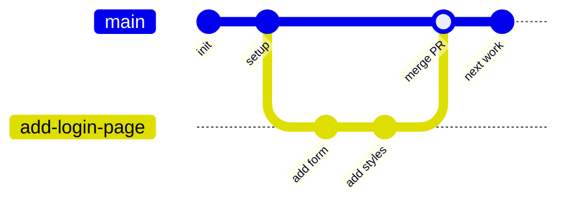
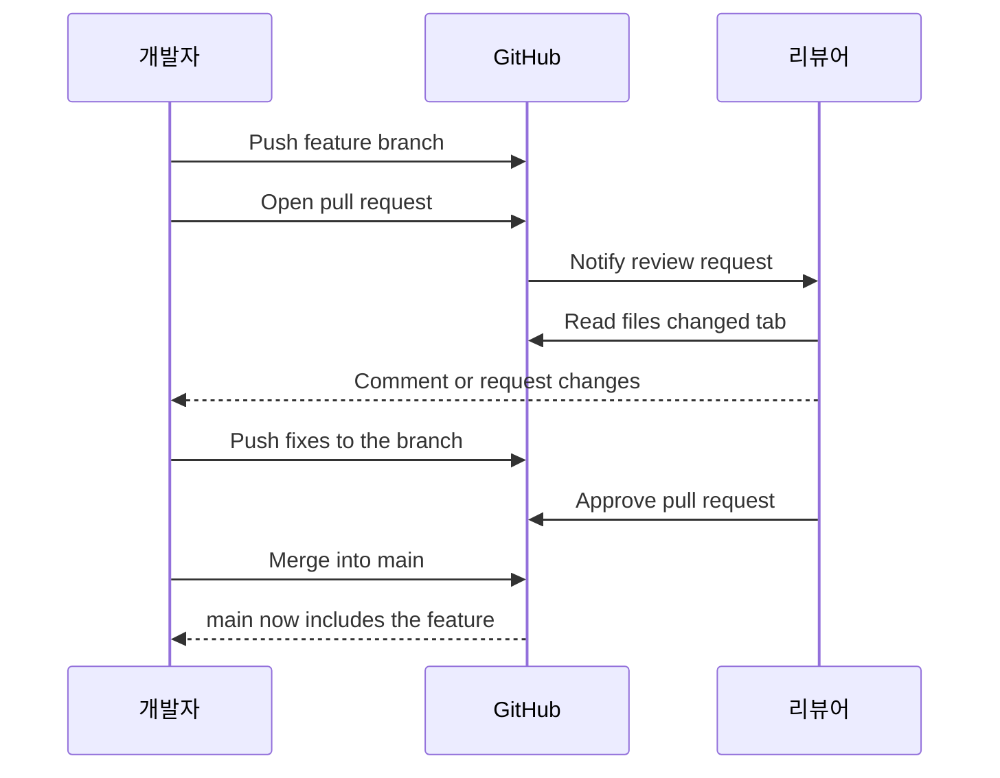

# 버전 관리와 협업: Git 워크플로우 기초

## 학습 목표
- DevOps에서 버전 관리가 협업과 자동화의 출발점이 되는 이유를 이해한다.
- Git 협업의 핵심 흐름인 브랜치, 커밋, 머지, 풀 리퀘스트를 파악한다.
- 기본 Git 명령어로 브랜치를 만들고 변경 사항을 머지하는 과정을 직접 실습한다.

## 본문

### 왜 버전 관리가 먼저인가

앞선 강의에서 DevOps를 협업과 자동화 기반의 문화로 소개했다. 그런데 실제로 모든 것을 연결하는 핵심이 하나 있다. **버전 관리 없이는 아무것도 작동하지 않는다.** CI(지속적 통합)가 "최신 코드"를 테스트하려면 팀 전체가 동의한 단 하나의 장소에 최신 코드가 있어야 한다. CD(지속적 배포)가 빌드를 배포하려면 소스의 정확한 버전을 가리킬 수 있어야 한다. 자동화에는 단일한 진실의 원천(single source of truth)이 필요하고, 현대 소프트웨어에서 그 역할을 하는 것이 바로 Git 저장소다.

버전 관리란 시간의 흐름에 따라 파일의 모든 변경 사항을 기록하는 시스템이다. 무엇이 바뀌었는지, 누가 바꿨는지 확인할 수 있고, 문제가 생기면 이전 상태로 되돌릴 수 있다. **Git**은 오늘날 업계를 지배하는 버전 관리 도구이고, **GitHub**(GitLab, Bitbucket도 마찬가지)는 Git 저장소를 서버에 올려 팀 전체가 공유할 수 있게 해주는 호스팅 서비스다.

> Git은 내 컴퓨터에서 변경 이력을 기록하는 엔진이고, GitHub는 팀 전체가 그 이력을 주고받는 공유 차고라고 생각하면 된다. Git은 도구이고, GitHub는 그것을 올려두는 공간 중 하나다.

버전 관리가 협업에서 특히 중요한 이유는 여러 사람이 서로 방해하지 않고 동시에 같은 프로젝트를 수정할 수 있기 때문이다. Git 이전에는 팀이 zip 파일을 이메일로 주고받거나, `project_final_v2_진짜최종`처럼 폴더를 복사하는 방식으로 일했다. Git은 그 혼란을 구조화되고 추적 가능한 흐름으로 대체한다. 이 흐름이 갖춰지면 자동화가 거기에 연결될 수 있고, 그것이 바로 DevOps 파이프라인이 만들어지는 방식이다.

### 핵심 개념: 저장소, 커밋, 브랜치

세 가지 단어가 계속 등장하므로 명확하게 정리해 두자.

- **저장소(repo):** Git이 추적하는 프로젝트 폴더 전체. 전체 변경 이력을 포함한다.
- **커밋(commit):** 특정 시점의 변경 사항을 저장한 스냅샷. 무엇을 했는지 설명하는 메시지가 붙는다. 커밋마다 고유한 ID가 있고, 누가 언제 만들었는지도 기록된다.
- **브랜치(branch):** 같은 저장소 안에서 독립적으로 진행하는 작업 흐름. 다른 사람이 쓰는 안정적인 코드를 건드리지 않고 기능을 개발할 수 있다.

모든 저장소에는 기본 브랜치가 있으며, 보통 `main`이라 부른다(오래된 저장소에서는 `master`라고 하기도 하는데, 같은 뜻이다). `main` 브랜치는 언제나 동작하고 배포 가능한 코드를 유지하는 게 원칙이다. 보통 `main`을 직접 수정하지 않는다. 대신 `main`에서 브랜치를 만들어 안전하게 작업한 뒤, 준비가 되면 다시 합친다.

### 핵심 협업 흐름

팀에서 일반적인 흐름은 이렇다. `main`에서 **기능 브랜치(feature branch)**를 만들고, 거기에 커밋을 쌓고, GitHub에 푸시한 뒤 **풀 리퀘스트(PR)**를 열어 머지를 제안한다. 팀원에게 리뷰를 받고, 최종적으로 `main`에 **머지**한다. 각자 자신의 브랜치에서 작업하다가 리뷰라는 검토 단계를 거쳐 `main`에 합쳐지므로, `main`은 항상 깨끗하게 유지된다. 아래 다이어그램이 이 브랜치-머지 구조를 보여준다.



실제 명령어로 단계별로 살펴보자.

### 1단계: 현재 위치 확인 및 브랜치 만들기

먼저 현재 어느 브랜치에 있는지 확인한다.

```bash
git branch
```

현재 브랜치는 강조 표시(보통 초록색)로 나타난다. `main`만 보인다면 그게 출발점이다. 이제 새 기능 브랜치를 만들고 한 번에 이동한다.

```bash
git checkout -b add-login-page
```

`-b` 옵션은 "새 브랜치 만들기"를 의미하고, `add-login-page`는 이름이다. 어떤 작업인지 알 수 있게 설명적인 이름을 붙이자. `git branch`를 다시 실행하면 두 개의 브랜치가 보이고, `add-login-page`가 현재 브랜치로 강조 표시된다.

> 같은 기능을 하는 최신 명령어로 `git switch -c add-login-page`도 있다. 읽기가 조금 더 자연스러운 편이다. 둘 다 써도 무방하다.

### 2단계: 변경하고 커밋하기

파일을 하나 추가하고 스냅샷을 저장해 보자.

```bash
echo "login form" > login.txt
git add login.txt
git commit -m "Add login page placeholder"
```

`git add`는 파일을 스테이징한다(이 변경을 포함하겠다고 Git에 알리는 것). `git commit`은 `-m` 뒤의 메시지와 함께 영구 스냅샷으로 기록한다. 커밋 메시지는 *변경 사항이 무엇을 하는지* 현재 시제로 간결하게 쓰는 것이 좋다. 나중에 보는 팀원도, 미래의 나 자신도 고마워할 것이다.

### 3단계: GitHub에 브랜치 푸시하기

지금까지의 커밋은 내 컴퓨터에만 있다. 공유하려면 원격 저장소에 푸시해야 한다.

```bash
git push
```

새로 만든 브랜치를 처음 푸시할 때는 Git이 멈추면서 **업스트림(upstream)**이 없다고 알린다. 원격의 어느 브랜치로 보낼지 아직 모른다는 뜻이다. 바로 쓸 수 있는 명령어를 알려준다.

```bash
git push --set-upstream origin add-login-page
```

여기서 `origin`은 GitHub 원격 저장소의 기본 이름이고, 로컬 `add-login-page`를 원격의 같은 이름 브랜치와 연결하겠다는 의미다. 브랜치마다 한 번만 하면 되고, 이후에는 `git push`만 써도 된다.

`git checkout main`으로 `main`으로 돌아가 파일 목록을 보면 `login.txt`가 없다. 이게 핵심이다. 브랜치는 직접 합치기 전까지 변경 사항을 완전히 분리해 둔다.

### 4단계: 풀 리퀘스트 열기

GitHub에 돌아오면 "Compare & pull request" 버튼이 나타난다. **풀 리퀘스트(PR)**는 "`main`에 이 변경 사항을 머지하고 싶으니 리뷰해 달라"는 제안이다. 아무것도 리뷰 없이 `main`에 들어가지 않기 때문에, 안전한 협업의 핵심이 된다.

PR에 명확한 제목과 무엇을, 왜 바꿨는지 설명하는 본문을 작성한다. 리뷰어(팀원)를 지정하면 알림이 간다. 리뷰어는 **Files changed** 탭에서 `main`과 어떤 줄이 다른지 확인하고, 댓글을 달거나, 수정을 요청하거나, 승인할 수 있다. 이 리뷰 단계에서 버그가 조기에 잡히고, 어떤 변경이 언제 반영됐는지 검색 가능한 기록도 남는다. 아래 시퀀스 다이어그램은 리뷰와 머지 과정에서 누가 무엇을 하는지 보여준다.



> 팀에서는 `main`에 **브랜치 보호 규칙**을 설정하는 경우가 많다. 직접 푸시 금지, 최소 한 명의 승인 필요, 머지 전 자동 테스트 통과 등이 여기에 해당한다. 이 지점이 다음 강의에서 다룰 CI 파이프라인이 Git 워크플로우와 맞물리는 곳이다.

PR이 승인되고 충돌이 없으면 **Merge pull request**를 클릭해 브랜치를 `main`에 합친다. 이제 내 기능이 공유 코드베이스의 일부가 됐다.

### main의 변경 사항을 내 브랜치로 가져오기: 머지 vs. 리베이스

실제 프로젝트는 내가 작업하는 동안에도 계속 움직인다. 브랜치 작업을 마칠 때쯤이면 팀원들이 `main`에 새 커밋을 추가한 상태일 가능성이 높다. 내 작업이 최신 코드 위에 얹히도록 그 변경 사항을 브랜치로 가져와야 한다. 방법은 두 가지인데, 둘의 차이를 알면 Git을 능숙하게 다루는 사람임을 알 수 있다.

먼저 로컬 `main`을 최신 상태로 업데이트한다.

```bash
git checkout main
git pull
```

그런 다음 그 변경 사항을 기능 브랜치로 가져온다. **머지**는 두 이력을 합치는 새 "머지 커밋"을 만들어 두 줄기를 이어붙인다.

```bash
git checkout add-login-page
git merge main
```

머지는 안전하고 기존 커밋을 절대 바꾸지 않는다. ID, 타임스탬프, 작성자 정보가 그대로 유지된다. 단점은 팀이 활발하게 움직이는 경우 머지 커밋이 쌓이면서 이력이 복잡해질 수 있다는 것이다.

**리베이스**는 다른 방식을 취한다. 브랜치의 커밋들을 들어올려 최신 `main` 위에 하나씩 다시 얹는다. 결과는 깔끔한 일직선 이력이 된다.

```bash
git checkout add-login-page
git rebase main
```

마치 팀원들의 변경 이후에 작업을 시작한 것처럼 이력이 만들어진다. 단, 리베이스는 이력을 *다시 쓴다*. 원래 커밋을 대체하는 새 커밋(새 ID)이 생긴다.

> 황금 규칙: **리베이스는 내가 혼자 쓰는 로컬 커밋에만, 다른 사람이 의존하기 전에 사용한다. 다른 사람이 이미 공유하는 브랜치는 절대 리베이스하지 않는다.** 공유된 이력을 다시 쓰면 다른 사람의 로컬 복사본이 깨진다. 안전하고 일반적인 패턴은 PR을 열기 전에 `git pull --rebase`로 정리하고, PR은 머지로 합치는 것이다.

### 머지 충돌 해결하기

조만간 두 사람이 같은 파일의 *같은 줄*을 수정하는 상황이 생기고, Git은 어느 버전이 맞는지 판단할 수 없다. 이것이 **머지 충돌**이다. 완전히 정상적인 상황이고, 잘못한 것이 아니다.

`git merge main`을 실행했다가 충돌이 나면, Git이 멈추고 충돌 파일에 이런 표시를 남긴다.

```text
<<<<<<< HEAD
Hello from my branch
=======
Hello from main
>>>>>>> main
```

`<<<<<<<`와 `=======` 사이가 *내* 버전이고, `=======`와 `>>>>>>>`사이가 `main`에서 들어오는 버전이다. 에디터에서 파일을 열어(VS Code라면 클릭 가능한 "Accept" 버튼이 있다) 최종적으로 남길 내용을 결정하고, 충돌 표시를 모두 지운다. 그런 다음 해결 결과를 스테이징하고 커밋한다.

```bash
git add hello.txt
git commit -m "Resolve merge conflict in hello.txt"
git push
```

이 커밋이 두 버전을 연결하고 동기화된 상태로 돌아온다. 충돌 해결은 금방 익숙해진다. 핵심은 양쪽 내용을 꼼꼼히 읽고 충돌 표시를 최종 파일에 남기지 않는 것이다.

### GUI로 작업하기

위의 모든 과정은 그래픽 도구에서도 동일하게 동작한다. **Visual Studio Code**에는 Git이 내장되어 있어, 소스 제어 패널에서 클릭만으로 스테이징, 커밋, 푸시, 충돌 해결이 가능하다. 무료 **GitHub Pull Requests** 확장 기능을 쓰면 에디터를 떠나지 않고 PR을 리뷰하고 머지할 수도 있다. 확장 기능을 설치할 때 한 가지 주의할 점이 있다. 누구나 배포할 수 있으므로, 공식 GitHub 확장인지 *게시자 이름*을 꼭 확인하자. 명령줄이든 GUI든 결국 같은 Git 개념, 즉 브랜치, 커밋, 푸시, 풀 리퀘스트, 머지를 사용한다는 사실은 변하지 않는다.

## 핵심 정리
- 버전 관리는 DevOps 협업과 자동화의 토대다. 파이프라인에는 단일하고 추적 가능한 진실의 원천이 필요하며, 그것이 Git 저장소다.
- 일상적인 흐름은 `main`에서 브랜치 만들기 → 커밋 → 푸시 → 풀 리퀘스트로 리뷰 요청 → 머지 순서다. `main`은 항상 안정적으로 유지된다.
- `git checkout -b`로 브랜치를 만들고, `git add` + `git commit`으로 변경 사항을 스냅샷하며, 처음 공유할 때는 `git push --set-upstream origin <브랜치명>`을 쓴다.
- 팀원의 변경 사항을 가져올 때 **머지**는 이력을 보존하고(안전하지만 복잡해질 수 있음), **리베이스**는 이력을 일직선으로 정리한다(공유 전 내 커밋에만 사용).
- 머지 충돌은 정상이다. 표시된 파일에서 올바른 최종 내용으로 편집하고, 충돌 표시를 모두 제거한 뒤, add → commit → push하면 된다.
