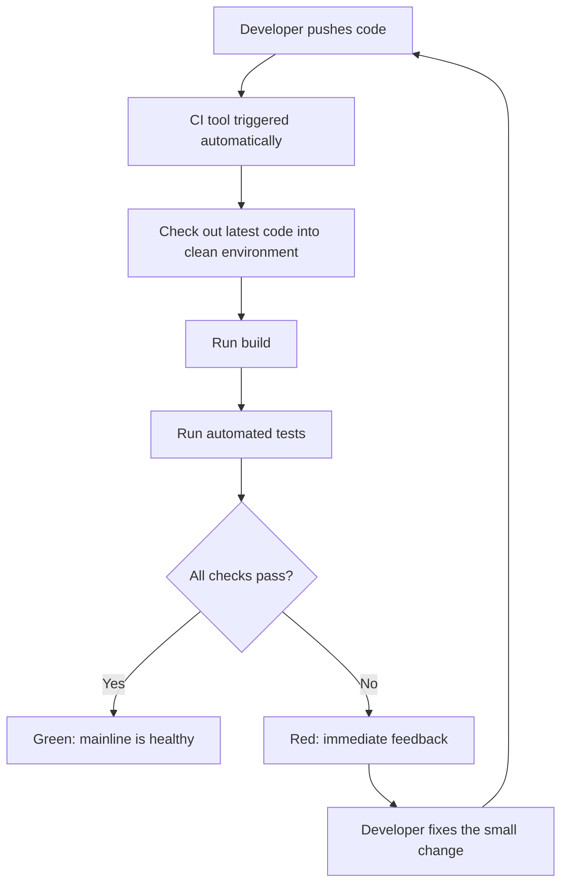

# Continuous Integration (CI) Basics: Automating Builds and Tests

## Learning Objectives
- Understand what Continuous Integration (CI) is and why teams integrate code "often and in small pieces."
- Trace the flow of a CI pipeline: code push → automated build → automated tests.
- Set up a simple CI configuration (GitHub Actions) and watch a build and test run automatically on every push.

## Body

### The problem CI was invented to solve

Imagine a team of five developers, each working on their own feature for a few weeks without sharing code. Eventually the day comes when everyone has to merge their work together. In the early days of software, teams literally scheduled this for a specific day and dreaded it. They even had a name for it: **"merge day"** (or "integration hell").

Why was it so painful? Because when five different sets of changes collide all at once, conflicts pile up, and when something breaks, nobody knows *which* of the thousands of accumulated changes caused it. Debugging a single broken build that contains weeks of everyone's work is exhausting.

> The core insight of CI is simple: merging is painful in proportion to how long you wait. So don't wait. Integrate small changes frequently, and let a machine check each one immediately.

This idea didn't appear by accident. Back in 1999, Kent Beck (also famous for Test-Driven Development) introduced **Extreme Programming (XP)**, an agile methodology built for responding quickly to rapidly changing customer requirements. Among its practices, alongside testing, refactoring, and pair programming, was **Continuous Integration**.

### What "Continuous Integration" actually means

Continuous Integration is the practice of having every developer **merge their small changes into a shared mainline frequently** (ideally many times a day), where each merge automatically triggers a **build** and a suite of **automated tests**. If anything is wrong, the team finds out within minutes, not weeks.

Let's define two terms a beginner often confuses, because CI revolves around them:

- **Compile** — translating human-written source code into machine-readable instructions.
- **Build** — the larger process of turning source files into a runnable software artifact. A build usually *includes* compilation, plus steps like fetching dependencies and packaging.

A helpful analogy: compiling is like translating an English manuscript into your native language so you can understand it. Building is binding that translation into a finished book. (Deploying that book to a bookstore where readers can buy it is a *separate* step called CD, which is the topic of the next lecture.)

So CI's job is to make sure that, after each small change, the project still **compiles, builds, and passes its tests**, every single time.

### The CI pipeline flow

A CI pipeline is just an automated sequence of steps that runs whenever code changes. At the beginner level, the essential flow looks like this:

1. **A developer pushes code** (or opens a pull request) to the shared repository.
2. The push **triggers** the CI tool automatically.
3. The CI tool **checks out** the latest code into a clean, throwaway environment.
4. It runs the **build** to confirm the code compiles and packages correctly.
5. It runs the **automated tests** to confirm the code still behaves correctly.
6. It reports a clear **pass (green)** or **fail (red)** result back to the developer.

The diagram below traces this flow, including how the build-and-test stage branches into a green or red result.



If the result is red, the developer gets immediate feedback and fixes the issue while the change is still small and fresh in their mind. If it's green, everyone has confidence the mainline still works.

### Where to run the checks: feature branches and pull requests

A common and beginner-friendly Git workflow is the **feature branch workflow**: each developer creates a separate branch for their feature, works there without disturbing the main branch, and opens a **pull request** (also called a merge request) when ready to merge.

Here's the key habit: **run the CI checks on the pull request, before the code reaches main.** The pull request acts as a gatekeeper. Why does this matter so much? Picture this: if broken code merges into main *first* and only then gets tested, the failure now sits in the shared branch and blocks *everyone else's* work too, even teammates who did nothing wrong. By testing on the pull request, you keep the broken change out of main entirely.

The sequence below shows how the pull request gates the merge, so that broken code never reaches main in the first place.

```mermaid Feature branch and pull request workflow with CI as a gatekeeper
sequenceDiagram
    participant Dev as Developer
    participant FB as Feature branch
    participant PR as Pull request
    participant CI as CI tool
    participant Main as Main branch
    Dev->>FB: Commit small changes
    Dev->>PR: Open pull request
    PR->>CI: Trigger build and tests
    CI-->>PR: Report pass or fail
    alt Checks pass
        PR->>Main: Merge approved
    else Checks fail
        CI-->>Dev: Block merge, show failure
        Dev->>FB: Fix and commit again
    end
```

Even better, you can run checks on **every commit** in the feature branch, not just at merge time. If you collect twenty commits and only test at the end, you might discover a pile of issues that takes hours to untangle. Testing each small commit gives you a tight feedback loop: introduce a problem, see it fail right away, fix it, move on. This idea of catching problems as early as possible is called **"shifting left"** (moving automated testing earlier in the process). The earliest point of all is your own editor or IDE, which can flag messy code as you type, but we don't rely on individuals remembering to do that. We **centralize and automate** the checks in the pipeline so they always run.

### What kinds of tests run in CI?

The exact tests depend on your project, but common categories include:

- **Unit and integration tests** — verify your code logic produces correct results across different inputs.
- **Linting / code-style checks** — a **linter** is a tool that checks whether your code follows agreed-upon standards (consistent formatting, naming, no obvious mistakes). Inconsistent indentation, missing blank lines between functions, and similar sloppiness all get flagged.
- **Security scans** — check dependencies for known vulnerabilities and scan for hardcoded secrets.
- **Code-quality checks** — code can work and even be secure but still be hard to maintain (duplicated logic, outdated APIs, poor test coverage). These checks catch maintainability problems.

For this lecture we'll keep it concrete with a build and a simple test, which is plenty to see CI in action.

### What is a "CI tool" and a "runner"?

A **CI tool** (also called a CI server) is the software that watches your repository and runs the pipeline. Popular options include **GitHub Actions**, Jenkins, GitLab CI/CD, and Travis CI. We'll use **GitHub Actions** because it's built directly into GitHub, so there's nothing extra to install.

A few GitHub Actions terms you'll meet in the config file:

- **Event** — the trigger that starts a workflow (for example, a `push` or a `pull_request`).
- **Workflow** — the whole automated process, defined in a YAML file.
- **Job** — a group of steps that run together.
- **Runner** — the container environment (a fresh virtual machine) where your job executes. GitHub hosts these for free with choices of Ubuntu Linux, Windows, or macOS.
- **Step / Action** — an individual task within a job. An **action** is a reusable, pre-built step you can grab from the GitHub Actions Marketplace (like the official "checkout" action that pulls your code into the runner).

> One critical gotcha: GitHub only recognizes workflow files placed in the exact folder `.github/workflows/`. If your pipeline never triggers, the wrong file location is the usual culprit.

### Hands-on: your first CI pipeline with GitHub Actions

Let's build a minimal pipeline. We'll use a Node.js example because it's compact, but the *structure* is identical for any language.

**Step 1 — Create a repository.** On GitHub.com, create a new repository and add a README so you have something to start with.

**Step 2 — Add a tiny project with a test.** Create a `package.json` that defines a build and a test command:

```json
{
  "name": "ci-demo",
  "version": "1.0.0",
  "scripts": {
    "build": "echo 'Building the project...' && node -e \"console.log('build ok')\"",
    "test": "node --test"
  }
}
```

Add a trivial test file named `app.test.js` so the test command has something to check:

```javascript
const { test } = require('node:test');
const assert = require('node:assert');

test('1 + 1 equals 2', () => {
  assert.strictEqual(1 + 1, 2);
});
```

**Step 3 — Create the workflow file.** In your repository, create a file at exactly this path: `.github/workflows/ci.yml`. This YAML file *is* your CI pipeline:

```yaml
name: CI

# Event: run on every push and on every pull request to main
on:
  push:
    branches: [ main ]
  pull_request:
    branches: [ main ]

jobs:
  build-and-test:
    # Runner: a clean Ubuntu container hosted by GitHub
    runs-on: ubuntu-latest

    steps:
      # Step 1: check out (download) our repository code into the runner
      - name: Check out code
        uses: actions/checkout@v4

      # Step 2: install Node.js in the runner
      - name: Set up Node.js
        uses: actions/setup-node@v4
        with:
          node-version: '20'

      # Step 3: install dependencies (none here, but this is the real-world step)
      - name: Install dependencies
        run: npm install

      # Step 4: run the build
      - name: Build
        run: npm run build

      # Step 5: run the automated tests
      - name: Test
        run: npm test
```

Read that file top to bottom and you can narrate the whole pipeline in one sentence: *"Whenever someone pushes to main or opens a pull request, run a job on an Ubuntu runner that checks out the code, sets up Node, installs dependencies, builds, and then tests."* That is CI.

**Step 4 — Push and watch it run.** The moment you commit this file, GitHub starts the workflow. Back on the repository's main page you'll see a small **status icon**: yellow means "running," green check means "all checks passed," and red means "something failed." Click the **Actions** tab to watch each step execute live and read its logs.

**Step 5 — Make it fail on purpose.** To really understand the feedback loop, break a test:

```javascript
test('this will fail', () => {
  assert.strictEqual(1 + 1, 3); // intentionally wrong
});
```

Push it. Within a minute the icon turns red, the Actions tab shows exactly which step failed and why, and you've experienced the entire point of CI: **problems surface immediately, pinpointed to the change that caused them.** Fix the assertion back to `2`, push again, and watch it go green.

### Why this small setup is a big deal

That green checkmark is more than a status light. It's a shared, automated source of truth that says: "the latest code builds and passes its tests." This is the foundation everything else in DevOps builds on. In fact, you can already glimpse the next step: once the checks are green, an automated process could take that verified code and deliver it onward to a server, which is exactly what **Continuous Delivery / Deployment (CD)** does in the next lecture.

Martin Fowler describes a few habits that separate "we technically have a CI tool" from genuinely practicing CI:

- Keep **a single shared place** where everyone can get the current source.
- **Automate the build** so anyone can build the system from source with one command.
- **Automate the tests** so a healthy test suite can run at any time.
- Make sure **anyone who grabs the latest build** can trust it's the most complete, working version available.

Notice that none of these are about a specific tool. The tool (GitHub Actions, Jenkins, whatever) is just the engine. CI is the *discipline* of integrating small changes often and letting automation guard the mainline.

## Key Takeaways
- **CI = integrate small changes frequently**, with an automated build and tests checking each one, so you escape the pain of "merge day."
- The core pipeline flow is **push → trigger → check out → build → test → pass/fail feedback**, ideally running on pull requests *before* code reaches main.
- **"Shift left":** catch problems as early as possible (in the IDE, on each commit, on the pull request) so they're cheap to fix.
- A **CI tool** like GitHub Actions runs your **workflow** (defined in YAML) as **jobs** on a **runner**; workflow files must live in `.github/workflows/`.
- You built a real pipeline: a green check means the latest code builds and passes tests, the trustworthy foundation that CD (next lecture) extends into automated deployment.
