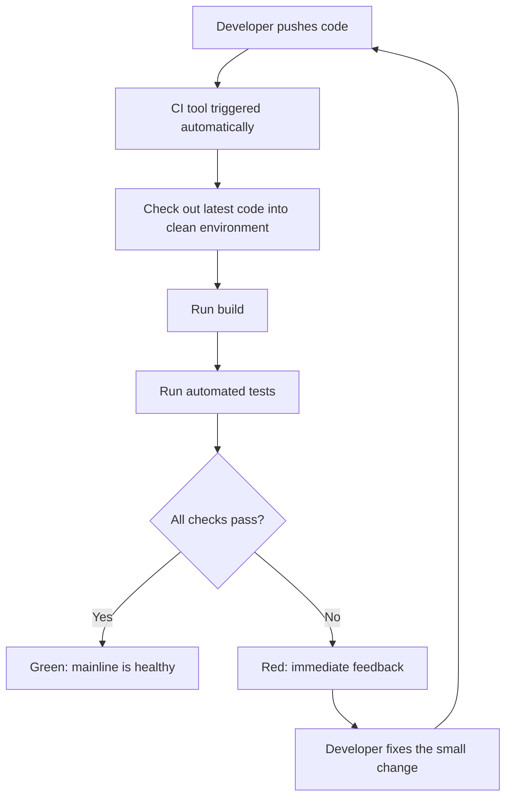
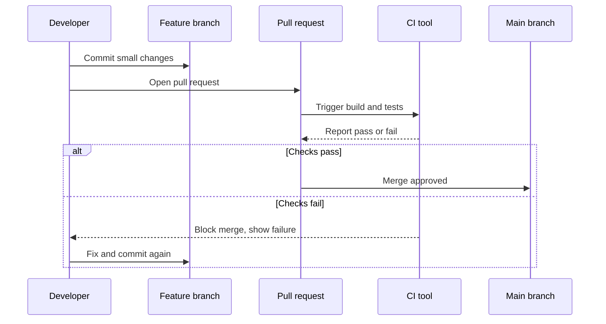

# CI(지속적 통합) 기초: 빌드와 테스트 자동화

## 학습 목표
- CI(Continuous Integration, 지속적 통합)가 무엇인지, 왜 팀이 코드를 "자주, 조금씩" 합쳐야 하는지 이해한다.
- CI 파이프라인의 흐름을 파악한다: 코드 푸시 → 자동 빌드 → 자동 테스트.
- 간단한 CI 설정(GitHub Actions)을 직접 구성하고, 푸시할 때마다 빌드와 테스트가 자동으로 돌아가는 것을 확인한다.

## 본문

### CI가 탄생한 배경

다섯 명의 개발자가 각자 몇 주 동안 자기 기능을 만들면서 코드를 공유하지 않는다고 상상해 보자. 결국 모두의 작업을 한꺼번에 합쳐야 하는 날이 온다. 초창기 소프트웨어 개발 현장에서는 이 날을 미리 잡아놓고 두려워했다. 심지어 이름까지 있었다: **"머지 데이(merge day)"**, 혹은 "통합 지옥(integration hell)".

왜 이렇게 괴로웠을까? 다섯 사람의 변경 사항이 한꺼번에 충돌하면 문제가 폭발하는데, 무엇이 원인인지 알 수가 없다. 수천 개의 변경이 뒤섞인 빌드 하나를 디버깅하는 일은 정말 소모적이다.

> CI의 핵심 통찰은 단순하다: 통합을 미룰수록 고통은 커진다. 그러니 미루지 말자. 작은 변경을 자주 합치고, 기계가 즉시 검사하게 하자.

이 아이디어는 우연히 나온 것이 아니다. 1999년 켄트 벡(Kent Beck, TDD로도 유명)이 빠르게 변하는 고객 요구에 대응하기 위한 애자일 방법론인 **익스트림 프로그래밍(XP, Extreme Programming)**을 소개했다. 여기에는 테스트, 리팩터링, 페어 프로그래밍과 함께 **지속적 통합(Continuous Integration)**이 핵심 실천법으로 포함되어 있었다.

### "지속적 통합"이란 실제로 무엇인가

지속적 통합은 모든 개발자가 **작은 변경을 공유 메인라인(mainline)에 자주 병합하는** 습관이다(이상적으로는 하루에도 여러 번). 각 병합은 자동으로 **빌드**와 **자동화된 테스트**를 실행하고, 문제가 생기면 몇 주 후가 아니라 몇 분 내에 팀이 알게 된다.

입문자가 자주 헷갈리는 두 가지 개념을 짚고 넘어가자.

- **컴파일(Compile)** — 사람이 작성한 소스 코드를 기계가 읽을 수 있는 명령어로 변환하는 작업.
- **빌드(Build)** — 소스 파일을 실행 가능한 소프트웨어 산출물로 만드는 더 넓은 과정. 컴파일을 포함하며, 의존성 설치나 패키징 같은 단계도 함께 처리한다.

비유를 들면, 컴파일은 영어 원고를 모국어로 번역하는 것이고, 빌드는 그 번역본을 완성된 책으로 제본하는 것이다. (그 책을 서점에 배달하는 것은 CD(지속적 배포/전달)의 영역으로, 다음 강의에서 다룬다.)

CI의 역할은 작은 변경이 생길 때마다 프로젝트가 여전히 **컴파일되고, 빌드되고, 테스트를 통과하는지** 매번 확인하는 것이다.

### CI 파이프라인 흐름

CI 파이프라인은 코드가 바뀔 때마다 자동으로 실행되는 일련의 단계다. 기본 흐름은 다음과 같다.

1. 개발자가 코드를 **푸시**하거나 풀 리퀘스트(pull request)를 연다.
2. 푸시가 CI 도구를 **자동으로 트리거**한다.
3. CI 도구가 깨끗한 임시 환경에 최신 코드를 **체크아웃**한다.
4. **빌드**를 실행해 코드가 올바르게 컴파일·패키징되는지 확인한다.
5. **자동화된 테스트**를 실행해 코드가 기대대로 동작하는지 확인한다.
6. 개발자에게 **통과(초록)** 또는 **실패(빨강)** 결과를 명확히 알려준다.

아래 다이어그램은 코드 푸시부터 결과 판정까지 이 흐름을 보여준다.



결과가 빨강이면 개발자는 즉시 피드백을 받아 변경이 여전히 작고 기억이 생생할 때 문제를 고칠 수 있다. 초록이면 메인라인이 정상이라는 신뢰가 생긴다.

### 어디서 검사를 실행할까: 피처 브랜치와 풀 리퀘스트

입문자에게 친숙한 Git 워크플로는 **피처 브랜치(feature branch) 워크플로**다. 각 개발자가 자신의 기능을 위한 별도 브랜치를 만들고, 메인 브랜치에 영향을 주지 않은 채 작업한다. 준비가 되면 **풀 리퀘스트(pull request, PR)**를 열어 병합을 요청한다.

핵심 습관은 이것이다: **코드가 main에 닿기 전에, 풀 리퀘스트 단계에서 CI 검사를 실행한다.** 풀 리퀘스트가 문지기 역할을 한다. 왜 중요할까? 깨진 코드가 main에 먼저 들어오면, 그 실패는 이제 공유 브랜치에 앉아 잘못한 것이 없는 동료들의 작업까지 막는다. 풀 리퀘스트에서 테스트하면 깨진 변경이 처음부터 main에 들어오지 못한다.

아래 다이어그램은 풀 리퀘스트가 병합을 어떻게 통제하는지, 그리고 깨진 코드가 main에 도달하지 못하도록 막는 과정을 보여준다.



더 나아가, 병합 시점뿐 아니라 **피처 브랜치의 커밋마다** 검사를 돌릴 수도 있다. 커밋 20개를 쌓아두고 마지막에만 테스트하면, 한꺼번에 쏟아지는 문제를 몇 시간에 걸쳐 풀어야 할 수도 있다. 커밋 하나하나를 테스트하면 피드백 루프가 촘촘해진다: 문제를 만들면 즉시 실패를 확인하고, 고치고, 넘어간다. 이처럼 가능한 한 일찍 문제를 잡는 것을 **"시프트 레프트(shift left)"**라고 한다(자동화 테스트를 프로세스 앞쪽으로 옮기는 것). 가장 앞단은 본인의 에디터나 IDE인데, 타이핑하는 순간 코드 문제를 알려주기도 한다. 하지만 개개인이 기억해서 할 일에 의존할 수는 없다. 그래서 **파이프라인에서 검사를 자동화**해 항상 실행되게 만든다.

### CI에서 어떤 테스트를 실행할까

프로젝트마다 다르지만, 일반적인 유형은 다음과 같다.

- **단위·통합 테스트** — 코드 로직이 다양한 입력에 대해 올바른 결과를 내는지 검증한다.
- **린팅(Linting) / 코드 스타일 검사** — **린터(linter)**는 코드가 팀 내 합의된 표준을 따르는지 검사하는 도구다(일관된 들여쓰기, 함수 사이 빈 줄, 명백한 실수 등을 잡아낸다).
- **보안 스캔** — 알려진 취약점이 있는 의존성이 없는지, 하드코딩된 시크릿(비밀키 등)이 없는지 확인한다.
- **코드 품질 검사** — 코드가 동작하고 보안적으로도 문제없지만, 유지보수하기 어려울 수 있다(중복 로직, 낡은 API, 낮은 테스트 커버리지 등). 이런 문제를 잡아낸다.

이 강의에서는 빌드와 간단한 테스트에 집중한다. CI가 실제로 어떻게 동작하는지 확인하기에 충분하다.

### CI 도구와 러너란?

**CI 도구**(CI 서버라고도 한다)는 저장소를 감시하고 파이프라인을 실행하는 소프트웨어다. 대표적으로 **GitHub Actions**, Jenkins, GitLab CI/CD, Travis CI 등이 있다. 여기서는 GitHub에 기본으로 내장된 **GitHub Actions**를 사용한다. 별도 설치가 필요 없다.

설정 파일에서 만나게 될 GitHub Actions 용어를 정리하면 다음과 같다.

- **이벤트(Event)** — 워크플로를 시작하는 트리거(예: `push`, `pull_request`).
- **워크플로(Workflow)** — YAML 파일로 정의된 전체 자동화 프로세스.
- **잡(Job)** — 함께 실행되는 스텝들의 묶음.
- **러너(Runner)** — 잡이 실행되는 컨테이너 환경(새로운 가상 머신). GitHub가 Ubuntu Linux, Windows, macOS 중에서 선택할 수 있게 무료로 제공한다.
- **스텝(Step) / 액션(Action)** — 잡 안의 개별 작업 단위. **액션**은 GitHub Actions 마켓플레이스에서 가져다 쓸 수 있는 재사용 가능한 빌트인 스텝이다(예: 코드를 러너로 내려받는 공식 "checkout" 액션).

> 중요한 함정 하나: GitHub는 정확히 `.github/workflows/` 폴더에 있는 워크플로 파일만 인식한다. 파이프라인이 실행되지 않는다면 파일 위치가 잘못된 경우가 대부분이다.

### 실습: GitHub Actions로 첫 번째 CI 파이프라인 만들기

최소한의 파이프라인을 직접 만들어 보자. 예제는 Node.js로 간결하게 작성하지만, *구조*는 어떤 언어에서도 동일하다.

**1단계 — 저장소 생성.** GitHub.com에서 새 저장소를 만들고, README를 추가해 시작점을 마련한다.

**2단계 — 테스트가 포함된 간단한 프로젝트 추가.** 빌드와 테스트 명령을 정의하는 `package.json`을 만든다.

```json
{
  "name": "ci-demo",
  "version": "1.0.0",
  "scripts": {
    "build": "echo 'Building the project...' && node -e \"console.log('build ok')\"",
    "test": "node --test"
  }
}
```

테스트 명령이 확인할 수 있도록 `app.test.js` 파일을 추가한다.

```javascript
const { test } = require('node:test');
const assert = require('node:assert');

test('1 + 1 equals 2', () => {
  assert.strictEqual(1 + 1, 2);
});
```

**3단계 — 워크플로 파일 생성.** 저장소에 정확히 이 경로로 파일을 만든다: `.github/workflows/ci.yml`. 이 YAML 파일이 곧 CI 파이프라인이다.

```yaml
name: CI

# 이벤트: main 브랜치로의 모든 푸시와 풀 리퀘스트에서 실행
on:
  push:
    branches: [ main ]
  pull_request:
    branches: [ main ]

jobs:
  build-and-test:
    # 러너: GitHub이 제공하는 깨끗한 Ubuntu 컨테이너
    runs-on: ubuntu-latest

    steps:
      # 스텝 1: 저장소 코드를 러너에 체크아웃(다운로드)
      - name: Check out code
        uses: actions/checkout@v4

      # 스텝 2: 러너에 Node.js 설치
      - name: Set up Node.js
        uses: actions/setup-node@v4
        with:
          node-version: '20'

      # 스텝 3: 의존성 설치 (여기선 없지만, 실제 프로젝트에서 필수)
      - name: Install dependencies
        run: npm install

      # 스텝 4: 빌드 실행
      - name: Build
        run: npm run build

      # 스텝 5: 자동화된 테스트 실행
      - name: Test
        run: npm test
```

파일을 위에서 아래로 읽으면 파이프라인 전체를 한 문장으로 말할 수 있다: *"누군가 main에 푸시하거나 풀 리퀘스트를 열면, Ubuntu 러너 위에서 코드를 체크아웃하고, Node를 설정하고, 의존성을 설치하고, 빌드한 다음 테스트하는 잡을 실행한다."* 이것이 CI다.

**4단계 — 푸시하고 실행 확인.** 이 파일을 커밋하는 순간 GitHub이 워크플로를 시작한다. 저장소 메인 페이지에서 작은 **상태 아이콘**을 볼 수 있다: 노란색은 실행 중, 초록 체크는 통과, 빨간색은 실패를 뜻한다. **Actions** 탭을 클릭하면 각 스텝이 실행되는 것을 실시간으로 보고 로그를 읽을 수 있다.

**5단계 — 의도적으로 실패시키기.** 피드백 루프를 제대로 이해하려면 테스트를 직접 깨뜨려 보자.

```javascript
test('this will fail', () => {
  assert.strictEqual(1 + 1, 3); // intentionally wrong
});
```

푸시해 보자. 1분 안에 아이콘이 빨간색으로 바뀌고, Actions 탭에서 어떤 스텝이, 왜 실패했는지 정확히 확인할 수 있다. 이것이 CI의 핵심이다: **문제가 즉시 드러나고, 원인이 된 변경에 정확히 연결된다.** 단언(assertion)을 `2`로 되돌려 다시 푸시하면 초록으로 돌아오는 것을 확인할 수 있다.

### 이 작은 설정이 왜 중요한가

초록 체크마크는 단순한 상태 표시가 아니다. "최신 코드가 빌드되고 테스트를 통과했다"는 공유된 자동화 사실의 증거다. DevOps의 모든 것이 이 위에 쌓인다. 사실 다음 단계도 이미 보인다: 검사가 초록이 되면, 자동화 프로세스가 그 검증된 코드를 서버로 전달할 수 있다. 다음 강의에서 다룰 **CD(지속적 전달/배포, Continuous Delivery/Deployment)**가 바로 그것이다.

마틴 파울러(Martin Fowler)는 "CI 도구를 갖추는 것"과 "진정한 CI를 실천하는 것"을 가르는 몇 가지 습관을 설명한다.

- 누구든 현재 소스를 받을 수 있는 **단일 공유 장소**를 유지한다.
- 명령어 하나로 소스를 빌드할 수 있도록 **빌드를 자동화**한다.
- 언제든 건강한 테스트 스위트를 실행할 수 있도록 **테스트를 자동화**한다.
- 최신 빌드를 가져가는 사람이 가장 완성된, 동작하는 버전임을 **신뢰할 수 있게** 만든다.

이 중 특정 도구에 관한 이야기는 하나도 없다. GitHub Actions, Jenkins, 무엇이든 도구는 그냥 엔진일 뿐이다. CI는 작은 변경을 자주 통합하고 자동화가 메인라인을 지키게 하는 **규율**이다.

## 핵심 정리
- **CI = 작은 변경을 자주 통합**하고, 자동화된 빌드와 테스트가 매번 검사하게 해서 "머지 데이"의 고통을 없애는 것.
- 핵심 파이프라인 흐름은 **푸시 → 트리거 → 체크아웃 → 빌드 → 테스트 → 통과/실패 피드백**이며, 코드가 main에 닿기 전 풀 리퀘스트 단계에서 실행하는 것이 이상적이다.
- **"시프트 레프트":** 문제를 가능한 한 일찍(IDE, 각 커밋, 풀 리퀘스트) 잡으면 수정 비용이 줄어든다.
- GitHub Actions 같은 **CI 도구**는 YAML로 정의된 **워크플로**를 **러너** 위에서 **잡**으로 실행하며, 워크플로 파일은 반드시 `.github/workflows/`에 있어야 한다.
- 직접 파이프라인을 만들었다: 초록 체크는 최신 코드가 빌드되고 테스트를 통과했다는 신뢰의 근거이며, 다음 강의에서 다룰 CD가 이를 자동 배포로 확장한다.
