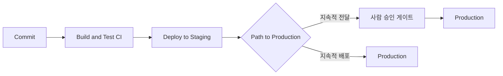
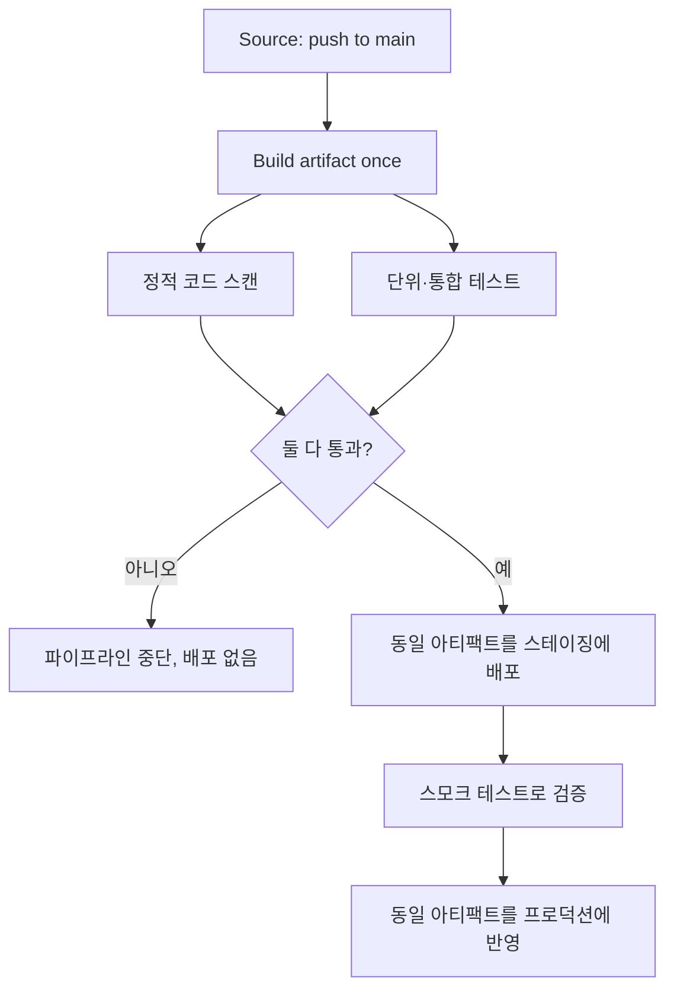
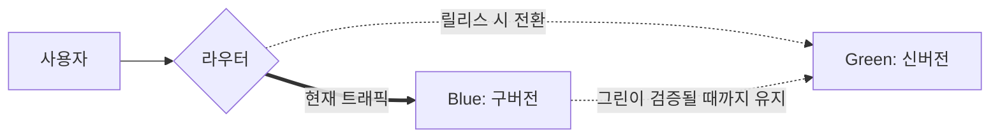

# 지속적 전달 & 지속적 배포 기초: 프로덕션까지 자동으로

## 학습 목표
- **지속적 전달(Continuous Delivery)** 과 **지속적 배포(Continuous Deployment)**, 같은 약어 "CD"가 가리키는 두 개념의 차이를 설명할 수 있다.
- 파이프라인이 빌드 결과물을 CI에서 스테이징을 거쳐 프로덕션까지 자동으로 전달하는 흐름을 이해한다.
- **아티팩트 빌드 → 배포 → 검증**이라는 세 단계를 직접 실습한다.
- 무중단 배포 패턴(롤링, 블루-그린, 카나리)을 입문자 수준에서 파악한다.

## 본문

### 복습: CI는 테스트된 빌드를 만들어준다

4강에서 **지속적 통합(CI)** 을 설정했다. 코드를 푸시할 때마다 파이프라인이 자동으로 프로젝트를 빌드하고 테스트를 실행한다. CI가 녹색이면 코드가 컴파일되고 예상대로 동작한다는 뜻이다.

그런데 빌드 서버에 쌓인 합격 테스트 결과는 사용자에게 아무 의미가 없다. 누군가 그 빌드를 가져다 *실제로 돌아가는 서버에 올려야* 한다. 검증된 빌드를 실사용자 앞에 안전하게 내놓는 이 마지막 구간이 바로 **CD**가 하는 일이다. CI가 "코드가 제대로 동작하는가?"를 묻는다면, CD는 "어떻게 하면 이를 안정적이고 반복 가능하게 배포할 수 있는가?"를 묻는다.

> CI와 CD는 따로 조립하는 별개의 도구가 아니다. 하나의 연속 파이프라인이다. CI는 앞부분(빌드·테스트), CD는 뒷부분(릴리스·배포)이다.

### 배포를 자동화하는 이유

이 아이디어가 막 등장하던 시절의 실화다. 어느 팀이 인터넷 서비스 공급업체의 시스템을 재구축하면서 Windows에서 개발하고 Solaris 서버에 배포했다. 첫 배포에 **2주가 걸렸고 그마저도 실패**했다. 변경 사항이 실제로 잘 동작하는지 피드백을 받는 데 또 2~3주가 더 걸렸다. 무언가 고치는 일은 고통이었고, 릴리스는 주말을 통째로 바치는 두려운 행사였다.

팀은 배포 스크립트를 작성했다("코난 더 디플로이어"라는 별명을 붙였다). 전 과정을 자동화한 결과, 배포 시간이 2주에서 **약 1시간**으로 줄었고 잘못된 릴리스를 롤백하는 데 **1초도 안 걸렸다**. 주말 배포는 사라졌다.

이 이야기에서 얻을 수 있는 교훈은 보편적이다. 배포가 수동이고 느리고 두렵다면 팀은 드물게, 크고 위험한 묶음 단위로 배포한다. 배포가 자동이고 빠르고 지루하다면 팀은 *자주*, 작고 안전한 단위로 배포한다. 그리고 작고 잦은 배포는 사실 더 **안전**하다. 마지막 릴리스 이후 바뀐 것이 적으니 문제가 생길 여지도 줄고, 문제가 생겼을 때 어디를 봐야 할지도 분명하다. Flickr가 높은 가용성을 유지하면서 하루에 열 번 이상 배포했다는 사례는 잦은 배포와 안정성이 결코 모순이 아님을 증명한다.

CD 이면에 있는 DevOps의 핵심 통찰이 바로 이것이다. "코드 커밋"에서 "프로덕션 반영"까지의 **리드 타임(lead time)** 을 단축하고, 릴리스 단위의 **배치 크기**를 줄이는 것이다.

### 핵심 개념: 전달(Delivery) vs. 배포(Deployment)

둘 다 약어로 "CD"라고 쓰고 사람들이 혼용하지만, 분명히 다른 뜻이다. 차이는 **누가 프로덕션 배포의 마지막 버튼을 누르느냐**에 있다.

- **지속적 전달(Continuous Delivery)** — CI가 끝나면 파이프라인이 릴리스를 자동으로 준비해 스테이징 환경까지 밀어 넣는다. 프로덕션은 *클릭 한 번* 앞에 있다. 모든 변경 사항은 언제든 배포 가능한 상태를 유지하지만, *언제* 실제로 릴리스할지는 사람이 결정한다. 프로덕션 배포는 자동화되어 있되 **수동으로 트리거**한다.

- **지속적 배포(Continuous Deployment)** — 한 단계 더 나아간다. 수동 게이트가 없다. 모든 자동화 검사를 통과한 변경 사항은 사람 개입 없이 자동으로 프로덕션에 반영된다.

쉽게 말하면: 지속적 전달은 *"릴리스는 언제나 준비돼 있다. 사람이 출발 버튼을 누른다."* 이고, 지속적 배포는 *"테스트를 통과하면 이미 라이브다."* 다. 아래 다이어그램은 두 경로가 프로덕션 직전 단계까지 동일하고, 마지막 단계에서만 전달은 사람 게이트를 두고 배포는 이를 없앤다는 것을 보여준다.



지속적 배포는 자동화 테스트에 대한 깊은 신뢰를 전제한다. 커밋과 사용자 사이에 다른 안전망이 없기 때문이다. 대부분의 팀은 먼저 지속적 *전달*을 도입해 사람 게이트를 유지하다가, 테스트 커버리지와 모니터링이 충분한 신뢰를 쌓고 나서야 지속적 *배포*로 넘어간다.

> 쉽게 외우는 팁: 지속적 **전달(De**L**ivery)**은 프로덕션 전에 사람을 **L**oop에 남긴다. 지속적 **배포(De**P**loyment)**는 **P**ushes 바로 통과한다.

한 가지 더 알아둘 개념이 있다. **배포(deploy)와 릴리스(release) 분리**다. 프로덕션 서버에 코드를 *배포*하더라도 사용자에게 기능을 *릴리스*하지 않을 수 있다. **피처 토글(feature toggle)** 은 런타임 온/오프 스위치로, 새 코드를 라이브 상태지만 숨겨두다가 사용자의 1%에게, 그다음 10%에게, 마지막으로 전체에게 순차적으로 공개할 수 있게 해준다. Facebook이 정확히 이 방식을 쓴다. 배포는 기술적 이벤트이고 릴리스는 비즈니스 결정이다. 둘을 분리하면 두려움이 크게 줄어든다.

### 배포 파이프라인의 구조

파이프라인은 단계(stage)를 직렬로 연결한 체인이다. 각 단계가 성공해야 다음 단계가 시작된다. 어느 단계든 실패하면 파이프라인이 멈추고 아무것도 프로덕션에 도달하지 않는다. 일반적인 흐름은 다음과 같다.

1. **소스(Source)** — 메인 브랜치에 푸시하거나 머지하면 파이프라인이 시작된다.
2. **빌드(Build)** — 코드를 컴파일하고 **아티팩트(artifact)** 를 만든다. 버전이 명시된 단일 배포 패키지(`.jar`/`.war`, Docker 이미지, 압축 번들 등)다. 아티팩트는 **한 번만** 빌드되고 *동일한* 아티팩트가 이후 모든 단계를 통해 승격된다. 테스트한 것이 곧 배포하는 것이다.
3. **테스트(Test)** — 자동화 검사를 실행한다. 단위 테스트, 통합 테스트, 종단 간 테스트 등이 포함된다. (CI 구간이 이 부분이다.)
4. **스테이징 배포(Deploy to Staging)** — 아티팩트를 **스테이징** 환경에 올린다. 스테이징은 최종 검증을 위해 프로덕션과 동일하게 구성한 복제 환경이다.
5. **검증(Verify)** — 스테이징에 스모크 테스트나 헬스 체크를 실행해 앱이 제대로 올라왔는지 확인한다.
6. **프로덕션 배포(Deploy to Production)** — *동일한 아티팩트*를 프로덕션에 반영한다. 지속적 전달에서는 사람 승인 후에, 지속적 배포에서는 자동으로 실행된다.

단계는 분기했다가 합쳐질 수도 있다. 예를 들어 빌드 후 정적 코드 품질 검사와 단위 테스트를 **병렬**로 실행하고, *둘 다* 성공해야 배포 단계가 시작된다. 아래 다이어그램은 병렬 검사와 실패 즉시 중단(fail-fast) 경로를 포함한 전체 게이트 흐름을 보여준다. Jenkins, GitHub Actions, GitLab CI, CircleCI 같은 실제 도구들이 모두 이 아이디어를 그대로 구현한다. 순차적 단계, 선택적 병렬 실행, 매 단계의 실패 즉시 중단 게이트.



### 서비스 중단 없이 배포하기: 무중단 패턴

단순하게 구버전을 내리고 신버전을 올리면 그 사이에 사용자가 오류를 만난다. 이를 피하는 세 가지 일반적인 패턴이 있다.

- **롤링 배포(Rolling Deployment)** — 인스턴스를 몇 개씩 교체한다. 일부 서버가 신버전을 실행하는 동안 나머지는 구버전으로 계속 서비스한다. 서비스가 완전히 중단되지 않는다. 단순하며 많은 플랫폼의 기본 방식이다.
- **블루-그린 배포(Blue-Green Deployment)** — 완전한 환경 두 벌을 운영한다. "블루"가 실제 트래픽을 처리하는 동안 유휴 상태인 "그린"에 신버전을 배포하고 테스트한다. 그린이 준비되면 라우터를 전환해 모든 트래픽을 그린으로 보낸다. 문제가 생기면 즉시 다시 전환한다. 앞서 "1초도 안 걸리는 롤백"이 가능했던 것이 바로 이 방식 덕분이다.
- **카나리 배포(Canary Deployment)** — 신버전을 먼저 소수의 트래픽("카나리")에만 노출한다. 지표를 모니터링하다가 정상이면 점진적으로 100%까지 확대한다. 오류율이 급등하면 대부분의 사용자가 영향을 받기 전에 회수한다.

블루-그린 패턴이 가장 직관적이다. 트래픽은 항상 하나의 환경을 가리키고, "릴리스"와 "롤백"은 그 포인터를 전환하는 것에 불과하다. 아래 다이어그램이 이를 보여준다.



오늘 이 패턴들을 전부 마스터할 필요는 없다. 다만 "배포 = 서비스 중단"이 아니라는 점, 그리고 가장 안전한 패턴들이 공통적으로 **신버전이 검증될 때까지 구버전을 살아있게 유지한다**는 원칙을 지킨다는 것만 기억하자.

## 실습: 빌드 → 배포 → 검증 파이프라인 만들기

세 단계 배포 과정을 **GitHub Actions**(4강에서 사용한 도구)로 직접 구현해보자. 흐름은 **아티팩트 생성 → 배포 → 검증** 순서다.

핵심 설계 원칙은 **아티팩트를 빌드 잡(job)에서 한 번만 만들고 배포 잡에 전달하는 것**이다. 각 환경에서 다시 빌드하지 않는다. GitHub Actions에서 각 잡은 독립된 머신에서 실행되고 파일을 자동으로 공유하지 않는다. 그래서 내장 액션 두 개를 활용한다. `actions/upload-artifact`(빌드 잡에서)가 `app.tar.gz`를 GitHub 아티팩트 저장소에 올리고, `actions/download-artifact`(각 배포 잡에서)가 *바로 그 파일*을 내려받는다. "한 번 빌드, 변경 없이 승격"이 구호에 그치지 않고 실제로 동작하는 방법이다.

```yaml
# .github/workflows/deploy.yml
name: CD Pipeline

on:
  push:
    branches: [ main ]          # main에 머지될 때마다 릴리스 시작

jobs:
  build:
    runs-on: ubuntu-latest
    steps:
      # 1) 코드 가져오기
      - uses: actions/checkout@v4

      # 2) 아티팩트 빌드 (한 번 빌드, 이후 단계에서 재사용)
      - name: Build artifact
        run: |
          npm ci
          npm run build           # ./dist를 배포 가능한 아티팩트로 생성
          tar -czf app.tar.gz dist # 단일 버전 번들로 패키지

      # 3) 이후 잡이 동일한 번들을 사용할 수 있도록 아티팩트 업로드
      - name: Upload artifact
        uses: actions/upload-artifact@v4
        with:
          name: app-bundle        # 다른 잡이 다운로드할 때 쓸 이름
          path: app.tar.gz

  deploy-staging:
    needs: build                  # 빌드 잡이 끝날 때까지 대기
    runs-on: ubuntu-latest
    steps:
      # 4) 빌드 잡이 만든 아티팩트 그대로 다운로드 (재빌드 없음!)
      - name: Download artifact
        uses: actions/download-artifact@v4
        with:
          name: app-bundle        # 위에서 업로드한 이름과 동일

      # 5) 다운로드한 아티팩트를 스테이징에 배포
      - name: Deploy to staging
        run: |
          echo "Shipping the prebuilt app.tar.gz to staging server..."
          scp app.tar.gz deploy@staging.example.com:/var/www/app/
          ssh deploy@staging.example.com 'cd /var/www/app && tar -xzf app.tar.gz && systemctl restart app'

      # 6) 배포가 실제로 동작하는지 검증 (스모크 테스트)
      - name: Smoke test
        run: |
          sleep 5
          curl --fail https://staging.example.com/health || exit 1
          echo "Deployment verified: app is up and healthy."
```

흐름을 이야기로 읽어보면 이렇다.

- **`on: push` to `main`** 이 트리거다. 파이프라인의 시작점이다.
- **`build`** 잡이 소스를 `app.tar.gz`로 만들어 `app-bundle`로 업로드한다. 코드가 컴파일되고 패키지되는 곳은 오직 여기뿐이다.
- **`deploy-staging`** 잡은 `app-bundle`을, 빌드 잡이 만든 바로 그 패키지를 다운로드해서 배포한다. `npm run build`를 실행하지 않는다는 점에 주목하자. 아티팩트가 이미 있으니 다시 빌드할 것이 없다.
- **스모크 테스트**가 `/health` 엔드포인트를 호출한다. `--fail` 옵션은 HTTP 오류 상태 시 `curl`이 오류를 반환하게 하고, `|| exit 1`은 잡 전체를 실패 처리한다. **검증이 실패하면 파이프라인이 빨간색이 되고, 사용자보다 먼저 문제를 알게 된다.**

완전한 지속적 배포 대신 **지속적 전달**로 만들려면, 프로덕션에 반영하는 세 번째 잡을 추가하되 GitHub **environment**에 필수 리뷰어를 설정해 수동 승인을 요구하면 된다. 이 잡도 스테이징이 검증한 *동일한* `app-bundle`을 다운로드하므로, 프로덕션에는 스테이징과 바이트 단위로 동일한 아티팩트가 배포된다.

```yaml
  deploy-production:
    needs: deploy-staging         # 스테이징 성공 및 검증 후에만 실행
    runs-on: ubuntu-latest
    environment:
      name: production            # 이 environment에 승인 요건 설정
    steps:
      # 빌드 잡이 만든 동일 아티팩트 가져오기 — 재빌드, 새 패키지 없음
      - name: Download artifact
        uses: actions/download-artifact@v4
        with:
          name: app-bundle        # 스테이징이 검증한 것과 동일한 번들

      - name: Promote to production
        run: |
          echo "Promoting the staging-verified app.tar.gz to production..."
          scp app.tar.gz deploy@prod.example.com:/var/www/app/
          ssh deploy@prod.example.com 'cd /var/www/app && tar -xzf app.tar.gz && systemctl restart app'
```

필수 리뷰어가 설정된 `environment: production` 선언이 바로 지속적 전달을 정의하는 사람-인-루프 게이트다. 승인 요건을 제거하면 지속적 배포가 된다.

> 아티팩트는 `build` 잡에서 한 번 빌드되고, 두 배포 잡 모두에서 *다운로드*된다. 스테이징과 프로덕션 사이에 절대 재빌드하지 말자. 재빌드는 테스트한 것과 미묘하게 다른 결과물을 배포하는 위험을 초래한다.

## 핵심 정리
- **CI**는 코드가 동작하는지 검증하고, **CD**는 그 검증된 빌드를 안전하고 반복 가능하게 사용자에게 전달한다.
- **지속적 전달**은 모든 변경 사항을 언제나 배포 가능한 상태로 유지하되 사람이 마지막 버튼을 누른다. **지속적 배포**는 수동 게이트 없이 자동으로 배포한다. 차이는 사람이 프로덕션 단계를 승인하느냐에 있다.
- 배포 파이프라인은 게이트가 있는 단계의 체인이다. **소스 → 빌드(아티팩트) → 테스트 → 스테이징 배포 → 검증 → 프로덕션 배포** 순서로 진행된다. 아티팩트는 한 번 빌드하고 *동일한* 것을 계속 승격한다(GitHub Actions에서는 한 번 업로드하고 각 배포 잡에서 다운로드한다).
- 작고 잦은 자동 배포는 드물고 큰 일괄 릴리스보다 **더 안전하다**. 변경량이 적고 롤백이 쉬우며 피드백이 빠르다(리드 타임 단축).
- **배포 ≠ 릴리스**: 피처 토글을 쓰면 코드를 숨긴 채 배포한 뒤 기능을 점진적으로 공개할 수 있다.
- 무중단 패턴인 **롤링, 블루-그린, 카나리** 모두 신버전이 검증될 때까지 구버전을 유지한다는 원칙을 공유한다.
