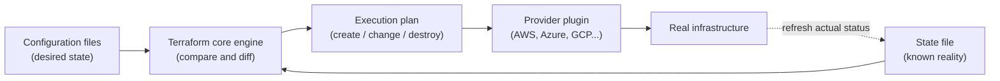
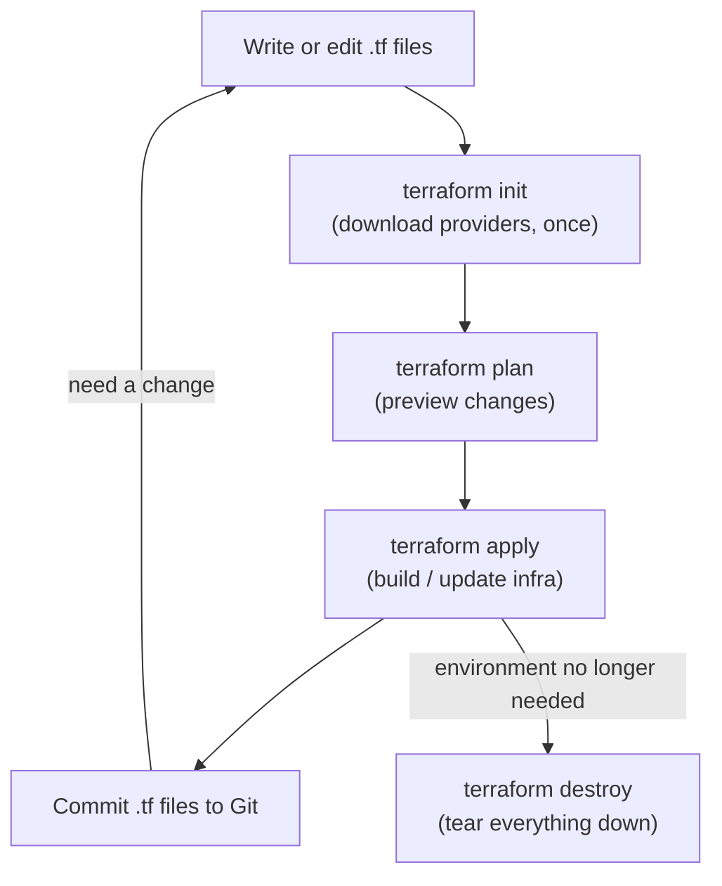

# Infrastructure as Code (IaC): Managing Your Infrastructure Like Software

## Learning Objectives
- Understand the problems of configuring infrastructure by hand (configuration drift, environments you can't reliably reproduce) and the benefits IaC delivers.
- Learn the two core ideas that make IaC powerful: the **declarative** approach and **idempotency**.
- See how infrastructure is actually defined as code through a simple Terraform example, and walk through the basic workflow (`init` → `plan` → `apply`).

## Body

### Why "click-and-configure" eventually breaks down

Imagine you've just started a new project. You need a place for your application to run, so you log in to a cloud console (AWS, Azure, Google Cloud, whatever your team uses) and start clicking. You create a private network, spin up a few servers, install the software each server needs, open the right firewall ports, and create a user with the right permissions. After an hour of clicking, everything works. Great.

Now the trouble starts.

A week later your manager asks for a **test environment** that mirrors production exactly. So you sit down to repeat all of those clicks. But did you write down every single setting? Was that one server `t3.medium` or `t3.large`? Which port did you open — was it `8080` or `8443`? You followed your own notes, but the new environment behaves *slightly* differently, and now a bug appears in test that never appeared in development. You've just discovered the two classic pains of manual infrastructure:

- **Not reproducible** — you can't recreate the exact same setup reliably, because the "source of truth" lives in your memory and a half-complete document.
- **Configuration drift** — over time, someone logs into a server, tweaks a setting "just for now" to fix an urgent issue, and forgets to update the documentation. The real environment slowly *drifts* away from what anyone thinks it is. Multiply this across dozens of servers and several environments, and nobody truly knows what's running anymore.

> Configuration drift is the silent killer of infrastructure reliability. The moment your running systems no longer match your written-down intent, every deployment becomes a gamble.

**Infrastructure as Code (IaC)** is the answer to both problems. The core idea is simple but transformative: instead of clicking through a console, you *write down your infrastructure in a text file* — and that file becomes the single, authoritative source of truth. A tool then reads the file and makes the real infrastructure match it.

### What IaC gives you

Once your infrastructure lives in code, you get to treat it with all the same discipline you already apply to application code:

- **Versioning** — store the files in Git. Every change is tracked, reviewed, and reversible. Want to know who changed the firewall rule and why? Check the commit history.
- **Reproducibility** — need an identical test or staging environment? Run the same code again. No more "I think I configured it this way."
- **Speed and automation** — spinning up a whole environment becomes one command instead of an afternoon of clicking.
- **Visibility** — anyone on the team can read the file and understand exactly what the infrastructure looks like.

This is what makes IaC a foundation of DevOps. A team can have a beautiful automated pipeline for their code, but if every new server requires opening a ticket and waiting two days for someone to provision it by hand, the whole flow stalls. IaC removes that bottleneck.

### The key concept #1: Declarative, not imperative

There are two fundamentally different ways to automate infrastructure, and understanding the difference is the heart of this lecture.

An **imperative** approach describes *how* to reach a result, step by step. It's like giving turn-by-turn driving directions: "create one Kubernetes cluster, then create a VM, then create the network, then connect them." You typically write this as a shell script calling a command-line tool. Imperative scripts are powerful and explicit, but they have a nasty weakness: they describe *actions*, not the *end state*. If you run the script a second time, it may try to create everything all over again — giving you a duplicate environment. And if a step fails halfway, you're left in a broken in-between state with no clean way to recover.

A **declarative** approach describes *what* you want the final result to be, and lets the tool figure out how to get there. Instead of "create a server," you say "I want exactly three servers with this configuration to exist." It's like telling a taxi driver your destination instead of every turn — you state the goal and trust the driver to handle the route.

Terraform, the tool we'll use in our example, is declarative. This matters most when you *change* things. Suppose you currently have five servers and you want seven. With an imperative script you'd have to write "add two more servers." With a declarative tool, you simply edit your file to say "I want seven servers" and re-run it. The tool compares your desired state to what currently exists, sees the difference (a *diff*), and creates exactly the two missing servers — nothing more. Your configuration file always reflects the *complete* current intent, so you can understand your entire infrastructure just by reading it.

### The key concept #2: Idempotency

This brings us to the second crucial idea: **idempotency**. An operation is idempotent if running it once or running it ten times produces the same end result.

This is exactly how a declarative IaC tool behaves. Run your configuration the first time and it builds your environment. Run the *same* configuration again five minutes later, and the tool checks reality, sees that everything already matches, and does *nothing*. No duplicate servers, no errors. You can safely re-run it anytime — for example, on a schedule — to confirm that nothing has drifted away from your defined state, and to automatically correct it if something has.

> Idempotency is what lets you re-run your infrastructure code with confidence. "Apply" is always safe: the tool only changes what needs changing to reach the desired state, and skips what's already correct.

Contrast this with the imperative script: running it twice gives you two environments. That's *not* idempotent, and it's precisely why hand-rolled scripts don't scale.

### How Terraform works under the hood

Terraform has two simple inputs it constantly reconciles:

1. **Your configuration files** — the desired end state, written by you.
2. **The state file** — Terraform's record of what it currently believes exists in the real world.

When you run Terraform, its core engine queries the real provider (say, AWS) to refresh its knowledge, compares the current reality against your desired configuration, and builds an **execution plan**: a precise list of what must be created, changed, or destroyed, and in what order (because some resources depend on others). It then talks to the actual platform through a **provider** — a plugin that knows how to speak to a specific service. There are providers for AWS, Azure, Google Cloud, Kubernetes, and hundreds more, each exposing that platform's resources to your code. The diagram below shows how Terraform reconciles these inputs to drive the real infrastructure.



### A first look at Terraform code

Terraform configuration is written in a language called **HCL** (HashiCorp Configuration Language). It's designed to be readable. Here's a small, complete example that creates a virtual network and a server on AWS:

```hcl
# Tell Terraform which provider (cloud platform) we're targeting
provider "aws" {
  region = "us-east-1"
}

# Declare a private network (VPC)
resource "aws_vpc" "main" {
  cidr_block = "10.0.0.0/16"

  tags = {
    Name = "my-app-network"
  }
}

# Declare a virtual server inside that network
resource "aws_instance" "app_server" {
  ami           = "ami-0abcdef1234567890"  # the OS image to boot
  instance_type = "t3.micro"               # the server size

  tags = {
    Name = "my-app-server"
  }
}
```

Notice the shape of every block: `resource "<type>" "<your_name>"` followed by a set of attributes. You're not writing steps — you're *declaring* that a VPC and a server should exist, with these properties. That's the declarative style in action. If you later change `instance_type` to `t3.small` and re-apply, Terraform will figure out how to update that one server to match, leaving everything else untouched.

### The basic workflow

Working with Terraform follows a short, predictable cycle:

1. **`terraform init`** — Run once in a new project. Terraform downloads the providers your code needs (here, the AWS provider).
2. **`terraform plan`** — A dry run. Terraform shows you exactly what it *would* create, change, or destroy, without touching anything. This is your safety preview — always read it before applying.
3. **`terraform apply`** — Executes the plan and makes the real infrastructure match your code. Because it's idempotent, running it again when nothing has changed simply reports "No changes."
4. **`terraform destroy`** — Cleanly tears everything down in the correct order. Handy for temporary environments, like a one-day demo setup you don't want lingering (and billing you) afterward.

The flow is: **write your `.tf` files → `plan` to preview → `apply` to build → commit to Git.** When you need a change, you edit the same files and repeat. The files stay clean and small, and they always tell the full truth about your infrastructure. The everyday command cycle looks like this:



### Where IaC fits with other tools

One quick clarification, since beginners often get confused here. Terraform's strength is **provisioning** — creating the underlying infrastructure (networks, servers, permissions). A different category of tools, called **configuration management** tools (such as Ansible), specializes in *configuring* servers that already exist — installing software, updating packages, deploying applications. Many teams use both: Terraform to build the foundation, then a configuration tool to set up what runs on it. Both fall under the IaC umbrella; they simply focus on different layers.

## Key Takeaways
- Manually configuring infrastructure leads to **non-reproducible environments** and **configuration drift** — the gap between what's running and what you think is running.
- **Infrastructure as Code** stores your infrastructure as text files, making it versioned in Git, reproducible, automated, and visible to the whole team.
- The **declarative** approach means you describe the *desired end state*, and the tool figures out the steps — far easier to maintain than imperative, step-by-step scripts, especially when making changes.
- **Idempotency** means re-running your code is always safe: the tool only applies the difference between current reality and your desired state, so the result is the same no matter how many times you run it.
- Terraform reconciles your **configuration** (desired state) against its **state file** (known reality) to build an execution plan, then uses **providers** to talk to platforms like AWS.
- The everyday workflow is `init` → `plan` → `apply` (and `destroy` to clean up) — write code, preview, build, commit.
