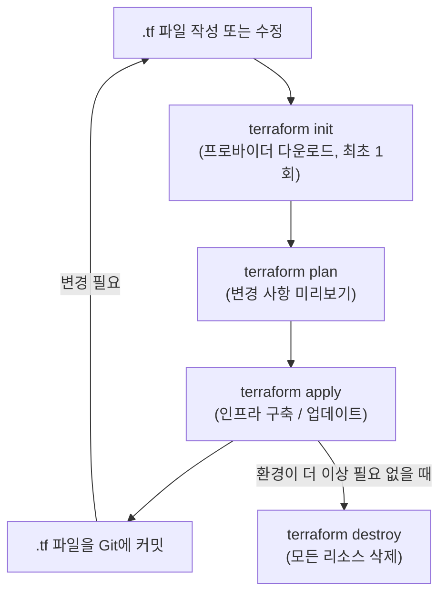

# IaC(Infrastructure as Code): 인프라를 코드로 관리하기

## 학습 목표
- 수동으로 인프라를 구성할 때 생기는 문제(설정 드리프트, 재현 불가 환경)를 이해하고 IaC가 어떻게 이를 해결하는지 파악한다.
- IaC를 강력하게 만드는 두 가지 핵심 개념인 **선언형(declarative)** 접근 방식과 **멱등성(idempotency)**을 익힌다.
- 간단한 Terraform 예제를 통해 인프라를 코드로 정의하는 방법을 살펴보고, 기본 워크플로(`init` → `plan` → `apply`)를 따라가본다.

## 본문

### "클릭으로 설정하기"가 결국 한계에 부딪히는 이유

새 프로젝트를 막 시작했다고 상상해보자. 애플리케이션을 실행할 공간이 필요하니 클라우드 콘솔(AWS, Azure, Google Cloud 등 팀에서 쓰는 것)에 로그인해 클릭을 시작한다. 사설 네트워크를 만들고, 서버 몇 대를 띄우고, 각 서버에 필요한 소프트웨어를 설치하고, 방화벽 포트를 열고, 적절한 권한을 가진 사용자를 만든다. 한 시간쯤 클릭하고 나니 모든 게 잘 돌아간다. 완벽하다.

이제 문제가 시작된다.

일주일 뒤, 팀장이 프로덕션과 완전히 동일한 **테스트 환경**을 만들어달라고 한다. 다시 앉아 모든 과정을 반복해야 한다. 그런데 모든 설정을 정확히 적어뒀는가? 그 서버가 `t3.medium`이었나, `t3.large`였나? 열었던 포트가 `8080`이었나, `8443`이었나? 메모를 따라가기는 했지만 새 환경은 기존과 *미묘하게* 다르게 동작하고, 테스트에서만 나타나는 버그가 생겼다. 수동 인프라 관리의 두 가지 고질적인 고통을 이제 몸소 느끼게 된다.

- **재현 불가** — "진실의 원천(source of truth)"이 기억과 절반쯤 완성된 문서에만 있으니 동일한 환경을 안정적으로 다시 만들 수 없다.
- **설정 드리프트(configuration drift)** — 시간이 지나면서 누군가가 서버에 접속해 긴급한 문제를 해결하려고 "잠깐만요"라며 설정을 바꾸고 문서 업데이트는 잊는다. 실제 환경은 기록된 내용에서 서서히 *벗어난다(drift)*. 서버가 수십 대, 환경이 여러 개가 되면 실제로 무엇이 돌아가고 있는지 아무도 정확히 알 수 없게 된다.

> 설정 드리프트는 인프라 안정성을 조용히 갉아먹는 존재다. 실제로 돌아가는 시스템이 문서에 적힌 의도와 달라지는 순간, 모든 배포는 도박이 된다.

**Infrastructure as Code(IaC)**는 이 두 문제에 대한 답이다. 핵심 아이디어는 단순하면서도 혁신적이다. 콘솔을 클릭하는 대신 *인프라를 텍스트 파일에 기록*하고, 그 파일을 유일한 진실의 원천으로 삼는다. 그러면 도구가 파일을 읽어 실제 인프라를 파일과 일치시킨다.

### IaC가 가져다주는 것

인프라가 코드 안에 존재하면, 애플리케이션 코드에 이미 적용하던 모든 규율을 인프라에도 똑같이 적용할 수 있다.

- **버전 관리** — 파일을 Git에 저장한다. 모든 변경이 추적되고, 검토되며, 되돌릴 수 있다. 방화벽 규칙을 누가, 왜 바꿨는지 알고 싶다면 커밋 히스토리를 확인하면 된다.
- **재현성** — 동일한 테스트 환경이나 스테이징 환경이 필요하다면? 같은 코드를 다시 실행하면 된다. "이렇게 설정한 것 같은데"라는 말이 필요 없다.
- **속도와 자동화** — 전체 환경을 띄우는 일이 명령어 한 줄이 된다. 오후 내내 클릭하지 않아도 된다.
- **가시성** — 팀 누구라도 파일을 읽으면 인프라가 어떻게 구성되어 있는지 정확히 알 수 있다.

IaC가 DevOps의 기반이 되는 이유가 여기 있다. 코드 배포 파이프라인이 아무리 잘 자동화되어 있어도, 새 서버가 필요할 때마다 티켓을 올리고 누군가가 수동으로 프로비저닝할 때까지 이틀을 기다려야 한다면 흐름 전체가 막혀버린다. IaC는 그 병목을 제거한다.

### 핵심 개념 1: 명령형이 아닌 선언형

인프라 자동화에는 근본적으로 다른 두 가지 방식이 있다. 이 차이를 이해하는 것이 이번 강의의 핵심이다.

**명령형(imperative)** 방식은 결과에 도달하는 *방법*을 단계별로 기술한다. 마치 운전 경로를 한 턴씩 안내하는 것처럼: "쿠버네티스 클러스터를 생성하고, 그다음 VM을 만들고, 네트워크를 만들고, 이것들을 연결하라." 주로 셸 스크립트로 명령줄 도구를 호출하는 방식이다. 명령형 스크립트는 강력하고 명시적이지만 치명적인 약점이 있다. *동작*을 기술하는 것이지, *최종 상태*를 기술하는 게 아니다. 스크립트를 두 번 실행하면 모든 것을 다시 만들려 할 수도 있고, 중간에 실패하면 어중간하게 망가진 상태로 남는다.

**선언형(declarative)** 방식은 원하는 최종 결과가 *무엇인지*를 기술하고, 도구가 어떻게 그 결과에 도달할지 알아서 판단하게 한다. "서버를 만들어라" 대신 "이 설정을 가진 서버가 정확히 세 대 존재해야 한다"고 말하는 것이다. 운전 경로를 일일이 알려주는 것이 아니라 택시 기사에게 목적지만 말하는 것과 같다. 목표를 선언하고 경로는 기사에게 맡긴다.

예제에서 사용할 Terraform은 선언형 도구다. 이 점이 특히 중요한 건 무언가를 *변경*할 때다. 서버가 다섯 대 있는데 일곱 대가 필요하다고 가정해보자. 명령형 스크립트라면 "서버 두 대를 추가하라"는 코드를 새로 써야 한다. 선언형 도구라면 파일에서 "서버가 일곱 대 있어야 한다"로 수정하고 다시 실행하기만 하면 된다. 도구는 현재 상태와 원하는 상태를 비교(*diff*)해 없는 서버 두 대만 정확히 만들고 그 이상은 건드리지 않는다. 설정 파일은 항상 *현재의 완전한 의도*를 반영하므로 파일만 읽어도 전체 인프라를 파악할 수 있다.

### 핵심 개념 2: 멱등성

이제 두 번째 핵심 개념인 **멱등성(idempotency)**으로 넘어가자. 어떤 작업이 멱등하다는 것은, 한 번 실행하든 열 번 실행하든 최종 결과가 같다는 뜻이다.

선언형 IaC 도구가 정확히 이렇게 동작한다. 설정을 처음 실행하면 환경이 구성된다. 같은 설정을 5분 뒤 다시 실행하면 도구가 현실을 확인한 뒤 이미 모든 것이 일치한다는 사실을 알아채고 *아무것도 하지 않는다.* 중복 서버도, 오류도 없다. 예를 들어 주기적으로 실행해 설정에서 드리프트가 생기지 않았는지 확인하고, 생겼다면 자동으로 교정하는 용도로도 안심하고 쓸 수 있다.

> 멱등성 덕분에 인프라 코드를 자신 있게 반복 실행할 수 있다. "apply"는 언제나 안전하다. 도구는 원하는 상태에 도달하기 위해 바뀌어야 하는 것만 변경하고, 이미 올바른 것은 그냥 놔둔다.

명령형 스크립트와 비교해보자. 스크립트를 두 번 실행하면 환경이 두 개 생긴다. 멱등하지 *않으며*, 수동으로 작성한 스크립트가 규모에 맞게 확장되지 않는 정확한 이유다.

### Terraform의 내부 동작

Terraform은 두 가지 입력을 끊임없이 비교하며 동작한다.

1. **설정 파일** — 직접 작성하는, 원하는 최종 상태.
2. **상태 파일(state file)** — Terraform이 실제 세계에서 현재 어떤 것이 존재하는지 기록해둔 파일.

Terraform을 실행하면 핵심 엔진이 실제 프로바이더(예: AWS)에 쿼리를 보내 최신 정보를 가져오고, 현재 상태와 원하는 설정을 비교해 **실행 계획(execution plan)**을 만든다. 실행 계획이란 무엇을 생성·변경·삭제해야 하는지, 어떤 순서로 해야 하는지(리소스 간 의존 관계가 있으므로)를 정밀하게 나열한 목록이다. 이후 실제 플랫폼과는 **프로바이더(provider)** — 특정 서비스와 통신하는 방법을 아는 플러그인 — 를 통해 대화한다. AWS, Azure, Google Cloud, Kubernetes 등 수백 개의 프로바이더가 있으며, 각 플랫폼의 리소스를 코드에서 사용할 수 있게 해준다. 아래 다이어그램은 Terraform이 이 입력들을 어떻게 조합해 실제 인프라를 구동하는지 보여준다.


### Terraform 코드 첫 걸음

Terraform 설정은 **HCL**(HashiCorp Configuration Language)이라는 언어로 작성한다. 읽기 쉽게 설계된 언어다. 아래는 AWS에 가상 네트워크와 서버를 하나씩 만드는 작고 완전한 예제다.

```hcl
# 어떤 프로바이더(클라우드 플랫폼)를 쓸지 지정
provider "aws" {
  region = "us-east-1"
}

# 사설 네트워크(VPC) 선언
resource "aws_vpc" "main" {
  cidr_block = "10.0.0.0/16"

  tags = {
    Name = "my-app-network"
  }
}

# 해당 네트워크 안의 가상 서버 선언
resource "aws_instance" "app_server" {
  ami           = "ami-0abcdef1234567890"  # 부팅할 OS 이미지
  instance_type = "t3.micro"               # 서버 크기

  tags = {
    Name = "my-app-server"
  }
}
```

모든 블록의 모양에 주목하자. `resource "<타입>" "<이름>"` 뒤에 속성들이 따라온다. 단계를 나열하는 게 아니라 VPC와 서버가 이런 속성으로 *존재해야 한다*고 선언하는 것이다. 선언형 방식이 실제로 어떻게 생겼는지 보여주는 예시다. 나중에 `instance_type`을 `t3.small`로 바꿔 다시 적용하면 Terraform이 그 서버 하나만 업데이트하고 나머지는 그대로 놔둔다.

### 기본 워크플로

Terraform은 짧고 예측 가능한 사이클로 진행된다.

1. **`terraform init`** — 새 프로젝트에서 처음 한 번 실행한다. 코드에서 필요한 프로바이더(여기서는 AWS 프로바이더)를 다운로드한다.
2. **`terraform plan`** — 드라이런(dry run)이다. 실제로 아무것도 건드리지 않고 무엇을 생성·변경·삭제할지 정확히 보여준다. apply 전에 반드시 확인하는 안전 미리보기다.
3. **`terraform apply`** — 계획을 실행해 실제 인프라를 코드와 일치시킨다. 멱등하기 때문에 아무것도 바뀌지 않은 상태에서 다시 실행하면 "변경 사항 없음"만 출력한다.
4. **`terraform destroy`** — 모든 것을 올바른 순서로 깔끔하게 제거한다. 며칠 뒤 없어져야 할 임시 환경(하루짜리 데모 등)을 정리할 때 유용하다.

흐름은 이렇다. **`.tf` 파일 작성 → `plan`으로 미리보기 → `apply`로 구축 → Git에 커밋.** 변경이 필요하면 같은 파일을 수정하고 반복한다. 파일은 항상 작고 깔끔하며, 인프라의 실제 상태를 정직하게 담는다. 일상적인 명령어 흐름은 다음과 같다.



### IaC와 다른 도구의 관계

입문자가 자주 혼동하는 부분이라 짚고 넘어가겠다. Terraform의 강점은 **프로비저닝** — 네트워크, 서버, 권한 같은 기반 인프라를 생성하는 것이다. **설정 관리(configuration management)** 도구(Ansible 등)는 다른 영역을 담당한다. 이미 존재하는 서버에 소프트웨어를 설치하거나, 패키지를 업데이트하거나, 애플리케이션을 배포하는 데 특화되어 있다. 많은 팀이 두 가지를 함께 쓴다. Terraform으로 기반을 만들고, 설정 관리 도구로 그 위에서 돌아갈 것을 셋업하는 식이다. 둘 다 IaC의 범주에 속하지만, 초점을 두는 레이어가 다를 뿐이다.

## 핵심 요약
- 인프라를 수동으로 구성하면 **재현 불가능한 환경**과 **설정 드리프트** — 실제로 돌아가는 것과 돌아간다고 생각하는 것의 간극 — 가 생긴다.
- **IaC(Infrastructure as Code)**는 인프라를 텍스트 파일로 저장해 Git으로 버전 관리하고, 재현 가능하며, 자동화되고, 팀 전체에 가시적으로 만든다.
- **선언형** 방식은 *원하는 최종 상태*를 기술하고 도구가 방법을 알아서 찾게 한다. 특히 변경할 때 명령형의 단계별 스크립트보다 유지 관리가 훨씬 쉽다.
- **멱등성**은 코드를 다시 실행해도 항상 안전하다는 뜻이다. 도구는 현재 상태와 원하는 상태의 차이만 적용하므로, 몇 번을 실행해도 결과가 같다.
- Terraform은 **설정 파일**(원하는 상태)과 **상태 파일**(알려진 현실)을 비교해 실행 계획을 만들고, **프로바이더**를 통해 AWS 같은 플랫폼과 통신한다.
- 일상적인 워크플로는 `init` → `plan` → `apply`(정리할 때는 `destroy`)다. 코드를 쓰고, 미리보고, 구축하고, 커밋한다.
