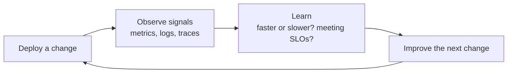

# Introduction to Monitoring and Observability - Seeing Your Operations

## Learning Objectives
- Understand the difference between monitoring and observability, and why both matter.
- Explain the three pillars of observability: metrics, logs, and traces.
- See how measuring and visualizing operational signals connects to the "Measurement" principle of DevOps (CALMS).

## Body

### Why we need to "see" production at all

Imagine you ship a new version of your app on a Friday afternoon. Everything looked fine in your tests, so you head home. Over the weekend, checkout requests quietly start failing for a fraction of your users. Nobody on your team notices, because nobody is looking. By Monday, you have angry customers, lost revenue, and a long debugging session ahead of you.

This is the problem that monitoring and observability solve. Once your software is running in production, you can no longer assume it is healthy just because the deployment succeeded. You need a way to **see what is actually happening inside a system you cannot touch directly**. A useful real-world reminder: a single bad software update has been enough to disrupt hospitals, banks, and airports worldwide. Many incidents like that are caught much earlier when teams have solid monitoring and alerting in place.

> If you cannot see your system, you are flying blind. The goal of this lecture is to stop being a firefighter who reacts after users complain, and start being an operator who spots trouble *before* it spreads.

### Monitoring: watching for the things you already expect

Let's start with the older, more familiar idea: **monitoring**.

> **Monitoring** is the practice of continuously watching and measuring a system against expectations you have defined in advance — and alerting you when something crosses a threshold.

In the early days, monitoring meant pointing a tool at a single server. You would install an agent (a small program that collects data) or simply log into the machine, look at CPU and memory, compare those numbers against a threshold like "alert me if CPU goes above 90%," and get notified if the threshold was crossed. Tools like Nagios were built for exactly this world: a known set of servers, each watched for a known set of problems.

The key word is *known*. Monitoring answers **questions you prepared for in advance**. "Is the server up?" "Is the disk full?" "Is response time over one second?" You decide which questions matter, you wire up the checks, and the system tells you the answers. That works beautifully when you have a handful of long-lived servers and you already understand how they can fail.

### Why monitoring alone breaks down in modern systems

Now picture a modern application instead of a single server. The structure is something like this: a frontend (say, a Node.js service) talks to a couple of backend services (perhaps one in Java, one in Python); the Java service talks to a database; and the Python service calls the Java service for data. All of this runs as containers inside a cluster like Kubernetes, where instances are constantly being created and destroyed as load changes. The diagram below shows how a single user request can fan out across several services.

```mermaid A user request fanning out across services in a distributed system
flowchart LR
    U["User"] --> FE["Frontend (Node.js)"]
    FE --> JS["Backend Service (Java)"]
    FE --> PS["Backend Service (Python)"]
    PS --> JS
    JS --> DB[("Database")]
```

This kind of distributed, cloud-native setup introduces problems that the old approach was never designed for:

- **Many runtimes, many data sources.** Each service may produce data in a different way and in a different place. There is no single machine to log into anymore.
- **Scattered logs.** Each service writes its logs somewhere different, so you have to find a way to pull them all together.
- **Requests that span services.** When a user hits an error, that single request may have passed through three or four services. Figuring out *where* it actually broke is now a detective job.
- **Constant change.** Containers come and go. A tool that expects a fixed list of servers simply cannot keep up.

There is a famous line in distributed systems: a distributed system is one where the failure of a computer you didn't even know existed can make your own work unusable. As systems become more diverse, things you didn't even know were there can take down your service. Pre-defined checks are not enough, because you cannot pre-define a question for a failure mode you never imagined.

### Observability: being able to ask new questions

This is where **observability** comes in.

> **Observability** is a measure of how well you can understand the internal state of a system just from the data it emits — to the point where you can answer *new* questions you never thought to ask in advance.

Here is the difference in one sentence: **monitoring answers the questions you prepared for; observability lets you ask questions you didn't prepare for and still find the answer.** Monitoring tells you *that* something is wrong. Observability helps you explore *why* it is wrong, even when the cause is something brand new.

A practical way to think about an observability practice is three steps:

1. **Collect** — gather data from across the whole system. In a Kubernetes cluster, for example, you automatically get some CPU and memory data, plus application logs and signals like latency and availability, ideally flowing into one place.
2. **Monitor / visualize** — turn that raw data into dashboards so you can see the health of each service and each business goal at a glance.
3. **Analyze and act** — when a dashboard shows something off, dive deeper, trace the problem back to its source, fix it, and repeat.

Notice that monitoring is not the *opposite* of observability — it is a part of it. Observability is the broader capability; monitoring (and its dashboards and alerts) is one of the things you do once your system is observable.

### The three pillars of observability

Observability rests on three kinds of data, often called the **three pillars**: metrics, logs, and traces. Each answers a different kind of question, and you usually need all three together to fully understand a problem.

**1. Metrics — the numbers over time.**
A metric is a numeric measurement tracked over time: how full is the disk, how much CPU is in use, how many requests per second, how many errors. Metrics are cheap to store and easy to graph, which makes them perfect for dashboards and alerts. A widely used starting point is Google's "four golden signals":
- **Latency** — how long it takes to serve a request.
- **Traffic** — how much demand there is (for example, requests per second).
- **Errors** — the rate of failing or incorrect responses.
- **Saturation** — how "full" the service is, which tells you how close you are to running out of capacity.
Metrics are great for telling you *that* something changed, but a single number rarely tells you *why*.

**2. Logs — the detailed record of events.**
A log is an immutable, timestamped record of discrete events: "this user logged in," "this process started," "this request failed with this error." Logs are the oldest of the three pillars and the richest in detail. You will encounter different kinds — system logs, application logs, and security logs (for spotting unauthorized access), among others. When a metric tells you errors are spiking, logs are usually where you go to read the actual error messages and understand what happened.

**3. Traces — the journey of a single request.**
A trace follows one request as it travels through a distributed system, recording each step and how long it took. If a user's checkout request passes through the frontend, then a backend service, then the database, a trace stitches those steps together end to end. This is what lets you answer "which service was the slow one?" or "where exactly did this request break?" — questions that are nearly impossible to answer from metrics or logs alone in a microservices world.

> Think of it this way: **metrics tell you something is wrong, traces tell you where it is wrong, and logs tell you why.** Used together, they take you from "checkout is slow" to "the payment service is making thousands of tiny database calls because of yesterday's deploy."

The diagram below maps each pillar to the question it answers and how they combine.

```mermaid The three pillars of observability and the question each one answers
flowchart TB
    OBS["Observability"] --> M["Metrics<br/>numbers over time"]
    OBS --> T["Traces<br/>a request's journey"]
    OBS --> L["Logs<br/>timestamped events"]
    M --> QM["Answers: WHAT is wrong"]
    T --> QT["Answers: WHERE is it wrong"]
    L --> QL["Answers: WHY is it wrong"]
    QM --> RC["Together: symptom to root cause"]
    QT --> RC
    QL --> RC
```

In practice, mature teams prefer to bring these three pillars into a **single, centralized platform** rather than juggling separate tools. The reason is simple: when CPU is unexpectedly high (a metric), you want to jump straight into the related logs and traces to find the root cause, without switching tools and losing context.

### Alerting: turning signals into action

Collecting data is only useful if it leads to action at the right moment. **Alerting** is how your observability setup notifies you when something needs attention — for example, when fewer than the expected number of load balancers are running, or when more than half of your test transactions are taking too long.

Good alerting is disciplined, not noisy. A common practice (popularized by Google's Site Reliability Engineering teams) is to tier alerts by urgency: truly critical, "wake someone up" alerts go to an on-call person; less urgent alerts go to a ticket queue to be handled during normal hours; and everything else is simply kept as informational data shown on dashboards. The aim is to avoid false alarms so that when an alert does fire, your team trusts it and acts.

### From raw signals to business goals: SLIs and SLOs

There is one more shift worth understanding. Older tools focused heavily on low-level resource numbers like CPU and memory. In a Kubernetes world, much of that is handled by the platform itself, which frees teams to focus on what actually matters to the business. That is where **SLIs and SLOs** come in:

- An **SLI (Service Level Indicator)** is a measured signal of how well a service is doing — for example, the percentage of requests served in under 200 milliseconds.
- An **SLO (Service Level Objective)** is the target you set for that indicator — for example, "99.9% of requests should be served in under 200 milliseconds."

These let you express health in terms a business cares about — "is the app fast?", "is it up?" — rather than raw machine counters.

### How this connects to DevOps and the "Measurement" principle

Back in the lecture on DevOps culture, we introduced **CALMS**: Culture, Automation, Lean, **Measurement**, and Sharing. Everything in this lecture is the "Measurement" pillar made concrete.

DevOps is built on a tight feedback loop: you build, you ship, you observe the result, and you use what you learn to improve the next change. Observability is the part of that loop that gives you eyes on production. Without it, "measurement" is just a slogan. With metrics, logs, and traces flowing into dashboards and alerts, you can answer the questions that drive continuous improvement: Did this release make things faster or slower? Are we meeting our SLOs? Where do requests slow down? The measurement loop runs as shown below: deploy a change, observe the signals, learn from what they show, and feed that learning into the next change.



This also closes the loop with everything we have learned in this course. Version control and CI/CD let you ship changes quickly and safely; observability tells you whether those changes actually behaved well once real users hit them. Fast delivery without good observability is just shipping problems faster.

## Key Takeaways
- **Monitoring** watches a system against checks you defined in advance and alerts on known problems; it answers questions you already prepared for.
- **Observability** is the broader ability to understand a system's internal state from its outputs well enough to answer *new* questions — essential in distributed, constantly changing cloud-native systems.
- The **three pillars** are metrics (numbers over time — *that* something is wrong), logs (detailed timestamped events — *why*), and traces (a request's journey across services — *where*). Together they take you from symptom to root cause.
- Good **alerting** is tiered and low-noise, so an alert that fires is one your team trusts and acts on; **SLIs/SLOs** express health in business terms.
- Observability is the concrete form of the **Measurement** pillar in CALMS — it provides the production feedback that makes the whole DevOps loop of build, ship, observe, and improve actually work.
