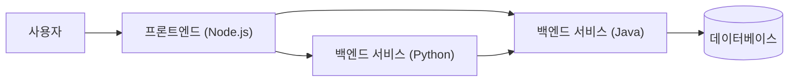
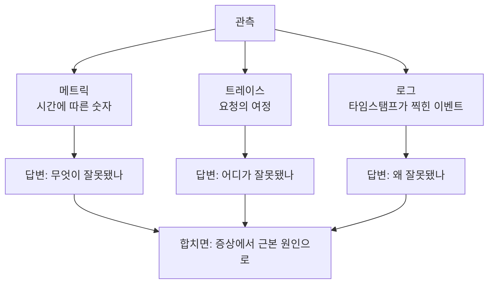
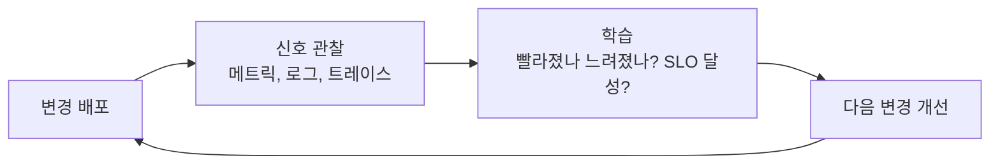

# 모니터링과 관측 - 운영 환경을 들여다보기

## 학습 목표
- 모니터링과 관측의 차이를 이해하고, 왜 둘 다 필요한지 설명할 수 있다.
- 관측의 세 기둥인 메트릭, 로그, 트레이스를 설명할 수 있다.
- 운영 신호를 측정하고 시각화하는 것이 DevOps의 'Measurement(측정)' 원칙(CALMS)과 어떻게 연결되는지 이해한다.

## 본문

### 프로덕션 환경을 왜 "들여다봐야" 하는가

금요일 오후에 새 버전을 배포했다고 상상해보자. 테스트에서는 모두 정상이었으니 퇴근한다. 주말 동안, 일부 사용자의 결제 요청이 조용히 실패하기 시작한다. 팀원 누구도 눈치채지 못한다. 들여다보는 사람이 없기 때문이다. 월요일 아침에 출근하면 화난 고객, 손실된 매출, 긴 디버깅 세션이 기다리고 있다.

바로 이 문제를 모니터링과 관측이 해결한다. 소프트웨어를 프로덕션에 배포했다고 해서 그게 정상 동작하고 있다고 가정할 수 없다. **직접 손댈 수 없는 시스템 안에서 실제로 무슨 일이 일어나고 있는지 파악할 수단**이 필요하다. 현실을 보여주는 사례도 있다. 소프트웨어 업데이트 하나로 전 세계 병원, 은행, 공항이 마비된 적도 있다. 탄탄한 모니터링과 알림 체계를 갖춘 팀은 그런 사고를 훨씬 일찍 발견한다.

> 시스템을 볼 수 없으면 계기판 없이 비행하는 것과 같다. 이 강의의 목표는 사용자가 불평하고 나서야 뛰어드는 소방수가 아니라, 문제가 퍼지기 *전에* 미리 감지하는 운영자가 되는 것이다.

### 모니터링: 예상했던 이상 징후를 감시한다

먼저 더 오래되고 친숙한 개념인 **모니터링**부터 살펴보자.

> **모니터링**이란 미리 정해 놓은 기준에 맞춰 시스템을 지속적으로 관찰·측정하고, 어떤 값이 임계치를 넘으면 알림을 보내는 활동이다.

초기의 모니터링은 단일 서버 하나를 들여다보는 것이었다. 에이전트(데이터를 수집하는 작은 프로그램)를 설치하거나 직접 서버에 접속해서 CPU와 메모리를 확인하고, "CPU가 90%를 넘으면 알림"처럼 임계치를 설정해두었다. Nagios 같은 도구가 바로 이 세계를 위해 만들어졌다. 관리할 서버 목록이 정해져 있고, 각 서버에서 어떤 문제가 생길지 이미 알고 있는 환경이다.

핵심 키워드는 *미리 안다*는 것이다. 모니터링은 **미리 준비해둔 질문에 대한 답**을 준다. "서버가 살아 있나?" "디스크가 꽉 찼나?" "응답 시간이 1초를 넘었나?" 어떤 질문이 중요한지 직접 결정하고, 그에 맞는 체크를 설정하면, 시스템이 답을 알려준다. 서버 몇 대를 오래 운영하면서 어떻게 장애가 생기는지 이미 파악하고 있다면 이 방식으로 충분하다.

### 현대 시스템에서 모니터링만으로는 부족한 이유

이번엔 단일 서버 대신 현대적인 애플리케이션을 떠올려보자. 프론트엔드(Node.js 서비스)가 백엔드 서비스 두 개(Java 하나, Python 하나)와 통신하고, Java 서비스는 데이터베이스와 연결되며, Python 서비스는 데이터를 가져오기 위해 Java 서비스를 호출한다. 이 모두가 Kubernetes 같은 클러스터 위에서 컨테이너로 돌아가며, 부하에 따라 인스턴스가 수시로 생겼다 사라진다. 아래 다이어그램은 사용자 요청 하나가 여러 서비스에 걸쳐 어떻게 퍼져나가는지 보여준다.

이런 분산·클라우드 네이티브 구조는 기존 방식이 전혀 대비하지 못했던 문제들을 낳는다.

- **런타임이 다양하고 데이터 출처가 제각각이다.** 서비스마다 다른 방식·다른 위치에서 데이터를 생성한다. 접속할 단일 서버가 더 이상 존재하지 않는다.
- **로그가 사방에 흩어져 있다.** 서비스마다 로그를 저장하는 곳이 달라, 한데 모으는 방법을 별도로 마련해야 한다.
- **요청이 여러 서비스를 넘나든다.** 사용자에게 오류가 발생했을 때, 그 요청이 서너 개 서비스를 거쳤다면 *어디서* 실제로 깨졌는지 찾는 게 탐정 일이 된다.
- **환경이 끊임없이 바뀐다.** 컨테이너는 쉴 새 없이 생겼다 사라진다. 고정된 서버 목록을 기대하는 도구는 이를 따라갈 수 없다.

분산 시스템 분야의 유명한 말이 있다. "분산 시스템이란 자기가 존재하는지도 몰랐던 어떤 컴퓨터의 장애가 내 작업을 못 쓰게 만드는 시스템이다." 시스템이 복잡해질수록, 알지도 못했던 무언가가 서비스를 쓰러뜨릴 수 있다. 미리 상상조차 못 했던 장애 유형에 대해서는 미리 질문을 준비할 수 없으니, 사전 정의된 체크만으로는 역부족이다.

### 관측: 새로운 질문을 던질 수 있는 능력

바로 이 지점에서 **관측(Observability)**이 등장한다.

> **관측**이란 시스템이 내보내는 데이터만으로 내부 상태를 얼마나 잘 이해할 수 있는지를 나타내는 척도다. 미처 생각하지 못했던 *새로운 질문*에도 답을 찾을 수 있을 만큼의 수준이어야 한다.

한 문장으로 정리하면 이렇다. **모니터링은 미리 준비한 질문에 답하고, 관측은 미처 준비하지 못한 질문에도 답을 찾게 해준다.** 모니터링은 *뭔가 잘못됐다*는 사실을 알려주고, 관측은 *왜* 잘못됐는지 탐색할 수 있게 해준다. 원인이 전혀 새로운 것일 때도 마찬가지다.

관측을 실천하는 방법은 크게 세 단계로 생각할 수 있다.

1. **수집(Collect)** — 전체 시스템에서 데이터를 모은다. 예를 들어 Kubernetes 클러스터에서는 CPU·메모리 데이터가 자동으로 수집되고, 애플리케이션 로그와 지연 시간·가용성 같은 신호도 이상적으로는 한 곳으로 흘러들어온다.
2. **모니터링 / 시각화(Monitor / Visualize)** — 수집한 원시 데이터를 대시보드로 변환해 각 서비스와 비즈니스 지표의 상태를 한눈에 파악한다.
3. **분석하고 행동(Analyze and Act)** — 대시보드에서 이상 징후를 발견하면 더 깊이 파고들어 원인을 추적하고 수정한 뒤, 다시 반복한다.

모니터링이 관측의 *반대말*이 아니라는 점을 기억하자. 모니터링은 관측의 일부다. 관측은 더 넓은 능력이고, 모니터링(과 그에 딸린 대시보드·알림)은 시스템을 관측 가능하게 만든 뒤에 하는 활동 중 하나다.

### 관측의 세 기둥

관측은 **세 가지 데이터 유형**, 흔히 **세 기둥**이라 부르는 메트릭·로그·트레이스 위에 세워진다. 각각 서로 다른 종류의 질문에 답하며, 문제를 완전히 이해하려면 보통 셋 모두가 필요하다.

**1. 메트릭(Metrics) — 시간에 따른 숫자**
메트릭은 시간 축을 따라 추적하는 수치 측정값이다. 디스크 사용률, CPU 점유율, 초당 요청 수, 오류 횟수 같은 것들이다. 저장 비용이 낮고 그래프로 나타내기 쉬워서 대시보드와 알림에 안성맞춤이다. 출발점으로 많이 쓰이는 구글의 '네 가지 골든 시그널'은 다음과 같다.
- **지연 시간(Latency)** — 요청 하나를 처리하는 데 걸리는 시간.
- **트래픽(Traffic)** — 수요의 크기(예: 초당 요청 수).
- **오류율(Errors)** — 실패하거나 잘못된 응답의 비율.
- **포화도(Saturation)** — 서비스가 얼마나 '꽉 찼는지', 즉 용량 한계에 얼마나 가까워졌는지.
메트릭은 *뭔가 바뀌었다*는 사실을 알려주기엔 탁월하지만, 숫자 하나만으로 *왜* 바뀌었는지까지 알려주진 않는다.

**2. 로그(Logs) — 이벤트의 상세 기록**
로그는 변경 불가능한, 타임스탬프가 찍힌 개별 이벤트 기록이다. "이 사용자가 로그인했다", "이 프로세스가 시작됐다", "이 요청이 이런 오류로 실패했다" 같은 내용이다. 세 기둥 중 가장 오래됐고 가장 풍부한 정보를 담는다. 시스템 로그, 애플리케이션 로그, 보안 로그(무단 접근 탐지용) 등 여러 종류가 있다. 메트릭이 오류가 급증했다고 알려주면, 실제 오류 메시지를 읽고 무슨 일이 일어났는지 파악하기 위해 찾는 곳이 바로 로그다.

**3. 트레이스(Traces) — 요청 하나의 여정**
트레이스는 요청 하나가 분산 시스템을 통과하는 전체 경로를 따라가며, 각 단계와 그 소요 시간을 기록한다. 사용자의 결제 요청이 프론트엔드, 백엔드 서비스, 데이터베이스를 거친다면, 트레이스는 그 단계들을 처음부터 끝까지 하나로 꿰어준다. "어느 서비스가 느렸나?" "요청이 정확히 어디서 깨졌나?" — 마이크로서비스 환경에서 메트릭이나 로그만으로는 거의 답할 수 없는 질문들이 트레이스로 비로소 풀린다.

> 이렇게 생각하면 쉽다. **메트릭은 뭔가 잘못됐다고 알려주고, 트레이스는 어디가 잘못됐는지 알려주며, 로그는 왜 잘못됐는지 알려준다.** 셋을 함께 쓰면 "결제가 느리다"에서 "어제 배포로 결제 서비스가 데이터베이스 쿼리를 수천 번씩 잘게 나눠 호출하고 있다"까지 원인을 추적할 수 있다.

아래 다이어그램은 각 기둥이 어떤 질문에 답하는지, 그리고 셋이 어떻게 결합하는지를 보여준다.

실제로 성숙한 팀은 이 세 기둥을 별개 도구로 따로 관리하지 않고 **단일 중앙화 플랫폼**으로 통합하는 것을 선호한다. 이유는 단순하다. CPU가 갑자기 높아졌다(메트릭)면, 도구를 바꿔가며 컨텍스트를 잃지 않고 관련 로그와 트레이스로 바로 뛰어들어 근본 원인을 찾고 싶기 때문이다.

### 알림: 신호를 행동으로 바꾸는 것

데이터를 수집하는 것 자체는 적절한 순간에 행동으로 이어져야 의미가 있다. **알림(Alerting)**은 관측 체계가 주의가 필요한 상황을 알려주는 수단이다. 예를 들어 로드 밸런서가 기대치보다 적게 실행 중일 때, 또는 테스트 트랜잭션 절반 이상이 너무 오래 걸릴 때 알림이 울린다.

좋은 알림은 시끄럽지 않고 절제되어 있다. 구글 SRE 팀이 대중화한 방식이 있는데, 긴급도에 따라 알림을 계층화하는 것이다. 진짜 위기급 알림만 온콜 담당자를 깨우고, 덜 긴급한 알림은 티켓 큐에 넣어 업무 시간 중에 처리하며, 나머지는 그냥 대시보드의 참고 데이터로만 남긴다. 이렇게 하는 이유는 오탐(false alarm)을 없애서, 알림이 울렸을 때 팀이 그것을 믿고 즉각 행동하게 만들기 위해서다.

### 원시 신호에서 비즈니스 목표로: SLI와 SLO

한 가지 더 알아둘 변화가 있다. 과거 도구들은 CPU나 메모리 같은 저수준 자원 수치에 치중했다. Kubernetes 환경에서는 플랫폼이 그 대부분을 알아서 처리해주므로, 팀은 비즈니스에 실제로 중요한 것에 집중할 수 있게 됐다. 바로 여기서 **SLI와 SLO**가 등장한다.

- **SLI(Service Level Indicator, 서비스 수준 지표)**는 서비스가 얼마나 잘 동작하고 있는지를 측정한 신호다. 예를 들어 200밀리초 이내에 처리된 요청의 비율이 SLI가 된다.
- **SLO(Service Level Objective, 서비스 수준 목표)**는 그 지표에 대해 설정한 목표치다. 예를 들어 "요청의 99.9%는 200밀리초 이내에 처리돼야 한다"가 SLO다.

이를 통해 서비스 상태를 비즈니스가 이해하는 언어로 표현할 수 있다. 원시 서버 수치가 아니라, "앱이 빠른가?", "앱이 살아 있는가?" 같은 질문으로 말이다.

### DevOps와 'Measurement(측정)' 원칙과의 연결

DevOps 문화를 다룬 강의에서 **CALMS**: Culture(문화), Automation(자동화), Lean(린), **Measurement(측정)**, Sharing(공유)을 소개했다. 이 강의에서 다룬 모든 내용이 바로 'Measurement' 기둥을 구체화한 것이다.

DevOps는 촘촘한 피드백 루프 위에 세워진다. 만들고, 배포하고, 결과를 관찰하고, 그로부터 배운 것을 다음 변경에 반영한다. 관측은 그 루프에서 프로덕션을 바라보는 눈 역할을 한다. 관측 없이는 '측정'이 그냥 구호에 머문다. 메트릭·로그·트레이스가 대시보드와 알림으로 흘러들어오면, 지속적인 개선을 이끄는 질문들에 비로소 답할 수 있다. 이번 릴리즈로 속도가 빨라졌나 느려졌나? SLO를 지키고 있나? 어디서 요청이 느려지나? 아래 그림처럼 측정 루프가 돌아간다. 변경을 배포하고, 신호를 관찰하고, 그것으로부터 배우고, 다음 변경에 반영한다.

이것은 이 강좌에서 배운 모든 내용을 하나로 연결하기도 한다. 버전 관리와 CI/CD가 변경을 빠르고 안전하게 배포할 수 있게 해준다면, 관측은 그 변경이 실제 사용자를 만났을 때 제대로 동작했는지 알려준다. 좋은 관측 없이 빠르게 배포하는 것은 그냥 문제를 더 빨리 쏟아내는 일이다.

## 핵심 정리
- **모니터링**은 미리 정의한 기준으로 시스템을 감시하고 알려진 문제에 알림을 보낸다. 이미 준비한 질문에 대한 답을 준다.
- **관측**은 시스템이 내보내는 데이터만으로 내부 상태를 파악해 *새로운 질문*에도 답할 수 있는 더 넓은 능력이다. 끊임없이 변하는 분산 클라우드 네이티브 환경에서 필수적이다.
- **세 기둥**은 메트릭(시간에 따른 숫자 — *뭔가* 잘못됐음), 로그(타임스탬프가 찍힌 상세 이벤트 — *왜*), 트레이스(여러 서비스를 넘나드는 요청의 여정 — *어디서*)다. 셋을 함께 쓰면 증상에서 근본 원인까지 추적할 수 있다.
- 좋은 **알림**은 계층화되어 있고 잡음이 없다. 알림이 울리면 팀이 믿고 즉각 행동할 수 있어야 한다. **SLI/SLO**는 서비스 상태를 비즈니스 언어로 표현한다.
- 관측은 CALMS의 **Measurement(측정)** 기둥을 구체화한 것이다. 프로덕션 피드백을 제공함으로써 DevOps의 만들고·배포하고·관찰하고·개선하는 전체 루프를 실제로 돌아가게 만든다.
