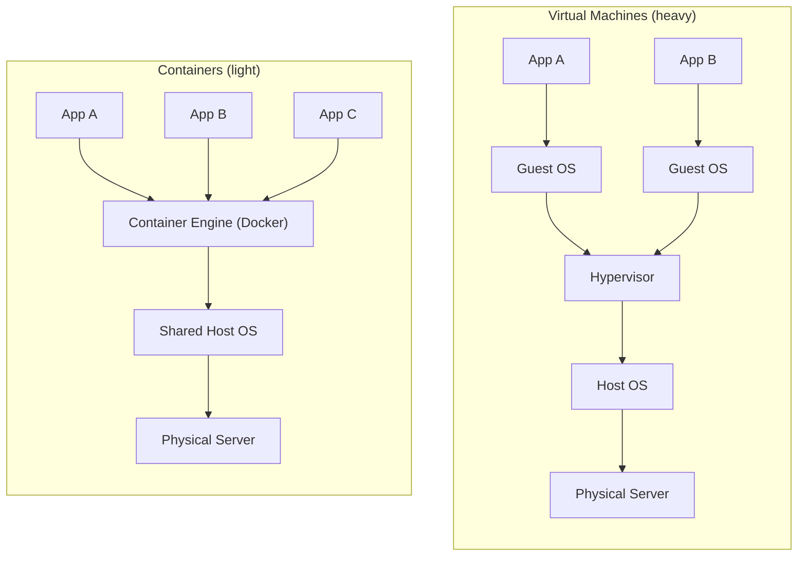
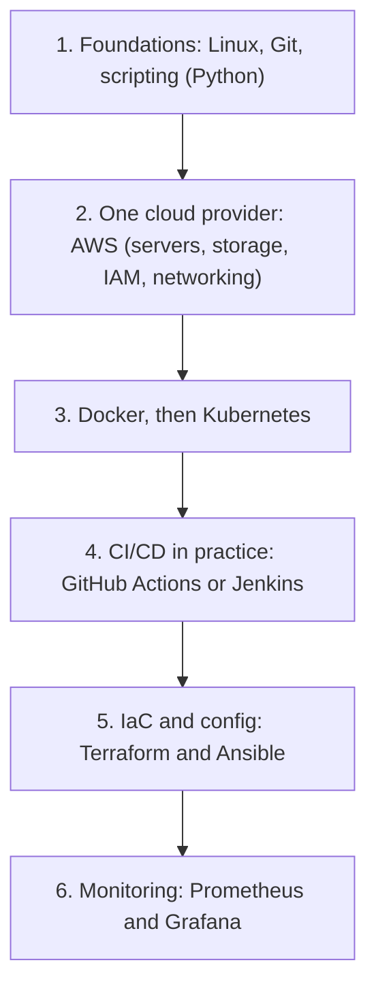

# Containers and the Automation Toolchain: Seeing the DevOps Ecosystem at a Glance

## Learning Objectives
- Understand, at a conceptual level, why containers (Docker) matter so much in DevOps.
- See the big picture of how orchestration, CI/CD, IaC, and monitoring tools each play a role in the pipeline.
- Get a clear sense of direction for what tools and topics to learn next after this introductory course.

## Body

### Why this lecture exists

Over the last seven lectures we built up the *ideas* of DevOps one at a time: the wall between development and operations, the CALMS culture, Git as the foundation of collaboration, continuous integration, continuous delivery, infrastructure as code, and finally monitoring and observability. Each lecture asked a "why" question and answered it with a principle.

This final lecture flips the camera around. Instead of asking "why," we ask **"with what?"** Every principle you have learned is normally put into practice with a specific category of tool, and those tools are designed to *click together* like parts of a machine. By the end of this lecture you should be able to look at the famous, intimidating "DevOps tools landscape" poster and not feel lost — because you will recognize *what job each box is doing*.

> The single most important takeaway of this course: tools are means to an end. When you understand *what problem* a tool solves and *why*, swapping one tool for another (Jenkins for GitHub Actions, Terraform for Pulumi) becomes a detail, not a crisis.

### Start with the thing being shipped: the container

Before we can talk about a pipeline, we have to be clear about *what flows through it*. The modern answer is a **container**.

Here is the problem containers solve, told as a simple story. Imagine you own a building, but the building has no internal walls — you can only rent it to a single tenant at a time. That is wasteful, the same way running just one application on a powerful 64 GB server is wasteful. The old fix was to put up permanent interior walls: this is the **virtual machine (VM)**, where each tenant gets a full, heavy apartment complete with its own plumbing (a full guest operating system). It works, but building and remodeling those walls is slow.

A **container** is the clever upgrade: instead of remodeling, you build a self-contained pod that already has everything the tenant needs, and you simply lift the whole pod into the building. When the tenant leaves, you lift the pod out and discard it. Nothing to remodel. In software terms, a container packages an application together with its libraries, runtime, and system tools into one standardized unit. Because containers *share* the host's operating system kernel instead of carrying a full OS each, they are far lighter and faster to start than VMs.

The key structural difference is shown in the diagram below: a VM stacks a full guest OS under every app, while containers share one host OS through a lightweight engine.



> "It works on my machine" is the oldest excuse in software. Containers retire it: the container *is* the machine, so if it runs on your laptop it runs the same way in production.

**Docker** is the tool that most people use to build and run containers. You write a small recipe file (a `Dockerfile`), Docker turns it into a reusable **image**, and from that image you can launch identical **containers** anywhere. In our building analogy, Docker is the contractor you hire to manufacture and manage the pods — you just say "give me a container running this app," and it handles the messy details.

Containers matter so much in DevOps because they are the **universal unit of delivery**. CI builds them, CD ships them, orchestration runs them, monitoring watches them. They are the common currency that lets every other tool in the chain cooperate.

### When one server is not enough: orchestration

Containers are so easy to create that teams quickly end up with dozens, then hundreds, then thousands of them spread across many servers. Now new questions appear that a single Docker host cannot answer on its own:

- What restarts a container automatically when it crashes at 3 a.m.?
- How do we add more copies of a service when traffic spikes, and remove them when it calms down?
- How do all these containers, scattered across many machines, find and talk to each other?

This is the job of a **container orchestrator**, and the industry standard is **Kubernetes**. Continuing the building story: once you own several buildings each with its own Docker contractor, you can no longer phone each contractor individually all day. So you hire a manager named Kubernetes. You hand the manager a written description of the *state you want* — "keep three copies of this service running" — and Kubernetes makes it happen and *keeps* it true: it schedules containers onto servers, restarts failed ones (self-healing), scales replicas up and down, and stitches everything into one virtual network. This "declare the desired state, let the system converge to it" approach is the same declarative, idempotent mindset you met in Lecture 6 on infrastructure as code.

### The conveyor belt: CI/CD tools

Lectures 4 and 5 taught the *ideas* of continuous integration and continuous delivery. The tool that automates them is a **CI/CD engine**. Its job is to react to a Git push and run an automated pipeline: pull the code, run tests, scan for problems, build a Docker image, and deploy that image to an environment.

The classic, still-everywhere tool is **Jenkins**. Newer, more convenient options include **GitHub Actions** and **GitLab CI/CD**, which live right next to your code repository. Notice the recurring theme: the pipeline is described *as code* (a `Jenkinsfile` or a YAML workflow file) that lives in Git, so the pipeline itself is versioned, reviewed, and reproducible — exactly the discipline DevOps applies to everything.

### Recreating the world from a file: infrastructure as code

Suppose your whole environment — the cloud servers, the Kubernetes cluster, the networking, dozens of supporting services — is wiped out by a misconfiguration or an attack. Rebuilding all of that by hand could take weeks, and you would never reproduce it exactly. This is the nightmare **infrastructure as code (IaC)** prevents.

With IaC you describe your infrastructure in configuration files and let a tool create it for you. Run the script and the entire environment appears; run it again and you get an identical environment. **Terraform** is the most widely used IaC tool for provisioning cloud resources. A close relative is **configuration management** with tools like **Ansible**, which focuses on the *inside* of servers — installing packages, applying security patches, pushing the same change to hundreds of machines from a single script instead of logging into each one.

### Keeping watch: monitoring and observability

Once thousands of containers are running and the orchestrator is automating operations, you cannot personally read every log. You need software that watches for you and *alerts* you when something drifts away from normal — a service under attack, a database overloaded, a bad config quietly breaking the cluster. This is the monitoring and observability layer from Lecture 7, and a popular open-source stack pairs **Prometheus** (collecting and querying metrics, raising alerts) with **Grafana** (turning that data into dashboards you can actually read). This is also where the "Measurement" pillar of CALMS becomes concrete.

### The glue that holds it all together

Two foundational skills sit underneath everything above, which is why this course started where it did:

- **Git** is how all of this code — pipeline definitions, Dockerfiles, Kubernetes manifests, Terraform files — is stored, shared, versioned, and collaborated on. In DevOps, *everything is code in a repository*.
- **Linux and the command line** are unavoidable. Containers are built on Linux, Kubernetes worker nodes run Linux, and even with all the automation in the world you will spend real time at a terminal.

### How the pieces fit into one flow

Putting it together, the typical end-to-end flow looks like this. A developer pushes code to **Git**. A **CI/CD** tool detects the push, runs tests, and builds a **Docker** image. That image is deployed onto a **Kubernetes** cluster, which keeps the right number of containers running across servers. The underlying servers and cluster were themselves created from **Terraform** (IaC) and tuned with **Ansible**. While everything runs, **Prometheus and Grafana** watch the metrics and alert the team if something goes wrong. The real skill of a DevOps engineer is not knowing any one of these tools in isolation — it is wiring them together safely and sensibly. The diagram below shows how each tool category clicks into this single flow.

```mermaid End-to-end DevOps toolchain: how each tool category clicks together
flowchart LR
    Dev["Developer"] -->|push| Git["Git Repository"]
    Git -->|triggers| CICD["CI/CD Engine (Jenkins / GitHub Actions)"]
    CICD -->|test and build| Image["Docker Image"]
    Image -->|deploy| K8s["Kubernetes Cluster"]
    K8s -->|runs| Containers["Running Containers"]

    subgraph Provision["Provisioned by Infrastructure as Code"]
        direction TB
        TF["Terraform (provision)"] --> Servers["Cloud Servers and Cluster"]
        Ansible["Ansible (configure)"] --> Servers
    end
    Servers -.->|host| K8s

    Containers --> Metrics["Metrics and Logs"]
    Metrics --> Prom["Prometheus (collect and alert)"]
    Prom --> Grafana["Grafana (dashboards)"]
    Grafana -.->|alert| Dev
```

### Where to go next: your learning roadmap

You have finished the conceptual map. A sensible order to learn the hands-on tools, building on this course, is:

1. **Solidify the foundations** — get genuinely comfortable with the Linux command line and Git, plus a scripting language (Python is the common choice for automation).
2. **Learn one cloud provider** — pick **AWS** (the most widely used) and learn servers, storage, identity (IAM), and networking. This is where everything else will run.
3. **Containers, then orchestration** — get hands-on with **Docker** (images, Dockerfiles, Docker Compose), then move to **Kubernetes** (pods, services, deployments, scaling).
4. **CI/CD in practice** — build real pipelines with **GitHub Actions** or **Jenkins**.
5. **Infrastructure and configuration as code** — **Terraform** for provisioning, **Ansible** for configuration.
6. **Monitoring and observability** — **Prometheus** and **Grafana**.

This recommended order is summarized in the roadmap below.



Treat this as a direction, not a deadline. Pick the *next* tool that solves a problem you actually have, learn the concept behind it, and the specific commands will follow.

## Key Takeaways
- A **container** is a lightweight, self-contained unit that packages an app with everything it needs to run; **Docker** is the standard tool for building and running containers, and it is the common unit of delivery that ties the whole toolchain together.
- The DevOps toolchain is a set of cooperating roles: **CI/CD** automates build-test-deploy, **orchestration (Kubernetes)** runs containers at scale, **IaC (Terraform/Ansible)** recreates infrastructure from files, and **monitoring (Prometheus/Grafana)** watches it all — with **Git** and **Linux** underneath everything.
- Tools are interchangeable means to an end; understanding the *problem each one solves* matters far more than memorizing any single tool.
- A practical next-step roadmap: Linux + Git + scripting, then one cloud, then Docker and Kubernetes, then CI/CD, then IaC, then monitoring.
