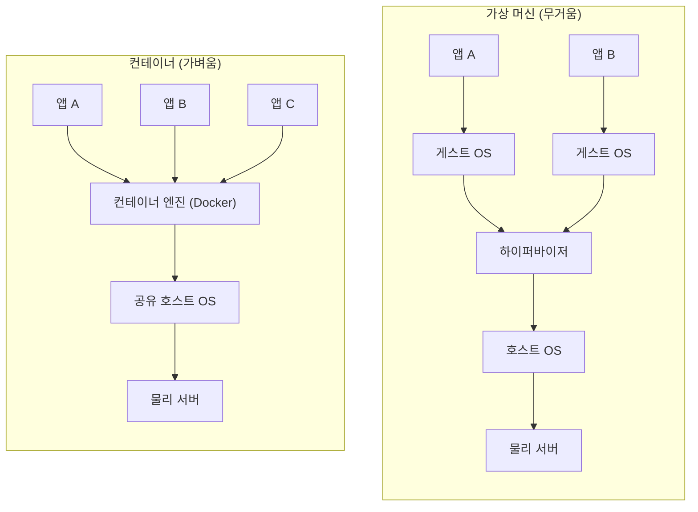
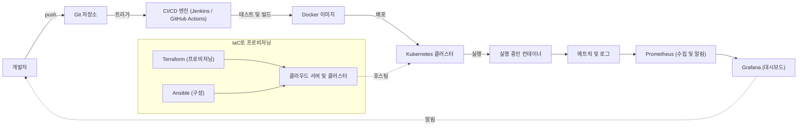
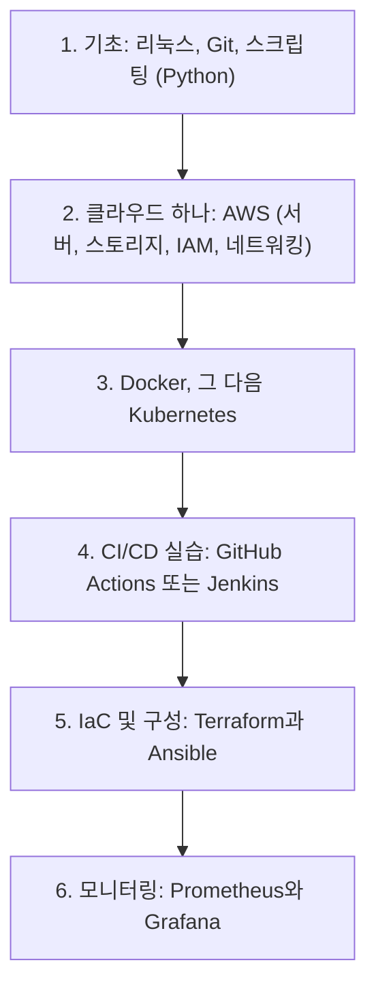

# 컨테이너와 자동화 도구 둘러보기: DevOps 생태계를 한눈에

## 학습 목표
- 컨테이너(Docker)가 DevOps에서 왜 그토록 중요한지 개념 수준에서 이해한다.
- 오케스트레이션, CI/CD, IaC, 모니터링 도구가 파이프라인 안에서 각각 어떤 역할을 하는지 큰 그림을 파악한다.
- 이 입문 강좌를 마친 뒤 무엇을 어떤 순서로 배워야 할지 방향을 잡는다.

## 본문

### 이 강의가 존재하는 이유

지금까지 일곱 개 강의에 걸쳐 DevOps의 *개념*을 하나씩 쌓아왔다. 개발과 운영 사이의 벽, CALMS 문화, 협업의 토대로서의 Git, 지속적 통합, 지속적 배포, 코드로 관리하는 인프라(IaC), 그리고 모니터링과 관측까지. 각 강의는 "왜?"라는 질문을 던지고 원칙으로 답했다.

이 마지막 강의는 카메라를 반대 방향으로 돌린다. "왜?"가 아니라 **"무엇으로?"**를 묻는다. 지금까지 배운 모든 원칙은 실제 현장에서 특정 도구 범주로 실현되며, 그 도구들은 마치 기계 부품처럼 *서로 맞물려* 작동하도록 설계되어 있다. 이 강의를 마치고 나면 그 유명한, 처음 보면 압도당하는 "DevOps 도구 지형도" 포스터 앞에서 당황하지 않을 수 있다. 각 박스가 *어떤 역할*을 하는지 알아볼 수 있기 때문이다.

> 이 강좌에서 가장 중요한 메시지: 도구는 목적을 위한 수단이다. 어떤 도구가 *어떤 문제*를 해결하는지, *왜* 그런지 이해하면, Jenkins를 GitHub Actions으로 바꾸거나 Terraform을 Pulumi로 교체하는 것은 위기가 아니라 그냥 세부 사항이 된다.

### 파이프라인에 흐르는 것: 컨테이너

파이프라인 이야기를 꺼내기 전에, *무엇이 그 안을 흐르는지*부터 짚어야 한다. 현대적인 답은 **컨테이너**다.

컨테이너가 해결하는 문제를 쉬운 비유로 설명해 보자. 칸막이가 전혀 없는 건물을 소유하고 있다고 상상해보자. 그 건물에는 세입자를 한 번에 한 명밖에 들일 수 없다. 64 GB 서버에 애플리케이션 하나만 올리는 것처럼 낭비다. 예전의 해결책은 내부에 영구 벽을 세우는 것이었다. 이것이 **가상 머신(VM)**이다. 각 세입자는 자체 배관(게스트 운영체제 전체)이 딸린 완전한 아파트를 받는다. 효과는 있지만, 그 벽을 짓고 고치는 데 시간이 많이 걸린다.

**컨테이너**는 더 스마트한 업그레이드다. 벽을 새로 짓는 대신, 세입자에게 필요한 것이 이미 다 들어있는 자급자족 모듈을 만들어 건물 안에 그냥 들여놓는다. 세입자가 떠나면 모듈을 꺼내 버리면 된다. 리모델링이 필요 없다. 소프트웨어로 말하면, 컨테이너는 애플리케이션을 그것에 필요한 라이브러리, 런타임, 시스템 도구와 함께 하나의 표준화된 단위로 묶는다. 컨테이너는 각자 운영체제를 통째로 품는 대신 호스트의 OS 커널을 *공유*하기 때문에, VM보다 훨씬 가볍고 시작도 빠르다.

이 구조적 차이를 아래 다이어그램에서 확인할 수 있다. VM은 모든 앱 아래에 게스트 OS를 온전히 쌓는 반면, 컨테이너는 가벼운 엔진 하나를 통해 하나의 호스트 OS를 공유한다.

> "내 컴퓨터에서는 됐는데"라는 말은 소프트웨어 업계에서 가장 오래된 변명이다. 컨테이너가 이 변명을 없애준다. 컨테이너 *자체가* 실행 환경이기 때문에, 내 노트북에서 돌아가면 운영 환경에서도 똑같이 돌아간다.

**Docker**는 컨테이너를 빌드하고 실행하는 데 가장 널리 쓰이는 도구다. 간단한 레시피 파일(`Dockerfile`)을 작성하면 Docker가 이것을 재사용 가능한 **이미지**로 만들고, 그 이미지로 어디서든 동일한 **컨테이너**를 실행할 수 있다. 건물 비유로 돌아가면, Docker는 모듈을 제조하고 관리하는 시공업체다. "이 앱을 실행하는 컨테이너 하나 줘"라고만 하면 나머지 복잡한 일은 알아서 처리한다.

컨테이너가 DevOps에서 이토록 중요한 이유는 그것이 **배포의 공통 단위**이기 때문이다. CI가 빌드하고, CD가 전달하고, 오케스트레이션이 실행하고, 모니터링이 감시하는 대상이 모두 컨테이너다. 도구 체인 전체가 협력할 수 있는 공통 화폐인 셈이다.

### 서버 한 대로는 부족할 때: 오케스트레이션

컨테이너는 너무 쉽게 만들 수 있어서, 팀이 수십 개, 수백 개, 수천 개의 컨테이너를 여러 서버에 걸쳐 운영하는 상황이 금방 온다. 그러면 단일 Docker 호스트로는 답하기 어려운 질문들이 생긴다.

- 새벽 3시에 컨테이너가 죽으면 누가 자동으로 재시작해 주는가?
- 트래픽이 폭증할 때 서비스 복사본을 늘리고, 잠잠해지면 줄이려면 어떻게 하는가?
- 여러 서버에 흩어진 이 모든 컨테이너는 서로 어떻게 찾고 통신하는가?

이것이 **컨테이너 오케스트레이터**의 역할이며, 업계 표준은 **Kubernetes**다. 건물 비유를 계속하면, 각각 Docker 시공업체가 딸린 건물 여러 채를 소유하게 됐을 때 각 업체에 일일이 전화를 걸 수는 없다. 그래서 Kubernetes라는 이름의 총괄 매니저를 고용한다. 매니저에게 *원하는 상태*를 문서로 건네주면 — "이 서비스는 세 개가 항상 돌아야 해" — Kubernetes가 그것을 실현하고 *유지*한다. 컨테이너를 서버에 스케줄링하고, 장애가 난 것은 재시작하고(자가 치유), 복제본 수를 늘리거나 줄이고, 모든 것을 하나의 가상 네트워크로 연결한다. "원하는 상태를 선언하면 시스템이 거기 맞춰간다"는 이 선언적·멱등적 사고방식은 6강 IaC에서 이미 만난 것과 같다.

### 컨베이어 벨트: CI/CD 도구

4강과 5강은 지속적 통합과 지속적 배포의 *개념*을 다뤘다. 그것을 자동화하는 도구가 **CI/CD 엔진**이다. Git push에 반응해 자동화 파이프라인을 실행하는 것이 이 도구의 역할이다. 코드를 가져오고, 테스트를 돌리고, 문제를 스캔하고, Docker 이미지를 빌드하고, 그 이미지를 환경에 배포한다.

고전이자 지금도 널리 쓰이는 도구가 **Jenkins**다. 더 편리한 최신 옵션으로는 코드 저장소 바로 옆에 붙어 있는 **GitHub Actions**와 **GitLab CI/CD**가 있다. 여기서도 반복되는 패턴이 보인다. 파이프라인 자체가 *코드*로 기술된다(`Jenkinsfile`이나 YAML 워크플로 파일). 이 파일은 Git에 보관되므로 파이프라인도 버전 관리되고, 리뷰되고, 재현 가능하다. DevOps가 모든 것에 적용하는 바로 그 방식이다.

### 파일 하나로 세계를 재현하다: Infrastructure as Code(IaC)

팀의 전체 환경 — 클라우드 서버, Kubernetes 클러스터, 네트워크, 수십 개의 지원 서비스 — 이 잘못된 설정이나 공격으로 한순간에 사라진다고 상상해 보자. 모든 것을 수작업으로 복구하려면 몇 주가 걸릴 수 있고, 똑같이 재현하는 것은 사실상 불가능하다. 이것이 **Infrastructure as Code(IaC)**가 막아주는 악몽이다.

IaC에서는 인프라를 설정 파일로 기술하고, 도구가 그것을 실제로 만들어 준다. 스크립트를 실행하면 환경 전체가 나타나고, 다시 실행하면 동일한 환경이 생긴다. **Terraform**은 클라우드 자원을 프로비저닝하는 데 가장 널리 쓰이는 IaC 도구다. 이와 비슷한 개념으로 **Ansible** 같은 도구를 쓰는 **구성 관리(configuration management)**가 있다. 이쪽은 서버 *내부*에 집중한다. 패키지를 설치하고, 보안 패치를 적용하고, 각 서버에 직접 접속하는 대신 스크립트 하나로 수백 대에 같은 변경을 밀어넣는다.

### 지켜보기: 모니터링과 관측

수천 개의 컨테이너가 돌아가고 오케스트레이터가 운영을 자동화하는 상황에서는 모든 로그를 사람이 직접 읽을 수 없다. 대신 소프트웨어가 감시하다가 뭔가 정상에서 벗어나면 *알려주어야* 한다. 공격받는 서비스, 과부하된 데이터베이스, 잘못된 설정이 클러스터를 서서히 망가뜨리는 상황 등. 이것이 7강에서 다룬 모니터링과 관측 계층이다. 인기 있는 오픈소스 조합은 **Prometheus**(메트릭 수집·쿼리·알림)와 **Grafana**(그 데이터를 실제로 읽을 수 있는 대시보드로 변환)를 함께 쓰는 것이다. CALMS의 "측정(Measurement)" 기둥이 여기서 구체적인 모습을 드러낸다.

### 모든 것을 잇는 접착제

위의 모든 것 아래에 두 가지 기초 기술이 자리한다. 이 강좌가 거기서 시작한 이유도 그 때문이다.

- **Git**은 파이프라인 정의, Dockerfile, Kubernetes 매니페스트, Terraform 파일 등 이 모든 코드를 저장하고, 공유하고, 버전 관리하고, 협업하는 수단이다. DevOps에서는 *모든 것이 저장소 안의 코드*다.
- **리눅스와 명령줄**은 피할 수 없다. 컨테이너는 리눅스 기반으로 만들어졌고, Kubernetes 워커 노드도 리눅스를 쓴다. 아무리 자동화가 잘 되어 있어도 터미널 앞에서 실제 시간을 보내야 하는 순간은 반드시 온다.

### 모든 조각이 하나의 흐름으로

정리하면, 전형적인 엔드투엔드 흐름은 이렇다. 개발자가 코드를 **Git**에 푸시한다. **CI/CD** 도구가 이를 감지해 테스트를 돌리고 **Docker** 이미지를 빌드한다. 그 이미지는 **Kubernetes** 클러스터에 배포되고, 클러스터는 여러 서버에 걸쳐 적절한 수의 컨테이너를 유지한다. 그 서버와 클러스터 자체는 **Terraform**(IaC)으로 만들어지고 **Ansible**로 설정된다. 모든 것이 돌아가는 동안 **Prometheus와 Grafana**가 메트릭을 감시하다 이상이 생기면 팀에 알린다. DevOps 엔지니어의 진짜 실력은 이 도구들 중 하나를 깊이 아는 것이 아니라, 이것들을 안전하고 합리적으로 *연결하는* 데 있다. 아래 다이어그램은 각 도구 범주가 하나의 흐름 안에서 어떻게 맞물리는지 보여준다.

### 다음에 무엇을 배울까: 학습 로드맵

이제 개념 지도를 완성했다. 이 강좌를 기반으로 실습 도구를 배워나가는 합리적인 순서는 다음과 같다.

1. **기초를 탄탄히** — 리눅스 명령줄과 Git을 진짜 편하게 쓸 수 있을 때까지 익히고, 스크립팅 언어도 하나 익힌다(자동화에는 Python이 보편적 선택이다).
2. **클라우드 하나 배우기** — **AWS**(가장 널리 쓰임)를 골라 서버, 스토리지, 권한 관리(IAM), 네트워킹을 익힌다. 이후의 모든 것이 여기서 돌아간다.
3. **컨테이너, 그 다음 오케스트레이션** — **Docker**(이미지, Dockerfile, Docker Compose)를 직접 써보고, 그 다음 **Kubernetes**(파드, 서비스, 디플로이먼트, 스케일링)로 넘어간다.
4. **CI/CD 실습** — **GitHub Actions** 또는 **Jenkins**로 실제 파이프라인을 만들어 본다.
5. **인프라·구성 코드화** — 프로비저닝은 **Terraform**, 구성 관리는 **Ansible**.
6. **모니터링과 관측** — **Prometheus**와 **Grafana**.

이 권장 순서를 아래 로드맵으로 정리했다.

이것은 마감이 있는 계획표가 아니라 방향이다. 지금 당신이 실제로 겪고 있는 문제를 해결해 줄 *다음* 도구를 고르고, 그 뒤에 있는 개념을 이해하면, 구체적인 명령어는 자연스럽게 따라온다.

## 핵심 요약
- **컨테이너**는 앱을 실행에 필요한 모든 것과 함께 묶은 가볍고 독립적인 단위다. **Docker**는 컨테이너를 빌드하고 실행하는 표준 도구이며, 도구 체인 전체를 연결하는 배포의 공통 단위다.
- DevOps 도구 체인은 역할이 나뉜 협력 체계다. **CI/CD**는 빌드-테스트-배포를 자동화하고, **오케스트레이션(Kubernetes)**은 컨테이너를 대규모로 운영하며, **IaC(Terraform/Ansible)**는 인프라를 파일로 재현하고, **모니터링(Prometheus/Grafana)**은 모든 것을 감시한다. 그 아래에는 **Git**과 **리눅스**가 있다.
- 도구는 교체 가능한 수단이다. 각 도구가 *어떤 문제를 해결하는지* 이해하는 것이 특정 도구 하나를 외우는 것보다 훨씬 중요하다.
- 다음 학습 순서: 리눅스 + Git + 스크립팅 → 클라우드 하나 → Docker와 Kubernetes → CI/CD → IaC → 모니터링.
