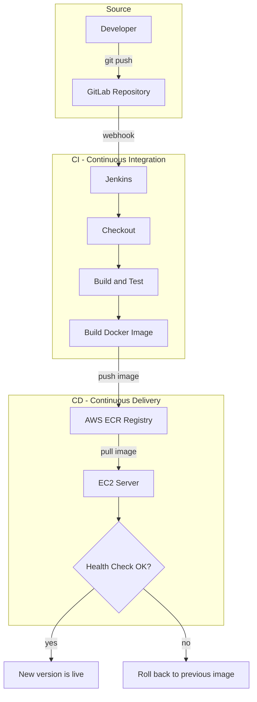

# The Big Picture — What a CI/CD Pipeline Is and What We'll Build

## Learning Objectives
- Understand the real-world pain of manual deployment — human error, lack of reproducibility, and the cost of repeating the same steps over and over.
- Picture how GitLab, Jenkins, a container image registry, and an EC2 server connect into a single automated flow.
- Know exactly what finished pipeline you will have built by the end of this course.

## Body

### A day in the life of manual deployment

Let's start with a story you may already recognize. Your team has finished a new feature, and now someone has to ship it. You merge your branch into `main` and immediately hit merge conflicts because two other engineers pushed first. You fix those by hand. A test job runs and surfaces a handful of failures that only appeared once everyone's code was mixed together, so you scramble to patch them before the sprint ends. Finally, the moment arrives: someone "senior enough" SSHes into the server, stops the running containers, edits a Docker Compose file, and restarts everything — hopefully in the right order, hopefully without a typo.

Every step in that story depends on a human being available, awake, and careful. That is exactly why teams avoid deploying on a Friday evening: if something breaks at 9 p.m. and nobody is watching, customers are stuck until morning. Manual deployment is slow, stressful, and — most importantly — **not reproducible**. Do it ten times and you will get ten slightly different results.

> The single most expensive ingredient in a manual deployment is the human in the loop. CI/CD is the discipline of removing that human from the repetitive, error-prone steps so they can focus on the decisions that actually require judgment.

### What CI and CD actually mean

**CI — Continuous Integration.** Instead of waiting until release day to merge everyone's work and discover the conflicts all at once, developers integrate small changes frequently — often several times a day — and an automated system builds and tests each change right away. Problems show up early, in isolation, and are cheap to fix.

**CD — Continuous Delivery / Deployment.** Once code passes the automated checks, it is automatically packaged and moved toward release. *Continuous Delivery* means every change is always in a deployable, tested state; the final push to production may still be a one-click manual approval. *Continuous Deployment* goes one step further and ships every passing change all the way to production automatically.

Put together, **a CI/CD pipeline is an automated assembly line for your code**: a push triggers a series of stages — source, build, test, package, deploy — and each stage hands off to the next only if it succeeds.

### The four stages every pipeline shares

Almost every pipeline, regardless of tooling, follows the same shape:

1. **Source** — a code change is pushed to a repository (GitLab, in our case). This is the trigger.
2. **Build** — the code is compiled or assembled together with its dependencies into a deployable artifact. For us, that artifact is a Docker image.
3. **Test** — automated tests run against the build. If they fail, the pipeline stops and the team is notified. Bad code never reaches users.
4. **Deploy** — the validated artifact is released to a running environment — here, an AWS EC2 server.

The payoff is dramatic. One team featured in the source material cut their build-test-publish cycle from two hours down to eight minutes once they automated it. The reason companies like Netflix or Amazon can deploy dozens or even thousands of times a day is precisely this kind of pipeline.

### The pipeline you will build in this course

This course is hands-on. You will assemble a complete pipeline that takes *your own* source code from a `git push` all the way to a live container on EC2, with no manual terminal steps in between. The end-to-end flow looks like this:

1. You push code to a **GitLab** repository.
2. A **webhook** notifies **Jenkins** that something changed.
3. Jenkins checks out the code and runs the **build and test** stages — if tests fail, everything stops here.
4. On success, Jenkins builds a **Docker image** of your app.
5. Jenkins authenticates to **AWS ECR** (a private image registry) and pushes the tagged image.
6. Jenkins connects to your **EC2** server over **SSH** and uses **docker compose** to pull the new image and replace the running container.
7. A **health check** confirms the new version is alive; if it isn't, the pipeline **rolls back** to the previous image. Secrets and environment variables stay out of your code and are injected safely.

The diagram below shows how those four tools connect into one automated path from your `git push` to a live container.

We deliberately use a simple, language-agnostic web app as the example. The Dockerfile, the Jenkinsfile, and the deployment logic are the real lessons — and every one of them can be swapped out for your own application.

### Why invest the effort

Setting all this up is a one-time investment, typically measured in a few days once you've done it before. In return you get: no human errors from forgotten steps, no "code freeze" while you wait for one senior engineer, faster and more frequent releases, and the calm confidence that comes from knowing every change was tested the same way, every time. That trade — a few days now for years of saved hours and reduced risk — is the entire reason CI/CD sits at the heart of modern DevOps.

## Key Takeaways
- Manual deployment is slow, stressful, and not reproducible because it depends on a careful human performing the same steps every time.
- **CI** integrates and tests small changes frequently to catch problems early; **CD** automatically delivers (and optionally deploys) the tested result.
- Nearly every pipeline follows four stages: source → build → test → deploy, where each stage only proceeds if the previous one passes.
- By the end of this course you'll have a pipeline where a single `git push` to GitLab triggers Jenkins to build, test, push an image to AWS ECR, and deploy it to EC2 — with health checks, rollback, and safe secret handling.
