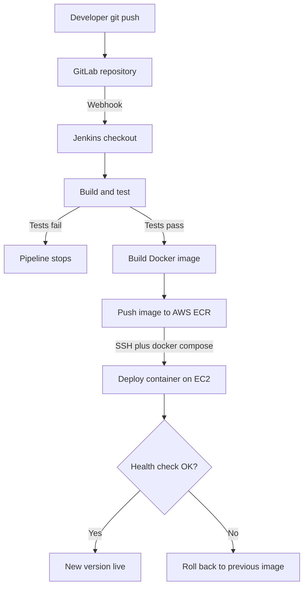

# The Big Picture — What a CI/CD Pipeline Is and What We'll Build

## Learning Objectives
- Understand the problem CI/CD solves: manual deployment is slow, error-prone, and not reproducible.
- Know what CI and CD mean and the four stages every pipeline shares.
- See exactly what pipeline you will build in this course — GitLab → Jenkins → AWS ECR → EC2.

## Body

### The problem: manual deployment

Without automation, shipping a change means someone merges branches by hand, fixes conflicts, runs tests locally, then SSHes into the server to stop containers, edit a Docker Compose file, and restart everything in the right order. Every step depends on a careful human, which is why teams fear Friday-evening deploys — if it breaks at 9 p.m., nobody is there to fix it. The result is slow, stressful, and **not reproducible**: do it ten times and you get ten slightly different outcomes.

> CI/CD is the discipline of removing the human from the repetitive, error-prone steps so the team can focus on decisions that actually need judgment.

### What CI and CD mean

**CI — Continuous Integration.** Developers merge small changes frequently, and an automated system builds and tests each change right away. Problems surface early and in isolation, so they are cheap to fix.

**CD — Continuous Delivery / Deployment.** Once code passes the automated checks, it is automatically packaged and moved toward release. *Continuous Delivery* keeps every change in a deployable state (the final push to production may be a one-click approval); *Continuous Deployment* ships every passing change to production automatically.

Together, a CI/CD pipeline is an **automated assembly line for your code**: a push triggers a series of stages, and each stage hands off to the next only if it succeeds.

### The four stages every pipeline shares

Regardless of tooling, almost every pipeline follows the same shape:

1. **Source** — a code change is pushed to a repository (GitLab, here). This is the trigger.
2. **Build** — the code and its dependencies are assembled into a deployable artifact. For us, that artifact is a Docker image.
3. **Test** — automated tests run against the build. If they fail, the pipeline stops. Bad code never reaches users.
4. **Deploy** — the validated artifact is released to a running environment — an AWS EC2 server.

This is why companies like Netflix or Amazon can deploy dozens or thousands of times a day: each `git push` runs the exact same automated path.

### The pipeline you will build

This course is hands-on. By the end you will have a pipeline that takes your own code from a `git push` all the way to a live container on EC2, with no manual terminal steps in between. The end-to-end flow is as follows:

1. You push code to a **GitLab** repository.
2. A **webhook** notifies **Jenkins** that something changed.
3. Jenkins checks out the code and runs **build and test** — if tests fail, everything stops here.
4. On success, Jenkins builds a **Docker image** of your app.
5. Jenkins authenticates to **AWS ECR** (a private image registry) and pushes the tagged image.
6. Jenkins connects to **EC2** over **SSH** and uses **docker compose** to pull the new image and replace the running container.
7. A **health check** confirms the new version is alive; if not, the pipeline **rolls back** to the previous image. Secrets stay out of your code and are injected safely.

The diagram below shows this end-to-end flow at a glance, including where a failed test stops the pipeline and where a failed health check triggers a rollback.

We use a simple, language-agnostic web app as the example. The Dockerfile, the Jenkinsfile, and the deployment logic are the real lessons — and each can be swapped out for your own application.

Setting this up is a one-time investment of a few days. In return you get no human errors from forgotten steps, no waiting on one senior engineer, faster releases, and the confidence that every change was tested the same way, every time.

## Key Takeaways
- Manual deployment is slow, stressful, and not reproducible because it depends on a careful human repeating the same steps.
- **CI** integrates and tests small changes frequently; **CD** automatically delivers (and optionally deploys) the tested result.
- Nearly every pipeline follows four stages: source → build → test → deploy, advancing only when the previous stage passes.
- In this course you will build a pipeline where one `git push` to GitLab triggers Jenkins to build, test, push an image to AWS ECR, and deploy it to EC2 — with health checks, rollback, and safe secret handling.

## Sources
- https://www.youtube.com/watch?v=AknbizcLq4w
- https://www.youtube.com/watch?v=M4CXOocovZ4
- https://www.youtube.com/watch?v=G1u4WBdlWgU
