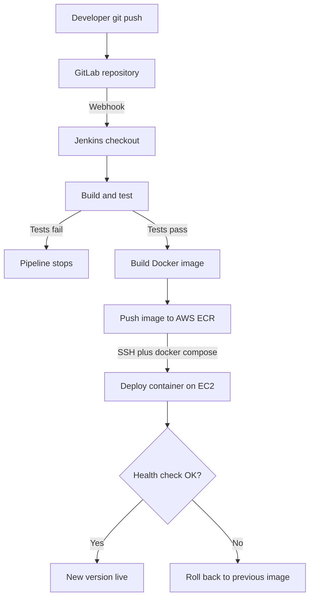

# 전체 그림 — CI/CD 파이프라인이란 무엇이고, 우리는 무엇을 만드는가

## 학습 목표
- CI/CD가 해결하는 문제를 이해한다: 수동 배포는 느리고, 실수가 잦으며, 재현이 안 된다.
- CI와 CD가 각각 무엇을 의미하는지, 모든 파이프라인이 공유하는 4단계가 무엇인지 안다.
- 이 강좌에서 직접 만들 파이프라인의 전체 구조를 미리 파악한다 — GitLab → Jenkins → AWS ECR → EC2.

## 본문

### 문제: 수동 배포

자동화 없이 변경 사항을 배포하려면 누군가가 직접 브랜치를 병합하고 충돌을 해결한 뒤 로컬에서 테스트를 돌려야 한다. 그런 다음 서버에 SSH로 접속해 컨테이너를 멈추고, Docker Compose 파일을 수정하고, 올바른 순서로 모든 것을 다시 기동한다. 매 단계마다 사람이 직접 챙겨야 하다 보니, 팀은 금요일 저녁 배포를 두려워한다. 밤 9시에 장애가 나도 아무도 없으니까. 결과는 느리고, 스트레스가 심하며, 무엇보다 **재현이 안 된다**: 열 번 해도 열 번 결과가 조금씩 다르다.

> CI/CD는 반복적이고 실수가 잦은 단계에서 사람을 빼내, 팀이 진짜 판단이 필요한 일에 집중하게 만드는 방법론이다.

### CI와 CD의 의미

**CI — 지속적 통합(Continuous Integration).** 개발자들이 작은 변경 사항을 자주 병합하면, 자동화 시스템이 즉시 빌드하고 테스트한다. 문제가 일찍, 그리고 독립적으로 드러나기 때문에 고치는 비용이 훨씬 적다.

**CD — 지속적 제공/배포(Continuous Delivery / Deployment).** 코드가 자동화된 검사를 통과하면 자동으로 패키징되어 릴리스 방향으로 이동한다. *지속적 제공(Continuous Delivery)*은 모든 변경 사항을 언제든 배포 가능한 상태로 유지하는 것이다(운영 환경 최종 반영은 원클릭 승인으로 남겨둘 수 있다). *지속적 배포(Continuous Deployment)*는 한 단계 더 나아가, 통과한 모든 변경 사항을 사람 개입 없이 운영 환경에 자동으로 릴리스한다.

둘을 합치면 CI/CD 파이프라인은 **코드를 위한 자동화된 조립 라인**이 된다. 푸시 하나가 일련의 단계를 트리거하고, 각 단계는 앞 단계가 성공해야만 다음으로 넘어간다.

### 모든 파이프라인이 공유하는 4단계

어떤 도구를 쓰든 거의 모든 파이프라인은 같은 구조를 따른다.

1. **소스(Source)** — 저장소(여기서는 GitLab)에 코드 변경 사항이 푸시된다. 이것이 트리거다.
2. **빌드(Build)** — 코드와 의존성을 배포 가능한 산출물로 조립한다. 여기서 그 산출물은 Docker 이미지다.
3. **테스트(Test)** — 빌드된 결과에 자동화 테스트를 실행한다. 실패하면 파이프라인이 멈춘다. 나쁜 코드는 절대 사용자에게 닿지 않는다.
4. **배포(Deploy)** — 검증된 산출물을 실행 환경(AWS EC2 서버)에 릴리스한다.

Netflix나 Amazon 같은 회사가 하루에 수십~수천 번 배포할 수 있는 이유가 바로 여기 있다. `git push` 하나가 매번 정확히 동일한 자동화 경로를 거친다.

### 우리가 만들 파이프라인

이 강좌는 실습 중심이다. 마치면 자신의 코드를 `git push` 하나로 EC2 위의 실행 중인 컨테이너까지 보낼 수 있는 파이프라인이 완성된다. 중간에 터미널을 직접 건드릴 필요가 없다. 전체 흐름은 다음과 같다.

1. **GitLab** 저장소에 코드를 푸시한다.
2. **Webhook**이 **Jenkins**에 변경 사항이 생겼음을 알린다.
3. Jenkins가 코드를 체크아웃하고 **빌드와 테스트**를 실행한다 — 테스트가 실패하면 여기서 멈춘다.
4. 성공하면 Jenkins가 앱의 **Docker 이미지**를 빌드한다.
5. Jenkins가 **AWS ECR**(프라이빗 이미지 레지스트리)에 인증하고 태그된 이미지를 푸시한다.
6. Jenkins가 **SSH**로 **EC2**에 접속해 **docker compose**로 새 이미지를 pull하고 실행 중인 컨테이너를 교체한다.
7. **헬스 체크**로 새 버전이 정상 동작하는지 확인한다. 실패하면 파이프라인이 이전 이미지로 **롤백**한다. 시크릿은 코드에 포함되지 않고 안전하게 주입된다.

아래 다이어그램은 이 전체 흐름을 한눈에 보여준다. 테스트 실패 시 파이프라인이 어디서 멈추는지, 헬스 체크 실패 시 어디서 롤백이 발생하는지도 함께 표시했다.

예제로는 언어에 구애받지 않는 간단한 웹앱을 사용한다. Dockerfile, Jenkinsfile, 그리고 배포 로직이 진짜 배울 내용이며, 언제든 자신의 애플리케이션으로 바꿔 쓸 수 있다.

초기 구성에 며칠이 걸릴 수 있지만, 한 번 해두면 빠뜨린 단계로 인한 실수도, 특정 시니어 엔지니어를 기다릴 필요도 없어진다. 릴리스는 빨라지고, 모든 변경 사항이 매번 동일하게 테스트됐다는 확신을 갖게 된다.

## 핵심 요약
- 수동 배포는 느리고 스트레스가 심하며 재현이 안 된다. 사람이 매번 같은 단계를 직접 반복해야 하기 때문이다.
- **CI**는 작은 변경 사항을 자주 통합하고 테스트하며, **CD**는 테스트를 통과한 결과를 자동으로 제공(또는 배포)한다.
- 거의 모든 파이프라인은 소스 → 빌드 → 테스트 → 배포의 4단계를 따르며, 앞 단계가 성공해야만 다음으로 넘어간다.
- 이 강좌에서는 GitLab에 `git push` 하나로 Jenkins가 빌드·테스트·이미지 push(AWS ECR)·EC2 배포를 모두 수행하는 파이프라인을 만든다. 헬스 체크, 롤백, 시크릿 관리까지 갖춘 완전한 파이프라인이다.

## 출처
- https://www.youtube.com/watch?v=AknbizcLq4w
- https://www.youtube.com/watch?v=M4CXOocovZ4
- https://www.youtube.com/watch?v=G1u4WBdlWgU
