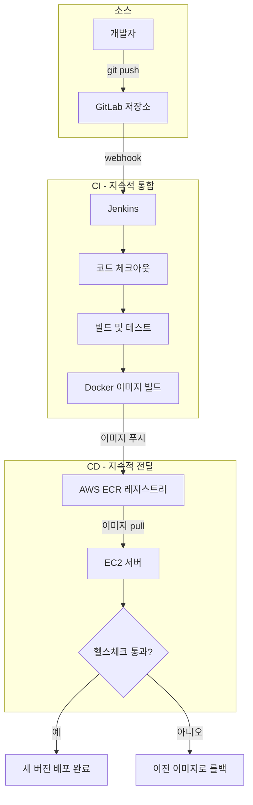

# 전체 그림 — CI/CD 파이프라인이란 무엇이고 무엇을 만들 것인가

## 학습 목표
- 수동 배포의 실제 고통 — 사람의 실수, 재현 불가, 같은 작업을 반복하는 비용 — 을 이해한다.
- GitLab, Jenkins, 컨테이너 이미지 레지스트리, EC2 서버가 하나의 자동화된 흐름으로 연결되는 구조를 그릴 수 있다.
- 이 강좌를 끝냈을 때 완성될 파이프라인의 최종 모습을 미리 파악한다.

## 본문

### 수동 배포의 하루

이미 겪어봤을 법한 이야기부터 시작하자. 팀에서 새 기능 개발이 끝나 배포해야 하는 순간이 왔다. `main` 브랜치에 머지하려 하는데, 다른 두 명의 개발자가 먼저 푸시해서 머지 충돌이 생겼다. 손으로 충돌을 해소하고 다시 머지하니, 이번엔 여러 사람의 코드가 섞이면서 처음엔 없었던 테스트 실패가 쏟아진다. 스프린트 마감 전에 수습하느라 뛰어다닌다. 드디어 배포 타이밍이 왔다. "충분히 시니어한" 누군가가 서버에 SSH로 접속해서 실행 중인 컨테이너를 내리고, Docker Compose 파일을 수정하고, 올바른 순서대로, 오타 없이 다시 올린다.

이 과정의 매 단계마다 사람이 자리에 있어야 하고, 깨어 있어야 하고, 실수하지 않아야 한다. 그래서 금요일 저녁엔 배포를 꺼린다. 밤 9시에 뭔가 터졌는데 아무도 보고 있지 않으면 고객은 아침까지 기다려야 한다. 수동 배포는 느리고, 스트레스가 심하고, 무엇보다 **재현이 불가능하다**. 열 번 하면 열 번 다 조금씩 다른 결과가 나온다.

> 수동 배포에서 가장 비싼 재료는 사람이다. CI/CD는 반복적이고 오류가 잦은 단계에서 사람을 빼내 실제로 판단이 필요한 일에 집중하게 만드는 방법론이다.

### CI와 CD의 실제 의미

**CI — 지속적 통합(Continuous Integration).** 릴리스 날까지 기다렸다가 모두의 작업을 한꺼번에 합치고 충돌을 발견하는 대신, 개발자들이 작은 변경을 자주 — 하루에도 여러 번 — 통합하고 자동화 시스템이 즉시 빌드·테스트를 실행한다. 문제가 일찍, 격리된 상태에서 드러나기 때문에 고치는 비용이 훨씬 싸다.

**CD — 지속적 전달/배포(Continuous Delivery / Deployment).** 코드가 자동 검사를 통과하면 자동으로 패키징되어 릴리스 단계로 이동한다. *지속적 전달(Continuous Delivery)*은 모든 변경이 항상 배포 가능하고 테스트된 상태를 유지한다는 뜻이다. 프로덕션으로의 최종 푸시는 원클릭 수동 승인이 남아 있을 수 있다. *지속적 배포(Continuous Deployment)*는 한 단계 더 나아가, 자동 검사를 통과한 모든 변경을 사람 개입 없이 프로덕션까지 자동으로 내보낸다.

합치면, **CI/CD 파이프라인은 코드를 위한 자동화 조립 라인**이다. 푸시 하나가 소스 → 빌드 → 테스트 → 패키징 → 배포의 일련의 단계를 시작시키고, 각 단계는 성공했을 때만 다음 단계로 넘어간다.

### 모든 파이프라인이 공유하는 4단계

어떤 도구를 쓰든 거의 모든 파이프라인은 같은 형태를 따른다.

1. **소스(Source)** — 코드 변경이 저장소(여기선 GitLab)에 푸시된다. 이것이 트리거다.
2. **빌드(Build)** — 코드가 의존성과 함께 배포 가능한 산출물(artifact)로 조립된다. 우리의 경우 그 산출물은 Docker 이미지다.
3. **테스트(Test)** — 자동화 테스트가 빌드 결과물을 검증한다. 실패하면 파이프라인이 멈추고 팀에 알린다. 나쁜 코드는 사용자에게 절대 닿지 않는다.
4. **배포(Deploy)** — 검증된 산출물이 실행 환경에 릴리스된다. 여기선 AWS EC2 서버다.

효과는 극적이다. 소스 자료에 나온 한 팀은 자동화 후 빌드-테스트-배포 사이클을 두 시간에서 8분으로 줄였다. Netflix나 Amazon이 하루에 수십, 심지어 수천 번씩 배포할 수 있는 이유가 바로 이런 파이프라인이다.

### 이 강좌에서 만들 파이프라인

이 강좌는 직접 만들며 배우는 강좌다. `git push` 한 번으로 *내 소스 코드*가 터미널 조작 없이 EC2의 실행 중인 컨테이너까지 흘러가는 완전한 파이프라인을 조립한다. 전체 흐름은 다음과 같다.

1. **GitLab** 저장소에 코드를 푸시한다.
2. **Webhook**이 **Jenkins**에 변경 사항을 알린다.
3. Jenkins가 코드를 체크아웃하고 **빌드 및 테스트** 단계를 실행한다. 테스트가 실패하면 여기서 전부 멈춘다.
4. 성공하면 Jenkins가 앱의 **Docker 이미지**를 빌드한다.
5. Jenkins가 **AWS ECR**(프라이빗 이미지 레지스트리)에 인증하고 태그된 이미지를 푸시한다.
6. Jenkins가 **SSH**로 **EC2** 서버에 접속해 **docker compose**로 새 이미지를 pull하고 실행 중인 컨테이너를 교체한다.
7. **헬스체크**가 새 버전이 정상 작동하는지 확인한다. 확인에 실패하면 파이프라인이 이전 이미지로 **롤백**한다. 시크릿과 환경변수는 코드에서 분리되어 안전하게 주입된다.

아래 다이어그램은 이 네 가지 도구가 하나의 자동화 경로로 연결되어 `git push`부터 실행 중인 컨테이너까지 이어지는 모습을 보여 준다.

예제 앱은 언어에 종속되지 않는 단순한 웹앱으로 일부러 선택했다. Dockerfile, Jenkinsfile, 배포 로직이 핵심 학습 내용이며, 이 모두는 내 애플리케이션으로 그대로 교체할 수 있다.

### 왜 이 투자를 하는가

이 모든 걸 처음 설정하는 데는 며칠이 걸린다. 하지만 그 대가로 얻는 것은 크다. 빠뜨린 단계로 인한 사람의 실수가 없어지고, 시니어 엔지니어 한 명을 기다리느라 생기는 "코드 프리즈"도 사라진다. 릴리스는 더 빠르고 잦아지며, 모든 변경이 매번 동일한 방식으로 테스트됐다는 조용한 확신이 생긴다. 지금 며칠을 투자해서 앞으로 수년간의 시간을 절약하고 리스크를 줄이는 이 거래가, CI/CD가 현대 DevOps의 핵심에 자리한 이유다.

## 핵심 정리
- 수동 배포는 느리고 스트레스가 심하며 재현이 불가능하다. 매번 같은 단계를 실수 없이 수행할 사람에 의존하기 때문이다.
- **CI**는 작은 변경을 자주 통합·테스트해 문제를 일찍 잡는다. **CD**는 테스트를 통과한 결과물을 자동으로 전달(선택에 따라 배포까지)한다.
- 거의 모든 파이프라인은 소스 → 빌드 → 테스트 → 배포의 4단계를 따르며, 각 단계는 이전 단계가 통과해야만 진행된다.
- 이 강좌를 마치면 GitLab에 `git push` 한 번으로 Jenkins가 빌드·테스트·ECR 이미지 푸시·EC2 배포를 수행하는 파이프라인이 완성된다. 헬스체크, 롤백, 안전한 시크릿 처리까지 갖춘 파이프라인이다.
