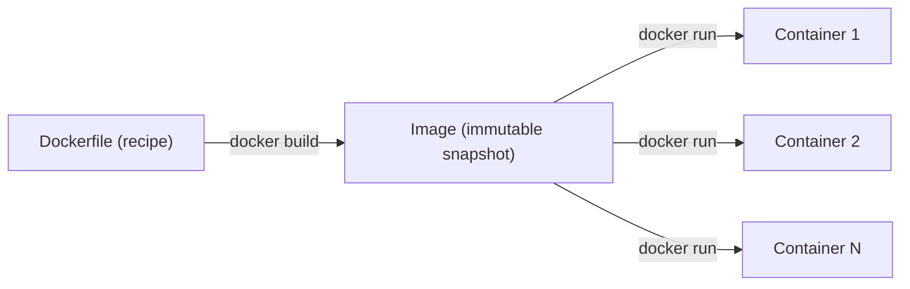

# Packaging Your App as a Container — Writing a Dockerfile and Running It Locally

## Learning Objectives
- Understand why a container image is the unit we ship through the whole pipeline.
- Learn the standard Dockerfile pattern for turning any web app into an image.
- Verify your image works locally with `docker build` and `docker run` before automating anything.

## Body

### Why ship containers at all

You've probably said — or heard — "but it works on my machine." That sentence is the exact problem containers were invented to solve. Your app depends on a specific runtime version, certain libraries, and a particular configuration. Move it to a teammate's laptop or a server with slightly different versions, and it breaks.

A **container** packages your code together with everything it needs to run — runtime, system tools, libraries, settings — into one standalone unit. Because that unit carries its own environment, it runs identically on your laptop, a colleague's machine, and an EC2 server. There are three terms worth nailing down right away:

- **Dockerfile** — a text file containing the instructions to build an image. Think of it as a recipe.
- **Image** — an immutable, built snapshot produced from the Dockerfile. Think of it as the meal, frozen and ready.
- **Container** — a running instance of an image. Think of it as the meal being served. One image can spawn many containers.

The relationship flows in one direction: a Dockerfile *builds* an image, and an image *runs* as a container, as the diagram below makes clear.



> In this pipeline, the image is the single artifact that travels from your laptop, through Jenkins, into ECR, and onto EC2. Everything we automate later is really just "build this image, store it, and run it somewhere." Getting the Dockerfile right is the foundation.

### The standard Dockerfile pattern

Almost every Dockerfile for a web app follows the same skeleton. Here is the pattern using a small Node.js app as the example — but the *shape* applies to any language. Create a file named exactly `Dockerfile` (no extension) in the root of your project:

```dockerfile
# 1. Start from an official base image that already has your runtime
FROM node:20-alpine

# 2. Set the working directory inside the image
WORKDIR /app

# 3. Copy dependency manifest FIRST, then install — this layer gets cached
COPY package.json package-lock.json ./
RUN npm install

# 4. Now copy the rest of the source code
COPY . .

# 5. Document the port the app listens on
EXPOSE 8080

# 6. Define the command that runs when a container starts
CMD ["node", "index.js"]
```

A few of these lines deserve explanation, because they encode real best practices:

- **`FROM`** picks a base image. Prefer an official, slim image — `node:20-alpine` is based on Alpine Linux (a tiny ~5 MB distribution), which keeps your final image small and fast to push and pull. A bloated base image costs you on every deploy.
- **Each instruction is a cached layer.** Docker rebuilds only the layers that changed. This is *why* we copy `package.json` and run `npm install` **before** copying the source code. Your dependencies change rarely, but your source changes constantly — so installing dependencies in an earlier layer means Docker can reuse the cached install on most builds. Get this order wrong and every code change forces a full reinstall.
- **`CMD` uses the array (exec) form** — `["node", "index.js"]` rather than a plain string. The exec form runs your process directly instead of wrapping it in a shell, which makes signal handling and shutdown behave correctly.

### Don't copy junk: the .dockerignore file

When you write `COPY . .`, Docker copies *everything* in the folder — including your local `node_modules`, build artifacts, and, dangerously, any stray secret files. Create a `.dockerignore` file (it works just like `.gitignore`) to exclude them:

```
node_modules
.git
*.env
```

This keeps your image small, your builds fast, and your secrets out of a layer that anyone who pulls the image could inspect.

### Build it and run it locally

Now turn the recipe into an image. The `-t` flag tags it with a memorable name:

```bash
docker build -t myapp:local .
```

The trailing `.` tells Docker to look for the Dockerfile in the current directory. Watch the output: Docker steps through each instruction, pulling the base image, installing dependencies, and copying your code, then prints the built image ID. Confirm it exists:

```bash
docker images
```

Now run it. A common beginner trap is to start the container and then wonder why `localhost` shows nothing:

```bash
docker run -p 5000:8080 myapp:local
```

The `-p 5000:8080` flag is the key. By default a container's ports are *not* reachable from your machine. This flag **maps** port `5000` on your host to port `8080` inside the container (the port we `EXPOSE`d). Open `http://localhost:5000` and you should see your app. The mapping reads `host:container`.

To run it in the background, add `-d` (detached). Inspect what's running with `docker ps`, read logs with `docker logs <container>`, and stop it with `docker stop <container>`.

### This is your starting point

You now have a reproducible, portable image of your app and you've proven it runs. That image is exactly what the rest of the pipeline will build, store, and deploy automatically. In the lectures ahead, every step you just did by hand — build, tag, run — becomes a stage that Jenkins executes for you on every push.

## Key Takeaways
- A container packages your app with its entire environment, eliminating "works on my machine" and giving you one artifact that runs the same everywhere.
- Remember the chain: a **Dockerfile** builds an **image**, and an **image** runs as a **container**.
- Order your Dockerfile to exploit layer caching — copy and install dependencies *before* copying source code — and use a slim base image plus `.dockerignore` to stay small and safe.
- Validate locally with `docker build -t name .` and `docker run -p host:container name`; remember that port mapping is required to reach the app, and the format is `host:container`.
