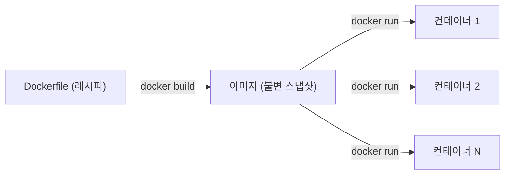

# 내 앱을 컨테이너로 — Dockerfile 작성과 로컬 실행

## 학습 목표
- 왜 배포 단위로 컨테이너 이미지를 쓰는지 이해한다.
- 어떤 언어의 웹앱이든 Dockerfile로 이미지화하는 기본 패턴을 익힌다.
- 자동화하기 전에 `docker build`와 `docker run`으로 이미지가 로컬에서 잘 동작하는지 검증한다.

## 본문

### 왜 컨테이너로 배포하나

"내 로컬에서는 잘 돌아가는데요." 한 번쯤 해봤거나 들어봤을 말이다. 컨테이너는 바로 이 문제를 해결하기 위해 만들어졌다. 앱은 특정 런타임 버전, 특정 라이브러리, 특정 설정에 의존한다. 팀원의 노트북이나 버전이 조금 다른 서버로 옮기면 깨진다.

**컨테이너**는 코드와 그것이 실행되는 데 필요한 모든 것 — 런타임, 시스템 도구, 라이브러리, 설정 — 을 하나의 독립된 단위로 묶어 준다. 환경 자체를 함께 담기 때문에 내 노트북, 동료의 머신, EC2 서버 어디에서든 동일하게 실행된다. 먼저 세 가지 용어를 정리해 두자.

- **Dockerfile** — 이미지를 만들기 위한 명령들이 담긴 텍스트 파일. 레시피라고 생각하면 된다.
- **이미지(Image)** — Dockerfile로 빌드한 불변(immutable) 스냅샷. 만들어 놓은 완성 요리라고 생각하면 된다.
- **컨테이너(Container)** — 이미지의 실행 인스턴스. 손님 앞에 내놓은 요리다. 하나의 이미지로 여러 컨테이너를 띄울 수 있다.

관계는 한 방향으로 흐른다. Dockerfile이 이미지를 *빌드*하고, 이미지가 컨테이너로 *실행*된다. 아래 다이어그램에서 이 흐름을 확인할 수 있다.



> 이 파이프라인에서 이미지는 내 노트북에서 Jenkins를 거쳐 ECR로, 다시 EC2로 이동하는 단 하나의 배포 산출물이다. 이후에 자동화하는 모든 것은 결국 "이 이미지를 빌드하고, 저장하고, 어딘가에서 실행한다"는 흐름이다. Dockerfile을 제대로 작성하는 것이 그 모든 것의 기초다.

### 표준 Dockerfile 패턴

웹앱을 위한 Dockerfile은 거의 같은 뼈대를 따른다. Node.js 예제를 기준으로 패턴을 보여 주지만, *구조* 자체는 어떤 언어에든 적용된다. 프로젝트 루트에 확장자 없이 `Dockerfile`이라는 이름으로 파일을 만든다.

```dockerfile
# 1. 런타임이 이미 들어 있는 공식 베이스 이미지를 지정한다
FROM node:20-alpine

# 2. 이미지 안에서 작업 디렉터리를 설정한다
WORKDIR /app

# 3. 의존성 목록을 먼저 복사하고 설치한다 — 이 레이어가 캐시된다
COPY package.json package-lock.json ./
RUN npm install

# 4. 그다음 나머지 소스 코드를 복사한다
COPY . .

# 5. 앱이 리스닝하는 포트를 문서화한다
EXPOSE 8080

# 6. 컨테이너가 시작될 때 실행할 명령을 지정한다
CMD ["node", "index.js"]
```

몇 가지 줄은 실질적인 best practice를 담고 있어 설명이 필요하다.

- **`FROM`**은 베이스 이미지를 지정한다. 공식·slim 이미지를 쓰길 권한다. `node:20-alpine`은 Alpine Linux(약 5 MB 초경량 배포판) 기반이라 최종 이미지를 작고 빠르게 유지한다. 베이스 이미지가 무거우면 배포할 때마다 비용이 붙는다.
- **각 명령은 캐시되는 레이어다.** Docker는 변경된 레이어부터만 재빌드한다. 그렇기 때문에 소스 코드를 복사하기 **전에** `package.json`을 복사하고 `npm install`을 실행하는 것이다. 의존성은 자주 바뀌지 않지만 소스는 수시로 바뀐다 — 의존성을 앞 레이어에 두면 대부분의 빌드에서 캐시된 설치 결과를 그대로 쓸 수 있다. 순서를 바꾸면 코드를 한 줄 고칠 때마다 전체 재설치가 강제된다.
- **`CMD`는 배열(exec) 형식을 쓴다** — 일반 문자열 대신 `["node", "index.js"]`. exec 형식은 프로세스를 shell로 감싸지 않고 직접 실행하기 때문에 시그널 처리와 종료 동작이 올바르게 작동한다.

### 불필요한 파일 제외: .dockerignore 파일

`COPY . .`을 쓰면 Docker는 폴더 안의 *모든 것* — 로컬 `node_modules`, 빌드 산출물, 위험하게도 혹시 있을 시크릿 파일까지 — 을 복사한다. `.gitignore`와 같은 방식으로 동작하는 `.dockerignore` 파일을 만들어 제외한다.

```
node_modules
.git
*.env
```

이렇게 하면 이미지가 작아지고, 빌드가 빨라지고, 이미지를 pull한 누구든 레이어를 들여다볼 수 있는 상황에서 시크릿이 노출되지 않는다.

### 빌드하고 로컬에서 실행하기

이제 레시피를 이미지로 만들어 보자. `-t` 플래그로 알아보기 쉬운 이름을 붙인다.

```bash
docker build -t myapp:local .
```

끝의 `.`은 현재 디렉터리에서 Dockerfile을 찾으라는 의미다. 출력을 보면 Docker가 각 명령을 단계별로 실행하는 것을 확인할 수 있다. 빌드된 이미지가 있는지 확인한다.

```bash
docker images
```

이제 실행해 보자. 초보자가 자주 빠지는 함정이 있다. 컨테이너를 시작했는데 `localhost`에 아무것도 뜨지 않는 경우다.

```bash
docker run -p 5000:8080 myapp:local
```

`-p 5000:8080` 플래그가 핵심이다. 기본적으로 컨테이너의 포트는 내 머신에서 *접근할 수 없다*. 이 플래그가 호스트의 포트 `5000`을 컨테이너 안의 포트 `8080`(`EXPOSE`한 포트)으로 **연결**한다. `http://localhost:5000`을 열면 앱이 보인다. 형식은 `호스트:컨테이너`다.

백그라운드로 실행하려면 `-d`(detached)를 붙인다. `docker ps`로 실행 중인 컨테이너를 확인하고, `docker logs <컨테이너>`로 로그를 보고, `docker stop <컨테이너>`로 중지한다.

### 이것이 시작점이다

재현 가능하고 이식 가능한 이미지를 만들고, 실행까지 확인했다. 이 이미지가 바로 이후 파이프라인이 자동으로 빌드·저장·배포할 대상이다. 앞으로의 강의에서는 지금 수동으로 한 모든 단계 — 빌드, 태그, 실행 — 가 push마다 Jenkins가 자동으로 처리하는 스테이지가 된다.

## 핵심 정리
- 컨테이너는 앱과 실행 환경 전체를 묶어 "내 로컬에서만 되는" 문제를 없애고, 어디서든 동일하게 동작하는 단 하나의 배포 산출물을 만들어 준다.
- **Dockerfile** → **이미지** → **컨테이너** 의 흐름을 기억한다.
- Dockerfile은 레이어 캐싱을 활용하도록 작성한다. 의존성 복사·설치를 소스 코드 복사 *전에* 두고, slim 베이스 이미지와 `.dockerignore`로 이미지를 작고 안전하게 유지한다.
- `docker build -t 이름 .`와 `docker run -p 호스트:컨테이너 이름`으로 로컬 검증을 마친다. 포트 매핑이 없으면 앱에 접근할 수 없고, 형식은 `호스트:컨테이너`다.
