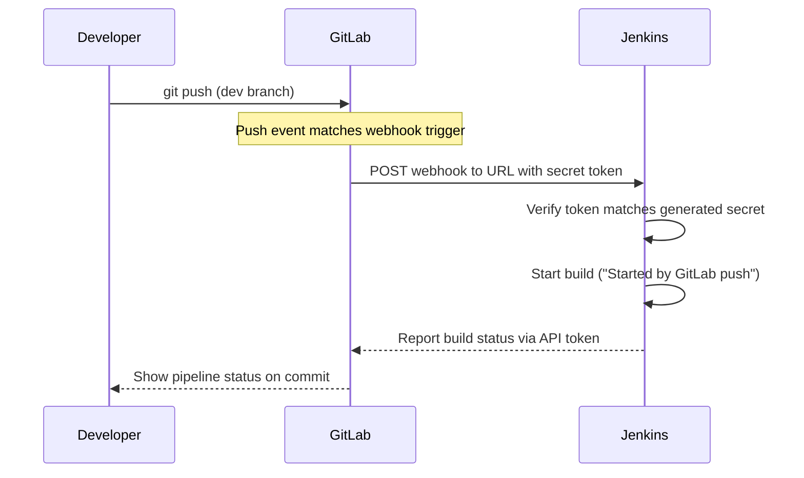

# Setting Up GitLab and Triggering Jenkins on Push (Webhooks)

## Learning Objectives
- Push code to a GitLab repository using a simple `dev`/`main` branch strategy.
- Connect GitLab to Jenkins so that a `push` automatically triggers a build.
- Configure and verify a GitLab webhook secured by a shared secret token.

## Body

The goal of a pipeline is that *pushing code* — not running commands by hand — starts the work. To get there you need a place to push (GitLab) and a way to tell Jenkins "something changed" (a webhook). This lecture wires the two together.

### Task 1 — Push your app to GitLab

**What & why:** Jenkins needs a repository to watch. Push the Dockerfile-equipped app from the previous lecture to a new GitLab project.

```bash
git init
git remote add origin https://gitlab.com/<your-namespace>/<your-project>.git
git add .
git commit -m "Initial commit with Dockerfile"
git push -u origin main

# create a dev branch for day-to-day work
git checkout -b dev
git push -u origin dev
```

> Branch strategy: work on `dev`, keep `main` as "what should be deployed." Triggering on `dev` lets you experiment without touching the deployable branch.

### Task 2 — Create a GitLab personal access token

**What & why:** Jenkins talks to GitLab's API, which requires a token.

1. GitLab → avatar (top-left) → **Preferences** (older UI: **Edit profile**) → **Access Tokens**.
2. **Add new token**, give it a name and expiry, and set the scope to **api**.
3. **Copy the token now** — GitLab shows it only once. If you lose it, create a new one.

### Task 3 — Install the GitLab plugin in Jenkins

**What & why:** The plugin lets GitLab trigger builds and lets Jenkins report status back to GitLab.

- **Manage Jenkins → Plugins → Available** → search **GitLab** → install.
- The **GitLab API Plugin** is installed as a companion automatically.

### Task 4 — Create the GitLab connection in Jenkins

**What & why:** This registers your GitLab server and API token so Jenkins can authenticate.

**Manage Jenkins → System → GitLab** section:

- **Connection name** — any label, e.g. `gitlab-saas`.
- **GitLab host URL** — `https://gitlab.com` (SaaS) or your self-hosted URL.
- **Credentials** → **Add** → kind **GitLab API token** → paste the token from Task 2.

Click **Test Connection** — a success message confirms it works. **Save**.

### Task 5 — Make the Jenkins job listen for pushes

**What & why:** This tells the job which incoming events should start a build.

In the pipeline job's config → **Build Triggers** → enable **"Build when a change is pushed to GitLab."** Select **Push Events** (and **Merge Request Events** if needed).

Then expand **Advanced** and click **Generate** to create a **secret token**. Copy it — and note the **webhook URL** Jenkins displays in this same section. You'll need both in the next task. **Save**.

### Task 6 — Create the webhook in GitLab

**What & why:** The webhook is what GitLab calls when an event happens. It needs the URL and secret token from Jenkins, which must match on both ends.

GitLab project → **Settings → Webhooks**:

- **URL** — paste the webhook URL from Jenkins (Task 5).
- **Secret token** — paste the generated token from Jenkins (Task 5).
- Trigger: select **Push events**, choose your branches.
- **Add webhook**.

> The whole connection is just two facts that must match on both sides: a **URL** pointing GitLab at the right Jenkins job, and a **shared secret token** that proves the request is authentic.

Use **Test → Push events** in GitLab to fire a sample event and confirm the wiring.

### Task 7 — Verify end to end

**What & why:** A real push should now start a build with no manual action.

```bash
git checkout dev
echo "trigger test" >> README.md
git commit -am "Test webhook"
git push
```

Watch Jenkins: within a second or two a new build appears, and the console output reads **"Started by GitLab push"**. Pushes — not commands — now drive the pipeline.

The sequence diagram below traces what happens end to end, from your `git push` to the build Jenkins starts on its own.



## Key Takeaways
- Pushing code to GitLab, not running commands, is what now starts your pipeline.
- A webhook lets GitLab notify Jenkins the instant an event occurs, instead of Jenkins polling.
- The connection rests on two matching facts: a **URL** pointing at the Jenkins job and a **shared secret token** that authenticates the request.
- Configure the job to "Build when a change is pushed to GitLab," create the matching webhook in GitLab, and verify with a test push showing "Started by GitLab push."

## Sources
- https://www.youtube.com/watch?v=_8YjWDmLvAE
- https://www.youtube.com/watch?v=SObrdM1ev3M
