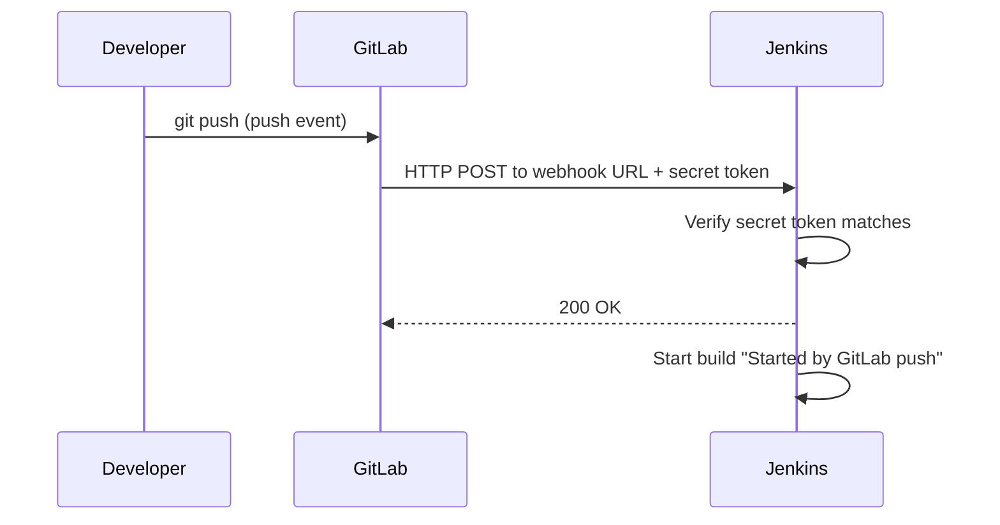

# Setting Up GitLab and Triggering Jenkins on Push (Webhooks)

## Learning Objectives
- Understand the basic flow of creating a GitLab repository, pushing code, and a simple branch strategy.
- Know how a GitLab webhook delivers a `push` event to Jenkins and what makes it secure.
- Connect GitLab to Jenkins so that pushing code automatically triggers the pipeline.

## Body

### The repository is the trigger

In the previous lecture you built an image by hand. The whole point of a pipeline is that you stop running commands manually — instead, *pushing code* sets everything in motion. That means we need two things: a place to push code (GitLab) and a mechanism that tells Jenkins "something changed, start working" (a webhook). This lecture wires those two together.

### A quick GitLab and branch refresher

Create a project in GitLab, then push your code — the same Dockerfile-equipped app from the last lecture — to it:

```bash
git init
git remote add origin https://gitlab.com/<your-namespace>/<your-project>.git
git add .
git commit -m "Initial commit with Dockerfile"
git push -u origin main
```

A small but real **branch strategy** keeps the pipeline sane. The convention is to do day-to-day work on a `dev` (or feature) branch, and treat `main` as the branch that always represents what should be deployed. You can configure the pipeline to react to pushes on whichever branch you choose. For learning, triggering on every push to `dev` lets you experiment freely without touching the deployable branch.

### What a webhook actually is

A **webhook** is GitLab's way of saying "call me back when something happens." Instead of Jenkins constantly polling GitLab asking "anything new yet?", GitLab proactively sends an HTTP request to a URL you give it the instant an event — like a `push` — occurs. It's the difference between repeatedly checking your mailbox and having the postal service ring your doorbell.

The sequence below traces a single `push` from your machine all the way to a started Jenkins build, and shows where the secret token proves the request is authentic.



GitLab actually offers two ways to connect to Jenkins, and it helps to know both:

- **The Jenkins integration** — the officially recommended path. It uses a GitLab plugin in Jenkins plus a saved connection, and it can also report build status *back* into the GitLab UI.
- **A plain webhook** — a more direct, lower-level approach where GitLab simply POSTs to a Jenkins URL secured by a token.

We'll set up the connection using the integration, then show the raw webhook so you understand what's happening underneath.

### Step 1 — A personal access token in GitLab

Jenkins needs permission to talk to GitLab's API. In the current GitLab UI, click your avatar (top-left) → **Preferences** (older versions label this **Edit profile**), then choose **Access Tokens** from the left-hand menu. Click **Add new token**, give it a name and an expiry, and — this is the critical part — set the scope to **api**. Copy the token immediately: GitLab shows it exactly once and you can never retrieve it again. If you lose it, you create a new one.

### Step 2 — Install the GitLab plugin in Jenkins

In Jenkins, go to **Manage Jenkins → Plugins → Available**, search for **GitLab**, and install it (the **GitLab API Plugin** comes along as a companion). This plugin is what lets GitLab trigger builds and lets Jenkins display results back in GitLab.

### Step 3 — Create the GitLab connection in Jenkins

Go to **Manage Jenkins → System** and scroll to the new **GitLab** section. Fill in:

- **Connection name** — any label you like (e.g. `gitlab-saas`).
- **GitLab host URL** — `https://gitlab.com` for GitLab SaaS, or your self-hosted server's URL.
- **Credentials** — click **Add**, choose the kind **GitLab API token**, and paste the token from Step 1.

Save, then click **Test Connection**. A success message confirms Jenkins can reach GitLab.

### Step 4 — Make the Jenkins job listen for pushes

In your Jenkins pipeline job's configuration, find **Build Triggers** and enable **"Build when a change is pushed to GitLab."** Select the events you care about — typically **Push Events** and **Merge Request Events**. This tells Jenkins which incoming notifications should actually start a build.

### Step 5 — Create the webhook in GitLab

Now go to your GitLab project → **Settings → Webhooks**. You need two pieces of information that Jenkins displays in that same Build Triggers section:

- **URL** — the endpoint Jenkins exposes for this job (Jenkins shows you the exact URL).
- **Secret token** — click **Generate** in Jenkins to create one, then paste it into the GitLab webhook's secret token field.

The secret token matters: it's how Jenkins verifies that an incoming request genuinely came from your GitLab project and not from some stranger who guessed the URL. Choose **Push events**, pick the branches, and add the hook. GitLab gives you a **Test → Push events** button to fire a sample event and confirm the wiring.

> The whole connection is just two facts that must match on both ends: a **URL** that points GitLab at the right Jenkins job, and a **shared secret token** that proves the request is authentic. Get those two aligned and the trigger works.

### Step 6 — Prove it end to end

Make a trivial change — edit the README on your `dev` branch — and commit:

```bash
git checkout dev
echo "trigger test" >> README.md
git commit -am "Test webhook"
git push
```

Watch Jenkins. Within a second or two a new build appears, and the console output shows it was **"Started by GitLab push"** by your user. You now have a hands-off trigger: from here on, code pushes — not commands — drive the pipeline. The structure is now in place; the next lecture defines what Jenkins actually *does* when that trigger fires.

## Key Takeaways
- Pushing code to GitLab — not running commands — is what now starts your pipeline, so connecting GitLab to Jenkins is the foundation of automation.
- A webhook lets GitLab push a notification to Jenkins the instant an event occurs, rather than Jenkins polling for changes.
- The connection rests on two matching facts: a **URL** pointing at the Jenkins job and a **shared secret token** that authenticates the request.
- Configure the Jenkins job to "Build when a change is pushed to GitLab," create the matching webhook in GitLab, and verify with a test push that shows "Started by GitLab push."
