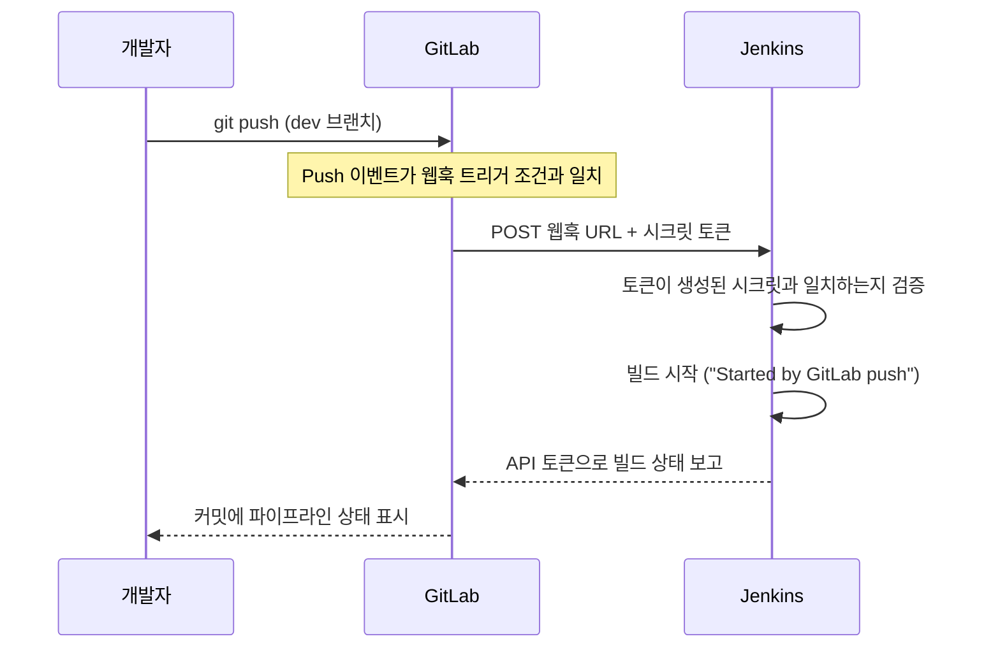

# GitLab 설정과 Push 트리거(Webhook)

## 학습 목표
- `dev`/`main` 브랜치 전략으로 GitLab 저장소에 코드를 푸시한다.
- `push` 시 Jenkins 빌드가 자동으로 시작되도록 GitLab과 Jenkins를 연결한다.
- 공유 시크릿 토큰으로 보호되는 GitLab 웹훅을 설정하고 동작을 확인한다.

## 본문

파이프라인의 목적은 명령어를 손으로 실행하는 것이 아니라 *코드 푸시* 하나로 모든 작업이 시작되게 하는 것이다. 이를 위해 코드를 올릴 장소(GitLab)와 Jenkins에 "뭔가 바뀌었다"고 알리는 수단(웹훅)이 필요하다. 이번 강의에서 이 둘을 연결한다.

### Task 1 — 앱을 GitLab에 푸시하기

**무엇을, 왜:** Jenkins가 감시할 저장소가 있어야 한다. 이전 강의에서 만든 Dockerfile이 포함된 앱을 새 GitLab 프로젝트에 푸시한다.

```bash
git init
git remote add origin https://gitlab.com/<your-namespace>/<your-project>.git
git add .
git commit -m "Initial commit with Dockerfile"
git push -u origin main

# 일상 작업용 dev 브랜치 생성
git checkout -b dev
git push -u origin dev
```

> 브랜치 전략: 일상 작업은 `dev`에서 하고 `main`은 "배포 대상"으로 유지한다. 트리거를 `dev`에만 걸어두면 배포 브랜치를 건드리지 않고 마음껏 실험할 수 있다.

### Task 2 — GitLab 개인 액세스 토큰 만들기

**무엇을, 왜:** Jenkins가 GitLab API와 통신하려면 토큰이 필요하다.

1. GitLab → 아바타(좌상단) → **Preferences**(구 UI: **Edit profile**) → **Access Tokens**.
2. **Add new token**을 클릭해 이름과 만료일을 설정하고 범위를 **api**로 지정한다.
3. **토큰을 즉시 복사한다** — GitLab은 단 한 번만 보여 준다. 잃어버리면 새 토큰을 만들어야 한다.

### Task 3 — Jenkins에 GitLab 플러그인 설치하기

**무엇을, 왜:** 이 플러그인이 있어야 GitLab이 빌드를 트리거할 수 있고, Jenkins가 빌드 결과를 GitLab에 보고할 수 있다.

- **Manage Jenkins → Plugins → Available** → **GitLab** 검색 → 설치.
- **GitLab API Plugin**이 자동으로 함께 설치된다.

### Task 4 — Jenkins에 GitLab 연결 생성하기

**무엇을, 왜:** GitLab 서버와 API 토큰을 등록해 Jenkins가 인증할 수 있도록 한다.

**Manage Jenkins → System → GitLab** 섹션:

- **Connection name** — 원하는 이름, 예: `gitlab-saas`.
- **GitLab host URL** — `https://gitlab.com`(SaaS) 또는 자체 호스팅 URL.
- **Credentials** → **Add** → 종류: **GitLab API token** → Task 2에서 복사한 토큰 붙여넣기.

**Test Connection**을 클릭해 성공 메시지를 확인하고 **Save**한다.

### Task 5 — Jenkins 잡이 푸시를 감지하도록 설정하기

**무엇을, 왜:** 어떤 이벤트가 빌드를 시작할지 잡에 알려준다.

파이프라인 잡 설정 → **Build Triggers** → **"Build when a change is pushed to GitLab"** 활성화. **Push Events**(필요 시 **Merge Request Events**도) 선택.

이어서 **Advanced**를 펼치고 **Generate**를 클릭해 **시크릿 토큰**을 생성한다. 토큰을 복사해 두고, 이 화면에 표시된 **웹훅 URL**도 함께 메모한다. 다음 단계에서 둘 다 사용한다. **Save**.

### Task 6 — GitLab에 웹훅 만들기

**무엇을, 왜:** 웹훅은 이벤트가 발생했을 때 GitLab이 실제로 호출하는 대상이다. Jenkins에서 가져온 URL과 시크릿 토큰을 그대로 입력해야 양쪽이 맞아떨어진다.

GitLab 프로젝트 → **Settings → Webhooks**:

- **URL** — Jenkins에서 복사한 웹훅 URL(Task 5).
- **Secret token** — Jenkins에서 생성한 토큰(Task 5).
- 트리거: **Push events** 선택 후 브랜치 지정.
- **Add webhook**.

> 연결의 핵심은 단 두 가지다. Jenkins 잡을 가리키는 **URL**과, 요청이 진짜 GitLab 프로젝트에서 왔음을 증명하는 **공유 시크릿 토큰**. 이 둘이 양쪽에서 일치하면 된다.

GitLab의 **Test → Push events**로 샘플 이벤트를 보내 연결이 정상인지 확인한다.

### Task 7 — 엔드투엔드 검증

**무엇을, 왜:** 실제 푸시 한 번으로 빌드가 자동으로 시작되는지 확인한다.

```bash
git checkout dev
echo "trigger test" >> README.md
git commit -am "Test webhook"
git push
```

Jenkins를 지켜보자. 1~2초 안에 새 빌드가 나타나고 콘솔 출력에 **"Started by GitLab push"**가 표시된다. 이제 명령어가 아니라 코드 푸시가 파이프라인을 움직인다.

아래 시퀀스 다이어그램은 `git push`부터 Jenkins가 자동으로 빌드를 시작하기까지의 흐름을 전체적으로 보여 준다.



## 핵심 정리
- GitLab에 코드를 푸시하는 것 자체가 파이프라인을 시작한다. 더 이상 명령어를 직접 실행할 필요가 없다.
- 웹훅은 Jenkins가 반복 폴링하는 대신 GitLab이 이벤트 발생 즉시 알림을 보내는 방식이다.
- 연결은 두 가지 사실이 양쪽에서 일치해야 성립한다. Jenkins 잡을 가리키는 **URL**과 요청을 인증하는 **공유 시크릿 토큰**.
- 잡에서 "GitLab에 변경이 푸시되면 빌드"를 활성화하고, GitLab에 매칭 웹훅을 만든 뒤, 실제 푸시 후 "Started by GitLab push"가 나타나는지로 동작을 확인한다.

## 출처
- https://www.youtube.com/watch?v=_8YjWDmLvAE
- https://www.youtube.com/watch?v=SObrdM1ev3M
