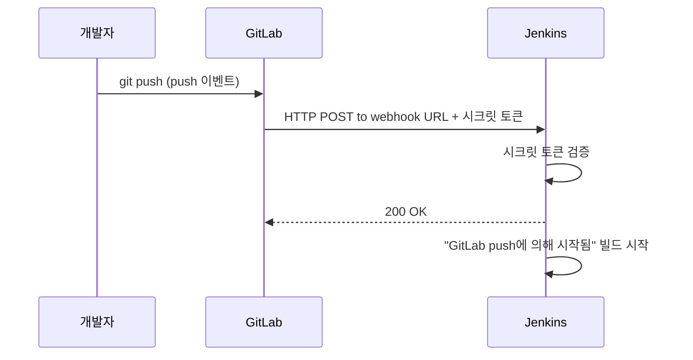

# GitLab 저장소 구성과 Push 트리거(Webhook)

## 학습 목표
- GitLab 저장소를 만들고 코드를 푸시하는 기본 흐름과 브랜치 전략을 이해한다.
- GitLab 웹훅이 push 이벤트를 Jenkins에 전달하는 원리와 보안 방식을 안다.
- GitLab과 Jenkins를 연결해 코드 푸시 시 파이프라인이 자동 트리거되도록 설정한다.

## 본문

### 저장소가 트리거다

이전 강의에서 이미지를 직접 손으로 빌드했다. 파이프라인의 목적은 그 수동 작업을 없애는 것이다. 즉 *코드 푸시* 하나가 모든 것을 시작하게 만든다. 그러려면 두 가지가 필요하다. 코드를 올릴 장소(GitLab)와 "뭔가 바뀌었으니 일 시작해"라고 Jenkins에 알리는 메커니즘(웹훅). 이번 강의에서 이 둘을 연결한다.

### GitLab과 브랜치 전략 간단 정리

GitLab에 프로젝트를 만들고 이전 강의에서 만든 Dockerfile이 포함된 앱을 푸시한다.

```bash
git init
git remote add origin https://gitlab.com/<your-namespace>/<your-project>.git
git add .
git commit -m "Initial commit with Dockerfile"
git push -u origin main
```

파이프라인을 안정적으로 운영하려면 간단한 **브랜치 전략**이 필요하다. 일상적인 작업은 `dev`(또는 feature) 브랜치에서 하고, `main`은 언제든 배포 가능한 상태를 나타내는 브랜치로 유지한다. 파이프라인이 어느 브랜치의 푸시에 반응할지는 자유롭게 설정할 수 있다. 학습 중에는 `dev` 브랜치 푸시에만 트리거를 걸어 놓으면 배포 브랜치를 건드리지 않고 마음껏 실험할 수 있다.

### 웹훅이란 실제로 무엇인가

**웹훅**은 GitLab이 "뭔가 일어났을 때 알려줄게"라고 말하는 방식이다. Jenkins가 GitLab에 "새 내용 있어요?"라고 계속 묻는 방식(폴링) 대신, GitLab이 push 같은 이벤트가 발생하는 즉시 지정한 URL로 HTTP 요청을 능동적으로 보낸다. 우편함을 계속 확인하러 나가는 것과 집배원이 도착하면 초인종을 눌러주는 것의 차이다.

아래 시퀀스 다이어그램은 `push` 한 번이 Jenkins 빌드 시작으로 이어지는 과정과, 시크릿 토큰이 요청의 신뢰성을 어떻게 증명하는지 보여 준다.



GitLab에서 Jenkins에 연결하는 방법은 두 가지로, 둘 다 알아두면 좋다.

- **Jenkins 통합(Integration)** — 공식 권장 방법. GitLab 플러그인과 Jenkins를 저장된 연결로 잇는다. 빌드 결과를 GitLab UI에 다시 보고하는 기능도 있다.
- **순수 웹훅** — 보다 직접적인 방법. GitLab이 토큰으로 보호된 Jenkins URL에 POST를 보내는 방식이다.

이 강좌에서는 통합 방식으로 연결하되, 내부에서 어떤 일이 벌어지는지 이해할 수 있도록 순수 웹훅도 함께 살펴본다.

### 1단계 — GitLab 개인 액세스 토큰 만들기

Jenkins가 GitLab API와 통신하려면 권한이 필요하다. 최신 GitLab UI에서는 아바타(좌상단) → **Preferences**(구 버전은 **Edit profile**) → 좌측 메뉴의 **Access Tokens**로 이동한다. **Add new token**을 클릭하고 이름과 만료일을 설정하되 — 이 부분이 핵심 — 범위를 반드시 **api**로 지정한다. 토큰을 즉시 복사한다. GitLab은 딱 한 번만 보여 주며 이후 절대 다시 확인할 수 없다. 잃어버리면 새 토큰을 만들어야 한다.

### 2단계 — Jenkins에 GitLab 플러그인 설치

Jenkins에서 **Manage Jenkins → Plugins → Available**로 이동해 **GitLab**을 검색하고 설치한다(**GitLab API Plugin**이 함께 설치된다). GitLab이 빌드를 트리거하고 Jenkins가 결과를 GitLab에 다시 표시할 수 있게 해주는 플러그인이다.

### 3단계 — Jenkins에 GitLab 연결 생성

**Manage Jenkins → System**으로 이동해 새로 생긴 **GitLab** 섹션을 찾는다. 다음 항목을 채운다.

- **Connection name** — 원하는 이름(예: `gitlab-saas`).
- **GitLab host URL** — GitLab SaaS라면 `https://gitlab.com`, 자체 서버라면 해당 서버 URL.
- **Credentials** — **Add**를 클릭해 종류를 **GitLab API token**으로 선택하고 1단계에서 복사한 토큰을 붙여 넣는다.

저장 후 **Test Connection**을 클릭한다. 성공 메시지가 나오면 Jenkins가 GitLab에 접근할 수 있다는 의미다.

### 4단계 — Jenkins 잡이 푸시를 감지하도록 설정

Jenkins 파이프라인 잡 설정에서 **Build Triggers**를 찾아 **"Build when a change is pushed to GitLab"**을 활성화한다. 반응할 이벤트를 선택한다 — 보통 **Push Events**와 **Merge Request Events**를 선택한다. 이 설정이 어떤 알림이 실제로 빌드를 시작할지 결정한다.

### 5단계 — GitLab에 웹훅 생성

GitLab 프로젝트의 **Settings → Webhooks**로 이동한다. Jenkins의 Build Triggers 섹션에 표시된 두 가지 정보가 필요하다.

- **URL** — Jenkins가 이 잡을 위해 노출하는 엔드포인트(Jenkins가 정확한 URL을 보여 준다).
- **Secret token** — Jenkins에서 **Generate**를 클릭해 생성한 뒤 GitLab 웹훅의 시크릿 토큰 필드에 붙여 넣는다.

시크릿 토큰의 역할: 들어온 요청이 URL을 짐작한 외부인이 보낸 것이 아니라 실제 GitLab 프로젝트에서 온 것임을 Jenkins가 검증하는 수단이다. **Push events**를 선택하고 브랜치를 지정한 뒤 훅을 추가한다. GitLab의 **Test → Push events** 버튼으로 샘플 이벤트를 보내 연결이 정상인지 확인할 수 있다.

> 연결 전체는 양쪽에서 일치해야 하는 두 가지 사실로 이루어진다. Jenkins 잡을 가리키는 **URL**과, 요청이 진짜임을 증명하는 **공유 시크릿 토큰**. 이 둘을 맞추면 트리거가 동작한다.

### 6단계 — 엔드투엔드 확인

사소한 변경을 만들어 `dev` 브랜치에 커밋한다.

```bash
git checkout dev
echo "trigger test" >> README.md
git commit -am "Test webhook"
git push
```

Jenkins를 지켜보자. 1~2초 안에 새 빌드가 나타나고 콘솔 출력에 내 사용자 이름으로 **"Started by GitLab push"**가 표시된다. 이제 자동 트리거가 생겼다. 앞으로는 명령어가 아니라 코드 푸시가 파이프라인을 움직인다. 다음 강의에서는 트리거가 발생했을 때 Jenkins가 실제로 무엇을 할지 정의한다.

## 핵심 정리
- 명령어 실행이 아니라 GitLab에 코드를 푸시하는 것이 파이프라인을 시작하게 되므로, GitLab과 Jenkins를 연결하는 일이 자동화의 기반이다.
- 웹훅은 GitLab이 변경 사항을 Jenkins에 능동적으로 알리는 방식이다. Jenkins가 반복적으로 폴링할 필요가 없다.
- 연결은 두 가지 사실이 일치해야 성립한다. Jenkins 잡을 가리키는 **URL**과 요청을 인증하는 **공유 시크릿 토큰**.
- Jenkins 잡에서 "GitLab에 변경이 푸시되면 빌드"를 활성화하고 GitLab에 매칭되는 웹훅을 만든 뒤, 실제 푸시 후 "Started by GitLab push"가 나타나는지로 동작을 검증한다.
