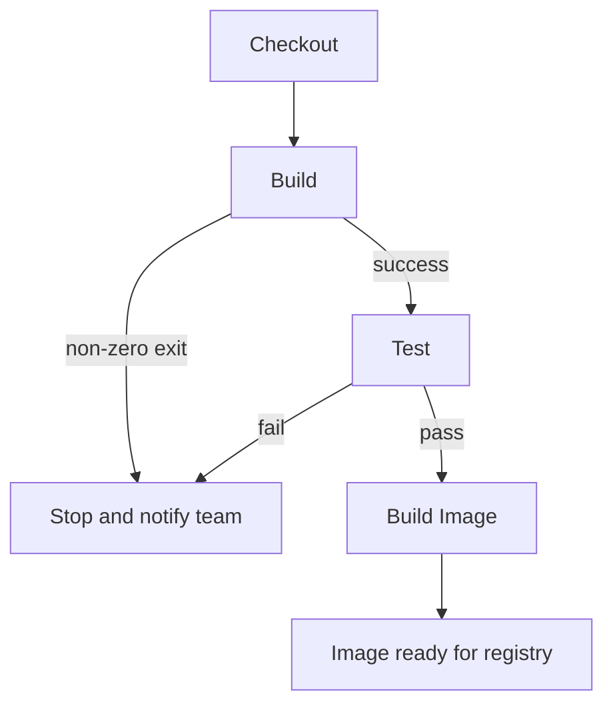

# The CI Stages — Build, Test, and Create the Image

## Learning Objectives
- Add `build` and `test` stages to your Jenkinsfile so the pipeline stops the moment something fails.
- Build a Docker image only after the tests have passed.
- Understand how CI acts as an automatic quality gate that keeps bad code from moving forward.

## Body

### Why this stage is the heart of CI

So far your pipeline triggers on a push and checks out the code. Useful, but it doesn't yet *protect* you from anything. The Continuous Integration stages are where the real value appears: they automatically verify every change so that broken code is caught in seconds, by a machine, instead of in production, by your customers.

The principle to keep in front of you is **fail fast**. If the build won't compile, don't bother testing. If a test fails, don't bother building an image. Each stage is a gate, and a closed gate stops the entire pipeline cold and notifies the team. In a declarative Jenkinsfile this behavior is the default: if any step in a stage returns a non-zero exit code, the build is marked failed and the remaining stages never run.

The flowchart below shows the fail-fast gating: each stage only proceeds on success, and any failure halts the pipeline before an image is ever built.



> A failing test that turns your pipeline red is not a problem — it's the pipeline doing its single most important job. The goal of CI is to make failures cheap, fast, and impossible to ignore.

### Adding the build stage

The build stage assembles your code together with its dependencies. What "build" means depends on your language — for a compiled language it might be `mvn clean package`; for an interpreted one it might be installing dependencies. The shape is the same: run a command, and let a non-zero exit code fail the stage.

```groovy
stage('Build') {
    steps {
        sh 'npm ci'
        sh 'npm run build'
    }
}
```

The `sh` step runs a shell command on the agent (use `bat` instead on Windows agents). If `npm ci` or `npm run build` fails, the pipeline stops here — there's no point testing code that didn't even assemble.

### Adding the test stage

Next comes the gate that actually catches bugs. Run your automated tests as a stage; if any test fails, the stage fails, and everything downstream is cancelled:

```groovy
stage('Test') {
    steps {
        sh 'npm test'
    }
}
```

This is the moment the source material illustrated so well: a developer changed a greeting from "hello world" to "hello CI/CD world," but a test still asserted the old value. The test failed, the pipeline went red, and the bad change was caught automatically — exactly as intended. That fast feedback loop is the entire point. Tests can be unit tests (individual functions), integration tests (components working together), or format/lint checks, and you can publish their results so the Jenkins UI shows which passed and which failed for every build.

A useful refinement: collect test reports even when the run fails, so you can always see what broke. The `post` block runs after a stage regardless of outcome:

```groovy
stage('Test') {
    steps {
        sh 'npm test'
    }
    post {
        always {
            junit 'reports/**/*.xml'
        }
    }
}
```

### Building the image — but only after tests pass

Because the stages run in order and a failure halts the pipeline, simply placing the image build *after* the test stage guarantees it only runs on green tests. This is the bridge to the rest of the course: the artifact this stage produces is the Docker image we'll push and deploy in the next lectures.

```groovy
stage('Build Image') {
    steps {
        sh 'docker build -t myapp:${BUILD_NUMBER} .'
    }
}
```

Two practitioner habits are worth adopting here. First, **never tag your image `latest` in a pipeline.** A floating `latest` tag makes it impossible to know which exact build is running where, and rollbacks become guesswork. Tag with something unique and traceable — above we use `${BUILD_NUMBER}`, a built-in Jenkins variable; in the next lecture we'll switch to the Git commit SHA for an even tighter link between code and image. Second, the Jenkins agent needs access to a Docker daemon to run `docker build`; the common setup is to give the Jenkins container access to the host's Docker socket so it can build images on the host.

### The full picture so far

Putting the new stages together, your Jenkinsfile now reads as a clear, ordered quality gate:

```groovy
pipeline {
    agent any
    stages {
        stage('Checkout')    { steps { checkout scm } }
        stage('Build')       { steps { sh 'npm ci'; sh 'npm run build' } }
        stage('Test')        { steps { sh 'npm test' } }
        stage('Build Image') { steps { sh 'docker build -t myapp:${BUILD_NUMBER} .' } }
    }
}
```

Read top to bottom, this is Continuous Integration in its essence: every push is automatically checked out, built, tested, and — only if all of that succeeds — turned into a deployable image. No human had to remember to run the tests, and no untested code can produce an image. That image is now ready to be stored in a registry, which is exactly where the next lecture takes us.

## Key Takeaways
- CI stages turn your pipeline into an automatic quality gate; the core principle is **fail fast** — a failed stage halts the pipeline and notifies the team.
- In a declarative pipeline, a non-zero exit code fails the stage by default, so ordering Build → Test → Build Image guarantees the image is only created from green, tested code.
- Run your real automated tests in the test stage and consider publishing reports (e.g. with `junit`) so results are visible for every build.
- Tag images with a unique, traceable value like the build number or commit SHA — never a floating `latest` — so you always know exactly what's running and can roll back cleanly.
