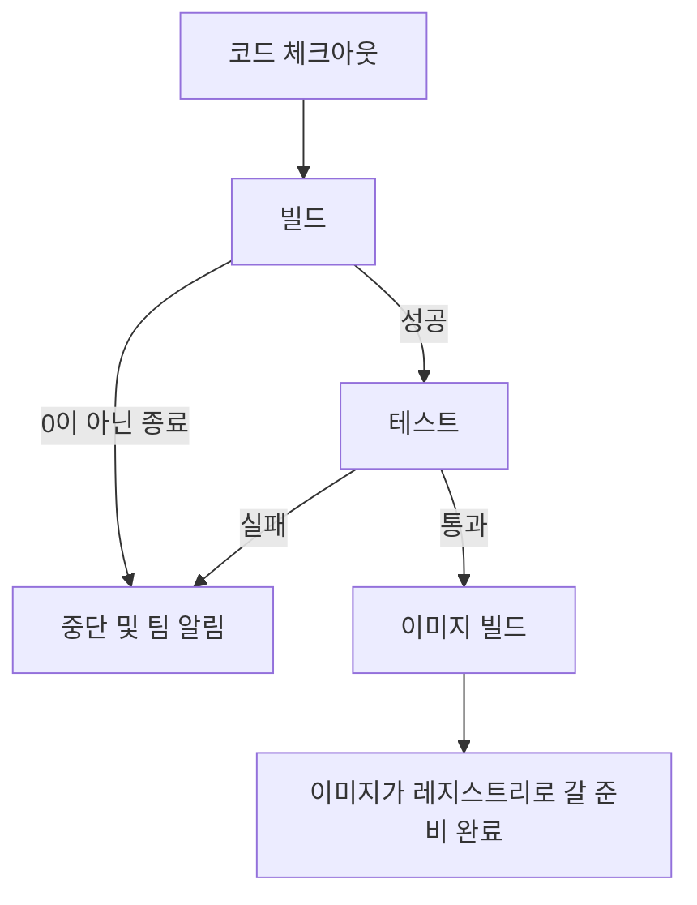

# CI 스테이지 — 빌드, 테스트, 이미지 생성

## 학습 목표
- Jenkinsfile에 `build`와 `test` 스테이지를 추가하고 실패 시 파이프라인이 중단되게 한다.
- 테스트 통과 후에만 Docker 이미지를 빌드하는 스테이지를 구성한다.
- CI가 코드 품질을 자동으로 거르는 역할을 이해한다.

## 본문

### CI의 핵심이 이 스테이지다

지금까지 파이프라인은 푸시를 감지하고 코드를 체크아웃한다. 나름 유용하지만 아직 아무것도 *보호*하지 않는다. 진정한 가치는 지속적 통합 스테이지에서 나타난다. 모든 변경을 자동으로 검증해서 나쁜 코드를 고객이 발견하기 전에 몇 초 안에 잡아낸다.

핵심 원칙은 **빠른 실패(fail fast)**다. 빌드가 컴파일조차 안 되면 테스트를 돌릴 필요가 없다. 테스트가 실패하면 이미지를 빌드할 필요가 없다. 각 스테이지는 게이트이고, 닫힌 게이트는 파이프라인 전체를 즉시 멈추고 팀에 알린다. 선언적 Jenkinsfile에서는 이 동작이 기본이다. 스테이지의 어떤 스텝이 0이 아닌 종료 코드를 반환하면 빌드가 실패로 표시되고 나머지 스테이지는 실행되지 않는다.

아래 순서도는 빠른 실패 방식의 게이팅을 보여 준다. 각 스테이지는 성공했을 때만 다음으로 넘어가고, 어디서든 실패하면 이미지가 만들어지기 전에 파이프라인이 멈춘다.



> 파이프라인을 빨갛게 만드는 테스트 실패는 문제가 아니다. 파이프라인이 가장 중요한 역할을 하는 순간이다. CI의 목표는 실패를 빠르고 싸게 만들어 누구도 무시할 수 없게 하는 것이다.

### 빌드 스테이지 추가하기

빌드 스테이지는 코드를 의존성과 함께 조립한다. "빌드"의 의미는 언어에 따라 다르다. 컴파일 언어라면 `mvn clean package` 같은 명령일 수 있고, 인터프리터 언어라면 의존성 설치일 수 있다. 형태는 같다. 명령을 실행하고 0이 아닌 종료 코드가 스테이지를 실패시킨다.

```groovy
stage('Build') {
    steps {
        sh 'npm ci'
        sh 'npm run build'
    }
}
```

`sh` 스텝은 에이전트에서 셸 명령을 실행한다(Windows 에이전트에서는 `bat`을 사용). `npm ci`나 `npm run build`가 실패하면 파이프라인이 여기서 멈춘다. 의존성도 설치하지 못한 코드를 테스트할 이유가 없기 때문이다.

### 테스트 스테이지 추가하기

다음은 버그를 실제로 잡는 게이트다. 자동화 테스트를 스테이지로 실행하고, 테스트가 하나라도 실패하면 스테이지가 실패하고 이후 모든 것이 취소된다.

```groovy
stage('Test') {
    steps {
        sh 'npm test'
    }
}
```

소스 자료에 잘 나온 사례를 여기서 그대로 볼 수 있다. 개발자가 인사말을 "hello world"에서 "hello CI/CD world"로 바꿨지만 테스트가 여전히 이전 값을 검증하고 있었다. 테스트가 실패하고 파이프라인이 빨갛게 됐다. 나쁜 변경이 자동으로 잡혔다. 의도한 대로다. 그 빠른 피드백 루프가 CI의 전부다. 단위 테스트(개별 함수), 통합 테스트(컴포넌트 간 상호작용), 형식/린트 검사 등 다양한 테스트를 실행할 수 있고, 결과를 게시해 Jenkins UI에서 모든 빌드마다 어떤 테스트가 통과하고 실패했는지 볼 수 있다.

유용한 개선: 실행이 실패해도 테스트 리포트를 수집하면 무엇이 잘못됐는지 항상 볼 수 있다. `post` 블록은 스테이지 결과와 무관하게 실행된다.

```groovy
stage('Test') {
    steps {
        sh 'npm test'
    }
    post {
        always {
            junit 'reports/**/*.xml'
        }
    }
}
```

### 테스트 통과 후에만 이미지 빌드하기

스테이지가 순서대로 실행되고 실패 시 파이프라인이 멈추므로, 이미지 빌드를 테스트 스테이지 *다음에* 배치하기만 하면 초록 테스트에서만 실행된다는 보장이 생긴다. 이 스테이지가 만드는 산출물이 다음 강의에서 푸시하고 배포할 Docker 이미지다.

```groovy
stage('Build Image') {
    steps {
        sh 'docker build -t myapp:${BUILD_NUMBER} .'
    }
}
```

여기서 익혀 둘 실무 습관이 두 가지 있다. 첫째, **파이프라인에서 이미지 태그로 `latest`를 절대 쓰지 않는다.** `latest` 태그는 어느 빌드의 이미지인지 알 수 없게 만들어 롤백이 불가능해진다. 추적 가능한 고유 값으로 태그한다. 위에서는 `${BUILD_NUMBER}` — Jenkins 내장 변수 — 를 사용했다. 다음 강의에서는 코드와 이미지 사이의 연결을 더 강화하기 위해 Git 커밋 SHA로 전환한다. 둘째, Jenkins 에이전트가 `docker build`를 실행하려면 Docker 데몬에 접근할 수 있어야 한다. 흔한 설정은 Jenkins 컨테이너에 호스트 Docker 소켓 접근 권한을 주어 호스트에서 이미지를 빌드하게 하는 것이다.

### 지금까지의 전체 그림

새 스테이지를 합치면 Jenkinsfile이 명확하고 순서 있는 품질 게이트로 읽힌다.

```groovy
pipeline {
    agent any
    stages {
        stage('Checkout')    { steps { checkout scm } }
        stage('Build')       { steps { sh 'npm ci'; sh 'npm run build' } }
        stage('Test')        { steps { sh 'npm test' } }
        stage('Build Image') { steps { sh 'docker build -t myapp:${BUILD_NUMBER} .' } }
    }
}
```

위에서 아래로 읽으면, 이것이 지속적 통합의 본질이다. 모든 푸시가 자동으로 체크아웃되고, 빌드되고, 테스트되고, 그 모든 것이 성공했을 때만 배포 가능한 이미지가 만들어진다. 사람이 테스트 실행을 기억할 필요가 없고, 테스트를 거치지 않은 코드는 이미지를 만들 수 없다. 그 이미지는 이제 레지스트리에 저장될 준비가 됐고, 다음 강의에서 바로 그 작업을 한다.

## 핵심 정리
- CI 스테이지는 파이프라인을 자동 품질 게이트로 만든다. 핵심 원칙은 **빠른 실패** — 스테이지가 실패하면 파이프라인이 멈추고 팀에 알린다.
- 선언적 파이프라인에서는 0이 아닌 종료 코드가 기본으로 스테이지를 실패시키므로, Build → Test → Build Image 순서만 지키면 이미지가 초록 테스트를 통과한 코드에서만 생성된다는 보장이 생긴다.
- 테스트 스테이지에서 실제 자동화 테스트를 실행하고, 결과를 게시(예: `junit`)해 모든 빌드의 결과를 볼 수 있게 한다.
- `latest` 같은 유동 태그 대신 빌드 번호나 커밋 SHA 같은 고유하고 추적 가능한 값으로 이미지를 태그한다. 실행 중인 컨테이너를 정확히 알고 깔끔하게 롤백하기 위해 필요하다.
