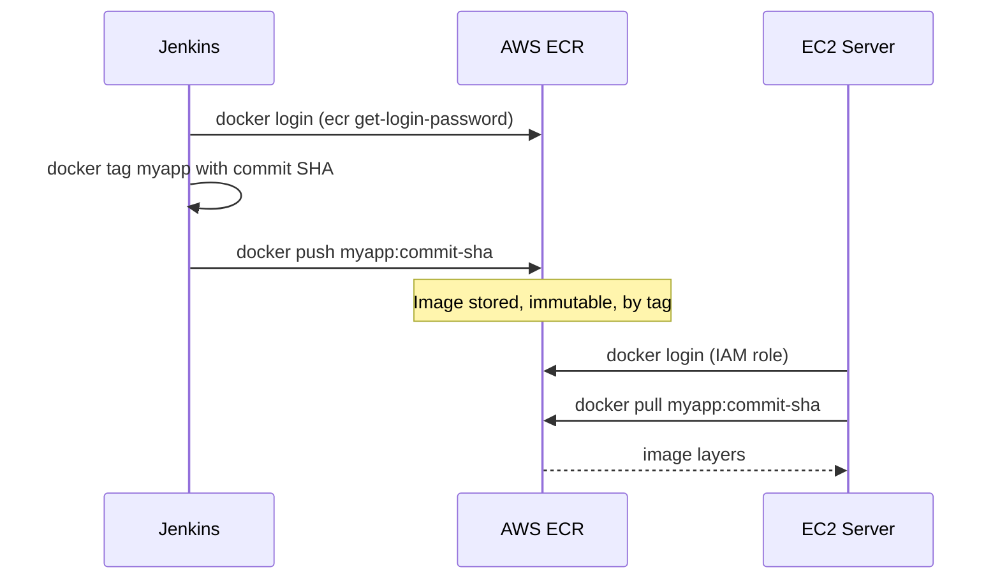

# Pushing the Image to a Registry (AWS ECR)

## Learning Objectives
- Understand the role of a container registry (ECR) and why you store built images there.
- Authenticate to ECR from Jenkins and push an image.
- Adopt an image tagging strategy based on the commit SHA.

## Body

### Why an image needs a home

In the last lecture Jenkins built a Docker image — but that image only exists on the Jenkins agent that built it. Your EC2 server can't reach inside Jenkins and grab it. We need a shared, central place to *store* images that both Jenkins (which pushes) and EC2 (which pulls) can access. That place is a **container registry**.

**Amazon ECR (Elastic Container Registry)** is AWS's private Docker registry. It plays the same role as Docker Hub but lives inside your AWS account, with access controlled by AWS permissions — a natural fit since we're deploying to EC2 anyway. The flow is simple to picture: Jenkins **pushes** the built image *up* to ECR, and later EC2 **pulls** that same image *down* to run it. ECR is the hand-off point between the CI half of the pipeline (build and test) and the CD half (deploy).

The sequence below shows that hand-off: Jenkins authenticates, tags, and pushes the image up to ECR, and later EC2 pulls the very same image down — the two halves never talk directly.



> A registry decouples *building* an image from *running* it. Jenkins doesn't need to know anything about your servers, and your servers don't need build tools — they just pull a finished, immutable image by its tag. That separation is what lets the same image travel cleanly from build to staging to production.

### Step 1 — Create an ECR repository

In the AWS console, open **ECR** and create a repository — give it the name of your app, for example `myapp`. ECR hands you a repository URI in this shape:

```
<aws_account_id>.dkr.ecr.<region>.amazonaws.com/myapp
```

That full URI *is* part of your image tag. Docker decides where to push an image purely from its tag, so to push to ECR you tag the image with that URI.

### Step 2 — Authenticate Jenkins to ECR

You can't push to a private registry without proving who you are. ECR authentication is a two-part dance: you use AWS credentials to obtain a short-lived Docker login password, then feed that password to Docker.

First, store your AWS credentials in Jenkins (never hard-code them). Use the **AWS Credentials** kind in Jenkins' credential store, or provide an access key ID and secret. Then in the pipeline, retrieve a login token and pipe it into `docker login`:

```bash
aws ecr get-login-password --region <region> \
  | docker login --username AWS --password-stdin \
    <aws_account_id>.dkr.ecr.<region>.amazonaws.com
```

`aws ecr get-login-password` returns a temporary password; piping it into `docker login` with `--password-stdin` authenticates Docker to your ECR registry without ever printing the password into the build log. The username is always the literal string `AWS` for ECR.

> In production, the cleaner approach is to attach an **IAM role** to the Jenkins instance so it has ECR permissions automatically, with no long-lived keys to store or rotate. Static access keys work for learning, but rotate them and scope their permissions tightly.

### Step 3 — A tagging strategy that earns its keep

Here's where we make good on a promise from the previous lecture. A tag like `latest` tells you nothing about *which code* an image contains. The professional standard is to tag images with the **Git commit SHA** — the unique fingerprint of the exact commit that produced them. That gives you a permanent, traceable link: given any running container, you can find the precise line of code it was built from, and vice versa.

In a Jenkinsfile you can capture the short SHA and use it as the tag:

```groovy
stage('Push to ECR') {
    steps {
        script {
            def registry = "<aws_account_id>.dkr.ecr.<region>.amazonaws.com"
            def commit = sh(script: 'git rev-parse --short HEAD', returnStdout: true).trim()
            sh """
                aws ecr get-login-password --region <region> \
                  | docker login --username AWS --password-stdin ${registry}
                docker tag myapp:${BUILD_NUMBER} ${registry}/myapp:${commit}
                docker push ${registry}/myapp:${commit}
            """
        }
    }
}
```

A common refinement is to push *two* tags from the same image: the immutable `${commit}` tag for traceability and rollback, plus a moving tag like the branch name (`main`) so deployment scripts have a stable "newest on this branch" pointer. The commit tag is the source of truth; the branch tag is a convenience.

### Step 4 — Confirm the push

After the pipeline runs, open the ECR console and look at your repository. You'll see the image listed with its commit-SHA tag and a "pushed" timestamp. That's your proof: the artifact built and tested moments ago now lives in a durable, private registry, ready for any server with permission to pull it.

### Where this leaves the pipeline

Your pipeline now does everything *except* run the new version on a server. A push to GitLab triggers Jenkins to check out, build, test, build an image, and store that image in ECR — tagged so you'll always know exactly what it contains. The only remaining gap is getting that image onto EC2 and running it, which is precisely what the next lecture completes.

## Key Takeaways
- A container registry like **ECR** is the shared storage that lets Jenkins push images and EC2 pull them, cleanly separating *building* from *running*.
- ECR authentication is a two-step flow: use AWS credentials to get a temporary token via `aws ecr get-login-password`, then `docker login` with it — and prefer an IAM role over static keys in production.
- Docker routes a push purely by the image tag, so tag your image with the full ECR repository URI to push there.
- Tag images with the **Git commit SHA** for a permanent, traceable link between running containers and source code; optionally add a moving branch tag for convenience.
