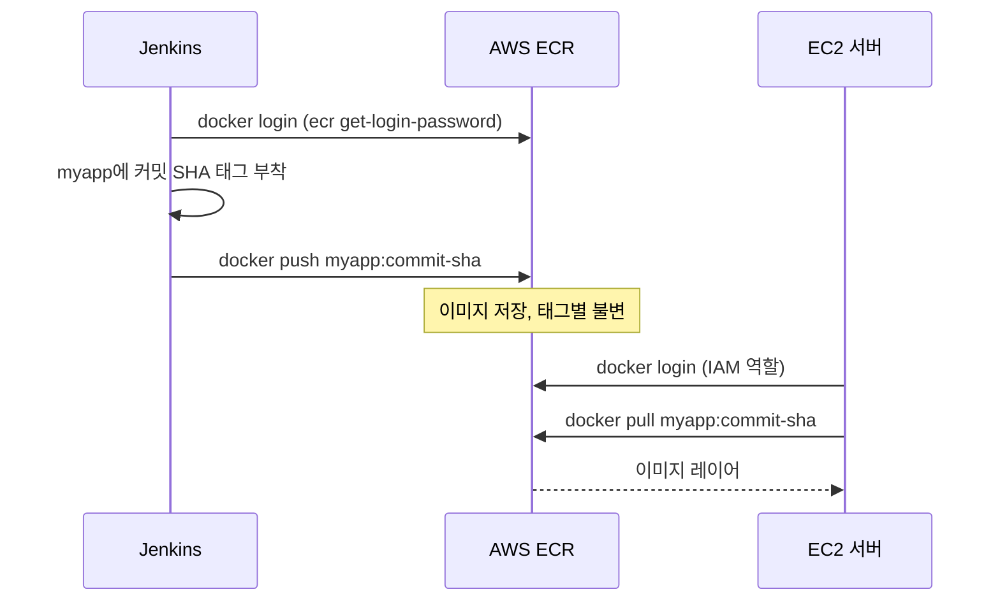

# 이미지 레지스트리에 푸시(AWS ECR)

## 학습 목표
- 컨테이너 레지스트리(ECR)의 역할과 빌드된 이미지를 거기에 보관하는 이유를 이해한다.
- Jenkins에서 ECR 인증을 처리하고 이미지를 푸시한다.
- 커밋 SHA 기반 이미지 태깅 전략을 세운다.

## 본문

### 이미지에 집이 필요하다

이전 강의에서 Jenkins가 Docker 이미지를 빌드했지만, 그 이미지는 빌드한 Jenkins 에이전트 위에만 존재한다. EC2 서버가 Jenkins 안으로 들어가 이미지를 가져올 수는 없다. Jenkins(이미지를 push)와 EC2(이미지를 pull) 양쪽 모두 접근할 수 있는 이미지 *저장* 공간이 필요하다. 그 공간이 **컨테이너 레지스트리**다.

**Amazon ECR(Elastic Container Registry)**은 AWS의 프라이빗 Docker 레지스트리다. Docker Hub와 같은 역할을 하지만 AWS 계정 안에 있어 AWS 권한으로 접근을 제어한다. 어차피 EC2에 배포하는 강좌이니 자연스러운 선택이다. 흐름은 단순하다. Jenkins가 빌드된 이미지를 ECR에 **push**하고, 나중에 EC2가 그 이미지를 **pull**해서 실행한다. ECR이 파이프라인의 CI 절반(빌드·테스트)과 CD 절반(배포) 사이의 중간 지점 역할을 한다.

아래 시퀀스 다이어그램은 그 중간 지점을 보여 준다. Jenkins가 인증하고 태그를 붙이고 이미지를 ECR로 push하면, 나중에 EC2가 같은 이미지를 pull한다. 두 절반이 서로 직접 통신하지 않는다.



> 레지스트리는 이미지를 *빌드*하는 것과 *실행*하는 것을 분리한다. Jenkins는 서버에 대해 아무것도 알 필요가 없고, 서버는 빌드 도구가 필요 없다. 완성된 불변 이미지를 태그로 pull하기만 하면 된다. 이 분리 덕분에 동일한 이미지가 빌드에서 스테이징을 거쳐 프로덕션까지 깔끔하게 이동할 수 있다.

### 1단계 — ECR 저장소 만들기

AWS 콘솔에서 **ECR**을 열고 저장소를 만든다. 앱 이름(예: `myapp`)을 붙이면 ECR이 다음 형태의 저장소 URI를 제공한다.

```
<aws_account_id>.dkr.ecr.<region>.amazonaws.com/myapp
```

그 전체 URI가 이미지 태그의 일부가 된다. Docker는 이미지 태그만 보고 어디로 push할지 결정하므로, ECR에 push하려면 이미지를 그 URI로 태그해야 한다.

### 2단계 — Jenkins에서 ECR 인증하기

프라이빗 레지스트리에 push하려면 신원을 증명해야 한다. ECR 인증은 두 단계로 이루어진다. AWS 자격증명으로 단기 Docker 로그인 비밀번호를 얻은 뒤 그것을 Docker에 전달한다.

먼저 Jenkins에 AWS 자격증명을 저장한다(코드에 하드코딩하는 것은 절대 금지). Jenkins의 자격증명 저장소에서 **AWS Credentials** 종류를 사용하거나 액세스 키 ID와 시크릿을 제공한다. 그런 다음 파이프라인에서 로그인 토큰을 가져와 `docker login`에 파이프로 연결한다.

```bash
aws ecr get-login-password --region <region> \
  | docker login --username AWS --password-stdin \
    <aws_account_id>.dkr.ecr.<region>.amazonaws.com
```

`aws ecr get-login-password`는 임시 비밀번호를 반환하고, 그것을 `--password-stdin`과 함께 `docker login`에 파이프로 연결하면 빌드 로그에 비밀번호가 출력되지 않은 채로 Docker가 ECR 레지스트리에 인증된다. ECR에서 사용자 이름은 항상 문자 그대로 `AWS`다.

> 프로덕션에서 더 깔끔한 방법은 Jenkins 인스턴스에 **IAM 역할**을 연결해 ECR 권한을 자동으로 갖게 하는 것이다. 저장하거나 교체해야 할 장기 키가 없어진다. 학습용으로는 정적 액세스 키도 괜찮지만, 사용 후 교체하고 권한 범위를 최소화한다.

### 3단계 — 제값하는 태깅 전략

이전 강의에서 한 약속을 이행할 차례다. `latest` 같은 태그는 그 이미지에 *어떤 코드*가 담겨 있는지 아무것도 알려 주지 않는다. 업계 표준은 이미지를 **Git 커밋 SHA** — 이미지를 만든 정확한 커밋의 고유 지문 — 로 태그하는 것이다. 영구적이고 추적 가능한 연결이 생긴다. 실행 중인 컨테이너가 있으면 정확히 어떤 코드 줄에서 빌드됐는지 찾을 수 있고, 역방향도 마찬가지다.

Jenkinsfile에서 짧은 SHA를 캡처해 태그로 사용할 수 있다.

```groovy
stage('Push to ECR') {
    steps {
        script {
            def registry = "<aws_account_id>.dkr.ecr.<region>.amazonaws.com"
            def commit = sh(script: 'git rev-parse --short HEAD', returnStdout: true).trim()
            sh """
                aws ecr get-login-password --region <region> \
                  | docker login --username AWS --password-stdin ${registry}
                docker tag myapp:${BUILD_NUMBER} ${registry}/myapp:${commit}
                docker push ${registry}/myapp:${commit}
            """
        }
    }
}
```

같은 이미지에 두 개의 태그를 함께 push하는 방법도 있다. 추적성과 롤백을 위한 불변 `${commit}` 태그와, 브랜치 이름(`main`) 같은 "이 브랜치의 최신 이미지" 포인터 역할의 유동 태그. 커밋 태그가 정보의 원천이고 브랜치 태그는 편의를 위한 것이다.

### 4단계 — 푸시 확인하기

파이프라인 실행 후 ECR 콘솔에서 저장소를 열면 커밋 SHA 태그와 "pushed" 타임스탬프가 달린 이미지를 볼 수 있다. 바로 조금 전 빌드하고 테스트한 산출물이 이제 내구성 있는 프라이빗 레지스트리에 저장되어 권한 있는 어떤 서버든 pull할 준비가 됐다는 증거다.

### 파이프라인의 현 상태

이제 파이프라인은 *실행* 단계를 빼고 모든 것을 한다. GitLab 푸시가 Jenkins를 트리거해 체크아웃·빌드·테스트·이미지 빌드·ECR 저장까지 한다. 그 이미지에 정확히 무엇이 담겨 있는지 항상 알 수 있도록 태그도 붙어 있다. 남은 유일한 단계는 그 이미지를 EC2에 올려 실행하는 것이고, 그것이 바로 다음 강의에서 완성하는 내용이다.

## 핵심 정리
- **ECR** 같은 컨테이너 레지스트리는 Jenkins가 이미지를 push하고 EC2가 pull할 수 있는 공유 저장소로, 이미지 *빌드*와 *실행*을 깔끔하게 분리한다.
- ECR 인증은 두 단계다. `aws ecr get-login-password`로 임시 토큰을 얻은 뒤 `docker login`에 전달한다. 프로덕션에서는 정적 키보다 IAM 역할을 선호한다.
- Docker는 이미지 태그만 보고 push 대상을 결정하므로, ECR로 push하려면 이미지 태그에 ECR 저장소 URI 전체를 붙인다.
- 실행 중인 컨테이너와 소스 코드 사이의 영구적이고 추적 가능한 연결을 위해 **Git 커밋 SHA**로 이미지를 태그한다. 편의를 위해 브랜치 이름 태그를 추가할 수도 있다.
