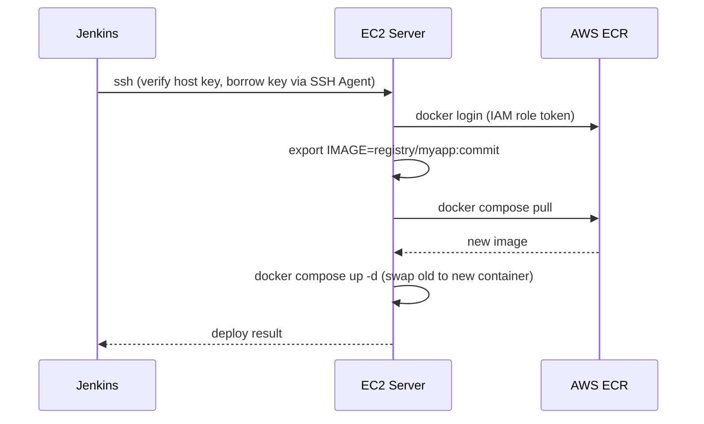

# Automated Deployment to EC2 — SSH + docker compose

## Learning Objectives
- Connect from Jenkins to EC2 securely over SSH.
- Write a deploy stage that pulls the newest image and swaps the running container with docker compose.
- Complete the pipeline so a single push reaches all the way to a live EC2 deployment.

## Body

### The last mile

Everything is in place except the final hand-off: your image sits in ECR, and now it needs to *run* on your EC2 server. This lecture builds the deploy stage that reaches across the network, into the server, and replaces the old version with the new one — automatically, on every successful build. This is the moment the whole pipeline becomes real: one `git push`, and minutes later the new version is live.

### Preparing the EC2 server

Your EC2 instance needs three things ready before Jenkins can deploy to it:

1. **Docker and the Compose plugin installed** — so it can pull images and run containers.
2. **Permission to pull from ECR** — the clean way is to attach an **IAM role** to the EC2 instance granting ECR read access, so the server can authenticate to ECR without any stored keys.
3. **A `docker-compose.yml` file** that describes how to run your app — which image, which ports, which environment.

A minimal compose file on the server looks like this:

```yaml
services:
  web:
    image: ${IMAGE}
    ports:
      - "80:8080"
    restart: always
```

Notice the image is a variable, `${IMAGE}`. Jenkins will supply the exact ECR image tag at deploy time, so the same compose file always runs whatever version the pipeline just built.

### Connecting from Jenkins to EC2 over SSH

Jenkins reaches EC2 the same way you would: over **SSH** (Secure Shell), using the instance's private key. The professional practice is to store that private key in Jenkins' credential store as an **SSH credential** — never paste it into the Jenkinsfile, and never commit it to Git.

There's a second piece of trust most tutorials gloss over: SSH also verifies the *server's* identity. The first time a client connects, SSH records the server's **host key** in a file called `known_hosts`. On every later connection it checks that the server still presents the same key. That check is what stops a **man-in-the-middle (MITM)** attack — an attacker who intercepts your connection and impersonates your server. So before the first automated deploy, register the EC2 host key with Jenkins' SSH agent (the Linux user it runs as):

```bash
# Run once on the Jenkins host, then verify the fingerprint out of band
# (e.g. against the EC2 console) before trusting it
ssh-keyscan -H <EC2_HOST> >> ~/.ssh/known_hosts
```

> Verifying the host key isn't optional polish — it's the only thing standing between your deploy and an attacker silently impersonating your server. Register the key once in `known_hosts` and SSH will refuse to connect if it ever changes.

The **SSH Agent plugin** lets a pipeline borrow a stored key for the duration of a block. With the host key already in `known_hosts`, the deploy block connects securely with full verification — no flags needed to weaken it:

```groovy
stage('Deploy to EC2') {
    steps {
        sshagent(['ec2-ssh-key']) {
            sh """
                ssh ec2-user@<EC2_HOST> '
                    aws ecr get-login-password --region <region> \
                      | docker login --username AWS --password-stdin <registry>
                    export IMAGE=<registry>/myapp:${commit}
                    docker compose -f /home/ec2-user/docker-compose.yml pull
                    docker compose -f /home/ec2-user/docker-compose.yml up -d
                '
            """
        }
    }
}
```

> You'll see `-o StrictHostKeyChecking=no` in many tutorials. It disables host-key verification, which makes the *very* first connection "just work" — but it also throws away your protection against MITM attacks, because SSH will now connect to *any* server answering at that address. Don't make it your default. Prefer pre-populating `known_hosts`; only relax this in a throwaway lab, and understand exactly what you're giving up.

> Treat the SSH private key like the password to your server, because that's exactly what it is. Store it in Jenkins credentials, scope it to this job, and never let it touch your repository or the build log. A leaked deploy key is a leaked server.

### What the deploy stage actually does

Walk through the commands that run *inside* the SSH session, because together they are the deployment:

1. **Log in to ECR** — the EC2 server authenticates so it can pull your private image (thanks to its IAM role, no keys are needed beyond the temporary login token).
2. **Set the `IMAGE` variable** — to the exact commit-tagged image the pipeline built, so the compose file knows precisely what to run.
3. **`docker compose pull`** — downloads the new image from ECR.
4. **`docker compose up -d`** — this is the swap. Compose compares the running container against the desired state; because the image changed, it gracefully stops the old container and starts a new one from the new image. The `-d` runs it detached, in the background.

The sequence below shows those four commands running inside the SSH session that Jenkins opens to EC2.



The beauty of `docker compose up -d` is that it's **declarative**: you describe the desired end state, and Compose figures out what to change. You don't manually stop, remove, and re-run containers in the right order — Compose does the reconciliation for you.

### The completed pipeline

Add this deploy stage after the push stage, and your Jenkinsfile now spans the entire journey:

```groovy
pipeline {
    agent any
    stages {
        stage('Checkout')      { steps { checkout scm } }
        stage('Build & Test')  { steps { sh 'npm ci'; sh 'npm test' } }
        stage('Build Image')   { /* docker build, tagged with commit SHA */ }
        stage('Push to ECR')   { /* login + docker push */ }
        stage('Deploy to EC2') { /* sshagent → compose pull + up -d */ }
    }
}
```

Now do the thing this whole course has been building toward: make a change to your app, commit it, and push to GitLab. Watch the webhook fire, Jenkins march through every stage, and — without you touching a terminal — your EC2 server pull the new image and serve it. Open the server's URL and your change is live.

You've built a complete CI/CD pipeline. There's one more layer of robustness to add, though: right now, if the new version is broken, you'll deploy it anyway. The final lecture adds the safety net — health checks, rollback, and proper secret handling — that makes this pipeline production-worthy.

## Key Takeaways
- The deploy stage uses **SSH** to run commands on EC2; store the private key as a Jenkins SSH credential (e.g. via the SSH Agent plugin) and never put it in your repo.
- Verify the server too: register the EC2 host key in `known_hosts` (e.g. with `ssh-keyscan`) so SSH can detect a man-in-the-middle. Avoid `StrictHostKeyChecking=no` as a default — it disables that protection.
- Prepare EC2 with Docker, an **IAM role** for ECR pull access, and a `docker-compose.yml` whose image is a variable the pipeline fills in.
- The swap is just two commands inside the SSH session — `docker compose pull` then `docker compose up -d` — and Compose declaratively replaces the old container with the new one.
- With this stage added, a single `git push` now flows all the way to a live EC2 deployment with no manual steps.
