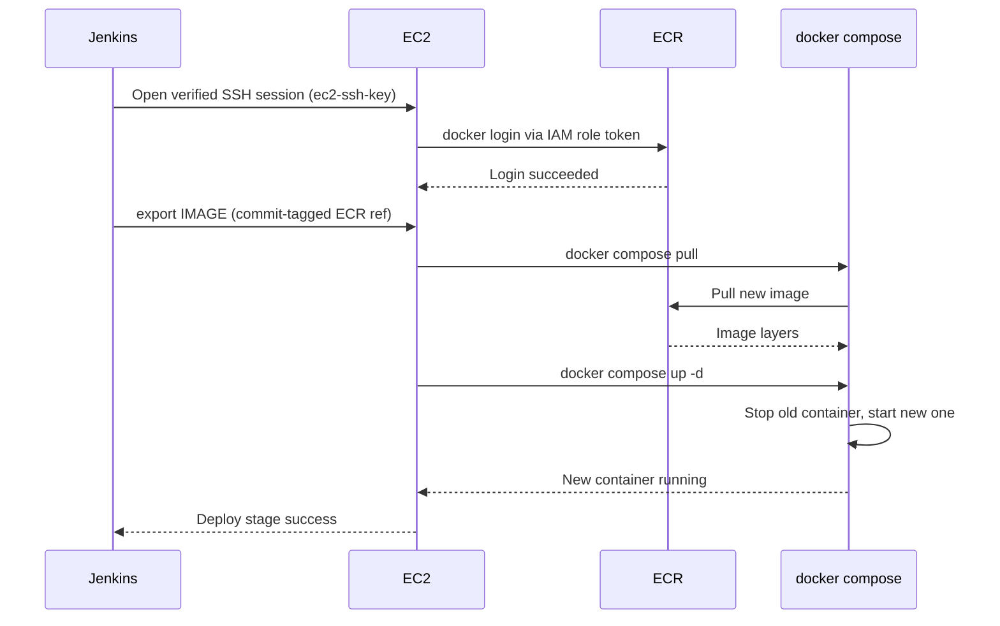

# Automated Deployment to EC2 — SSH + docker compose

## Learning Objectives
- Connect from Jenkins to EC2 securely over SSH.
- Write a deploy stage that pulls the newest image and swaps the running container with docker compose.
- Complete the pipeline so a single push reaches a live EC2 deployment.

## Body

The image is already in ECR. This lecture writes the final stage that runs it on EC2 — Jenkins opens an SSH session, pulls the new image, and swaps the container, automatically on every build.

### Step 1 — Prepare the EC2 server

**What & why:** Jenkins can only deploy if the server is ready to pull and run images. Prepare three things once: Docker + the Compose plugin, an **IAM role** attached to the instance granting ECR read access (so no keys are stored on the box), and a `docker-compose.yml` that describes how to run the app.

Place this compose file on the server (e.g. `/home/ec2-user/docker-compose.yml`):

```yaml
services:
  web:
    image: ${IMAGE}
    ports:
      - "80:8080"
    restart: always
```

`${IMAGE}` is a variable — Jenkins supplies the exact ECR tag at deploy time, so the same file always runs whatever the pipeline just built.

**Verify:** `docker --version && docker compose version` on the instance, and confirm `aws ecr get-login-password --region <region>` returns a token.

### Step 2 — Register the EC2 host key

**What & why:** SSH verifies the *server's* identity using its **host key**, recorded in `known_hosts`. Registering it once lets SSH detect a man-in-the-middle (an attacker impersonating your server). Run this on the Jenkins host as the user Jenkins runs as:

```bash
# Run once, then verify the fingerprint against the EC2 console before trusting it
ssh-keyscan -H <EC2_HOST> >> ~/.ssh/known_hosts
```

> You'll see `-o StrictHostKeyChecking=no` in many tutorials. It disables host-key verification entirely — convenient, but it throws away your protection against MITM. Prefer pre-populating `known_hosts`; only relax it in a throwaway lab.

### Step 3 — Store the SSH key in Jenkins

**What & why:** Jenkins connects with the instance's private key. Store it as an **SSH credential** (e.g. ID `ec2-ssh-key`) and use the **SSH Agent plugin** to borrow it for the deploy block — never paste the key into the Jenkinsfile or commit it.

> Treat the SSH private key like the password to your server, because that's what it is. Scope it to this job and keep it out of your repo and build logs. A leaked deploy key is a leaked server.

### Step 4 — Write the deploy stage

**What & why:** With the host key trusted and the SSH key in credentials, this stage opens a verified SSH session and runs the four commands that make up the deployment.

```groovy
stage('Deploy to EC2') {
    steps {
        sshagent(['ec2-ssh-key']) {
            sh """
                ssh ec2-user@<EC2_HOST> '
                    aws ecr get-login-password --region <region> \
                      | docker login --username AWS --password-stdin <registry>
                    export IMAGE=<registry>/myapp:${commit}
                    docker compose -f /home/ec2-user/docker-compose.yml pull
                    docker compose -f /home/ec2-user/docker-compose.yml up -d
                '
            """
        }
    }
}
```

Inside the SSH session:
1. **`docker login`** — EC2 authenticates to ECR using its IAM role token.
2. **`export IMAGE=...`** — sets the exact commit-tagged image for the compose file.
3. **`docker compose pull`** — downloads the new image.
4. **`docker compose up -d`** — the swap. Compose sees the image changed, stops the old container, and starts a new one detached. It's declarative: you describe the desired state and Compose reconciles it.

The diagram below traces this exchange end to end, from Jenkins opening the SSH session to the new container serving traffic.



### Step 5 — The completed pipeline

Add the deploy stage after the push stage and the Jenkinsfile now spans the whole journey:

```groovy
pipeline {
    agent any
    stages {
        stage('Checkout')      { steps { checkout scm } }
        stage('Build & Test')  { steps { sh 'npm ci'; sh 'npm test' } }
        stage('Build Image')   { /* docker build, tagged with commit SHA */ }
        stage('Push to ECR')   { /* login + docker push */ }
        stage('Deploy to EC2') { /* sshagent → compose pull + up -d */ }
    }
}
```

**Verify the whole loop:** make a change, commit, and push to GitLab. The webhook fires, Jenkins runs every stage, EC2 pulls the new image, and the server serves it. Open the server URL — your change is live, with no manual steps.

The next lecture adds the safety net — health checks, rollback, and secret handling — that makes this production-worthy.

## Key Takeaways
- The deploy stage runs commands on EC2 over **SSH**; store the private key as a Jenkins SSH credential (SSH Agent plugin) and never put it in your repo.
- Register the EC2 host key in `known_hosts` (e.g. `ssh-keyscan`) so SSH can detect a MITM. Avoid `StrictHostKeyChecking=no` as a default.
- Prepare EC2 with Docker, an **IAM role** for ECR pull, and a `docker-compose.yml` whose image is a variable the pipeline fills in.
- The swap is two commands — `docker compose pull` then `docker compose up -d` — and Compose declaratively replaces the old container.
- With this stage, a single `git push` flows all the way to a live EC2 deployment.

## Sources
- https://www.youtube.com/watch?v=nQdyiK7-VlQ
- https://www.youtube.com/watch?v=mAPbPAtRPUw
- https://www.youtube.com/watch?v=j0_keQl-XAg
