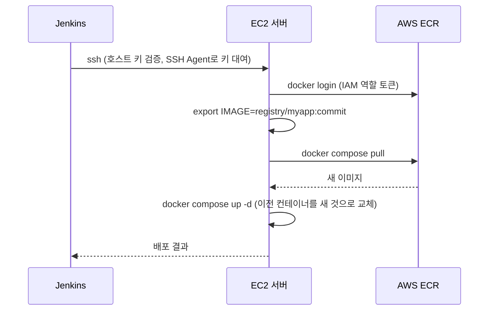

# EC2 자동 배포 — SSH + docker compose

## 학습 목표
- Jenkins에서 EC2로 안전하게 SSH 접속하는 방법을 익힌다.
- 최신 이미지를 pull해 docker compose로 교체 배포하는 스테이지를 작성한다.
- 푸시 한 번으로 EC2까지 배포되는 파이프라인을 완성한다.

## 본문

### 마지막 한 걸음

모든 준비가 끝났다. 이미지가 ECR에 들어 있고, 이제 그것이 EC2 서버에서 *실행*되어야 한다. 이번 강의에서 네트워크를 통해 서버까지 닿아 이전 버전을 새 버전으로 자동 교체하는 배포 스테이지를 만든다. 모든 성공 빌드에서 자동으로. 파이프라인이 현실이 되는 순간이다. `git push` 한 번에 몇 분 후 새 버전이 live 상태가 된다.

### EC2 서버 준비하기

Jenkins가 배포하기 전에 EC2 인스턴스에 세 가지가 준비되어야 한다.

1. **Docker와 Compose 플러그인 설치** — 이미지를 pull하고 컨테이너를 실행하기 위해.
2. **ECR에서 pull할 권한** — EC2 인스턴스에 **IAM 역할**을 연결해 ECR 읽기 권한을 부여하는 것이 깔끔한 방법이다. 저장된 키 없이 서버가 ECR에 인증할 수 있다.
3. **`docker-compose.yml` 파일** — 앱을 어떻게 실행할지 기술하는 파일(사용할 이미지, 포트, 환경 변수 등).

서버에 둘 최소한의 compose 파일은 다음과 같다.

```yaml
services:
  web:
    image: ${IMAGE}
    ports:
      - "80:8080"
    restart: always
```

이미지가 변수 `${IMAGE}`로 되어 있음에 주목하라. Jenkins가 배포 시점에 정확한 ECR 이미지 태그를 공급하므로 같은 compose 파일이 파이프라인이 방금 빌드한 버전을 항상 실행한다.

### Jenkins에서 EC2로 SSH 연결하기

Jenkins는 직접 접속하듯 **SSH(Secure Shell)**를 통해 EC2에 접근한다. 인스턴스의 프라이빗 키를 사용하는데, 전문적인 방법은 그 키를 Jenkins의 자격증명 저장소에 **SSH 자격증명**으로 저장하는 것이다. Jenkinsfile에 직접 붙여 넣거나 Git에 커밋하는 것은 절대 안 된다.

대부분의 튜토리얼이 넘어가는 신뢰의 두 번째 측면이 있다. SSH는 *서버*의 신원도 검증한다. 클라이언트가 처음 연결할 때 SSH는 서버의 **호스트 키**를 `known_hosts`라는 파일에 기록한다. 이후 연결 시마다 서버가 같은 키를 제시하는지 확인한다. 이 확인이 **중간자(MITM) 공격**을 막는다. 공격자가 연결을 가로채고 서버인 척하는 것을 차단한다. 첫 번째 자동 배포 전에 EC2 호스트 키를 Jenkins의 SSH 에이전트에 등록해야 한다.

```bash
# Jenkins 호스트에서 한 번만 실행한 뒤 지문을 대역 외(out-of-band)에서 검증한다
# (예: EC2 콘솔과 비교)
ssh-keyscan -H <EC2_HOST> >> ~/.ssh/known_hosts
```

> 호스트 키 검증은 선택적 마무리 작업이 아니다. 공격자가 서버인 척 접속하는 것을 막는 유일한 수단이다. `known_hosts`에 키를 한 번 등록해 두면 SSH는 키가 바뀔 경우 연결을 거부한다.

**SSH Agent 플러그인**은 파이프라인이 블록 실행 동안 저장된 키를 빌릴 수 있게 한다. 호스트 키가 이미 `known_hosts`에 있으면 배포 블록이 검증을 약화시키는 플래그 없이 안전하게 연결한다.

```groovy
stage('Deploy to EC2') {
    steps {
        sshagent(['ec2-ssh-key']) {
            sh """
                ssh ec2-user@<EC2_HOST> '
                    aws ecr get-login-password --region <region> \
                      | docker login --username AWS --password-stdin <registry>
                    export IMAGE=<registry>/myapp:${commit}
                    docker compose -f /home/ec2-user/docker-compose.yml pull
                    docker compose -f /home/ec2-user/docker-compose.yml up -d
                '
            """
        }
    }
}
```

> 많은 튜토리얼에서 `-o StrictHostKeyChecking=no`를 볼 수 있다. 이 옵션은 호스트 키 검증을 비활성화해 처음 연결이 "그냥 작동"하게 만들지만, 그 주소에 응답하는 어떤 서버에도 SSH가 연결하게 되어 MITM 공격 보호가 완전히 사라진다. 기본값으로 쓰지 않는다. `known_hosts`를 미리 채우는 방법을 쓰고, 임시 학습 환경에서만 완화를 고려하되 무엇을 포기하는지 정확히 이해한 뒤 사용한다.

> SSH 프라이빗 키는 서버 비밀번호와 같다. Jenkins 자격증명에 저장하고 이 잡에 대해서만 범위를 지정하며 절대 저장소나 빌드 로그에 닿지 않게 한다. 배포 키가 유출되면 서버가 유출된 것이다.

### 배포 스테이지가 실제로 하는 일

SSH 세션 *안에서* 실행되는 명령들은 함께 배포를 구성하므로 하나씩 살펴보자.

1. **ECR 로그인** — EC2 서버가 프라이빗 이미지를 pull할 수 있도록 인증한다(IAM 역할 덕분에 임시 로그인 토큰 외에 키가 필요 없다).
2. **`IMAGE` 변수 설정** — 파이프라인이 방금 빌드한 커밋 태그 이미지의 정확한 주소로 설정한다. compose 파일이 정확히 무엇을 실행할지 알 수 있다.
3. **`docker compose pull`** — ECR에서 새 이미지를 다운로드한다.
4. **`docker compose up -d`** — 이것이 교체 명령이다. Compose가 실행 중인 컨테이너와 원하는 상태를 비교하고, 이미지가 바뀌었으므로 이전 컨테이너를 정상적으로 중지하고 새 이미지에서 새 컨테이너를 시작한다. `-d`는 백그라운드로 실행해 SSH 세션에 즉시 제어권을 반환한다.

아래 시퀀스 다이어그램은 Jenkins가 EC2에 열어 실행하는 SSH 세션 안의 네 명령을 보여 준다.



`docker compose up -d`의 장점은 **선언적**이라는 점이다. 원하는 최종 상태를 기술하면 Compose가 무엇을 변경할지 알아서 처리한다. 컨테이너를 올바른 순서로 수동으로 중지·삭제·재실행할 필요가 없다.

### 완성된 파이프라인

이 배포 스테이지를 push 스테이지 뒤에 추가하면 Jenkinsfile이 전체 여정을 담는다.

```groovy
pipeline {
    agent any
    stages {
        stage('Checkout')      { steps { checkout scm } }
        stage('Build & Test')  { steps { sh 'npm ci'; sh 'npm test' } }
        stage('Build Image')   { /* docker build, 커밋 SHA로 태그 */ }
        stage('Push to ECR')   { /* 로그인 + docker push */ }
        stage('Deploy to EC2') { /* sshagent → compose pull + up -d */ }
    }
}
```

이제 이 강좌 전체가 쌓아 온 목표를 실행해 보자. 앱을 수정하고, 커밋하고, GitLab에 push한다. 웹훅이 실행되고, Jenkins가 모든 스테이지를 하나씩 진행하고, 터미널 한 번 건드리지 않고 EC2 서버가 새 이미지를 pull해 서비스한다. 서버 URL을 열면 변경 사항이 live 상태다.

완전한 CI/CD 파이프라인이 완성됐다. 한 가지 견고함이 더 필요하다. 지금 이 상태에서 새 버전이 망가져 있어도 그대로 배포된다. 마지막 강의에서 헬스체크, 롤백, 적절한 시크릿 처리를 추가해 이 파이프라인을 프로덕션에 적합한 수준으로 만든다.

## 핵심 정리
- 배포 스테이지는 **SSH**로 EC2에서 명령을 실행한다. 프라이빗 키는 Jenkins SSH 자격증명으로 저장하고(SSH Agent 플러그인 사용 권장) 절대 저장소에 두지 않는다.
- 서버도 검증한다. `known_hosts`에 EC2 호스트 키를 등록해(예: `ssh-keyscan`) SSH가 중간자를 감지할 수 있게 한다. `StrictHostKeyChecking=no`를 기본으로 쓰지 않는다. 그 보호를 비활성화하는 것이기 때문이다.
- EC2에 Docker, ECR pull 권한을 위한 **IAM 역할**, image 변수를 사용하는 `docker-compose.yml`을 준비한다.
- 교체는 SSH 세션 안의 두 명령이다. `docker compose pull` → `docker compose up -d`. Compose가 선언적으로 이전 컨테이너를 새 컨테이너로 교체한다.
- 이 스테이지가 추가되면 단일 `git push`가 수동 단계 없이 live EC2 배포까지 자동으로 흘러간다.
