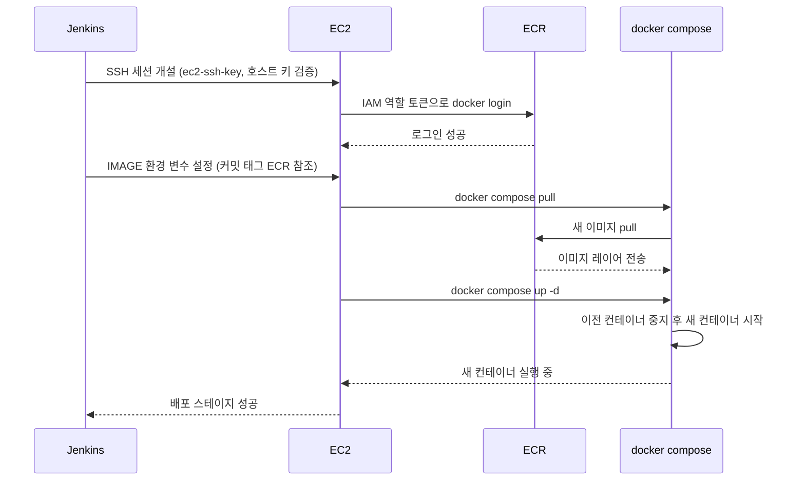

# EC2 자동 배포 — SSH + docker compose

## 학습 목표
- Jenkins에서 EC2로 안전하게 SSH 접속하는 방법을 익힌다.
- 최신 이미지를 pull해 docker compose로 교체 배포하는 스테이지를 작성한다.
- 푸시 한 번으로 EC2까지 배포되는 파이프라인을 완성한다.

## 본문

이미지는 이미 ECR에 들어 있다. 이번 강의에서는 그것을 EC2에서 실행시키는 마지막 스테이지를 작성한다. Jenkins가 SSH 세션을 열고 새 이미지를 pull한 뒤 컨테이너를 교체한다 — 매 빌드마다 자동으로.

### 1단계 — EC2 서버 준비

**무엇을, 왜:** Jenkins가 배포하려면 서버가 이미지를 pull하고 실행할 준비가 되어 있어야 한다. 한 번만 해두면 되는 준비가 세 가지다. Docker와 Compose 플러그인 설치, ECR 읽기 권한을 부여하는 **IAM 역할**을 인스턴스에 연결(서버에 키를 저장하지 않아도 됨), 그리고 앱 실행 방법을 기술한 `docker-compose.yml`.

서버에 둘 compose 파일(`/home/ec2-user/docker-compose.yml` 등):

```yaml
services:
  web:
    image: ${IMAGE}
    ports:
      - "80:8080"
    restart: always
```

`${IMAGE}`는 변수다. Jenkins가 배포 시점에 정확한 ECR 태그를 채워 넣으므로, 같은 파일이 파이프라인이 방금 빌드한 버전을 항상 실행한다.

**확인:** 인스턴스에서 `docker --version && docker compose version`을 실행하고, `aws ecr get-login-password --region <region>`이 토큰을 반환하는지 확인한다.

### 2단계 — EC2 호스트 키 등록

**무엇을, 왜:** SSH는 **호스트 키**로 *서버*의 신원을 검증한다. 이 키는 `known_hosts`에 기록된다. 미리 등록해 두면 SSH가 중간자(MITM) — 즉 서버인 척 위장한 공격자 — 를 탐지할 수 있다. Jenkins가 실행되는 사용자로 Jenkins 호스트에서 한 번만 실행한다:

```bash
# 한 번만 실행한 뒤 신뢰하기 전에 EC2 콘솔에서 지문을 검증한다
ssh-keyscan -H <EC2_HOST> >> ~/.ssh/known_hosts
```

> 많은 튜토리얼에서 `-o StrictHostKeyChecking=no`를 쓴다. 호스트 키 검증을 완전히 비활성화해 편하긴 하지만, MITM 보호 자체를 포기하는 것이다. `known_hosts`를 미리 채우는 방법을 우선으로 쓰고, 임시 학습 환경에서만 완화를 고려한다.

### 3단계 — SSH 키를 Jenkins에 저장

**무엇을, 왜:** Jenkins는 인스턴스의 프라이빗 키로 접속한다. 이 키를 **SSH 자격증명**(예: ID `ec2-ssh-key`)으로 저장하고 **SSH Agent 플러그인**을 사용해 배포 블록 실행 동안에만 빌려 쓴다 — 키를 Jenkinsfile에 직접 붙여 넣거나 커밋하는 것은 절대 안 된다.

> SSH 프라이빗 키는 서버 비밀번호와 같다. 이 잡에만 범위를 한정하고 저장소와 빌드 로그에 절대 닿지 않게 한다. 배포 키가 유출되면 서버가 유출된 것이다.

### 4단계 — 배포 스테이지 작성

**무엇을, 왜:** 호스트 키가 신뢰되고 SSH 키가 자격증명에 저장됐다면, 이 스테이지가 검증된 SSH 세션을 열고 배포를 구성하는 네 개의 명령을 실행한다.

```groovy
stage('Deploy to EC2') {
    steps {
        sshagent(['ec2-ssh-key']) {
            sh """
                ssh ec2-user@<EC2_HOST> '
                    aws ecr get-login-password --region <region> \
                      | docker login --username AWS --password-stdin <registry>
                    export IMAGE=<registry>/myapp:${commit}
                    docker compose -f /home/ec2-user/docker-compose.yml pull
                    docker compose -f /home/ec2-user/docker-compose.yml up -d
                '
            """
        }
    }
}
```

SSH 세션 안에서 실행되는 명령:
1. **`docker login`** — EC2가 IAM 역할 토큰으로 ECR에 인증한다.
2. **`export IMAGE=...`** — compose 파일이 실행할 커밋 태그 이미지의 정확한 주소를 설정한다.
3. **`docker compose pull`** — 새 이미지를 다운로드한다.
4. **`docker compose up -d`** — 교체 명령이다. Compose가 이미지가 바뀐 것을 감지하고 이전 컨테이너를 중지한 뒤 새 컨테이너를 백그라운드로 실행한다. 선언적 방식이라 원하는 상태를 기술하면 Compose가 알아서 맞춘다.

아래 다이어그램은 Jenkins가 SSH 세션을 여는 순간부터 새 컨테이너가 트래픽을 받기까지의 흐름을 보여 준다.



### 5단계 — 완성된 파이프라인

push 스테이지 뒤에 배포 스테이지를 추가하면 Jenkinsfile이 전체 여정을 담는다:

```groovy
pipeline {
    agent any
    stages {
        stage('Checkout')      { steps { checkout scm } }
        stage('Build & Test')  { steps { sh 'npm ci'; sh 'npm test' } }
        stage('Build Image')   { /* docker build, 커밋 SHA로 태그 */ }
        stage('Push to ECR')   { /* 로그인 + docker push */ }
        stage('Deploy to EC2') { /* sshagent → compose pull + up -d */ }
    }
}
```

**전체 흐름 확인:** 코드를 수정하고 커밋한 뒤 GitLab에 push한다. 웹훅이 실행되고, Jenkins가 모든 스테이지를 순서대로 진행하고, EC2가 새 이미지를 pull해 서비스한다. 서버 URL을 열면 변경 사항이 live 상태다 — 터미널을 한 번도 열지 않고.

다음 강의에서는 안전망을 추가한다. 헬스체크, 롤백, 시크릿 처리를 갖춰 이 파이프라인을 프로덕션에 적합한 수준으로 만든다.

## 핵심 정리
- 배포 스테이지는 **SSH**로 EC2에서 명령을 실행한다. 프라이빗 키는 Jenkins SSH 자격증명(SSH Agent 플러그인)으로 저장하고 절대 저장소에 두지 않는다.
- `known_hosts`에 EC2 호스트 키를 등록해(`ssh-keyscan`) SSH가 MITM을 탐지할 수 있게 한다. `StrictHostKeyChecking=no`를 기본으로 쓰지 않는다.
- EC2에 Docker, ECR pull을 위한 **IAM 역할**, image 변수를 사용하는 `docker-compose.yml`을 준비한다.
- 교체는 두 명령으로 이뤄진다 — `docker compose pull` 후 `docker compose up -d` — Compose가 선언적으로 이전 컨테이너를 새 컨테이너로 교체한다.
- 이 스테이지가 추가되면 단일 `git push`가 수동 단계 없이 live EC2 배포까지 자동으로 이어진다.

## 출처
- https://www.youtube.com/watch?v=nQdyiK7-VlQ
- https://www.youtube.com/watch?v=mAPbPAtRPUw
- https://www.youtube.com/watch?v=j0_keQl-XAg
