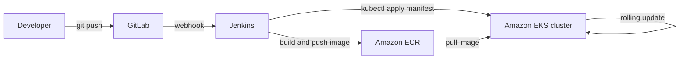

# EKS Deployment Pipelines — From Push to Kubernetes

## Learning Objectives
- Explain what Amazon EKS is and what "declarative, manifest-based deployment" means.
- Understand why a CI/CD pipeline ends with `kubectl`/manifests being applied to a cluster.
- See how GitLab, Jenkins, Amazon ECR, and EKS fit together into one end-to-end flow.

## Body

### Why this course exists

If you are a developer, your real goal is simple: you push code, and a little while later the new version is running in production — safely, with no downtime, and with an easy way to undo a bad release. Everything in this course is in service of that one sentence.

We are deliberately *not* trying to make you a Kubernetes internals expert. Instead, we treat Kubernetes (specifically AWS's managed flavor, EKS) as the **destination** that your automated pipeline delivers to. The interesting work is the road between your `git push` and a healthy Pod serving traffic, and that road is built from four tools: **GitLab** (where your source and your container images live), **Jenkins** (the engine that builds and deploys), **Amazon ECR** (the registry that stores your images), and **Amazon EKS** (the Kubernetes cluster that runs them).

### What is Kubernetes, briefly

Kubernetes (often abbreviated **k8s** — the "8" stands for the eight letters between "k" and "s") is an open-source **container orchestration platform**. In plain terms, it takes your containerized application and handles the boring-but-critical parts of running it: starting the right number of copies, restarting copies that crash, spreading them across machines, and replacing old versions with new ones gradually.

A Kubernetes cluster has two halves:

- The **control plane** is the brain. It holds the desired state of everything and makes decisions. Its key pieces are the **API server** (the front door you talk to), **etcd** (a key-value database that stores cluster state), the **scheduler** (decides which machine runs each Pod), and the **controller manager** (the loop that keeps reality matching what you asked for, including rolling updates and rollbacks).
- The **worker nodes** are the muscle — the actual machines that run your containers. Each node runs a **kubelet** (talks to the control plane), a **container runtime** (pulls images and runs containers), and **kube-proxy** (routes network traffic to the right Pods).

The smallest thing you deploy is a **Pod** — a wrapper around one or more containers that share networking and storage. You rarely create Pods by hand; higher-level objects manage them for you, which leads us to the most important idea in this whole course.

### The big idea: declarative deployment

Traditional deployment is **imperative** — you list the *steps*: "SSH to the server, stop the old process, copy the new build, start it again." If a step fails halfway, you are left in a broken in-between state.

Kubernetes is **declarative** instead. You write down the *desired end state* in a text file (a **manifest**, usually YAML) — "I want 3 copies of this image running, reachable on port 80" — and hand it to the cluster. The control plane's job is to continuously make reality match that description. If a Pod dies, it is recreated. If you change the image version in the file and re-apply it, Kubernetes figures out how to get from the current state to the new one.

> This is the single mental shift that makes the whole pipeline click: your deployment is **a file that describes what you want**, not a script that lists what to do. Version that file in Git, and your infrastructure becomes reviewable, repeatable, and revertible.

Because the desired state is just text, your pipeline's final job is wonderfully simple: take a manifest, point it at the cluster, and run `kubectl apply -f`. That is why "the end of the pipeline is applying manifests" — there is nothing more to it.

### Why EKS instead of running Kubernetes yourself

Kubernetes is powerful but genuinely hard to operate. Setting up and babysitting a production-grade control plane (the API server, etcd, failover across data centers) takes deep expertise. **Amazon EKS (Elastic Kubernetes Service)** is AWS's *managed* Kubernetes: AWS runs and maintains the control plane for you across multiple availability zones, and you bring the worker nodes and the workloads. Google's GKE and Azure's AKS are the equivalents on other clouds.

For a team that wants Kubernetes' benefits — self-healing, horizontal scaling, automatic rollbacks, portability — without owning the hardest part, a managed service like EKS is the pragmatic choice. (For a tiny side project, plain Kubernetes is often overkill; that is a real trade-off, not a marketing point.)

### How the four tools connect

Here is the end-to-end flow this course builds, one lecture at a time. The structure is as follows:

1. **You push code to GitLab.** GitLab hosts your application source — and, conveniently, can also host your container registry, though in AWS we will push images to ECR.
2. **GitLab triggers Jenkins** via a webhook. A webhook is just an HTTP call GitLab makes to Jenkins saying "something changed, start working."
3. **Jenkins builds a container image** from your `Dockerfile`, tags it (we will tag by commit SHA, never just `latest`), and **pushes it to Amazon ECR**, AWS's private Docker registry.
4. **Jenkins updates the Kubernetes manifest** to point at the new image tag and runs `kubectl apply` (or `kubectl set image`) against the **EKS cluster**.
5. **EKS performs a rolling update**: it brings up new Pods with the new image, waits until they report healthy, and only then retires the old ones — so users never see downtime. If something is wrong, one command rolls it back.

The diagram below traces that same flow end to end, and shows how the image tag threads through it.

That image tag is the thread that ties it all together: it is *produced* in the build stage, *stored* in ECR, and *consumed* by the manifest at deploy time. Keep your eye on it as we go.

### What "good" looks like

A few principles we will reinforce throughout, that experienced operators take for granted:

- **Tag images by commit, not `latest`.** A tag like `v1.4.2` or the Git commit SHA tells you *exactly* what is running. `latest` is a moving target that makes rollbacks and debugging miserable.
- **Authenticate machines, not humans.** Jenkins should reach AWS and EKS using an IAM role (covered in Lecture 5), not someone's personal credentials pasted into a job.
- **Let health checks gate your rollout.** Kubernetes will only shift traffic to a new version once it reports ready — but only if you *configure* readiness checks. We cover this in Lecture 7.

## Key Takeaways
- The pipeline's purpose is to turn `git push` into a safe, repeatable deployment on Kubernetes; everything else is detail.
- Kubernetes is declarative: you describe the desired end state in a manifest, and the control plane makes reality match it. The pipeline's final act is `kubectl apply`.
- EKS is AWS-managed Kubernetes — AWS runs the control plane, you run the workloads.
- The flow is: push to GitLab → webhook triggers Jenkins → Jenkins builds and pushes an image to ECR → Jenkins applies an updated manifest to EKS → EKS rolls out the new version.
- The image tag (ideally a commit SHA) is the value that connects build, registry, and deploy.
