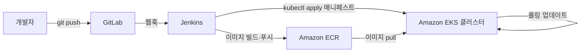

# EKS 배포 파이프라인 개요 — 파이프라인에서 쿠버네티스로

## 학습 목표
- Amazon EKS가 무엇인지, '선언형 매니페스트 기반 배포'가 어떤 의미인지 설명할 수 있다.
- CI/CD 파이프라인의 종착점이 왜 `kubectl`/매니페스트 적용인지 이해한다.
- GitLab, Jenkins, Amazon ECR, EKS가 하나의 엔드-투-엔드 흐름으로 연결되는 구조를 파악한다.

## 본문

### 이 강좌를 만든 이유

개발자의 진짜 목표는 단순하다. 코드를 푸시하면 얼마 뒤 새 버전이 프로덕션에서 실행되어야 한다 — 안전하게, 무중단으로, 그리고 문제가 생기면 손쉽게 되돌릴 수 있어야 한다. 이 강좌의 모든 내용은 그 한 문장을 위해 존재한다.

이 강좌는 쿠버네티스 내부 원리 전문가를 목표로 하지 않는다. 대신 쿠버네티스(특히 AWS의 관리형 서비스인 EKS)를 자동화된 파이프라인이 '도달해야 하는 목적지'로 다룬다. 핵심은 `git push`부터 트래픽을 받는 정상 Pod까지의 여정이고, 그 길은 네 가지 도구로 이루어진다. **GitLab**(소스코드와 컨테이너 이미지가 있는 곳), **Jenkins**(빌드와 배포를 담당하는 엔진), **Amazon ECR**(이미지를 저장하는 레지스트리), **Amazon EKS**(이미지를 실행하는 쿠버네티스 클러스터).

### 쿠버네티스란 무엇인가

쿠버네티스는 흔히 **k8s**로 줄여 쓴다(k와 s 사이 여덟 글자를 숫자 8로 대체한 표기). 오픈소스 **컨테이너 오케스트레이션 플랫폼**으로, 컨테이너화된 애플리케이션을 받아 복잡하지만 꼭 필요한 작업들을 대신 처리해 준다. 적절한 수의 복제본을 실행하고, 충돌한 복제본을 재시작하고, 여러 머신에 분산시키며, 구버전을 점진적으로 새 버전으로 교체한다.

쿠버네티스 클러스터는 두 부분으로 나뉜다.

- **컨트롤 플레인(Control Plane)**은 두뇌다. 전체 시스템의 원하는 상태(desired state)를 저장하고 의사결정을 내린다. 주요 구성요소는 **API 서버**(외부에서 요청을 받는 창구), **etcd**(클러스터 상태를 저장하는 키-값 데이터베이스), **스케줄러**(어떤 머신에서 각 Pod를 실행할지 결정), **컨트롤러 매니저**(롤링 업데이트·롤백을 포함하여 현실이 원하는 상태와 일치하도록 지속적으로 조정하는 루프)다.
- **워커 노드(Worker Node)**는 실행 엔진이다. 실제로 컨테이너를 구동하는 머신들이며, 각 노드에는 **kubelet**(컨트롤 플레인과 통신), **컨테이너 런타임**(이미지를 내려받고 컨테이너를 실행), **kube-proxy**(네트워크 트래픽을 적절한 Pod로 라우팅)가 함께 동작한다.

배포하는 가장 작은 단위는 **Pod**다. 네트워크와 스토리지를 공유하는 하나 이상의 컨테이너를 감싸는 단위다. Pod를 직접 생성하는 경우는 드물고, 상위 오브젝트가 Pod를 대신 관리한다. 이것이 이 강좌 전체에서 가장 중요한 개념으로 이어진다.

### 핵심 개념: 선언형 배포

전통적인 배포는 **명령형(imperative)**이다 — 단계를 직접 나열한다. "서버에 SSH로 접속하고, 구버전 프로세스를 종료하고, 새 빌드를 복사하고, 다시 시작한다." 중간에 단계가 실패하면 중간 상태에서 멈춰버린다.

쿠버네티스는 **선언형(declarative)**을 택한다. 텍스트 파일(**매니페스트**, 보통 YAML)에 원하는 최종 상태를 적는다 — "이 이미지를 3개 실행하고, 80번 포트로 접근 가능하게 한다" — 그런 다음 클러스터에 넘긴다. 컨트롤 플레인이 현실을 그 기술과 지속적으로 일치시킨다. Pod가 죽으면 다시 만든다. 파일에서 이미지 버전을 바꾸고 다시 적용하면, 쿠버네티스가 현재 상태에서 새 상태로 어떻게 전환할지 스스로 파악한다.

> 이것이 파이프라인 전체를 이해하는 핵심 전환점이다. 배포는 **무엇을 원하는지 기술한 파일**이지, 무엇을 할지 나열한 스크립트가 아니다. 그 파일을 Git으로 버전 관리하면, 인프라가 검토 가능하고 반복 가능하며 되돌릴 수 있는 것이 된다.

원하는 상태가 텍스트이므로, 파이프라인의 마지막 작업은 단순해진다. 매니페스트를 가져와서 클러스터에 연결하고 `kubectl apply -f`를 실행하면 끝이다. "파이프라인의 끝은 매니페스트를 적용하는 것"이라는 이유가 바로 이것이다.

### 쿠버네티스를 직접 운영하지 않고 EKS를 쓰는 이유

쿠버네티스는 강력하지만 운영이 쉽지 않다. 프로덕션 수준의 컨트롤 플레인(API 서버, etcd, 데이터센터 간 장애 복구)을 설정하고 관리하려면 깊은 전문 지식이 필요하다. **Amazon EKS(Elastic Kubernetes Service)**는 AWS가 관리하는 쿠버네티스다. AWS가 여러 가용 영역에 걸쳐 컨트롤 플레인을 운영·유지하고, 사용자는 워커 노드와 워크로드만 가져오면 된다. Google의 GKE, Azure의 AKS도 각 클라우드의 동등한 서비스다.

셀프 힐링, 수평 확장, 자동 롤백, 이식성 같은 쿠버네티스의 장점을 누리되, 가장 어려운 부분은 맡기고 싶은 팀에게 EKS 같은 관리형 서비스는 현실적인 선택이다. (소규모 사이드 프로젝트라면 쿠버네티스 자체가 과할 수 있다 — 이것은 진짜 트레이드오프다.)

### 네 가지 도구가 연결되는 방법

이 강좌가 강의별로 구축하는 엔드-투-엔드 흐름은 다음과 같다.

1. **GitLab에 코드를 푸시한다.** GitLab은 애플리케이션 소스를 호스팅하고, 편의상 컨테이너 레지스트리도 제공하지만 AWS에서는 ECR에 이미지를 푸시한다.
2. **GitLab이 웹훅으로 Jenkins를 트리거한다.** 웹훅은 GitLab이 Jenkins에 "무언가 바뀌었으니 작업을 시작해"라고 보내는 HTTP 호출이다.
3. **Jenkins가 `Dockerfile`로 컨테이너 이미지를 빌드하고**, 태그를 붙인 뒤(커밋 SHA로 태그하며, `latest`는 절대 사용하지 않는다), **Amazon ECR에 이미지를 푸시한다.** ECR은 AWS의 프라이빗 도커 레지스트리다.
4. **Jenkins가 새 이미지 태그를 가리키도록 쿠버네티스 매니페스트를 갱신하고**, **EKS 클러스터**에 `kubectl apply`(또는 `kubectl set image`)를 실행한다.
5. **EKS가 롤링 업데이트를 수행한다.** 새 이미지로 Pod를 띄우고, 정상임을 확인한 뒤에야 구버전을 내린다 — 사용자는 다운타임을 경험하지 않는다. 문제가 생기면 명령 하나로 롤백한다.

아래 다이어그램이 이 흐름을 단계별로 보여주며, 이미지 태그가 전체 과정을 어떻게 관통하는지도 확인할 수 있다.

이미지 태그는 전체를 하나로 잇는 실이다. 빌드 단계에서 *생성*되고, ECR에 *저장*되며, 배포 시 매니페스트가 *소비*한다. 강좌를 따라가면서 이 태그를 놓치지 않기를 바란다.

### '잘 된' 파이프라인이란

경험 많은 운영자라면 당연하게 여기는 원칙들을 강조해 두겠다.

- **이미지 태그는 커밋으로, `latest`는 금지.** `v1.4.2`나 Git 커밋 SHA 같은 태그는 *정확히* 어떤 코드가 실행 중인지 알려준다. `latest`는 움직이는 표적이라 롤백과 디버깅을 어렵게 만든다.
- **사람이 아닌 머신을 인증하라.** Jenkins는 누군가의 개인 자격증명을 잡에 붙여넣는 대신 IAM 역할을 통해 AWS와 EKS에 접근해야 한다(5강에서 다룬다).
- **헬스체크가 롤아웃을 게이팅하게 하라.** readiness 체크를 *설정해야만* 쿠버네티스가 새 버전이 준비됐을 때 트래픽을 전환한다. 7강에서 다룬다.

## 핵심 정리
- 파이프라인의 목적은 `git push`를 쿠버네티스의 안전하고 반복 가능한 배포로 전환하는 것이며, 나머지는 세부 사항이다.
- 쿠버네티스는 선언형이다. 매니페스트에 원하는 최종 상태를 기술하면 컨트롤 플레인이 현실을 일치시킨다. 파이프라인의 마지막 작업은 `kubectl apply`다.
- EKS는 AWS가 관리하는 쿠버네티스 — AWS가 컨트롤 플레인을 운영하고, 사용자가 워크로드를 실행한다.
- 흐름: GitLab에 푸시 → 웹훅이 Jenkins를 트리거 → Jenkins가 이미지를 빌드·ECR에 푸시 → Jenkins가 갱신된 매니페스트를 EKS에 적용 → EKS가 새 버전으로 롤아웃.
- 이미지 태그(이상적으로는 커밋 SHA)는 빌드, 레지스트리, 배포를 연결하는 값이다.
