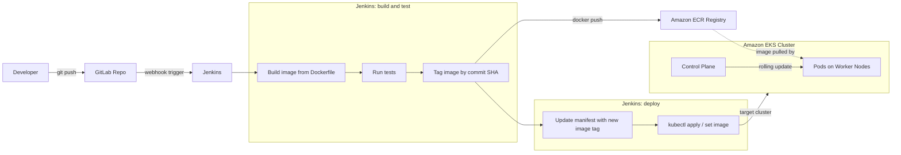

# EKS 배포 파이프라인 — git push부터 쿠버네티스까지

## 학습 목표
- Amazon EKS가 무엇인지, '선언형 매니페스트 기반 배포'가 어떤 의미인지 설명할 수 있다.
- CI/CD 파이프라인의 종착점이 왜 `kubectl`로 매니페스트를 적용하는 것인지 이해한다.
- GitLab, Jenkins, Amazon ECR, EKS가 하나의 엔드-투-엔드 흐름으로 연결되는 구조를 파악한다.

## 본문

### 이 강좌의 목표

코드를 푸시하면 잠시 후 새 버전이 프로덕션에서 실행된다 — 안전하게, 무중단으로, 필요하면 쉽게 롤백할 수 있어야 한다. 이 강좌는 `git push`부터 트래픽을 받는 정상 Pod까지의 여정을 네 가지 도구로 만들어 나간다.

- **GitLab** — 애플리케이션 소스코드를 호스팅한다.
- **Jenkins** — 빌드와 배포를 담당하는 엔진이다.
- **Amazon ECR** — 컨테이너 이미지를 저장하는 AWS의 프라이빗 레지스트리다.
- **Amazon EKS** — 이미지를 실행하는 관리형 쿠버네티스 클러스터다.

쿠버네티스는 이 강좌의 **목적지**이지 주제가 아니다. 쿠버네티스 내부 전문가가 되는 게 아니라, 자동으로 배포되는 파이프라인을 만드는 것이 목표다.

### 쿠버네티스와 EKS 간단 정리

쿠버네티스(**k8s**)는 컨테이너 오케스트레이션 플랫폼이다. 컨테이너 복제본을 적절한 수로 유지하고, 충돌한 것을 재시작하고, 여러 머신에 분산하며, 구버전을 새 버전으로 점진적으로 교체한다. 클러스터는 **컨트롤 플레인**(두뇌 — 원하는 상태를 저장하고 의사결정)과 **워커 노드**(실제로 컨테이너를 구동하는 머신)로 나뉜다. 배포의 최소 단위는 **Pod**로, 네트워크와 스토리지를 공유하는 하나 이상의 컨테이너를 감싼다.

프로덕션 수준의 컨트롤 플레인(API 서버, etcd, 가용 영역 간 장애 복구)을 운영하려면 깊은 전문 지식이 필요하다. **Amazon EKS(Elastic Kubernetes Service)**는 AWS의 *관리형* 쿠버네티스다. AWS가 컨트롤 플레인을 대신 운영하고, 사용자는 워커 노드와 워크로드만 가져오면 된다. (Google의 GKE, Azure의 AKS가 각 클라우드의 동등한 서비스다.)

### 핵심 개념: 선언형 배포

전통적인 배포는 **명령형(imperative)**이다 — 단계를 직접 스크립팅한다("구버전 프로세스를 종료하고, 새 빌드를 복사하고, 다시 시작한다"). 중간 단계가 실패하면 깨진 상태에 그대로 갇힌다.

쿠버네티스는 **선언형(declarative)**이다. *원하는 최종 상태*를 텍스트 파일인 **매니페스트**(YAML)에 기술한다 — 예컨대 "이 이미지를 3개 실행하고, 80번 포트로 접근 가능하게 한다" — 그러면 컨트롤 플레인이 현실을 그 기술에 지속적으로 맞춘다. Pod가 죽으면 다시 생성된다. 이미지 버전을 바꾸고 다시 적용하면, 쿠버네티스가 어떻게 전환할지 스스로 파악한다.

> 배포는 **무엇을 원하는지 기술한 파일**이지, 무엇을 할지 나열한 스크립트가 아니다. 그 파일을 Git으로 버전 관리하면, 인프라가 검토 가능하고 반복 가능하며 되돌릴 수 있는 것이 된다.

원하는 상태가 텍스트이므로 파이프라인의 마지막 작업은 단순하다. 매니페스트를 가져와 클러스터에 연결하고 `kubectl apply -f`를 실행하면 끝이다. "파이프라인의 끝은 매니페스트를 적용하는 것"이라는 이유가 바로 이것이다.

### 네 가지 도구가 연결되는 방법

이 강좌가 단계별로 만들어 가는 엔드-투-엔드 흐름은 다음과 같다.

1. **GitLab에 코드를 푸시한다.** GitLab이 소스코드를 호스팅한다.
2. **GitLab이 웹훅으로 Jenkins를 트리거한다.** 웹훅은 "무언가 바뀌었으니 작업을 시작해"라는 HTTP 호출이다.
3. **Jenkins가 `Dockerfile`로 컨테이너 이미지를 빌드하고**, 커밋 SHA로 태그한 뒤(`latest`는 절대 쓰지 않는다), **Amazon ECR에 이미지를 푸시한다.**
4. **Jenkins가 새 이미지 태그를 가리키도록 매니페스트를 갱신하고**, **EKS 클러스터**에 `kubectl apply`(또는 `kubectl set image`)를 실행한다.
5. **EKS가 롤링 업데이트를 수행한다.** 새 Pod가 정상 상태를 보고할 때까지 기다린 뒤 구버전을 내린다 — 사용자는 다운타임을 경험하지 않는다. 문제가 생기면 명령 하나로 롤백한다.

아래 다이어그램은 개발자의 `git push`부터 EKS 클러스터 안에서 실행되는 Pod까지의 전체 흐름을 보여준다.

**이미지 태그**는 전체를 하나로 잇는 실이다. 빌드 단계에서 *생성*되고, ECR에 *저장*되며, 배포 시 매니페스트가 *소비*한다.

### 앞으로 반복해서 강조할 원칙

- **태그는 커밋으로, `latest`는 금지.** SHA나 `v1.4.2` 같은 태그는 지금 무엇이 실행 중인지 정확히 알려준다. `latest`는 움직이는 표적이라 롤백과 디버깅을 어렵게 만든다.
- **사람이 아닌 머신을 인증하라.** Jenkins는 개인 자격증명을 잡에 붙여넣는 대신 IAM 역할을 통해 AWS/EKS에 접근해야 한다(5강에서 다룬다).
- **헬스체크가 롤아웃을 게이팅하게 하라.** readiness 체크를 설정해야만 쿠버네티스가 새 버전이 준비됐을 때 트래픽을 전환한다(7강에서 다룬다).

## 핵심 정리
- 파이프라인은 `git push`를 쿠버네티스의 안전하고 반복 가능한 배포로 전환한다.
- 쿠버네티스는 선언형이다. 매니페스트에 원하는 상태를 기술하면 컨트롤 플레인이 현실을 일치시킨다. 파이프라인의 마지막 작업은 `kubectl apply`다.
- EKS는 AWS 관리형 쿠버네티스 — AWS가 컨트롤 플레인을 운영하고, 사용자가 워크로드를 실행한다.
- 흐름: GitLab → 웹훅 → Jenkins가 이미지를 빌드·ECR에 푸시 → Jenkins가 매니페스트를 EKS에 적용 → 롤링 업데이트.
- 커밋 기반 이미지 태그가 빌드, 레지스트리, 배포를 연결한다.

## 출처
- https://www.youtube.com/watch?v=TlHvYWVUZyc
- https://www.youtube.com/watch?v=KOE_6QYQqA4
- https://www.youtube.com/watch?v=aRXg75S5DWA
