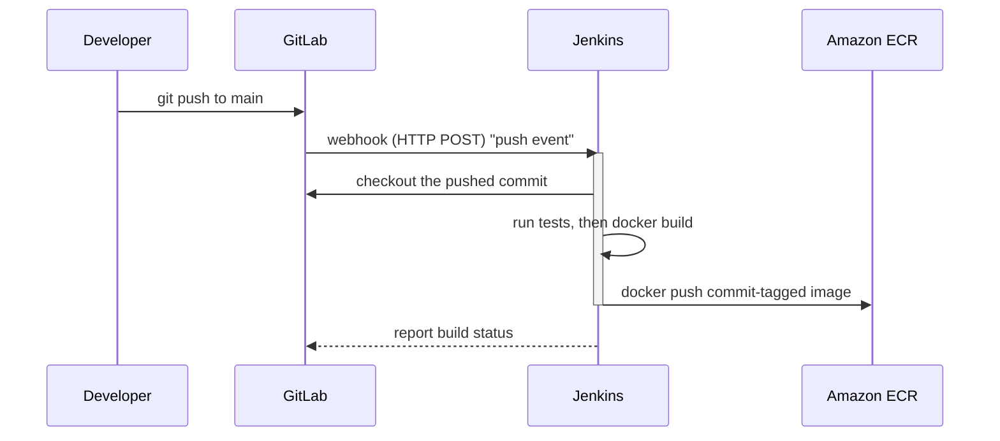

# Building the GitLab + Jenkins Pipeline

## Learning Objectives
- Trigger a Jenkins pipeline automatically from a GitLab webhook.
- Write a `Jenkinsfile` with checkout, build, test, and image-push stages.
- End up with a skeleton where a push to GitLab automatically produces a container image in ECR.

## Body

### The goal of this lecture

So far you can build an image and push it to ECR *by hand*. That is fine once; it is miserable every day. In this lecture we automate it: a developer pushes to GitLab, and within seconds Jenkins wakes up, builds the image, runs tests, and pushes the result to ECR — no human in the loop. By the end you have the **CI skeleton** (continuous integration), and the only thing missing is the deploy-to-EKS step, which we add in Lecture 6.

The two roles to keep straight:

- **GitLab** is the *source host*. It stores your repository and fires an event when code changes.
- **Jenkins** is the *engine*. It listens for that event and runs the actual work, defined as code in a `Jenkinsfile`.

### Wiring GitLab to Jenkins with a webhook

A **webhook** is just an HTTP request that GitLab sends to a URL of your choosing whenever something happens — for example, a push to the `main` branch. We point that URL at Jenkins so a push *triggers* a build automatically. The flow is as follows: GitLab detects a push, sends a webhook to Jenkins, and Jenkins starts the pipeline.



There are two sides to configure:

**On Jenkins**, create a Pipeline job and enable the GitLab webhook trigger so the job will accept incoming webhook calls. (Install the GitLab plugin if it is not already present.) Jenkins will accept webhook posts at a path like `http://<jenkins-host>/project/<job-name>` (or `/gitlab-webhook/`, depending on your plugin).

**On GitLab**, go to your project's *Settings → Webhooks*, paste the Jenkins URL, and select the events you care about — typically **Push events** and **Merge request events**. Save, and use GitLab's "Test" button to fire a sample event and confirm Jenkins responds.

> Before relying on the webhook, click **Build Now** in Jenkins once to confirm the job runs at all. Debugging "did the pipeline work?" and "did the webhook fire?" at the same time is twice the pain. Get a manual build green first, then prove the trigger.

A quick reality check on networking: GitLab must be able to *reach* your Jenkins URL. If Jenkins lives on a cloud VM, its security group/firewall has to allow inbound traffic on the Jenkins port (8080 by default), or the webhook delivery will fail with a connection error.

### The Jenkinsfile: your pipeline as code

Rather than clicking through Jenkins' UI to define build steps, you write them in a **`Jenkinsfile`** that lives in your repository alongside the code. This is "pipeline as code" — the build process is versioned, reviewable, and travels with the project. A declarative `Jenkinsfile` is organized into **stages**, each a logical phase of the build.

Here is a skeleton for our CI pipeline:

```groovy
pipeline {
    agent any

    environment {
        AWS_REGION = 'us-east-1'
        ACCOUNT_ID = '111122223333'
        ECR_REPO   = 'my-app'
        REGISTRY   = "${ACCOUNT_ID}.dkr.ecr.${AWS_REGION}.amazonaws.com"
        IMAGE_TAG  = "${env.GIT_COMMIT.take(7)}"   // short commit SHA, not 'latest'
    }

    stages {
        stage('Checkout') {
            steps {
                checkout scm   // pull the code GitLab just pushed
            }
        }

        stage('Test') {
            steps {
                sh 'npm install && npm test'   // fail fast if tests break
            }
        }

        stage('Build Image') {
            steps {
                sh "docker build -t ${REGISTRY}/${ECR_REPO}:${IMAGE_TAG} ."
            }
        }

        stage('Push to ECR') {
            steps {
                sh """
                  aws ecr get-login-password --region ${AWS_REGION} \
                    | docker login --username AWS --password-stdin ${REGISTRY}
                  docker push ${REGISTRY}/${ECR_REPO}:${IMAGE_TAG}
                """
            }
        }
    }
}
```

Walking through the stages:

- **Checkout** pulls the exact commit that triggered the build. Jenkins exposes that commit's SHA as `GIT_COMMIT`, which we shorten and reuse as our image tag — closing the loop with Lecture 2's "tag by commit" rule.
- **Test** runs your test suite. Put it *before* the build so a failing test stops the pipeline early, before you waste time building and pushing an image you would never deploy. (Many teams also slot a static-analysis or code-quality scan in here.)
- **Build Image** runs `docker build`, tagging with the full ECR address and the commit SHA.
- **Push to ECR** authenticates to ECR (the same `get-login-password` dance from Lecture 2) and pushes.

### Where do the AWS credentials come from?

The push stage needs permission to talk to ECR. **Do not** paste an access key and secret directly into the `Jenkinsfile` — that is a secret leaking into your repository. Instead:

- If Jenkins runs on an EC2 instance, attach an **IAM role** to that instance granting ECR push/pull permissions. The AWS CLI picks the role up automatically, with no static keys anywhere.
- Otherwise, store the credentials in **Jenkins Credentials** and inject them into the job, so they never appear in source control.

The IAM permissions ECR needs are modest: get an authorization token, and push/pull layers — ideally scoped to just your repository rather than every repo in the account. We will lean on this same "the machine has an IAM identity" idea heavily in Lecture 5, when Jenkins needs to authenticate to EKS itself.

### What you have built

At this point your CI skeleton is complete: **push to GitLab → webhook → Jenkins checks out, tests, builds, and pushes a commit-tagged image to ECR — fully automatically.** Every commit now leaves behind a traceable, deployable artifact in your registry.

What is still missing is the *delivery* half: nothing yet tells EKS to run that new image. That requires two things — manifests describing the deployment (Lecture 4) and a way for Jenkins to authenticate to and command the cluster (Lecture 5) — after which we add a final deploy stage in Lecture 6.

## Key Takeaways
- A GitLab webhook turns a `git push` into an automatic Jenkins build; configure the trigger on Jenkins and the webhook URL on GitLab, then test both.
- A `Jenkinsfile` defines the pipeline as versioned code, organized into stages: Checkout → Test → Build Image → Push to ECR.
- Reuse the triggering commit's SHA (`GIT_COMMIT`) as the image tag, so every artifact is traceable.
- Run tests before building so failures stop the pipeline early.
- Never hardcode AWS keys in the `Jenkinsfile`; use an IAM role on the Jenkins host or Jenkins-managed credentials.
- The result is a complete CI skeleton — the deploy-to-EKS step comes in Lectures 5 and 6.
