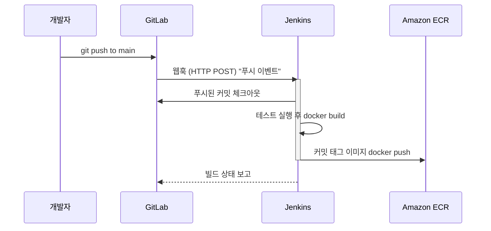

# GitLab + Jenkins 기본 파이프라인 구성

## 학습 목표
- GitLab 웹훅으로 Jenkins 파이프라인을 자동으로 트리거한다.
- checkout, build, test, 이미지 푸시 스테이지를 갖춘 `Jenkinsfile`을 작성한다.
- GitLab에 푸시하면 ECR에 컨테이너 이미지가 자동으로 만들어지는 CI 골격을 완성한다.

## 본문

### 이 강의의 목표

이전까지는 이미지를 빌드하고 ECR에 푸시하는 것을 *직접* 손으로 했다. 한 번이라면 괜찮지만 매일 하면 번거롭다. 이 강의에서는 자동화한다. 개발자가 GitLab에 푸시하면, Jenkins가 몇 초 안에 깨어나 이미지를 빌드하고, 테스트를 실행하고, 결과를 ECR에 푸시한다 — 사람의 개입 없이. 강의가 끝나면 **CI 골격**(지속적 통합)이 완성된다. 아직 빠진 부분은 EKS 배포 단계뿐이며, 이는 6강에서 추가한다.

두 역할을 명확히 구분해야 한다.

- **GitLab**은 *소스 호스트*다. 저장소를 보관하고 코드가 바뀌면 이벤트를 발생시킨다.
- **Jenkins**는 *엔진*이다. 그 이벤트를 수신하고 `Jenkinsfile`에 코드로 정의된 실제 작업을 실행한다.

### 웹훅으로 GitLab과 Jenkins 연결하기

**웹훅**은 GitLab이 특정 URL로 보내는 HTTP 요청이다. 예를 들어 `main` 브랜치에 푸시가 발생하면 Jenkins URL로 이 요청을 보내, 푸시가 빌드를 자동으로 *트리거*한다. 흐름은 다음과 같다. GitLab이 푸시를 감지하면 Jenkins에 웹훅을 보내고, Jenkins가 파이프라인을 시작한다.



설정해야 할 부분은 양쪽에 있다.

**Jenkins 쪽**에서는 Pipeline 잡을 만들고 GitLab 웹훅 트리거를 활성화하여 잡이 웹훅 요청을 수신하게 한다. (GitLab 플러그인이 설치되어 있지 않으면 설치한다.) Jenkins는 `http://<jenkins-host>/project/<job-name>` (또는 플러그인 버전에 따라 `/gitlab-webhook/`) 경로에서 웹훅 POST 요청을 수신한다.

**GitLab 쪽**에서는 프로젝트의 *설정 → 웹훅*으로 이동해 Jenkins URL을 붙여넣고, 관심 있는 이벤트 — 보통 **Push events**와 **Merge request events** — 를 선택한다. 저장한 뒤 GitLab의 "테스트" 버튼으로 샘플 이벤트를 발송해 Jenkins가 응답하는지 확인한다.

> 웹훅에 의존하기 전에, Jenkins에서 **지금 빌드**를 한 번 눌러 잡이 정상적으로 실행되는지 먼저 확인하라. "파이프라인이 동작하는가?"와 "웹훅이 제대로 발화하는가?"를 동시에 디버깅하면 두 배로 복잡해진다. 수동 빌드를 먼저 통과시킨 다음, 트리거를 검증하라.

네트워킹 현실도 점검해야 한다. GitLab이 Jenkins URL에 *도달*할 수 있어야 한다. Jenkins가 클라우드 VM에 있다면 보안 그룹/방화벽이 Jenkins 포트(기본 8080)의 인바운드 트래픽을 허용해야 한다. 그렇지 않으면 웹훅 전달이 연결 오류로 실패한다.

### Jenkinsfile: 코드로서의 파이프라인

Jenkins UI를 클릭해 빌드 단계를 정의하는 대신, 저장소의 코드 옆에 **`Jenkinsfile`**을 두고 그 안에 작성한다. 이것이 "파이프라인 as 코드"다 — 빌드 프로세스가 버전 관리되고, 검토 가능하며, 프로젝트와 함께 이동한다. 선언형 `Jenkinsfile`은 빌드의 논리적 단계인 **스테이지**로 구성된다.

CI 파이프라인의 골격 예시는 다음과 같다.

```groovy
pipeline {
    agent any

    environment {
        AWS_REGION = 'us-east-1'
        ACCOUNT_ID = '111122223333'
        ECR_REPO   = 'my-app'
        REGISTRY   = "${ACCOUNT_ID}.dkr.ecr.${AWS_REGION}.amazonaws.com"
        IMAGE_TAG  = "${env.GIT_COMMIT.take(7)}"   // 짧은 커밋 SHA, 'latest' 아님
    }

    stages {
        stage('Checkout') {
            steps {
                checkout scm   // GitLab이 막 푸시한 코드를 가져온다
            }
        }

        stage('Test') {
            steps {
                sh 'npm install && npm test'   // 테스트 실패 시 빠르게 종료
            }
        }

        stage('Build Image') {
            steps {
                sh "docker build -t ${REGISTRY}/${ECR_REPO}:${IMAGE_TAG} ."
            }
        }

        stage('Push to ECR') {
            steps {
                sh """
                  aws ecr get-login-password --region ${AWS_REGION} \
                    | docker login --username AWS --password-stdin ${REGISTRY}
                  docker push ${REGISTRY}/${ECR_REPO}:${IMAGE_TAG}
                """
            }
        }
    }
}
```

각 스테이지를 살펴보면:

- **Checkout**은 빌드를 트리거한 정확한 커밋을 풀한다. Jenkins는 해당 커밋의 SHA를 `GIT_COMMIT`으로 노출하며, 이를 줄여 이미지 태그로 재사용한다 — 2강의 "커밋으로 태그" 규칙과 연결된다.
- **Test**는 테스트 수트를 실행한다. 빌드 *전에* 배치해야 테스트 실패 시 파이프라인이 일찍 종료되어, 어차피 배포하지 않을 이미지를 빌드·푸시하는 데 시간을 낭비하지 않는다. (많은 팀이 여기에 정적 분석이나 코드 품질 검사도 추가한다.)
- **Build Image**는 `docker build`를 실행하며, 전체 ECR 주소와 커밋 SHA로 태깅한다.
- **Push to ECR**은 ECR에 인증(2강의 `get-login-password` 과정과 동일)하고 이미지를 푸시한다.

### AWS 자격증명은 어디서 오는가

푸시 스테이지는 ECR과 통신할 권한이 필요하다. 액세스 키와 시크릿을 `Jenkinsfile`에 직접 붙여넣으면 **안 된다** — 이는 시크릿을 저장소에 유출하는 것이다. 대신:

- Jenkins가 EC2 인스턴스에서 실행된다면, 해당 인스턴스에 ECR 푸시/풀 권한이 있는 **IAM 역할**을 연결한다. AWS CLI가 정적 키 없이 자동으로 역할을 감지한다.
- 그렇지 않다면 **Jenkins Credentials**에 자격증명을 저장하고 잡에 주입해서, 소스 컨트롤에 절대 노출되지 않도록 한다.

ECR에 필요한 IAM 권한은 많지 않다. 인증 토큰 발급과 레이어 푸시/풀 — 계정의 모든 리포지토리가 아닌 특정 리포지토리로 범위를 좁히면 이상적이다. 이 "머신에 IAM 아이덴티티가 있다"는 개념은 5강에서 Jenkins가 EKS 자체에 인증할 때 더 강하게 적용된다.

### 지금까지 만든 것

이 시점에서 CI 골격이 완성됐다. **GitLab에 푸시 → 웹훅 → Jenkins가 체크아웃, 테스트, 빌드, 커밋 태그 이미지를 ECR에 푸시 — 완전 자동으로.** 모든 커밋이 레지스트리에 추적 가능하고 배포 가능한 아티팩트를 남긴다.

아직 빠진 것은 *전달(delivery)* 절반이다. EKS에 새 이미지를 실행하도록 알리는 것이 없다. 이를 위해서는 두 가지가 필요하다 — 배포를 기술하는 매니페스트(4강)와 Jenkins가 클러스터에 인증하고 명령을 내릴 수 있는 방법(5강) — 그 다음에 6강에서 최종 배포 스테이지를 추가한다.

## 핵심 정리
- GitLab 웹훅은 `git push`를 자동 Jenkins 빌드로 전환한다. Jenkins에서 트리거를 설정하고 GitLab에 웹훅 URL을 등록한 뒤 양쪽을 테스트하라.
- `Jenkinsfile`은 파이프라인을 버전화된 코드로 정의하며 스테이지로 구성된다: Checkout → Test → Build Image → Push to ECR.
- 트리거 커밋의 SHA(`GIT_COMMIT`)를 이미지 태그로 재사용해 모든 아티팩트를 추적 가능하게 한다.
- 빌드 전에 테스트를 실행해 실패 시 파이프라인을 일찍 종료한다.
- `Jenkinsfile`에 AWS 키를 하드코딩하지 말라. Jenkins 호스트의 IAM 역할이나 Jenkins 관리 자격증명을 사용하라.
- 결과물은 완성된 CI 골격이다 — EKS 배포 단계는 5강과 6강에서 추가된다.
