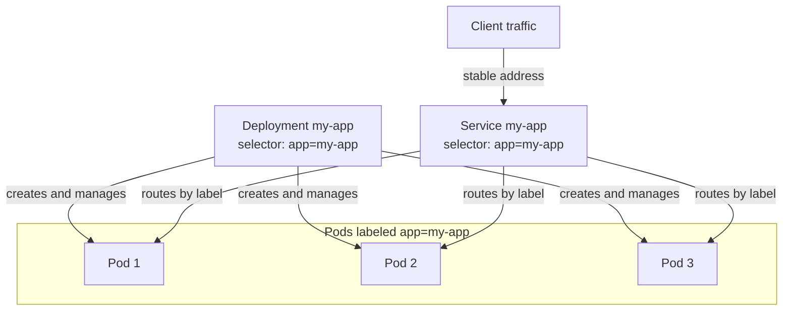

# Writing Kubernetes Deployment Manifests

## Learning Objectives
- Understand the core fields of Deployment and Service manifests (YAML).
- Identify exactly where the image tag is injected into the manifest.
- Write the manifests needed to deploy your own application.

## Body

### Manifests are the contract

In Lecture 1 we said Kubernetes is declarative: you describe the desired end state in a file, and the cluster makes it real. That file is the **manifest**, and in this lecture you write the two you will use constantly — a **Deployment** and a **Service**. The Deployment says "run N copies of this image"; the Service says "give those copies a stable address so traffic can reach them." Together they are the contract your pipeline applies to EKS.

### Pods, and why you do not write them directly

The smallest unit Kubernetes runs is a **Pod** — one or more containers sharing networking and storage. You *can* define a Pod directly:

```yaml
apiVersion: v1
kind: Pod
metadata:
  name: my-app
spec:
  containers:
    - name: my-app
      image: nginx
      ports:
        - containerPort: 80
```

But a bare Pod is fragile: if it dies, it stays dead, and there is no easy way to run several copies or upgrade them. So in practice you almost never create Pods directly. Instead you create a **Deployment**, which manages Pods for you.

### The Deployment manifest

A Deployment's job is to declare *how many* replicas of a Pod should run and *which* image they use, then keep that true — recreating failed Pods and handling upgrades. Here is a complete, annotated example:

```yaml
apiVersion: apps/v1
kind: Deployment
metadata:
  name: my-app
  labels:
    app: my-app
spec:
  replicas: 3                       # run 3 copies
  selector:
    matchLabels:
      app: my-app                   # this Deployment manages Pods with this label
  template:                         # the Pod blueprint
    metadata:
      labels:
        app: my-app                 # Pods get this label — must match the selector
    spec:
      containers:
        - name: my-app
          image: 111122223333.dkr.ecr.us-east-1.amazonaws.com/my-app:a1b9f3c
          ports:
            - containerPort: 3000
```

Every Kubernetes object shares four top-level fields, and they are worth naming explicitly:

- **`apiVersion`** — which API group/version this object belongs to (`apps/v1` for Deployments).
- **`kind`** — the type of object (`Deployment`).
- **`metadata`** — name and labels that identify it.
- **`spec`** — the desired state; this is where the real configuration lives.

Inside the Deployment `spec`, the three fields that matter most:

- **`replicas`** — how many identical Pods to run. Want to scale? Change this number and re-apply.
- **`selector.matchLabels`** — how the Deployment finds the Pods it owns. It looks for Pods carrying a matching label.
- **`template`** — the blueprint for each Pod. Its labels **must** match the selector (notice `app: my-app` appears in both places), or the Deployment will not recognize its own Pods.

### Where the image tag is injected

The single most important line for your pipeline is this one, inside the Pod template:

```yaml
          image: 111122223333.dkr.ecr.us-east-1.amazonaws.com/my-app:a1b9f3c
```

That `:a1b9f3c` is the commit-SHA tag your CI pipeline produced in Lectures 2 and 3. **This is the injection point** — the seam where "the image we built" meets "what the cluster runs." When you deploy a new version, what actually changes is this tag. In Lecture 6 you will see two ways to update it: rewrite the manifest and `kubectl apply`, or change it in place with `kubectl set image`. Either way, this is the field that moves.

### The Service manifest

Pods are **ephemeral** — they get created, destroyed, and rescheduled, and each one gets a fresh IP address. You cannot hand clients a Pod IP, because it will not exist tomorrow. A **Service** solves this by giving your set of Pods one stable address and load-balancing requests across them.

```yaml
apiVersion: v1
kind: Service
metadata:
  name: my-app
spec:
  type: ClusterIP                   # reachable inside the cluster
  selector:
    app: my-app                     # send traffic to Pods with this label
  ports:
    - port: 80                      # the Service's port
      targetPort: 3000              # the container's port
```

The key field is the **`selector`**: it matches the *same label* (`app: my-app`) that your Deployment's Pods carry. That label is the glue — it is how the Service knows which Pods to route to, completely decoupled from individual Pod IPs. As Pods come and go during an upgrade, the Service automatically tracks the healthy ones.

As the diagram shows, the shared `app: my-app` label is what links all three objects: the Deployment stamps it on the Pods it creates, and the Service uses it to find those Pods.



Service `type` controls reach:

- **`ClusterIP`** (default) — reachable only inside the cluster. Good for internal services.
- **`NodePort`** — opens a port on every node.
- **`LoadBalancer`** — on EKS, provisions an AWS load balancer with a public address, so the internet can reach your app.

For exposing real web apps to users you will often go further and use an **Ingress** (HTTP routing in front of Services), but a `Service` is the foundational piece and all you need to get traffic flowing in this course.

### A note on Deployment relatives

A Deployment is the right choice for **stateless** apps — web servers, APIs — where any replica is interchangeable. You may hear about two siblings: a **StatefulSet** (for apps that need stable identities and their own persistent storage per Pod, like databases or Kafka) and a **DaemonSet** (runs exactly one Pod per node, for agents like log or metrics collectors). For deploying your application code, Deployment is almost always what you want; just know the others exist.

### Applying your manifests

Once written, you hand the files to the cluster:

```bash
kubectl apply -f deployment.yaml
kubectl apply -f service.yaml
```

`kubectl apply -f` is declarative: run it once and it creates the objects; run it again after editing and it updates them to match the new desired state. This single command is the backbone of everything that follows — it is literally what your pipeline will call in Lecture 6.

## Key Takeaways
- A Deployment declares the desired number of replicas and the image to run, and keeps that true; you write Deployments, not bare Pods.
- Every object has `apiVersion`, `kind`, `metadata`, and `spec`; the Deployment's key fields are `replicas`, `selector`, and the Pod `template`.
- The `image:` line in the Pod template — ending in your commit-SHA tag — is exactly where the pipeline injects each new version.
- A Service gives ephemeral Pods one stable address and load-balances across them; its `selector` matches the Pods' label. Use `LoadBalancer` type on EKS to expose an app publicly.
- `kubectl apply -f` creates or updates objects to match your manifests, and is the command your pipeline ultimately runs.
