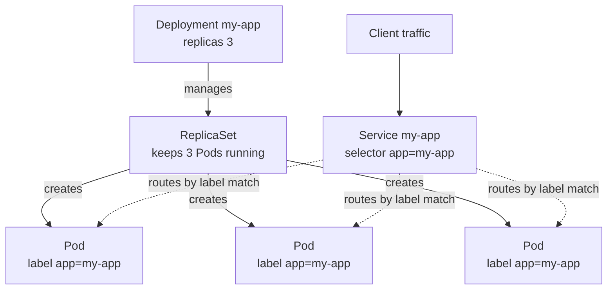

# Writing Kubernetes Deployment Manifests

## Learning Objectives
- Understand the core fields of Deployment and Service manifests (YAML).
- Identify exactly where the image tag is injected into the manifest.
- Write the manifests needed to deploy your own application.

## Body

Kubernetes is declarative: you write a **manifest** describing the desired end state, and the cluster makes it real. In this lecture you write the two manifests you will use constantly — a **Deployment** (run N copies of an image) and a **Service** (give those copies a stable address). Together they are the contract your pipeline applies to EKS. Every manifest shares four top-level fields: `apiVersion` (API group/version), `kind` (object type), `metadata` (name and labels), and `spec` (the desired state).

### Task 1: Write the Deployment

The smallest unit Kubernetes runs is a **Pod** (one or more containers sharing networking and storage). A bare Pod is fragile — if it dies, it stays dead. So you almost never create Pods directly. Instead you create a **Deployment**, which declares how many replicas to run and which image to use, then keeps that true by recreating failed Pods and handling upgrades.

```yaml
# deployment.yaml
apiVersion: apps/v1
kind: Deployment
metadata:
  name: my-app
  labels:
    app: my-app
spec:
  replicas: 3                       # run 3 copies
  selector:
    matchLabels:
      app: my-app                   # manage Pods carrying this label
  template:                         # the Pod blueprint
    metadata:
      labels:
        app: my-app                 # Pods get this label — must match the selector
    spec:
      containers:
        - name: my-app
          image: 111122223333.dkr.ecr.us-east-1.amazonaws.com/my-app:a1b9f3c
          ports:
            - containerPort: 3000
```

The three fields that matter most inside `spec`: `replicas` (change this number and re-apply to scale), `selector.matchLabels` (how the Deployment finds the Pods it owns), and `template` (the Pod blueprint). The template's labels **must** match the selector — notice `app: my-app` appears in both places — or the Deployment will not recognize its own Pods.

> The `image:` line ending in `:a1b9f3c` is the commit-SHA tag your CI pipeline built in Lectures 2–3. This is the injection point — the seam where "the image we built" meets "what the cluster runs." Deploying a new version means changing this one tag.

### Task 2: Write the Service

Pods are **ephemeral**: they get created, destroyed, and rescheduled, and each gets a fresh IP. You cannot hand clients a Pod IP because it will not exist tomorrow. A **Service** gives your set of Pods one stable address and load-balances requests across them.

```yaml
# service.yaml
apiVersion: v1
kind: Service
metadata:
  name: my-app
spec:
  type: ClusterIP                   # reachable inside the cluster
  selector:
    app: my-app                     # send traffic to Pods with this label
  ports:
    - port: 80                      # the Service's port
      targetPort: 3000              # the container's port
```

The key field is the **`selector`**: it matches the same label (`app: my-app`) that your Deployment's Pods carry. That label is the glue — it lets the Service track healthy Pods as they come and go, completely decoupled from individual Pod IPs.

The Service `type` controls reach: `ClusterIP` (default, internal only), `NodePort` (opens a port on every node), and `LoadBalancer` (on EKS, provisions an AWS load balancer with a public address). Use `LoadBalancer` to expose an app to the internet; for richer HTTP routing you later add an **Ingress**, but a Service is all you need to get traffic flowing here.

> Deployment is for **stateless** apps where any replica is interchangeable. Its siblings: a **StatefulSet** gives each Pod a stable identity and its own storage (databases, Kafka), and a **DaemonSet** runs one Pod per node (log/metrics agents). For your application code, Deployment is almost always the right choice.

### Task 3: Apply and verify

Hand the files to the cluster with `kubectl apply -f`. This is declarative: run it once and it creates the objects; run it again after editing and it updates them to match the new desired state. This is literally what your pipeline calls in Lecture 6.

```bash
kubectl apply -f deployment.yaml
kubectl apply -f service.yaml
```

Verify the Deployment created its Pods and the Service is routing to them:

```bash
kubectl get deployment my-app          # READY should show 3/3
kubectl get pods -l app=my-app         # 3 Pods, STATUS Running
kubectl get service my-app             # note the assigned address/port
kubectl get endpoints my-app           # should list the Pod IPs — proves the selector matches
```

If `kubectl get endpoints` shows no IPs, your Service `selector` does not match the Pods' labels — the single most common manifest mistake.

Putting the pieces together, the diagram below shows how these two manifests create one connected system: the Deployment owns a ReplicaSet that runs the Pods, while the Service routes traffic to those same Pods by matching their label.



## Key Takeaways
- A Deployment declares the desired number of replicas and the image to run, then keeps that true; write Deployments, not bare Pods.
- Every object has `apiVersion`, `kind`, `metadata`, and `spec`; the Deployment's key fields are `replicas`, `selector`, and the Pod `template` (labels in both must match).
- The `image:` line ending in your commit-SHA tag is exactly where the pipeline injects each new version.
- A Service gives ephemeral Pods one stable address; its `selector` matches the Pods' label. Use `LoadBalancer` type on EKS to expose an app publicly.
- `kubectl apply -f` creates or updates objects to match your manifests; `kubectl get endpoints` confirms the Service's selector actually matches your Pods.
