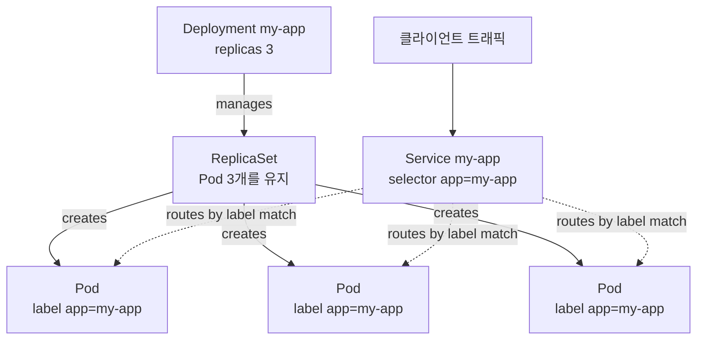

# 쿠버네티스 배포 매니페스트 작성

## 학습 목표
- Deployment와 Service 매니페스트(YAML)의 핵심 필드를 이해한다.
- 이미지 태그가 매니페스트에 주입되는 정확한 위치를 파악한다.
- 자신의 애플리케이션을 배포할 매니페스트를 직접 작성한다.

## 본문

쿠버네티스는 선언형이다. 원하는 최종 상태를 **매니페스트**로 기술하면 클러스터가 그것을 실현한다. 이 강의에서는 실무에서 반복적으로 쓰게 될 두 가지 매니페스트를 작성한다 — **Deployment**(이미지를 N개 실행)와 **Service**(그 실행 중인 인스턴스들에 안정적인 주소 부여). 둘을 합치면 파이프라인이 EKS에 적용하는 계약이 완성된다. 모든 매니페스트는 네 가지 최상위 필드를 공유한다. `apiVersion`(API 그룹/버전), `kind`(오브젝트 타입), `metadata`(이름과 라벨), `spec`(원하는 상태)이다.

### Task 1: Deployment 작성

쿠버네티스가 실행하는 가장 작은 단위는 **Pod**다 — 네트워크와 스토리지를 공유하는 하나 이상의 컨테이너. 베어 Pod는 취약하다. 죽으면 그대로 죽고, 여러 복제본을 실행하거나 업그레이드할 방법도 없다. 그래서 Pod를 직접 생성하는 경우는 거의 없다. 대신 **Deployment**를 만든다. Deployment는 레플리카 수와 사용할 이미지를 선언하고, 실패한 Pod를 재생성하고 업그레이드를 처리하면서 그 상태를 유지한다.

```yaml
# deployment.yaml
apiVersion: apps/v1
kind: Deployment
metadata:
  name: my-app
  labels:
    app: my-app
spec:
  replicas: 3                       # 3개의 복제본 실행
  selector:
    matchLabels:
      app: my-app                   # 이 라벨을 가진 Pod를 관리한다
  template:                         # Pod 청사진
    metadata:
      labels:
        app: my-app                 # Pod에 이 라벨을 붙인다 — selector와 반드시 일치해야 한다
    spec:
      containers:
        - name: my-app
          image: 111122223333.dkr.ecr.us-east-1.amazonaws.com/my-app:a1b9f3c
          ports:
            - containerPort: 3000
```

`spec` 안에서 가장 중요한 세 필드가 있다. `replicas`(이 숫자를 바꾸고 다시 적용하면 스케일링 완료), `selector.matchLabels`(Deployment가 자신이 소유한 Pod를 찾는 방법), `template`(Pod 청사진). template의 라벨은 **반드시** selector와 일치해야 한다 — 두 곳 모두에 `app: my-app`이 등장하는 이유가 여기 있다. 일치하지 않으면 Deployment는 자신의 Pod를 인식하지 못한다.

> `image:` 줄 끝의 `:a1b9f3c`가 2~3강에서 CI 파이프라인이 만든 커밋 SHA 태그다. 이것이 **주입 지점**이다 — "우리가 빌드한 이미지"와 "클러스터가 실행하는 것"이 만나는 연결부. 새 버전을 배포할 때 실제로 바뀌는 것은 이 태그 하나다.

### Task 2: Service 작성

Pod는 **임시적**이다. 생성되고, 파괴되고, 재스케줄되면서 매번 새 IP를 받는다. Pod IP를 클라이언트에 알려줄 수 없다 — 내일이면 사라질 수도 있다. **Service**는 Pod 집합에 하나의 안정적인 주소를 부여하고 요청을 분산시켜 이 문제를 해결한다.

```yaml
# service.yaml
apiVersion: v1
kind: Service
metadata:
  name: my-app
spec:
  type: ClusterIP                   # 클러스터 내부에서만 접근 가능
  selector:
    app: my-app                     # 이 라벨을 가진 Pod로 트래픽을 전송한다
  ports:
    - port: 80                      # Service의 포트
      targetPort: 3000              # 컨테이너의 포트
```

핵심 필드는 **`selector`**다. Deployment의 Pod가 가진 것과 동일한 라벨(`app: my-app`)을 매칭한다. 이 라벨이 접착제다 — 개별 Pod IP와 완전히 분리된 채로 Service가 정상 Pod를 추적할 수 있는 비결이다. 업그레이드 중 Pod가 오고 가더라도 Service는 자동으로 올바른 Pod를 찾아낸다.

Service `type`은 접근 범위를 제어한다. `ClusterIP`(기본값, 클러스터 내부 전용), `NodePort`(모든 노드에서 포트 개방), `LoadBalancer`(EKS에서는 공개 주소를 가진 AWS 로드 밸런서를 프로비저닝)로 나뉜다. 인터넷에 앱을 노출할 때는 `LoadBalancer`를 사용하고, 정교한 HTTP 라우팅이 필요하면 나중에 **Ingress**를 추가하면 된다. 지금 단계에서는 Service만으로 트래픽을 흘리기에 충분하다.

> Deployment는 모든 레플리카가 교체 가능한 **스테이트리스(stateless)** 앱에 적합하다. 형제 오브젝트로는 **StatefulSet**(데이터베이스, Kafka처럼 안정적인 아이덴티티와 Pod별 전용 스토리지가 필요한 앱)과 **DaemonSet**(로그·메트릭 수집 에이전트처럼 각 노드에 정확히 하나의 Pod를 실행)이 있다. 애플리케이션 코드를 배포할 때는 거의 항상 Deployment가 정답이다.

### Task 3: 적용 및 확인

파일을 클러스터에 넘길 때는 `kubectl apply -f`를 사용한다. 선언형 명령이라 처음 실행하면 오브젝트를 생성하고, 편집 후 다시 실행하면 새 원하는 상태에 맞게 업데이트한다. 6강에서 파이프라인이 실제로 호출하는 명령이 바로 이것이다.

```bash
kubectl apply -f deployment.yaml
kubectl apply -f service.yaml
```

Deployment가 Pod를 생성했는지, Service가 Pod로 라우팅하고 있는지 확인한다.

```bash
kubectl get deployment my-app          # READY가 3/3이어야 한다
kubectl get pods -l app=my-app         # Pod 3개, STATUS Running
kubectl get service my-app             # 할당된 주소/포트 확인
kubectl get endpoints my-app           # Pod IP 목록이 보여야 한다 — selector가 일치하는 증거
```

`kubectl get endpoints`에 IP가 없다면 Service `selector`가 Pod의 라벨과 맞지 않는 것이다 — 매니페스트에서 가장 흔한 실수다.

두 매니페스트가 하나의 연결된 시스템을 어떻게 만드는지 아래 다이어그램이 보여준다. Deployment는 ReplicaSet을 소유하고 ReplicaSet이 Pod를 실행하며, Service는 동일한 라벨로 그 Pod들에 트래픽을 라우팅한다.



## 핵심 정리
- Deployment는 원하는 레플리카 수와 실행할 이미지를 선언하고 그 상태를 유지한다. 베어 Pod가 아닌 Deployment를 작성하라.
- 모든 오브젝트는 `apiVersion`, `kind`, `metadata`, `spec`을 가진다. Deployment의 핵심 필드는 `replicas`, `selector`, Pod `template`이며, 두 곳의 라벨이 반드시 일치해야 한다.
- Pod template 안의 `image:` 줄 — 커밋 SHA 태그로 끝나는 — 이 파이프라인이 각 새 버전을 주입하는 정확한 위치다.
- Service는 임시적인 Pod에 하나의 안정적인 주소를 부여하고 요청을 분산한다. `selector`가 Pod의 라벨과 매칭된다. EKS에서 앱을 공개 노출하려면 `LoadBalancer` 타입을 쓴다.
- `kubectl apply -f`는 매니페스트에 맞게 오브젝트를 생성하거나 업데이트한다. `kubectl get endpoints`로 Service의 selector가 실제로 Pod와 연결됐는지 확인한다.
