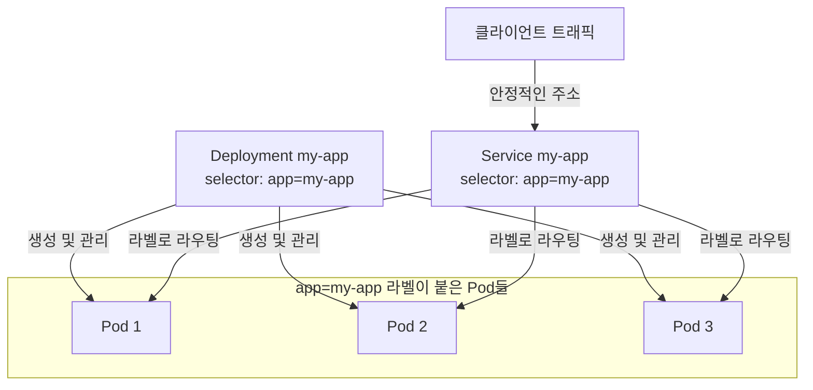

# 쿠버네티스 배포 매니페스트 작성

## 학습 목표
- Deployment와 Service 매니페스트(YAML)의 핵심 필드를 이해한다.
- 이미지 태그가 매니페스트에 주입되는 정확한 위치를 파악한다.
- 자신의 애플리케이션을 배포할 매니페스트를 직접 작성한다.

## 본문

### 매니페스트는 계약이다

1강에서 쿠버네티스는 선언형이라고 했다. 원하는 최종 상태를 파일에 기술하면 클러스터가 그것을 현실로 만든다. 그 파일이 **매니페스트**이고, 이 강의에서는 항상 쓰게 될 두 가지를 작성한다 — **Deployment**와 **Service**다. Deployment는 "이 이미지를 N개 실행한다"고 말하고, Service는 "그 실행 중인 인스턴스들에게 안정적인 주소를 부여해 트래픽이 도달할 수 있게 한다"고 말한다. 두 가지를 합치면 파이프라인이 EKS에 적용하는 계약이 완성된다.

### Pod, 그리고 직접 작성하지 않는 이유

쿠버네티스가 실행하는 가장 작은 단위는 **Pod**다 — 네트워크와 스토리지를 공유하는 하나 이상의 컨테이너. Pod를 직접 정의할 수도 있다.

```yaml
apiVersion: v1
kind: Pod
metadata:
  name: my-app
spec:
  containers:
    - name: my-app
      image: nginx
      ports:
        - containerPort: 80
```

하지만 베어 Pod는 취약하다. 죽으면 그대로 죽고, 여러 복제본을 실행하거나 업그레이드하는 방법도 없다. 실제로는 Pod를 직접 생성하는 경우가 거의 없다. 대신 Pod를 대신 관리해 주는 **Deployment**를 만든다.

### Deployment 매니페스트

Deployment의 역할은 몇 개의 Pod 레플리카를 실행해야 하는지, 어떤 이미지를 사용하는지를 선언하고 그 상태를 유지하는 것이다. 실패한 Pod를 다시 만들고 업그레이드를 처리한다. 전체 주석 예시는 다음과 같다.

```yaml
apiVersion: apps/v1
kind: Deployment
metadata:
  name: my-app
  labels:
    app: my-app
spec:
  replicas: 3                       # 3개의 복제본 실행
  selector:
    matchLabels:
      app: my-app                   # 이 Deployment가 이 라벨을 가진 Pod를 관리한다
  template:                         # Pod 청사진
    metadata:
      labels:
        app: my-app                 # Pod에 이 라벨을 붙인다 — selector와 일치해야 한다
    spec:
      containers:
        - name: my-app
          image: 111122223333.dkr.ecr.us-east-1.amazonaws.com/my-app:a1b9f3c
          ports:
            - containerPort: 3000
```

모든 쿠버네티스 오브젝트는 네 가지 최상위 필드를 공유하며, 명시적으로 이름 붙일 가치가 있다.

- **`apiVersion`** — 이 오브젝트가 속하는 API 그룹/버전 (Deployment는 `apps/v1`).
- **`kind`** — 오브젝트 타입 (`Deployment`).
- **`metadata`** — 오브젝트를 식별하는 이름과 라벨.
- **`spec`** — 원하는 상태. 실제 설정이 여기에 있다.

Deployment `spec` 안에서 가장 중요한 세 가지 필드는:

- **`replicas`** — 실행할 동일한 Pod의 수. 스케일링이 필요하면 이 숫자를 바꾸고 다시 적용한다.
- **`selector.matchLabels`** — Deployment가 자신이 소유한 Pod를 찾는 방법. 일치하는 라벨을 가진 Pod를 찾는다.
- **`template`** — 각 Pod의 청사진. 라벨이 **반드시** selector와 일치해야 한다(두 곳 모두에 `app: my-app`이 나타남에 주목하라). 그렇지 않으면 Deployment가 자신의 Pod를 인식하지 못한다.

### 이미지 태그가 주입되는 위치

파이프라인에서 가장 중요한 한 줄이 Pod template 안에 있다.

```yaml
          image: 111122223333.dkr.ecr.us-east-1.amazonaws.com/my-app:a1b9f3c
```

`:a1b9f3c`가 2강과 3강에서 CI 파이프라인이 만든 커밋 SHA 태그다. **이것이 주입 지점이다** — "우리가 빌드한 이미지"와 "클러스터가 실행하는 것"이 만나는 연결부다. 새 버전을 배포할 때 실제로 바뀌는 것은 이 태그다. 6강에서 두 가지 갱신 방법을 볼 것이다. 매니페스트를 다시 작성하고 `kubectl apply`하거나, `kubectl set image`로 직접 변경하거나. 어느 방식이든 움직이는 필드는 이것이다.

### Service 매니페스트

Pod는 **임시적**이다 — 생성되고, 파괴되고, 재스케줄되며, 각각 새로운 IP 주소를 받는다. 클라이언트에게 Pod IP를 알려줄 수 없다. 내일이면 존재하지 않을 수도 있다. **Service**는 Pod 집합에 하나의 안정적인 주소를 부여하고 요청을 분산시켜 이 문제를 해결한다.

```yaml
apiVersion: v1
kind: Service
metadata:
  name: my-app
spec:
  type: ClusterIP                   # 클러스터 내부에서만 접근 가능
  selector:
    app: my-app                     # 이 라벨을 가진 Pod로 트래픽을 전송한다
  ports:
    - port: 80                      # Service의 포트
      targetPort: 3000              # 컨테이너의 포트
```

핵심 필드는 **`selector`**다. Deployment의 Pod가 가진 것과 동일한 라벨(`app: my-app`)을 매칭한다. 이 라벨이 접착제다 — Service가 개별 Pod IP와 완전히 분리된 채로 어떤 Pod로 라우팅할지 아는 방법이다. 업그레이드 중 Pod가 오고 가더라도 Service는 자동으로 정상적인 Pod를 추적한다.

다이어그램이 보여주듯이, 공유 라벨 `app: my-app`이 세 오브젝트를 연결한다. Deployment가 생성하는 Pod에 라벨을 붙이고, Service는 그 라벨로 Pod를 찾는다.



Service `type`은 접근 범위를 제어한다.

- **`ClusterIP`** (기본값) — 클러스터 내부에서만 접근 가능. 내부 서비스에 적합.
- **`NodePort`** — 모든 노드에서 포트를 연다.
- **`LoadBalancer`** — EKS에서는 공개 주소가 있는 AWS 로드 밸런서를 프로비저닝해서 인터넷에서 앱에 접근할 수 있게 한다.

실제 웹 앱을 사용자에게 노출할 때는 **Ingress**(Service 앞에서 HTTP 라우팅)를 추가로 사용하는 경우가 많지만, Service가 기반이 되는 구성요소이며 이 강좌에서 트래픽 흐름을 구성하는 데 필요한 전부다.

### Deployment의 형제들

Deployment는 **스테이트리스(stateless)** 앱 — 웹 서버, API — 에 적합하며, 모든 레플리카가 교체 가능하다. 두 가지 형제가 있다. **StatefulSet**(데이터베이스나 Kafka처럼 안정적인 아이덴티티와 Pod별 영구 스토리지가 필요한 앱), **DaemonSet**(로그나 메트릭 수집기 같은 에이전트로, 각 노드에 정확히 하나의 Pod를 실행한다). 애플리케이션 코드를 배포할 때는 거의 항상 Deployment를 쓰면 된다. 다른 것들도 존재한다는 것만 알아두자.

### 매니페스트 적용하기

작성을 마치면 파일을 클러스터에 넘긴다.

```bash
kubectl apply -f deployment.yaml
kubectl apply -f service.yaml
```

`kubectl apply -f`는 선언형이다. 한 번 실행하면 오브젝트를 생성하고, 편집 후 다시 실행하면 새 원하는 상태에 맞게 업데이트한다. 이 단일 명령이 이후 모든 것의 기반이다 — 6강에서 파이프라인이 실제로 호출하는 명령이 바로 이것이다.

## 핵심 정리
- Deployment는 원하는 레플리카 수와 실행할 이미지를 선언하고 그 상태를 유지한다. 베어 Pod가 아닌 Deployment를 작성하라.
- 모든 오브젝트는 `apiVersion`, `kind`, `metadata`, `spec`을 가진다. Deployment의 핵심 필드는 `replicas`, `selector`, Pod `template`이다.
- Pod template 안의 `image:` 줄 — 커밋 SHA 태그로 끝나는 — 이 파이프라인이 각 새 버전을 주입하는 정확한 위치다.
- Service는 임시적인 Pod에 하나의 안정적인 주소를 부여하고 부하를 분산한다. `selector`가 Pod의 라벨과 매칭된다. EKS에서 앱을 공개적으로 노출하려면 `LoadBalancer` 타입을 사용하라.
- `kubectl apply -f`는 매니페스트에 맞게 오브젝트를 생성하거나 업데이트하며, 파이프라인이 궁극적으로 실행하는 명령이다.
