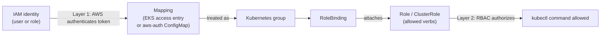

# Accessing the EKS Cluster and Configuring kubectl

## Learning Objectives
- Connect to an EKS cluster using kubeconfig.
- Understand how Jenkins authenticates to the cluster and runs commands against it.
- Grasp the basics of how IAM permissions connect to Kubernetes RBAC.

## Body

### The missing link

You have a CI pipeline that pushes images (Lecture 3) and manifests that describe deployments (Lecture 4). But neither one can touch the cluster yet, because nobody has *authenticated* to EKS. This lecture closes that gap — first for you on your laptop, then for Jenkins. The key insight, which trips up almost everyone the first time, is that EKS access has **two independent layers**: AWS IAM decides *whether you can reach the cluster at all*, and Kubernetes RBAC decides *what you can do once inside*. You need both.

### kubectl and kubeconfig

`kubectl` is the command-line tool for talking to a Kubernetes cluster. It reads its connection settings — which cluster, at which address, with which identity — from a file called the **kubeconfig** (by default `~/.kube/config`). Point kubeconfig at a cluster and `kubectl` commands go there; switch it, and they go somewhere else.

For EKS, you do not hand-edit this file. AWS generates the right entry for you with one command:

```bash
aws eks update-kubeconfig --region us-east-1 --name my-cluster
```

This command does exactly what its name says: it *updates your local kubeconfig* with the cluster's API endpoint and certificate, and configures it to obtain a short-lived token from AWS for authentication. After running it, verify access:

```bash
kubectl get nodes
kubectl get pods -A
```

If you see your nodes listed, you are connected. If you get an "Unauthorized" or "You must be logged in" error, that is the *second* layer talking — your AWS identity reached the cluster, but Kubernetes has not granted it any permissions yet. Keep that distinction in mind; it is the whole story of this lecture.

> Run `aws eks update-kubeconfig` whenever you switch clusters, AWS profiles, or machines. It is idempotent and harmless to re-run — it just refreshes the kubeconfig entry for that cluster.

### Layer one: IAM — can you reach the cluster?

When you call `aws eks update-kubeconfig`, the resulting kubeconfig tells `kubectl` to fetch a token from AWS using your current **IAM identity** (an IAM user or, better, an IAM role). EKS validates that token against AWS. So the first gate is: *does this IAM identity have permission to connect to this cluster, and does EKS recognize it?*

A minimal IAM policy for "let this identity connect to EKS" allows actions like `eks:DescribeCluster` (so `update-kubeconfig` can fetch the endpoint). That is enough to *reach* the cluster — but, importantly, it grants no power *inside* it.

### Layer two: RBAC — what can you do inside?

Once your token is accepted, Kubernetes applies its own authorization system, **RBAC (Role-Based Access Control)**. RBAC has two halves:

- A **Role** (namespace-scoped) or **ClusterRole** (cluster-wide) lists *permissions* — verbs like `get`, `list`, `watch`, `create` on resources like `pods`, `deployments`, `secrets`.
- A **RoleBinding** / **ClusterRoleBinding** *attaches* a Role to an identity (a user, group, or service account).

For example, a read-only viewer ClusterRole bound to a `my-viewer` group lets those identities run `kubectl get pods` everywhere but nothing destructive; a `cluster-admin` ClusterRole bound to a `my-admin` group grants full control.

### Connecting the two layers: who *is* this IAM identity, in Kubernetes terms?

Here is the crux. AWS knows your IAM identity; Kubernetes knows its own users and groups. Something has to **map** one to the other — to say "the IAM role `arn:aws:iam::...:role/jenkins-deploy` should be treated as the Kubernetes group `my-admin`." There are two mechanisms:

- **EKS access entries** — the modern, recommended approach. You declare the mapping through the EKS API (Console, CLI, or Terraform): this IAM principal maps to these Kubernetes groups/permissions. Clean and auditable.
- **The `aws-auth` ConfigMap** — the older approach, a ConfigMap in `kube-system` that listed IAM-to-RBAC mappings. You will still encounter it on existing clusters, but it is now considered legacy.

Either way, the chain is: **IAM identity → (mapping) → Kubernetes group → RoleBinding → Role's permissions.** Break any link and you get that "Unauthorized" error. The flow is as follows: AWS authenticates the IAM token, the access entry maps it to a Kubernetes group, and RBAC then decides what verbs that group may run.



A useful debugging tool while you sort this out is `kubectl auth can-i`, which answers permission questions directly:

```bash
kubectl auth can-i get pods          # -> yes / no
kubectl auth can-i create deployments
```

### Layer three: how Jenkins authenticates (the real target)

Everything above applies to *you*. Now apply it to *Jenkins*, which is the whole reason this lecture exists. Jenkins must be able to run `kubectl` against EKS unattended, with no human typing credentials. The principle from Lecture 3 holds: **authenticate the machine via an IAM role, never static keys in a job.**

In order of preference:

- **IRSA (IAM Roles for Service Accounts)** — if Jenkins itself runs *inside* Kubernetes/EKS, you associate its Kubernetes service account with an IAM role. The Jenkins Pod automatically receives short-lived AWS credentials for that role. No secrets stored anywhere. (AWS's newer "EKS Pod Identity" achieves the same goal with simpler setup.)
- **An instance/node IAM role** — if Jenkins runs on an EC2 instance, attach an IAM role to that instance. The AWS CLI inside the build picks it up automatically.

Whichever you use, that IAM role must then be **mapped to a Kubernetes RBAC group** (via an access entry) that has permission to deploy — typically the rights to `get`/`update`/`patch` Deployments in your app's namespace. Then Jenkins' deploy stage can simply run:

```bash
aws eks update-kubeconfig --region us-east-1 --name my-cluster
kubectl apply -f deployment.yaml
```

…and EKS will accept it, because the IAM role is recognized (layer 1 + the mapping) and has the right RBAC permissions (layer 2).

> Scope Jenkins' RBAC to the least it needs — usually permission to update Deployments in one namespace, not cluster-admin. If the pipeline is ever compromised, a tight role limits the blast radius.

### Putting it together

To let Jenkins deploy to EKS you will, once, set up: (1) an IAM role for Jenkins with EKS-connect permissions, (2) an EKS access entry mapping that role to a Kubernetes group, and (3) an RBAC binding giving that group deploy permissions. After that, the pipeline authenticates with one command and issues `kubectl` freely. Lecture 6 builds the deploy stage that relies on exactly this.

## Key Takeaways
- `aws eks update-kubeconfig --region <r> --name <cluster>` writes the cluster's endpoint and auth into your kubeconfig; then `kubectl get nodes` confirms access.
- EKS access has two layers: **IAM** decides if you can reach the cluster, **RBAC** decides what you can do inside. An "Unauthorized" error usually means IAM worked but RBAC has not been granted.
- An IAM identity must be **mapped** to Kubernetes groups via EKS access entries (modern) or the legacy `aws-auth` ConfigMap; the chain is IAM → mapping → group → binding → permissions.
- Jenkins should authenticate via an IAM role — IRSA/Pod Identity if it runs in-cluster, or an instance role on EC2 — never static keys. That role is then mapped to an RBAC group with deploy permissions.
- Scope the deploy role to least privilege (update Deployments in one namespace), and use `kubectl auth can-i` to debug permissions.
