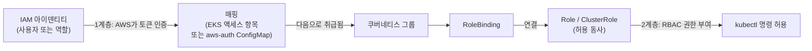

# EKS 클러스터 접근과 kubectl 설정

## 학습 목표
- kubeconfig를 통해 EKS 클러스터에 접근하는 방법을 익힌다.
- Jenkins가 클러스터에 인증하고 명령을 실행하는 구성을 이해한다.
- IAM 권한이 쿠버네티스 RBAC과 연결되는 기본 개념을 파악한다.

## 본문

### 빠진 연결 고리

이미지를 푸시하는 CI 파이프라인(3강)과 배포를 기술하는 매니페스트(4강)가 있다. 하지만 아직 누구도 EKS에 *인증*하지 않았기 때문에 클러스터에 접근할 수 없다. 이 강의에서 그 공백을 메운다 — 먼저 노트북에서, 그다음 Jenkins에서. 처음 접하면 누구나 막히는 핵심이 있다. EKS 접근에는 **두 개의 독립적인 계층**이 있다는 것이다. AWS IAM이 *클러스터에 도달할 수 있는지*를 결정하고, 쿠버네티스 RBAC이 *안에 들어간 뒤 무엇을 할 수 있는지*를 결정한다. 둘 다 필요하다.

### kubectl과 kubeconfig

`kubectl`은 쿠버네티스 클러스터와 통신하는 커맨드라인 도구다. 어떤 클러스터에, 어떤 주소로, 어떤 아이덴티티로 연결할지 등 접속 설정을 **kubeconfig** 파일(기본값 `~/.kube/config`)에서 읽는다. kubeconfig가 특정 클러스터를 가리키면 `kubectl` 명령이 그곳으로 향하고, 바꾸면 다른 곳으로 간다.

EKS의 경우 이 파일을 직접 편집하지 않는다. 명령 하나로 AWS가 올바른 항목을 생성해 준다.

```bash
aws eks update-kubeconfig --region us-east-1 --name my-cluster
```

이 명령은 이름 그대로다. 클러스터의 API 엔드포인트와 인증서를 *로컬 kubeconfig에 업데이트*하고, 인증용 단기 토큰을 AWS에서 발급받도록 설정한다. 실행 후 접근을 확인한다.

```bash
kubectl get nodes
kubectl get pods -A
```

노드 목록이 보이면 연결된 것이다. "Unauthorized" 또는 "로그인 필요" 오류가 나오면 *두 번째 계층*이 말하는 것이다 — AWS 아이덴티티는 클러스터에 도달했지만 쿠버네티스가 아직 권한을 부여하지 않은 것이다. 이 구분을 기억해 두라. 이것이 이 강의 전체의 핵심이다.

> `aws eks update-kubeconfig`는 클러스터를 전환하거나, AWS 프로파일을 바꾸거나, 다른 머신으로 이동할 때마다 실행하라. 멱등적(idempotent)이라 다시 실행해도 문제없다 — 해당 클러스터의 kubeconfig 항목만 새로 고친다.

### 1계층: IAM — 클러스터에 도달할 수 있는가

`aws eks update-kubeconfig`를 실행하면, 결과로 생성되는 kubeconfig가 `kubectl`에 현재 **IAM 아이덴티티**(IAM 사용자 또는 IAM 역할)로 AWS에서 토큰을 발급받도록 지시한다. EKS가 그 토큰을 AWS 기준으로 검증한다. 첫 번째 관문이다. *이 IAM 아이덴티티가 이 클러스터에 연결할 권한이 있는가, EKS가 이 아이덴티티를 인식하는가?*

"이 아이덴티티가 EKS에 연결하도록 허용"하기 위한 최소 IAM 정책은 `eks:DescribeCluster`(이 액션으로 `update-kubeconfig`가 엔드포인트를 가져올 수 있다)를 허용하는 것이다. 클러스터에 *도달*하기에는 충분하지만, 안에서 할 수 있는 것은 아무것도 부여하지 않는다.

### 2계층: RBAC — 안에서 무엇을 할 수 있는가

토큰이 수락되면 쿠버네티스가 자체 권한 부여 시스템인 **RBAC(Role-Based Access Control)**을 적용한다. RBAC은 두 부분으로 구성된다.

- **Role**(네임스페이스 범위) 또는 **ClusterRole**(클러스터 전체)은 *권한*을 나열한다 — `pods`, `deployments`, `secrets` 등의 리소스에 대한 `get`, `list`, `watch`, `create` 같은 동사.
- **RoleBinding** / **ClusterRoleBinding**은 Role을 아이덴티티(사용자, 그룹, 서비스 어카운트)에 *연결*한다.

예를 들어, `my-viewer` 그룹에 읽기 전용 뷰어 ClusterRole을 바인딩하면 그 아이덴티티는 어디서든 `kubectl get pods`를 실행할 수 있지만 파괴적인 작업은 할 수 없다. `my-admin` 그룹에 `cluster-admin` ClusterRole을 바인딩하면 전체 제어권이 부여된다.

### 두 계층 연결: 이 IAM 아이덴티티는 쿠버네티스 관점에서 누구인가

핵심이 여기에 있다. AWS는 IAM 아이덴티티를 알고, 쿠버네티스는 자체 사용자와 그룹을 안다. 두 세계를 **매핑**하는 무언가가 필요하다 — "IAM 역할 `arn:aws:iam::...:role/jenkins-deploy`를 쿠버네티스 그룹 `my-admin`으로 취급하라"고 말하는 것. 두 가지 메커니즘이 있다.

- **EKS 액세스 항목(access entries)** — 현대적이고 권장되는 방법. EKS API(콘솔, CLI, 또는 Terraform)를 통해 매핑을 선언한다. 이 IAM 주체를 이 쿠버네티스 그룹/권한으로 매핑한다. 명확하고 감사 가능하다.
- **`aws-auth` ConfigMap** — 예전 방법. `kube-system`의 ConfigMap으로 IAM-RBAC 매핑을 나열했다. 기존 클러스터에서 여전히 볼 수 있지만 이제 레거시로 간주된다.

어느 방법이든 체인은 같다. **IAM 아이덴티티 → (매핑) → 쿠버네티스 그룹 → RoleBinding → Role의 권한.** 어느 한 연결 고리가 끊어지면 "Unauthorized" 오류가 난다. 흐름은 이렇다. AWS가 IAM 토큰을 인증하고, 액세스 항목이 쿠버네티스 그룹으로 매핑하며, RBAC이 그 그룹이 실행할 수 있는 동사를 결정한다.



디버깅 도구로 `kubectl auth can-i`를 사용하면 권한 질문에 직접 답을 얻을 수 있다.

```bash
kubectl auth can-i get pods          # -> yes / no
kubectl auth can-i create deployments
```

### 3계층: Jenkins가 인증하는 방법(진짜 목표)

위의 내용은 *나*(개인)에게 적용된다. 이제 *Jenkins*에 적용해 보자. Jenkins가 EKS에 대해 `kubectl`을 실행해야 하는 이유가 바로 이 강의가 존재하는 이유다. Jenkins는 사람이 자격증명을 입력하지 않고도 EKS에 무인으로 명령을 실행할 수 있어야 한다. 3강의 원칙이 여기서도 적용된다. **머신은 IAM 역할로 인증하고, 잡에 정적 키를 쓰지 않는다.**

우선순위 순서로:

- **IRSA(IAM Roles for Service Accounts)** — Jenkins 자체가 쿠버네티스/EKS *안에서* 실행된다면, Jenkins의 쿠버네티스 서비스 어카운트에 IAM 역할을 연결한다. Jenkins Pod가 해당 역할의 단기 AWS 자격증명을 자동으로 받는다. 어디에도 시크릿이 저장되지 않는다. (AWS의 새로운 "EKS Pod Identity"도 더 간단한 설정으로 동일한 목적을 달성한다.)
- **인스턴스/노드 IAM 역할** — Jenkins가 EC2 인스턴스에서 실행된다면, 해당 인스턴스에 IAM 역할을 연결한다. 빌드 내 AWS CLI가 자동으로 이를 감지한다.

어느 방법을 사용하든, 그 IAM 역할은 배포 권한이 있는 쿠버네티스 RBAC 그룹에 **매핑**되어야 한다 — 보통 앱의 네임스페이스에서 Deployment를 `get`/`update`/`patch`하는 권한이다. 그러면 Jenkins의 배포 스테이지는 단순히 이렇게 실행할 수 있다.

```bash
aws eks update-kubeconfig --region us-east-1 --name my-cluster
kubectl apply -f deployment.yaml
```

EKS가 이를 수락한다. IAM 역할이 인식되고(1계층 + 매핑), 올바른 RBAC 권한이 있기 때문이다(2계층).

> Jenkins의 RBAC 범위를 최소한으로 유지하라 — 보통 한 네임스페이스에서 Deployment를 업데이트할 권한이면 충분하고, cluster-admin은 불필요하다. 파이프라인이 침해되더라도 범위가 좁은 역할은 피해 범위를 제한한다.

### 모두 합치기

Jenkins가 EKS에 배포하려면 한 번만 설정하면 된다. (1) EKS 연결 권한이 있는 Jenkins IAM 역할, (2) 해당 역할을 쿠버네티스 그룹에 매핑하는 EKS 액세스 항목, (3) 그 그룹에 배포 권한을 부여하는 RBAC 바인딩. 설정 후에는 파이프라인이 명령 하나로 인증하고 `kubectl`을 자유롭게 실행한다. 6강에서 정확히 이 내용을 기반으로 배포 스테이지를 구축한다.

## 핵심 정리
- `aws eks update-kubeconfig --region <r> --name <cluster>`는 클러스터의 엔드포인트와 인증 정보를 kubeconfig에 기록한다. `kubectl get nodes`로 접근을 확인한다.
- EKS 접근에는 두 계층이 있다. **IAM**이 클러스터 도달 가능 여부를 결정하고, **RBAC**이 안에서 할 수 있는 일을 결정한다. "Unauthorized" 오류는 대개 IAM은 통과했지만 RBAC이 부여되지 않은 것이다.
- IAM 아이덴티티는 EKS 액세스 항목(현대적) 또는 레거시 `aws-auth` ConfigMap을 통해 쿠버네티스 그룹에 **매핑**되어야 한다. 체인은 IAM → 매핑 → 그룹 → 바인딩 → 권한이다.
- Jenkins는 IAM 역할로 인증해야 한다 — 클러스터 내에서 실행된다면 IRSA/Pod Identity, EC2에서 실행된다면 인스턴스 역할을 사용하고, 절대 정적 키를 쓰지 않는다. 해당 역할은 배포 권한이 있는 RBAC 그룹에 매핑된다.
- 배포 역할을 최소 권한(한 네임스페이스에서 Deployment 업데이트)으로 제한하고, 권한 디버깅에는 `kubectl auth can-i`를 사용하라.
