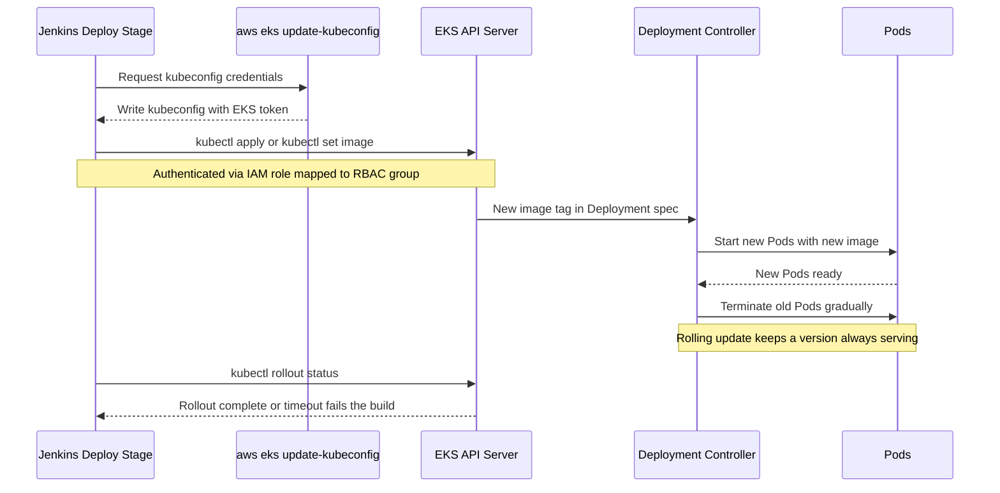

# Jenkins에서 EKS로 자동 배포

## 학습 목표
- 새로 빌드한 이미지 태그로 매니페스트(또는 실행 중인 Deployment)를 업데이트한다.
- `kubectl apply` 또는 `kubectl set image`로 EKS에 롤아웃하고, 완료될 때까지 기다린다.
- `git push` 한 번으로 EKS까지 배포가 완료되는 파이프라인을 완성한다.

## 본문

### 배포 스테이지가 하는 일

지금까지 만든 조각들을 정리해 보자. 커밋 SHA를 태그로 붙인 이미지를 빌드해 ECR에 푸시하는 CI 파이프라인, Deployment를 기술하는 매니페스트, 그리고 IAM 역할을 RBAC 그룹에 매핑해 EKS에 인증된 Jenkins가 있다. 남은 것은 새 태그를 클러스터에 밀어 넣는 **배포 스테이지** 하나뿐이다. 핵심 질문은 하나다: 새 이미지 태그를 클러스터의 Deployment에 어떻게 반영할 것인가? 깔끔한 방법이 두 가지 있다.

### 방법 A: 매니페스트를 수정한 뒤 `kubectl apply`

`deployment.yaml`에 플레이스홀더(`image: IMAGE_PLACEHOLDER`)를 넣어 두고, 배포 시점에 실제 태그로 치환한 뒤 apply하는 방식이다. 매니페스트가 유일한 진실의 원천(single source of truth)으로 남으므로, 레플리카 수·포트·프로브·리소스 제한 등 모든 필드가 한꺼번에 적용되고 클러스터 상태가 항상 저장소와 일치한다. 나중에 GitOps로 확장하기에도 유리하므로 이 방식을 권장한다.

```groovy
stage('Deploy to EKS') {
    steps {
        sh """
          aws eks update-kubeconfig --region ${AWS_REGION} --name ${CLUSTER}
          sed -i 's|IMAGE_PLACEHOLDER|${REGISTRY}/${ECR_REPO}:${IMAGE_TAG}|' deployment.yaml
          kubectl apply -f deployment.yaml
          kubectl apply -f service.yaml
          kubectl rollout status deployment/my-app --timeout=120s
        """
    }
}
```

### 방법 B: `kubectl set image`

Deployment가 이미 존재하고 이미지 태그만 바꾸는 경우라면, YAML을 건드리지 않고 해당 필드만 직접 업데이트할 수 있다.

```bash
kubectl set image deployment/my-app \
  my-app=111122223333.dkr.ecr.us-east-1.amazonaws.com/my-app:a1b9f3c
```

"Deployment `my-app` 안의 컨테이너 `my-app`을 이 이미지로 교체하라"는 뜻이다. `=` 왼쪽의 이름은 Pod 템플릿의 컨테이너 `name:`과 반드시 일치해야 한다. 간결하고 빠른 롤아웃에 편리하지만, 클러스터의 실행 상태가 Git 파일과 **드리프트(drift)**될 수 있다는 단점이 있다. 학습용 파이프라인에서는 무방하지만, 저장소를 정확히 반영하고 싶다면 방법 A가 낫다.

### 롤아웃 완료 대기

두 명령 모두 롤아웃을 *시작*하고 즉시 반환한다. 새 Pod가 실제로 정상 상태가 될 때까지 파이프라인을 블로킹하거나, 그렇지 않으면 빌드를 실패시켜야 한다.

```bash
kubectl rollout status deployment/my-app --timeout=120s
```

> `rollout status` 없이는 배포를 *요청*하는 순간 파이프라인이 "성공"을 보고한다. 새 버전이 크래시 루프에 빠져 있어도 마찬가지다. 이 명령을 추가하면 배포가 실패했을 때 빌드가 빨간불로 바뀐다.

`set image` 방식의 배포 스테이지 전체 코드:

```groovy
stage('Deploy to EKS') {
    steps {
        sh """
          aws eks update-kubeconfig --region ${AWS_REGION} --name ${CLUSTER}
          kubectl set image deployment/my-app my-app=${REGISTRY}/${ECR_REPO}:${IMAGE_TAG}
          kubectl rollout status deployment/my-app --timeout=120s
        """
    }
}
```

### 롤아웃 동작 원리와 커밋 SHA 태그가 중요한 이유

이미지를 변경하면 **롤링 업데이트**가 시작된다. Kubernetes는 새 Pod를 띄우고 준비 상태가 되면 기존 Pod를 조금씩 종료하므로, 항상 정상 버전이 트래픽을 받는 상태가 유지된다. 단 한 줄의 변경으로 다운타임 없이 배포가 된다.

아래 다이어그램은 배포 스테이지 전체 흐름을 보여 준다. Jenkins가 kubeconfig로 인증하고 새 이미지를 적용하면, 클러스터가 Pod를 교체하는 동안 `rollout status`가 완료될 때까지 블로킹하는 과정이다.



배포 스테이지는 `IMAGE_TAG`(커밋 SHA)를 그대로 클러스터에 전달하므로, 푸시한 커밋이 EKS에서 실행되는 내용을 정확히 결정하며 실행 중인 모든 Pod를 특정 커밋으로 추적할 수 있다.

> `latest` 태그로 배포하면 아무 일도 일어나지 않는 경우가 많다. Kubernetes 입장에서 Deployment 스펙이 바뀌지 않았으므로 롤아웃이 트리거되지 않기 때문이다. 커밋 SHA 태그는 항상 새로운 값이므로 롤아웃이 반드시 실행되고, 이 함정을 피할 수 있다.

### 전체 흐름 정리

처음부터 끝까지: **Git에 푸시 → 웹훅 → Jenkins가 체크아웃·테스트·빌드 후 커밋 태그 이미지를 ECR에 푸시 → Jenkins가 EKS에 인증하고 Deployment를 업데이트 → EKS가 롤링 업데이트 수행 → `kubectl rollout status`로 성공 확인.** 자신의 코드에 적용하려면 프로젝트별 부분만 바꾸면 된다: `Dockerfile`, `deployment.yaml` / `service.yaml`, 그리고 `Jenkinsfile`의 환경 변수(계정 ID, 리전, 레포 이름, 클러스터 이름).

## 핵심 정리
- 배포 스테이지의 역할은 새 이미지 태그를 Deployment에 반영하고 롤아웃이 끝날 때까지 기다리는 것이다.
- 방법은 두 가지다: 매니페스트를 수정한 뒤 `kubectl apply -f`(진실의 원천 방식, 권장), 또는 `kubectl set image deployment/<d> <container>=<image>:<tag>`(간결하지만 드리프트 가능성 있음).
- 반드시 `kubectl rollout status --timeout=...`으로 마무리한다. 배포가 실패하면 빌드도 실패해야 한다.
- 커밋 SHA 태그를 사용한다. 롤아웃을 보장하고 모든 Pod를 특정 커밋으로 추적할 수 있으며, `latest`는 아무 효과가 없을 수 있다.
- 완성된 파이프라인은 `git push` 한 번으로 EKS 롤링 배포까지 수동 개입 없이 완료된다.
